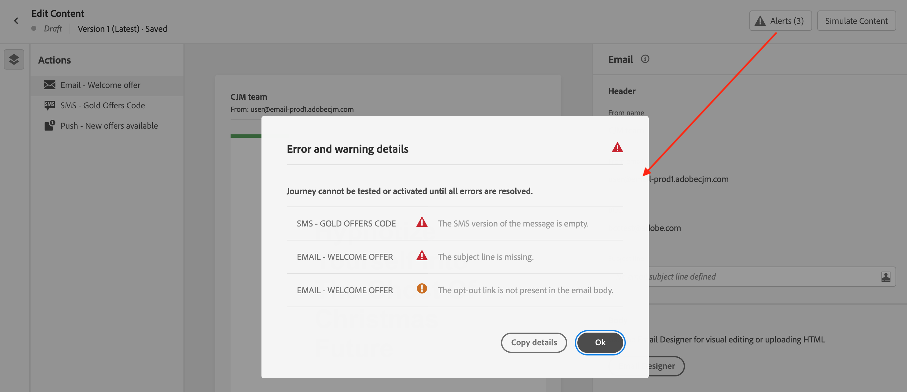

# 메시지에 대한 경고 확인 {#messages-alerts}

## 보내기 전 확인 {#message-alerting}

메시지를 디자인할 때 주요 설정이 누락되면 인터페이스에 경고가 표시됩니다.

메시지 콘텐츠를 편집할 때 화면 오른쪽 상단에 경고가 표시됩니다.

>[!NOTE]
>
>이 단추가 표시되지 않으면 경고가 감지되지 않습니다.

다음 두 가지 유형의 경고가 발생할 수 있습니다.

* **경고** 권장 사항 및 우수 사례를 참조하십시오. 예를 들어 옵트아웃 링크가 누락된 경우 메시지가 표시됩니다.

* **오류** 확인되지 않는 한 여정을 테스트하거나 활성화하지 않도록 합니다. 예를 들어 제목 줄이 누락되었다는 메시지가 표시됩니다.

가능한 모든 경고 및 오류가 자세히 표시됩니다 [아래](#alerts-and-warnings).

>[!CAUTION]
>
> 모든 문제를 해결해야 합니다. **오류** 는 메시지를 사용하여 여정을 테스트하거나 활성화하기 전에 경고합니다.

## 경고 및 오류 목록 {#alerts-and-warnings}

시스템에서 선택한 설정 및 요소는 아래에 나와 있습니다. 또한 구성을 조정하여 해당 문제를 해결하는 방법에 대한 정보도 확인할 수 있습니다.

**경고**:

* **[!UICONTROL 옵트아웃 링크가 이메일 본문에 없습니다.]**: 이메일 본문에 구독 취소 링크를 추가하는 것이 가장 좋습니다. 에서 구성하는 방법을 알아봅니다 [이 섹션](../privacy/opt-out.md#opt-out-management).

   >[!NOTE]
   >
   >마케팅 유형 이메일 메시지에는 옵트아웃 링크가 포함되어야 합니다. 옵트아웃 링크는 트랜잭션 메시지에는 필요 없습니다. 메시지 카테고리(**[!UICONTROL 마케팅]** 또는 **[!UICONTROL 트랜잭션]**)는 [채널 표면](../configuration/channel-surfaces.md#email-type)(예: 메시지 사전 설정) 수준에서 [메시지를 만들 때](get-started-content.md#create-new-message) 정의됩니다.

* **[!UICONTROL HTML의 텍스트 버전이 비어 있습니다.]**: HTML 콘텐츠를 표시할 수 없을 때 사용되므로 이메일 본문의 텍스트 버전을 정의하는 것을 잊지 마십시오. 에서 텍스트 버전을 만드는 방법을 알아봅니다. [이 섹션](../design/text-version-email.md).

* **[!UICONTROL 이메일 본문에 빈 링크가 있습니다.]**: 이메일의 모든 링크가 올바른지 확인합니다. 에서 콘텐츠 및 링크를 관리하는 방법 알아보기 [이 섹션](../design/create-email-content.md).

* **[!UICONTROL 전자 메일 크기가 100KB의 제한을 초과했습니다.]**: 최적의 전달을 위해 이메일 크기가 100KB를 초과하지 않도록 하십시오. 에서 이메일 콘텐츠를 편집하는 방법 알아보기 [이 섹션](../design/create-email-content.md).

**오류**:

* **[!UICONTROL 제목 줄이 누락되었습니다]**: 이메일 제목란은 필수입니다. 에서 정의 및 개인화하는 방법을 알아봅니다 [이 섹션](create-email.md).

   <!--HTML is empty when Amp HTML is present-->

* **[!UICONTROL 메시지의 푸시 버전이 비어 있습니다]**: 이 오류는 푸시 알림 본문 또는 제목이 누락된 경우 표시됩니다. 에서 푸시 알림 콘텐츠를 정의하는 방법을 알아봅니다. [이 섹션](create-push.md).

* **[!UICONTROL 메시지의 전자 메일 버전이 비어 있습니다]**: 이 오류는 이메일 컨텐츠가 구성되지 않은 경우 표시됩니다. 에서 이메일 콘텐츠를 디자인하는 방법 알아보기 [이 섹션](../design/design-emails.md).

* **[!UICONTROL 서피스가 없습니다.]**: 메시지 생성 후 선택한 서피스가 삭제되면 메시지를 사용할 수 없습니다. 이 오류가 발생하면 메시지에서 다른 서피스를 선택합니다 **[!UICONTROL 속성]**. 의 채널 표면에 대해 자세히 알아보기 [이 섹션](../configuration/channel-surfaces.md).

* **[!UICONTROL 푸시 iOS/Android 페이로드가 4KB의 제한을 초과했습니다]**: 푸시 알림 크기는 4KB를 초과할 수 없습니다. 이 제한을 준수하려면 이미지나 이모지의 사용을 줄이십시오. 에서 푸시 알림 콘텐츠를 관리하는 방법을 알아봅니다 [이 섹션](create-push.md).

>[!CAUTION]
>
> 메시지를 사용하려면 모두 해결해야 합니다 **오류** 경고.

<!--Other issues can stop publication such as:
* The push notification title is empty-->
