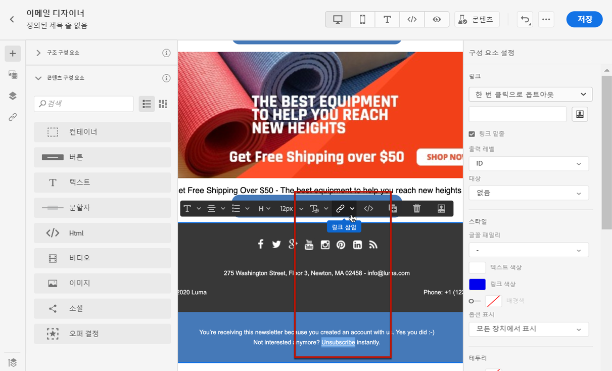
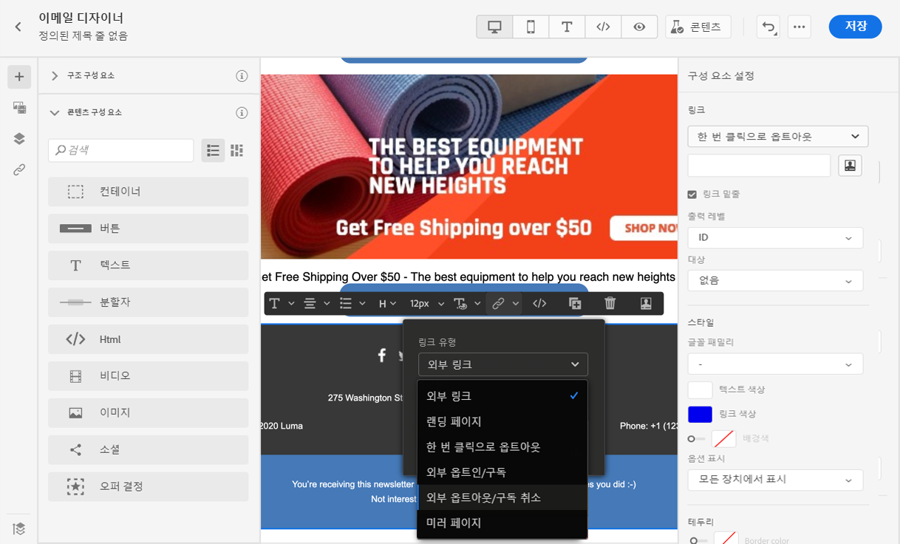
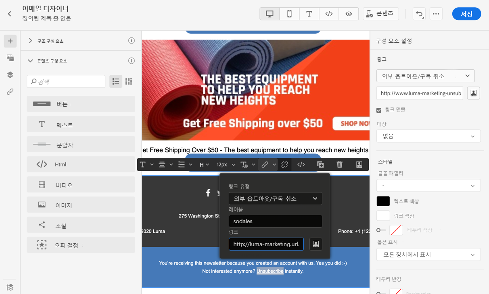
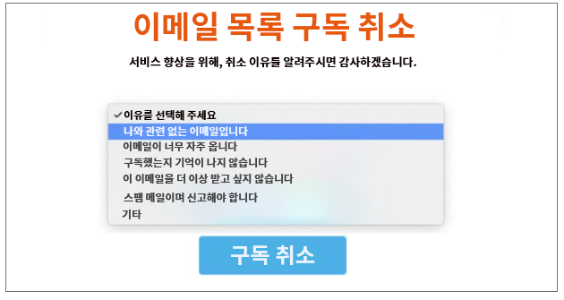
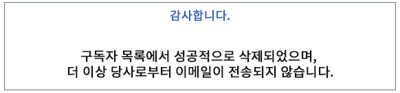
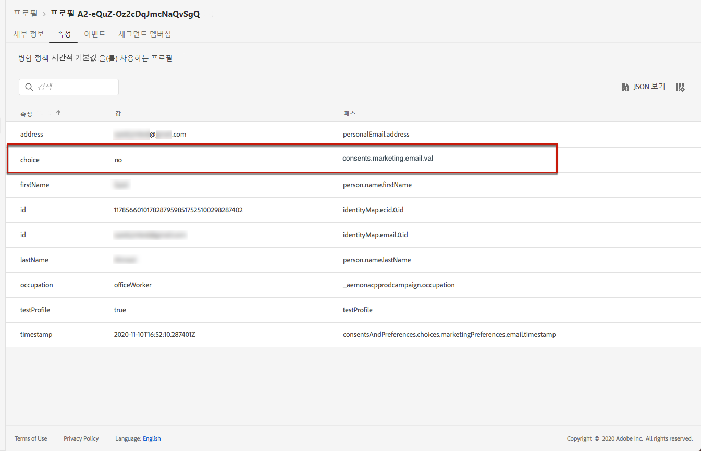
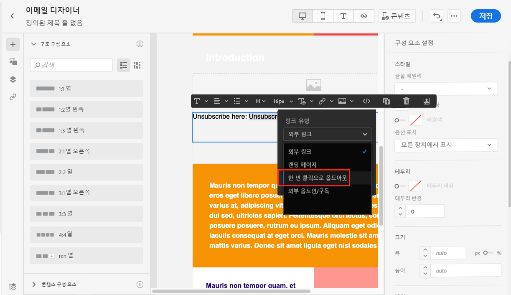
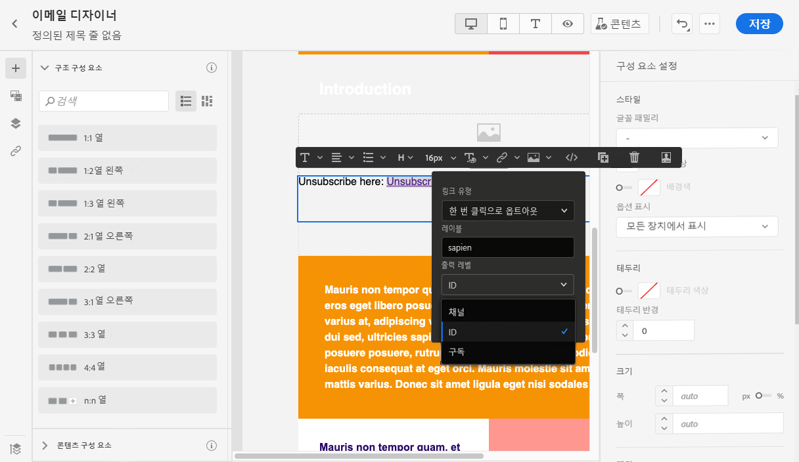
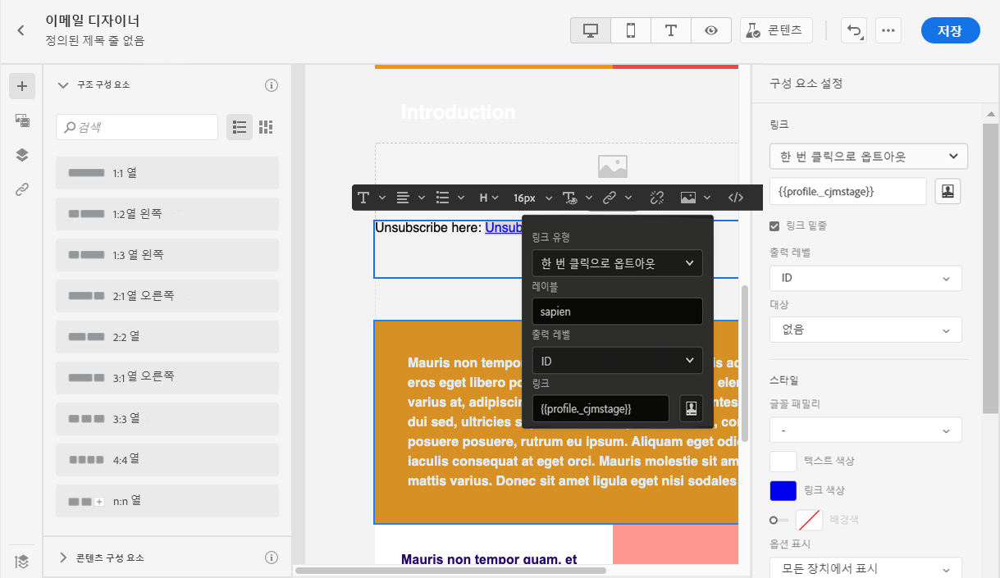

# 동의 관리 {#consent}

[!DNL Journey Optimizer]를 사용하여 수신자의 알림 동의를 추적하고 선호도 및 구독을 관리하여 수신자가 브랜드와 어떤 식으로 상호작용하는지 이해할 수 있습니다.

데이터 주체의 정보를 사용하기 전에 특정 요구 사항을 준수해야 하는 GDPR 상태와 같은 규정. 또한 데이터 주체는 언제든지 동의를 수정할 수 있어야 합니다.

**중요한 이유**

* 이러한 규정을 준수하지 않으면 브랜드에 대한 규제 법률 리스크가 발생합니다.
* 이메일은 원하지 않는 커뮤니케이션을 수신자에게 보내지 않도록 함으로써 메시지를 스팸으로 표시하고 명성을 손상시킬 수 있습니다.

개인 정보 관리에 대한 자세한 내용 및 해당 규정은 [Experience Platform 설명서](https://experienceleague.adobe.com/docs/experience-platform/privacy/home.html?lang=ko){target=&quot;_blank&quot;}를 참조하세요.

>[!NOTE]
>
>[!DNL Journey Optimizer]에서 동의는 Experience Platform [동의 스키마](https://experienceleague.adobe.com/docs/experience-platform/xdm/field-groups/profile/consents.html?lang=ko){target=&quot;_blank&quot;}에 의해 처리됩니다. 기본적으로 동의 필드의 값은 비어 있으며 커뮤니케이션을 수신하기 위한 동의로 처리됩니다. 온보딩하는 동안 [여기](https://experienceleague.adobe.com/docs/experience-platform/xdm/data-types/consents.html?lang=ko#choice-values){target=&quot;_blank&quot;} 나열된 가능한 값 중 하나로 이 기본값을 수정할 수 있습니다.

## 이메일 옵트아웃 관리 {#opt-out-management}

수신자가 브랜드로부터 커뮤니케이션 수신을 거부할 수 있는 기능을 제공하는 것은 법적 요구사항입니다. [Experience Platform 설명서](https://experienceleague.adobe.com/docs/experience-platform/privacy/regulations/overview.html?lang=ko#regulations){target=&quot;_blank&quot;}에서 해당 법률에 대해 자세히 알아보세요.

따라서 수신자에게 보내는 모든 이메일에 항상 **구독 취소 링크**&#x200B;를 포함해야 합니다.

* 이 링크를 클릭하면 수신자는 옵트아웃을 확인하는 버튼이 포함된 랜딩 페이지로 이동합니다.
* 선택을 확인하면 프로필의 데이터가 이 정보로 업데이트됩니다.

### 외부 옵트아웃 {#opt-out-external-lp}

이를 위해 외부 랜딩 페이지에 대한 링크를 이메일에 삽입하여 사용자가 브랜드로부터 커뮤니케이션 수신을 취소할 수 있습니다.

#### 구독 취소 링크 추가 {#add-unsubscribe-link}

먼저 메시지에 구독 취소 링크를 추가해야 합니다. 이렇게 하려면 아래 단계를 수행합니다:

1. 구독 취소 랜딩 페이지를 빌드합니다.

1. 원하는 서드파티 시스템에 호스팅합니다.

1. [!DNL Journey Optimizer]에 [메시지를 작성합니다](create-message.md).

1. 콘텐츠에서 텍스트를 선택하고 상황별 도구 모음을 사용하여 [링크를 삽입합니다](message-tracking.md#insert-links).

   

1. **[!UICONTROL Link type]** 드롭다운 목록에서 **[!UICONTROL External Opt-out/Unsubscription]**&#x200B;을(를) 선택합니다.

   

1. **[!UICONTROL Link]** 필드에 서드 파티 랜딩 페이지 링크를 붙여넣습니다.

   

1. **[!UICONTROL Save]**&#x200B;을(를) 클릭합니다.

1. 콘텐츠를 저장하고 [메시지를 게시합니다](publish-manage-message.md).

#### 옵트아웃에 대한 API 호출 구현 {#opt-out-api}

수신자가 랜딩 페이지에서 선택한 항목을 제출할 때 옵트아웃하도록 하려면 Adobe I/O을 통해 **구독 API 호출**&#x200B;을 구현하여 해당 프로필의 환경 설정을 업데이트합니다.

이 Adobe I/O POST 호출은 다음과 같습니다.

엔드포인트: platform.adobe.io/journey/imp/consent/preferences

쿼리 매개 변수:

* **params**: 암호화된 페이로드 포함
* **sig**: 서명
* **pid**: 암호화된 프로필 ID

이 세 매개 변수는 수신자에게 전송된 타사 랜딩 페이지 URL에 포함됩니다.


헤더 요구 사항:

* x-api-key
* x-gw-ims-org-id
* x-sandbox-name
* 인증(기술 계정의 사용자 토큰)

요청 본문:

```
{
   "marketing": [
       {
            "type": "email",           
            "choice": "no",          
            "scope": "channel"       
        }
    ],
 
}
```

[!DNL Journey Optimizer]은(는) 이러한 매개 변수를 사용하여 Adobe I/O 호출을 통해 해당 프로필의 선택을 업데이트합니다.

#### 구독 취소 링크가 있는 메시지 보내기 {#send-message-unsubscribe-link}

랜딩 페이지에 대한 구독 취소 링크를 구성하고 API 호출을 구현하면 메시지를 전송할 준비가 되었습니다.

1. 링크를 포함하는 메시지를 [여정](../building-journeys/journey.md)을 통해서 보냅니다.

1. 메시지가 수신되면 수신자가 구독 취소 링크를 클릭하면 랜딩 페이지가 표시됩니다.

   

1. 수신자가 양식을 제출하는 경우(여기서는 랜딩 페이지의 **구독 취소** 버튼을 누르는 경우), 프로필 데이터는 [Adobe I/O 호출](#opt-out-api)을 통해 업데이트됩니다.

1. 옵트아웃 수신자는 옵트아웃에 성공했음을 나타내는 확인 메시지 화면으로 리디렉션됩니다.

   

   따라서 이 사용자는 다시 구독하지 않으면 브랜드에서 보내는 커뮤니케이션을 받지 않습니다.

1. 해당 프로필의 선택 사항이 업데이트되었는지 확인하려면 Experience Platform으로 이동하여 ID 네임스페이스 및 해당 ID 값을 선택하여 프로필에 액세스합니다. [Experience Platform 설명서](https://experienceleague.adobe.com/docs/experience-platform/profile/ui/user-guide.html?lang=ko#getting-started){target=&quot;_blank&quot;}에서 자세한 내용을 알아보세요.

   

   **[!UICONTROL Attributes]** 탭에서 **[!UICONTROL choice]**&#x200B;에 대한 값이 **[!UICONTROL no]**&#x200B;로 변경되었음을 확인할 수 있습니다.

### 원클릭 옵트아웃 {#one-click-opt-out}

많은 고객이 보다 쉬운 구독 취소 프로세스를 원하는 만큼, 이메일 콘텐츠에 한 번의 클릭으로 옵트아웃할 수 있는 링크를 추가할 수도 있습니다. 이 링크를 사용하면 수신자가 랜딩 페이지로 리디렉션되어 옵트아웃을 확인할 필요 없이 커뮤니케이션에서 빠르게 구독을 취소할 수 있습니다.

이메일에 옵트아웃 링크를 추가하려면 아래 단계를 따르십시오.

1. [링크를 삽입하고](message-tracking.md#insert-links) 링크 유형으로 **[!UICONTROL One click Opt-out]**&#x200B;을(를) 선택합니다.

   

1. 채널, 신원 또는 구독 등 어느 수준에 옵트아웃을 적용할지 선택합니다.

   

   * **[!UICONTROL Channel]**: 옵트아웃은 현재 채널의 프로필 대상(즉, 이메일 주소)에 전송된 향후 메시지에 적용됩니다. 여러 대상이 프로필과 연결되어 있는 경우 옵트아웃은 해당 채널에 대한 프로필의 모든 타겟(즉, 이메일 주소)에 적용됩니다.
   * **[!UICONTROL Identity]**: 옵트아웃은 현재 메시지에 사용하는 특정 대상(즉, 이메일 주소)에 전송된 향후 메시지에 적용됩니다.
   * **[!UICONTROL Subscription]**: 옵트아웃은 특정 구독 목록과 연결된 향후 메시지에 적용됩니다. 이 옵션은 현재 메시지가 구독 목록과 연결된 경우에만 선택할 수 있습니다.

1. 사용자가 가입 해지되면 리디렉션될 랜딩 페이지의 URL을 입력합니다. 이 페이지는 옵트아웃이 성공했는지 확인하기 위한 것입니다.

   

   링크를 개인화할 수 있습니다. [이 섹션](../personalization/personalization-syntax.md)에서 URL 개인화에 대해 자세히 알아보십시오.

1. 변경 내용을 저장합니다.

[여정](../building-journeys/journey.md)을 통해 메시지를 보낸 이후 수신자가 옵트아웃 링크를 클릭하면 수신자의 프로필이 즉시 옵트아웃됩니다.

### 메시지 헤더의 구독 취소 링크 {#unsubscribe-email}

수신자의 이메일 클라이언트가 이메일 헤더에 구독 취소 링크 표시를 지원하는 경우 [!DNL Journey Optimizer]를 사용하여 전송된 이메일에 이 링크가 자동으로 포함됩니다.

예를 들어 구독 취소 링크는 Gmail에서 다음과 같이 표시됩니다.


이메일 클라이언트에 따라 헤더에서 구독 취소 링크를 클릭하면 다음 영향 중 하나가 발생합니다.

* 해당 프로필이 즉시 옵트아웃되고 이 선택 사항이 Experience Platform에서 업데이트됩니다. [Experience Platform 설명서](https://experienceleague.adobe.com/docs/experience-platform/profile/ui/user-guide.html#getting-started){target=&quot;_blank&quot;}에서 자세한 내용을 알아보세요.

* 이메일 콘텐츠에서 구독 취소 링크를 클릭하는 것과 동일한 효과가 있습니다. 수신자는 옵트아웃을 확인하는 버튼이 포함된 랜딩 페이지로 리디렉션됩니다. [이 섹션](#opt-out-management)에서 옵트아웃 관리에 대해 자세히 알아보십시오.

## 푸시 옵트아웃 관리 {#push-opt-out-management}

푸시 수신자는 자신의 디바이스에서 구독을 취소할 수 있습니다.

예를 들어, 앱을 다운로드하거나 사용하는 경우 알림을 중지하도록 선택할 수 있습니다. 마찬가지로 모바일 운영 체제를 통해 알림 설정을 변경할 수 있습니다.
