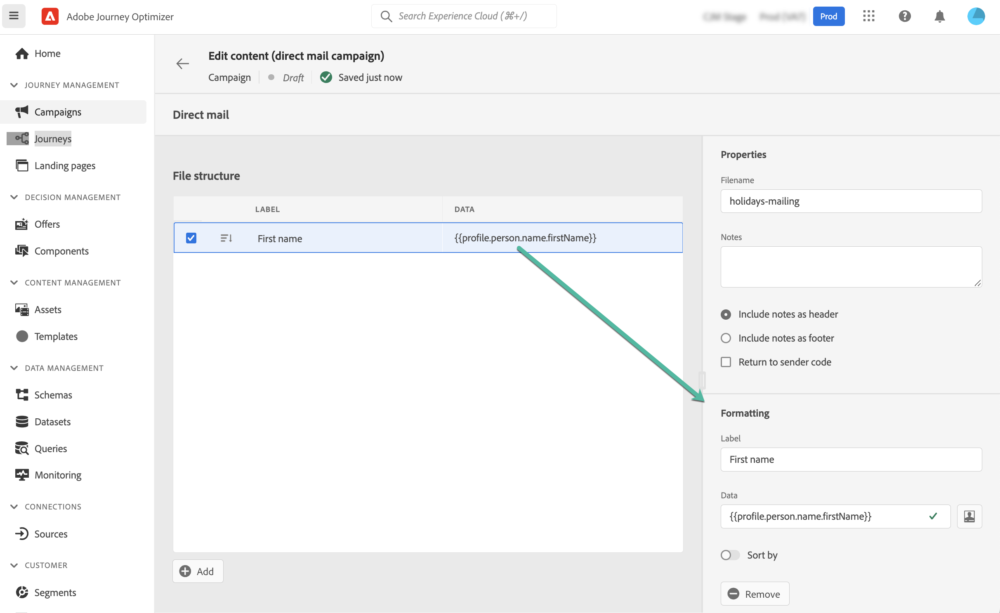

# DM 메시지 만들기 {#create-direct}

>[!CONTEXTUALHELP]
>id="ajo_direct_mail"
>title="DM 만들기"
>abstract="예약된 캠페인에서 DM 메시지를 만들고 DM 공급자가 고객에게 메일을 보내는 데 필요한 추출 파일을 디자인합니다."

DM은 다이렉트 메일 공급자가 고객에게 메일을 보내는 데 필요한 추출 파일을 개인화하고 생성할 수 있는 오프라인 채널입니다.

DM을 만들 때 Journey Optimizer에서는 타겟팅된 모든 프로필과 선택한 데이터(예를 들어 우편 주소, 프로필 속성)가 포함된 파일을 생성합니다. 그러면 DM 공급자가 해당 파일을 검색하고 실제 전송을 처리합니다.

DM 메시지는 예약된 캠페인 컨텍스트에서만 만들 수 있습니다. API로 트리거된 캠페인이나 여정에서 사용할 수 없습니다.

>[!IMPORTANT]
>
>DM 메시지를 보내기 전에 다음을 구성했는지 확인합니다.
>
>1. A [파일 라우팅 구성](../configuration/direct-mail-configuration.md#file-routing-configuration) 추출 파일을 업로드하고 저장할 서버를 지정합니다.
>1. A [DM 메시지 표면](../configuration/direct-mail-configuration.md#direct-mail-surface) 파일 라우팅 구성을 참조합니다.

## DM 메시지 만들기 {#create}

DM 메시지를 만들고 전송하는 단계는 다음과 같습니다.

1. 예약된 새 캠페인을 만들고, **[!UICONTROL DM]** 를 작업으로 사용하고 사용할 채널 서피스를 선택합니다. [DM 표면을 만드는 방법을 알아봅니다](../configuration/direct-mail-configuration.md#direct-mail-surface)

   

1. 클릭 **[!UICONTROL 만들기]** 그런 다음 캠페인에 대한 기본 정보(이름, 설명)를 정의합니다. [캠페인 구성 방법 알아보기](../campaigns/create-campaign.md)

   

1. 을(를) 클릭합니다. **[!UICONTROL 컨텐츠 편집]** DM 공급자에게 보낼 추출 파일을 구성하는 단추입니다.

1. 에서 추출 파일의 이름을 정의합니다 **[!UICONTROL 파일 이름]** 필드.

   추출 파일의 시작 또는 끝 부분에 정보를 추가해야 하는 경우가 있습니다. 이렇게 하려면 **[!UICONTROL 참고]** 필드를 사용하여 메모를 머리글이나 바닥글로 포함할지 지정합니다.

   <!--Click on the button to the right of the Output file field and enter the desired label. You can use personalization fields, content blocks and dynamic text (see Defining content). For example, you can complete the label with the delivery ID or the extraction date.-->

   

1. 추출 파일에 열로 표시할 정보를 정의하려면 왼쪽 영역을 사용합니다.

   1. 을(를) 클릭합니다. **[!UICONTROL 추가]** 단추를 클릭하여 새 열을 추가한 다음 목록에서 선택합니다.

   1. 에서 **[!UICONTROL 서식]** 섹션에서 열에 대한 레이블을 지정한 다음 을(를) 사용하여 표시할 프로필 속성을 정의합니다 [표현식 편집기](../personalization/personalization-build-expressions.md).

      

   1. 선택한 열을 사용하여 추출 파일을 정렬하려면 **[!UICONTROL 정렬 기준]** 옵션 켜짐. 다음 **[!UICONTROL 정렬 기준]** 그러면 파일 구조에 있는 열 레이블 옆에 아이콘이 표시됩니다.

1. 이 단계를 반복하여 추출 파일을 작성하는 데 필요한 만큼 열을 추가합니다. 최대 50개의 열을 추가할 수 있습니다.

   

   언제든지 열을 선택하고 **[!UICONTROL 제거]** 단추 **[!UICONTROL 서식]** 섹션을 참조하십시오.

1. DM 콘텐츠가 정의되면 캠페인 구성을 완료하십시오.

   캠페인이 시작되면 추출 파일이 자동으로 생성되고 [파일 라우팅 구성](../configuration/direct-mail-configuration.md).
