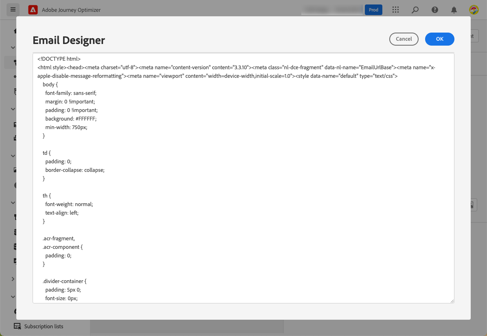

# 이메일 만들기 {#create-email-bis}

이메일을 만들려면 아래 단계를 수행하십시오.

## 1. 여정 또는 캠페인에서 이메일을 만듭니다

추가 **[!UICONTROL 이메일]** 작업을 여정 또는 캠페인에 수행하고 해당 사례에 따라 아래 절차를 따르십시오.

>[!BEGINTABS]

>[!TAB 여정에 이메일 추가]

1. 여정을 열고 을(를) 끌어다 놓습니다 **[!UICONTROL 이메일]** 활동의 **[!UICONTROL 작업]** 섹션에 있는 마지막 항목이 될 필요가 없습니다.

1. 메시지에 대한 기본 정보(레이블, 설명, 카테고리)를 제공합니다.

1. 을(를) 선택합니다 [이메일 표면] 를 사용하십시오.

   

여정 구성 방법에 대한 자세한 내용은 [이 페이지](../building-journeys/journey-gs.md).

>[!TAB 캠페인에 이메일 추가]

1. 예약되었거나 API가 트리거된 새 캠페인을 만들고 를 선택합니다. **[!UICONTROL 이메일]** 를 작업에 사용할 수 있습니다.

1. 을(를) 선택합니다 [이메일 표면] 를 사용하십시오.

   

1. **[!UICONTROL 만들기]**&#x200B;를 클릭합니다.

1. 이메일 캠페인을 만드는 단계를 완료합니다.

   

<!--
From the **[!UICONTROL Action]** section, specify if you want to track how your recipients react to your delivery: you can track email opens, and/or clicks on links and buttons in your email.

-->

캠페인 구성 방법에 대한 자세한 내용은 [이 페이지](../campaigns/get-started-with-campaigns.md).

>[!ENDTABS]

## 이메일 콘텐츠 정의

1. 여정 또는 캠페인 구성 화면에서 **[!UICONTROL 컨텐츠 편집]** 전자 메일 콘텐츠를 구성하는 단추입니다. [자세히 알아보기]

   

1. 에서 **[!UICONTROL Header]** 섹션 **[!UICONTROL 컨텐츠 편집]** 화면, **[!UICONTROL 이름]**, **[!UICONTROL 이메일에서]** 및 **[!UICONTROL 숨은 참조]** 필드는 선택한 이메일 화면에서 가져옵니다. [자세히 알아보기] <!--check if same for journey-->

   

1. 제목 줄을 추가할 수 있습니다. 일반 텍스트를 해당 필드에 직접 입력하거나 [표현식 편집기](../personalization/personalization-build-expressions.md) 제목 줄을 개인화합니다.

1. 을(를) 클릭합니다. **[!UICONTROL 이메일 본문 편집]** 단추를 사용하여 콘텐츠 작성을 시작합니다. [!DNL Journey Optimizer] 이메일 디자이너. [자세히 알아보기]

   

   또한 **[!UICONTROL 코드 편집기]** 표시되는 팝업 창을 사용하여 일반 HTML에서 고유한 콘텐츠를 코딩하는 단추입니다.

   

   >[!NOTE]
   >
   >이메일 디자이너를 통해 이미 콘텐츠를 만들거나 가져온 경우에는 이 콘텐츠가 HTML에 표시됩니다.

## 이메일 미리 보기

메시지 콘텐츠가 정의되면 미리 보기하여 전자 메일 렌더링을 제어하고 테스트 프로필로 개인화 설정을 확인할 수 있습니다. [자세히 알아보기]

편집기의 상단 섹션에서도 경고를 확인해야 합니다.  일부 경고는 간단한 경고이지만 일부 사용자는 메시지를 사용하지 못하도록 할 수 있습니다. [자세히 알아보기](alerts.md).

## 이메일 콘텐츠 유효성 검사

이메일이 준비되면 구성을 완료하십시오 [여정](../building-journeys/journey-gs.md) 또는 [campaign](../campaigns/create-campaign.md) 을 활성화하여 메시지를 보냅니다.

>[!NOTE]
>
>전자 메일 열기 및/또는 상호 작용을 통해 수신자의 동작을 추적하려면 **[!UICONTROL 추적]** 여정에서 섹션을 사용할 수 있습니다 [이메일 활동](../building-journeys/journeys-message.md) 또는 이메일에서 [campaign](../campaigns/create-campaign.md).

편집기의 상단 섹션에서도 경고를 확인해야 합니다.  일부 경고는 간단한 경고이지만 일부 사용자는 메시지를 사용하지 못하도록 할 수 있습니다. [자세히 알아보기](alerts.md)

