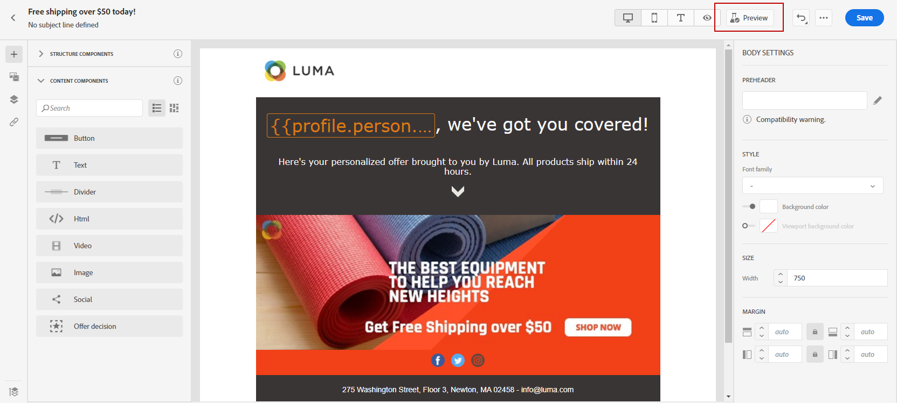

# 사용자 인터페이스에서 이메일 콘텐츠 디자인 {#create-email-content}

한번 드시면 [메시지 작성](create-message.md)을(를) 통해 이메일 콘텐츠 만들기를 시작할 수 있습니다.

➡️ [비디오에서 이 기능 살펴보기](#video)

1. 새로 만든 메시지에서 을(를) 선택합니다 **[!UICONTROL Email designer]** 에서 **[!UICONTROL Body]** 섹션을 참조하십시오.

   

1. 이메일 디자이너 홈페이지에서 다음 옵션 중 이메일을 디자인할 방법을 선택합니다.

   * 선택 **[!UICONTROL Design from scratch]** 이메일 디자이너 기능을 사용하여 이메일 콘텐츠를 만들려면 [자세히 알아보기](#design-scratch)

   * 선택 **[!UICONTROL Start from template]** 기본 제공 템플릿 목록에서 이메일을 작성합니다. 다른 템플릿은 만들 수 없습니다.

   * 선택 **[!UICONTROL Code your own]** HTML 원시 코드를 입력하거나 붙여넣습니다. [자세히 알아보기](existing-content.md#import-raw-html-code).

   * 선택 **[!UICONTROL Import HTML]** HTML 파일 또는 .zip 폴더를 가져오려면 다음을 수행하십시오. [자세히 알아보기](existing-content.md#import-html-content-from-file).

   

## 처음부터 디자인 {#design-scratch}

>[!CONTEXTUALHELP]
>id="ac_structure_components"
>title="구조 구성 요소 정보"
>abstract="구조 구성 요소는 이메일의 레이아웃을 정의합니다."

>[!CONTEXTUALHELP]
>id="ac_edition_columns"
>title="이메일 열 정의"
>abstract="이메일 디자이너를 사용하면 열 구조를 정의하여 이메일 레이아웃을 쉽게 정의할 수 있습니다."

이메일 디자이너를 사용하면 이메일 구조를 쉽게 정의할 수 있습니다. 간단한 드래그 앤 드롭 작업으로 구조 요소를 추가 및 이동하면 몇 초 이내에 이메일 모양을 디자인할 수 있습니다.

이메일 디자이너를 사용하여 이메일 콘텐츠 빌드를 시작하려면 아래 단계를 수행하십시오.

1. 을(를) 선택한 후 **[!UICONTROL Design from scratch]** 선택 사항, 끌어다 놓아 이메일 콘텐츠 디자인을 시작합니다 **[!UICONTROL Structure components]** 이메일 레이아웃을 정의하기 위해.

   >[!NOTE]
   >
   >열 스택은 모든 이메일 프로그램과 호환되지 않습니다. 지원되지 않는 경우에는 열이 스택되지 않습니다.
   >
   >전자 메일에 배치되면 이미 내부에 컨텐츠 구성 요소나 조각을 배치하지 않은 한 구성 요소를 이동하거나 제거할 수 없습니다.

   

1. 추가할 만큼 **[!UICONTROL Structure components]** 필요한 경우.

   을(를) 선택합니다 **[!UICONTROL n:n column]** 구성 요소를 사용하여 선택한 열 수를 정의합니다(3과 10 사이). 각 열의 맨 아래에서 화살표를 이동하여 각 열의 너비를 정의할 수도 있습니다.

   >[!NOTE]
   >
   >각 열 크기는 구조 구성 요소의 전체 너비의 10% 이하일 수 없습니다. 비어 있지 않은 열은 제거할 수 없습니다.

1. 에서 **[!UICONTROL Content components]** 드롭다운을 사용하면 **[!UICONTROL Content components]** 구조 구성 요소에서 필요한 경우. [콘텐츠 구성 요소에 대해 자세히 알아보기](content-components.md).

   

1. 각 구성 요소는 **[!UICONTROL Component settings]** 섹션을 참조하십시오. 예를 들어 구성 요소의 패딩 또는 여백을 텍스트 스타일로 변경할 수 있습니다. [정렬 및 패딩에 대해 자세히 알아보기](#adjusting-vertical-alignment-and-padding).

   

1. 에서 **[!UICONTROL Assets picker]**&#x200B;에 저장된 자산을 직접 추가할 수 있습니다 **[!UICONTROL Assets library]** 을 이메일에 추가합니다. [자산 관리에 대해 자세히 알아보기](assets-essentials.md).

   자산이 들어 있는 폴더를 두 번 클릭하고 이메일에 추가할 자산을 끌어다 놓습니다.

   

1. 프로필 데이터의 콘텐츠를 사용자 지정하려면 개인화 필드를 추가합니다. [콘텐츠 개인화에 대해 자세히 알아보기](../personalization/personalize.md).

   

1. 에서 **[!UICONTROL Links]** 왼쪽 창에서 추적할 컨텐츠의 모든 URL 목록을 확인합니다. 수정 가능 **[!UICONTROL Tracking Type]**, **[!UICONTROL Label]** 및 **[!UICONTROL Tags]** 필요한 경우

   

   >[!NOTE]
   >
   >의 링크 및 메시지 추적에 대해 자세히 알아보십시오 [이 페이지](message-tracking.md).

1. 필요한 경우 코드 편집기로 전환하여 을 클릭하여 이메일을 더 개인화할 수 있습니다. **[!UICONTROL Switch to code editor]** 고급 메뉴에서 을 클릭합니다. 코드 편집기에 대한 자세한 내용은 [이 페이지](existing-content.md#import-raw-html-code).

   >[!NOTE]
   >
   >코드 편집기로 전환한 후에는 이 이메일에 시각적 디자이너를 사용할 수 없습니다.

   

1. 클릭 **[!UICONTROL Show preview]** 전자 메일 렌더링을 확인합니다. 데스크탑 또는 모바일 보기를 선택할 수 있습니다.

   이메일을 미리 보는 방법에 대한 자세한 내용은 [이 페이지](preview.md).

   

1. 전자 메일이 준비되면 **[!UICONTROL Save & Close]**.

이제 메시지에 이메일 콘텐츠를 사용할 수 있습니다. [메시지 보내기 방법 알아보기](publish-manage-message.md).

## 이메일의 텍스트 버전 만들기 {#generate-text-version}

HTML 콘텐츠를 표시할 수 없을 때 사용되는 이메일 본문의 텍스트 버전을 만드는 것이 좋습니다.

기본적으로 이메일 디자이너는 **[!UICONTROL Plain text]** 개인화 필드를 포함한 이메일 버전입니다. 이 버전은 자동으로 생성되어 컨텐츠의 HTML 버전과 동기화됩니다.

일반 텍스트 버전에 다른 콘텐츠를 사용하려면 아래 단계를 따르십시오.

1. 이메일에서 **[!UICONTROL Plain text]** 탭.

   

1. 를 사용하십시오 **[!UICONTROL Sync with HTML]** 동기화를 사용하지 않도록 설정하려면 전환합니다.

   

1. 선택 내용을 확인하려면 확인 표시를 클릭합니다.

   

1. 그런 다음 일반 텍스트 버전을 원하는 대로 편집할 수 있습니다.

>[!CAUTION]
>
>* 의 변경 사항 **[!UICONTROL Plain text]** 보기는 HTML 보기에 반영되지 않습니다.
>
>* 를 다시 활성화하면 **[!UICONTROL Sync with HTML]** 일반 텍스트 컨텐츠를 업데이트하면 변경 사항이 유실되고 HTML 버전에서 생성된 텍스트 컨텐츠로 바뀝니다.

## 사전 헤더 추가 {#preheader}

>[!CONTEXTUALHELP]
>id="ac_edition_preheader"
>title="사전 헤더 추가"
>abstract="사전 헤더는 이메일 클라이언트의 이메일을 볼 때 제목란을 따르는 간단한 요약 텍스트입니다. 많은 경우, 이메일에 대한 간단한 요약을 제공하고 일반적으로 긴 한 문장입니다."

사전 헤더는 이메일 클라이언트의 이메일을 볼 때 제목란을 따르는 간단한 요약 텍스트입니다. 많은 경우, 이메일에 대한 간단한 요약을 제공하고 일반적으로 긴 한 문장입니다.

>[!NOTE]
>
>모든 전자 메일 클라이언트는 사전 헤더를 지원하지 않습니다. 지원되지 않는 경우 preheader가 표시되지 않습니다.

이메일 미리 헤더를 정의하려면 아래 단계를 수행합니다.

1. 이메일 디자이너에서 **[!UICONTROL Structure components]** 전자 메일 디자인을 시작합니다.

   

1. 에서 **[!UICONTROL Body settings]** 오른쪽 창 **편집** 다음 **[!UICONTROL Preheader]** 필드를 추가하여 컨텐츠를 추가합니다.

   

1. 사전 헤더를 추가합니다. 을(를) 클릭하여 추가로 개인화할 수 있습니다. **[!UICONTROL Add personalization]** 아이콘.

   

1. 에서 **[!UICONTROL Edit Personalization]** 창, **[!UICONTROL Content block]**, **[!UICONTROL Dynamic content]** 또는 **[!UICONTROL Personalization fields]**.

1. 클릭 **[!UICONTROL Validate]** 개인화 구문을 확인하려면

   

1. **[!UICONTROL Save]**&#x200B;을(를) 클릭합니다.

이제 이메일에 대해 사전 헤더가 구성되었습니다.

## 배경 설정 {#about-backgrounds}

>[!CONTEXTUALHELP]
>id="ac_edition_backgroundimage"
>title="배경 설정"
>abstract="콘텐츠의 배경색 또는 배경 이미지를 개인화할 수 있습니다. 모든 이메일 클라이언트는 배경 이미지를 지원하지 않습니다."

이메일 디자이너를 사용하여 배경을 설정하는 방법은 다음과 같습니다.

1. 디자인에 필요한 경우 이메일 본문에 배경색을 적용합니다.
1. 대부분의 경우 열 수준에서 배경색을 설정합니다.
1. 관리하기가 어려우므로 이미지 또는 텍스트 구성 요소에 배경색을 사용하지 마십시오.

다음은 사용할 수 있는 배경 설정입니다.

* 설정 **[!UICONTROL Background color]** 전체 이메일. 왼쪽 팔레트에서 액세스할 수 있는 탐색 트리에서 본문 설정을 선택해야 합니다.

* 모든 구조 구성 요소에 대해 동일한 배경색을 선택하고 **[!UICONTROL Viewport background color]**. 이 옵션을 사용하면 배경색에서 다른 설정을 선택할 수 있습니다.

* 각 구조 구성 요소에 대해 다른 배경색을 설정합니다. 왼쪽 팔레트에서 액세스할 수 있는 탐색 트리에서 구조를 선택하여 해당 구조에만 특정 배경색만 적용합니다.

   구조 배경색을 숨길 수 있으므로 뷰포트 배경색을 설정하지 마십시오.

* 설정 **[!UICONTROL Background image]** 구조 구성 요소의 컨텐츠에 대해 설명합니다.

   >[!NOTE]
   >
   >일부 이메일 프로그램은 배경 이미지를 지원하지 않습니다. 지원되지 않는 경우에는 행 배경색이 대신 사용됩니다. 이미지를 표시할 수 없는 경우 적절한 대체 배경색을 선택해야 합니다.

* 열 수준에서 배경색을 설정합니다.

   >[!NOTE]
   >
   >가장 일반적인 사용 사례입니다. Adobe은 전체 이메일 콘텐츠를 편집할 때 보다 유연하게 계산할 수 있도록 열 수준에서 배경색을 설정하는 것이 좋습니다.

   열 수준에서 배경 이미지를 설정할 수도 있지만 거의 사용되지 않습니다.

## 세로 정렬 및 패딩 조정 {#adjusting-vertical-alignment-and-padding}

이 예에서는 세 개의 열로 구성된 구조 구성 요소 내에서 패딩 및 세로 정렬을 조정합니다.

1. 이메일에서 직접 또는 **[!UICONTROL Navigation tree]** 왼쪽 메뉴에서 사용할 수 있습니다.

   

1. 도구 모음에서 **[!UICONTROL Select a column]** 편집할 항목을 선택합니다. 구조 트리에서 선택할 수도 있습니다.

   해당 열의 편집 가능한 매개 변수는 **[!UICONTROL Column settings]** 메뉴 아래의 제품에서 사용할 수 있습니다.

   

1. 아래 **[!UICONTROL Vertical alignment]**, 선택 **[!UICONTROL Bottom]**.

   컨텐츠 구성 요소가 열 아래로 이동합니다.

   

1. 아래 **[!UICONTROL Padding]**&#x200B;를 사용하여 열 내의 위쪽 패딩을 정의합니다. 잠금 아이콘을 클릭하여 아래쪽 패딩과의 동기화를 중단합니다.

   해당 열에 대한 왼쪽 및 오른쪽 패딩을 정의합니다.

   

1. 다른 열의 정렬 및 패딩을 조정하려면 유사하게 진행합니다.

1. 변경 내용을 저장합니다.

## 링크의 스타일 정의 {#about-styling-links}

링크에 밑줄을 긋고 이메일 디자이너에서 해당 색상과 타겟을 선택할 수 있습니다.

1. 텍스트 **[!UICONTROL Content component]** 링크가 삽입되는 위치에서 링크를 선택합니다.

1. 에서 **[!UICONTROL Component settings]** 메뉴, 확인 **[!UICONTROL Underline link]** 링크의 레이블 텍스트에 밑줄을 긋습니다.

   

1. 대상을 . **[!UICONTROL Target]** 드롭다운:

   * **[!UICONTROL None]**: 클릭한 것과 동일한 프레임에서 링크를 엽니다(기본값).
   * **[!UICONTROL Blank]**: 새 창이나 탭에서 링크를 엽니다.
   * **[!UICONTROL Self]**: 클릭한 것과 동일한 프레임에서 링크를 엽니다.
   * **[!UICONTROL Parent]**: 상위 프레임에서 링크를 엽니다.
   * **[!UICONTROL Top]**: 창의 전체 본문에 링크를 엽니다.

   

1. 링크 색상을 변경하려면 **[!UICONTROL Link color]**.

   

1. 필요한 색을 선택하세요.

1. 변경 내용을 저장합니다.

## 인라인 스타일 속성 추가 {#adding-inline-styling-attributes}

이메일 디자이너 인터페이스에서 요소를 선택하고 사이드 패널에 해당 설정을 표시하는 경우 해당 특정 요소의 인라인 속성과 해당 값을 사용자 지정할 수 있습니다.

1. 콘텐츠에서 요소를 선택합니다.
1. 사이드 패널에서 **[!UICONTROL Styles Inline]** 설정.

1. 기존 속성의 값을 수정하거나 **+** 버튼을 클릭합니다. CSS를 준수하는 모든 속성과 값을 추가할 수 있습니다.

그러면 선택한 요소에 스타일이 적용됩니다. 하위 요소에 특정 스타일 속성이 정의되어 있지 않으면 상위 요소의 스타일이 상속됩니다.

## 방법 비디오 {#video}

메시지 편집기로 이메일 콘텐츠를 만드는 방법을 알아봅니다.

>[!VIDEO](https://video.tv.adobe.com/v/334150?quality=12)
