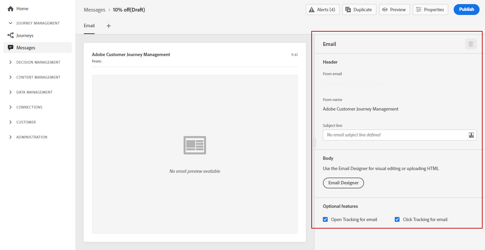

# 이메일 만들기 {#configure-email}

>[!CONTEXTUALHELP]
>id="ajo_message_email"
>title="이메일 만들기"
>abstract="간단한 3단계로 이메일 매개 변수를 정의할 수 있습니다."

일단 [메시지를 만들었습니다.](get-started-content.md)를 사용하려면 **[!UICONTROL Email]** 탭하여 전자 메일 채널의 설정 및 콘텐츠를 정의합니다.

>[!NOTE]
>
>다음 **[!UICONTROL From email]** 및 **[!UICONTROL From name]** 읽기 전용이며 **[!UICONTROL Preset]** 선택 [메시지 만들기](get-started-content.md).

이메일을 구성하는 단계는 다음과 같습니다.

1. 에서 전자 메일 제목을 지정합니다. **[!UICONTROL Subject line]** 필드. 이렇게 하려면 오른쪽의 버튼을 클릭하여 표현식 편집기를 열고 이메일 제목을 작성합니다. 에서 개인화를 추가하는 방법을 알아봅니다. [이 섹션](../personalization/personalize.md)

1. 을(를) 클릭합니다. **[!UICONTROL Email Designer]** 단추를 클릭하여 이메일을 디자인합니다. 에서 이메일을 디자인하는 방법 알아보기 [이 섹션](../design/design-emails.md).

1. 링크 열기 및/또는 클릭을 통해 수신자의 동작을 추적하려면 **[!UICONTROL Open Tracking for email]** 및 **[!UICONTROL Click Tracking for email]** 옵션이 활성화됩니다. 에서 추적에 대해 자세히 알아보십시오 [이 섹션](../design/message-tracking.md).

>[!NOTE]
>
>마케팅 유형 이메일 메시지에는 [옵트아웃 링크](consent.md#opt-out-management): 트랜잭션 메시지에 필요하지 않습니다. 메시지 카테고리(**[!UICONTROL Marketing]** 또는 **[!UICONTROL Transactional]**)가에 정의되어 있습니다. [메시지 사전 설정 수준](../configuration/message-presets.md#email-type) 그리고 [메시지 만들기](get-started-content.md#create-new-message).
