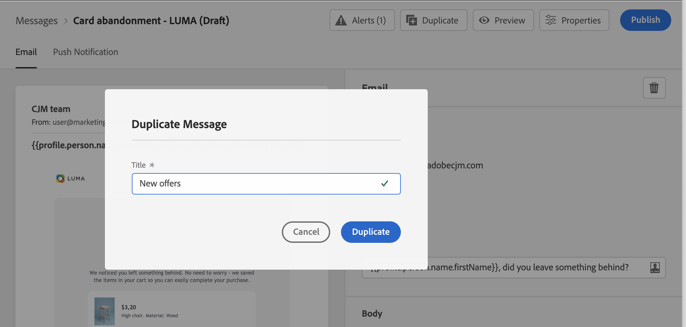
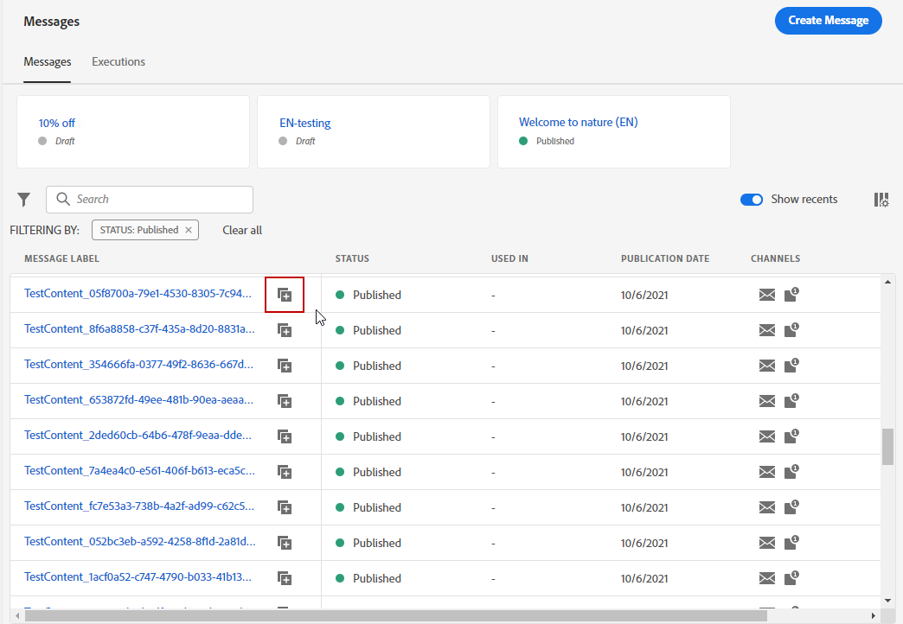

# 메시지 시작 {#get-started-contents-messages}

[!DNL Journey Optimizer]을(를) 사용하여 자산 및 콘텐츠와 같은 여러 리소스를 한 곳에서 활용하고, 개인화된 푸시 알림 및 이메일 메시지를 만들고 게시합니다.

* [!DNL Journey Optimizer] **이메일 디자인 기능**&#x200B;을 활용하여 응답형 이메일을 만들거나 가져옵니다.

* **Adobe Experience Manager Assets Essentials**&#x200B;을 활용하여 고유한 자산 데이터베이스를 구축하고 이메일을 보완합니다.

* 프로필 특성에 따라 **개인화된 푸시 및 이메일 메시지**&#x200B;를 만들어 고객의 경험을 향상시킬 수 있습니다.

* 이러한 콘텐츠를 기반으로 **푸시 및 이메일 메시지를 만든 다음** 게시합니다.

## 메시지 액세스 {#access-messages}

메시지는 왼쪽 탐색 인터페이스의 **[!UICONTROL Messages]** 바로 가기를 통해 사용할 수 있습니다. 전체 메시지 목록이 게시 날짜(게시한 메시지의 경우) 또는 작성 날짜(초안 메시지의 경우)별로 표시됩니다.

>[!NOTE]
>
>사용자는 제품 프로필에 따라 메시지에 액세스하고 메시지를 만들고 편집 및/또는 게시할 수 있습니다. 사용자 권한에 대한 자세한 내용은 [이 섹션](../administration/permissions.md)을 참조하세요.

* 지난 5일 동안 액세스한 메시지로 직접 가는 링크를 추가하려면 **[!UICONTROL Show recents]** 토글을 사용합니다.

   

* 필터 아이콘을 사용하여 초안, 게시 또는 게시 중 메시지만 표시할 수 있습니다. 다음과 같이 메시지 레이블을 검색할 수도 있습니다.

   

* 사용하지 않는 메시지를 보관하여 메시지 목록을 정리할 수도 있습니다. 빠른 작업 메뉴에서 전용 아이콘을 사용하면 됩니다.

   

   필터 아이콘을 사용하여 보관한 메시지를 모두 표시하고 **[!UICONTROL Unarchive]** 아이콘을 표시하여 보관 메시지 목록에서 항목을 제거합니다.

   >[!NOTE]
   >
   >보관된 메시지는 열 수 없습니다. 열려면 먼저 보관을 해제해야 합니다.

## 새 메시지 만들기 {#create-new-message}

새 메시지를 만들려면 아래 단계를 수행합니다.

1. 메시지 목록에 액세스한 다음 **[!UICONTROL Create Message]**&#x200B;를 클릭합니다.

1. 메시지 속성을 정의합니다.

   

   * **[!UICONTROL Title]**(필수) 및 **[!UICONTROL Description]**&#x200B;을 입력합니다.

   * **[!UICONTROL Message category]**&#x200B;를 마케팅 또는 트랜잭션 중에서 선택합니다.

   * 해당 메시지에 사용할 채널을 선택합니다. 이메일 및/또는 푸시 알림을 선택할 수 있습니다. 메시지를 만들려면 채널을 하나 이상 선택해야 합니다.

   * 메시지에 사용할 **[!UICONTROL Preset]**&#x200B;을 선택합니다.

      사전 설정에는 브랜드에 따라 이메일 및/또는 푸시 알림을 보내는 데 필요한 모든 매개 변수가 포함되어 있습니다. [사전 설정에 대해 자세히 알아보세요](../configuration/message-presets.md).
   >[!CAUTION]
   >
   >선택한 카테고리 및 채널에 대해 유효한 메시지 사전 설정을 선택해야 합니다.

   언제든지 메시지 인터페이스의 **[!UICONTROL Properties]** 버튼을 사용하여 메시지의 제목, 설명, 사전 설정에 액세스하고 이를 수정할 수 있습니다.

1. **[!UICONTROL Create]**&#x200B;를 클릭하여 메시지 만들기를 확인합니다. 메시지가 메시지 목록에 **[!UICONTROL Draft]** 상태로 추가됩니다.

   선택한 각 채널마다 탭을 하나씩 사용할 수 있습니다. 이 탭을 사용하여 각 채널에 대한 콘텐츠를 구성합니다. 탭을 선택하고 오른쪽에 있는 **[!UICONTROL Delete channel]** 버튼을 클릭하면 탭을 제거할 수 있습니다.

   

   이제 메시지 콘텐츠를 만들고 설정을 조정할 수 있습니다. 이메일 및 푸시 알림 구성에 대한 자세한 내용은 다음 섹션에서 확인할 수 있습니다.

   * [이메일 만들기](create-email.md)
   * [푸시 알림 만들기](create-push.md)

   >[!NOTE]
   >   
   >표현식 편집기에서 프로필의 데이터를 사용하여 메시지를 개인화할 수 있습니다. 개인화에 대한 자세한 내용은 [이 섹션](../personalization/personalize.md)을 참조하세요.

1. 왼쪽의 미리 보기 섹션을 사용하여 메시지 렌더링을 제어하고 테스트 프로필로 개인화 설정을 확인합니다. 이 작업에 대한 자세한 정보는 [이 섹션](../design/preview.md)을 참조하십시오.

   

1. 편집기의 위쪽 섹션에서 경고를 확인합니다.  일부는 간단한 경고이지만 일부는 해결하지 않으면 메시지를 게시하지 못할 수 있습니다. 자세한 내용은 [이 섹션](alerts.md)을 참조하십시오.

1. 이제 **[!UICONTROL Publish]** 버튼을 클릭하여 메시지를 게시하거나, 초안 상태로 저장했다가 나중에 게시할 수 있습니다. 자세한 메시지 게시 방법은 [이 섹션](publish-manage-message.md)을 참조하십시오.

## 메시지 복제 {#duplicate-message}

기존 메시지로 새 메시지를 만들려면 아래 단계를 수행합니다.

1. 복사할 메시지를 엽니다.

1. 메시지 인터페이스의 **[!UICONTROL Duplicate]** 버튼을 사용합니다.

   

   모든 설정 및 구성이 새 메시지에 복사됩니다.

1. 복제를 확인하기 전에 메시지 이름을 변경할 수 있습니다.

   

1. 새 메시지가 만들어지면 창 하단에 확인 메시지가 표시됩니다.

메시지 목록에서 빠른 작업 메뉴의 전용 아이콘을 사용하여 메시지를 복제할 수도 있습니다.

동일한 확인 프로세스가 적용됩니다.

