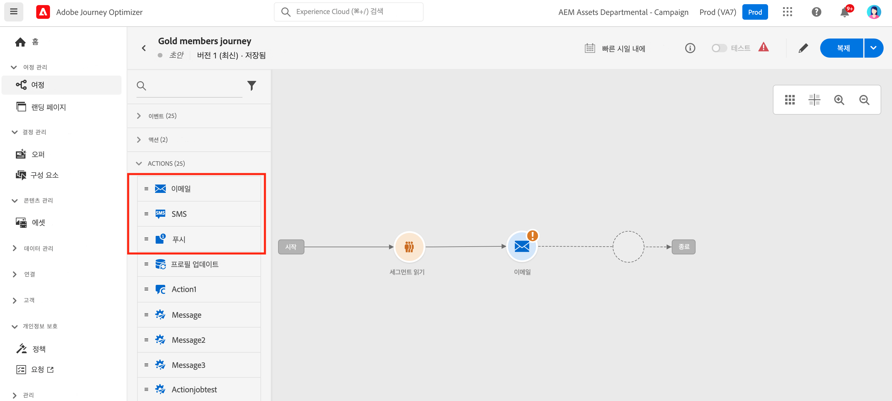
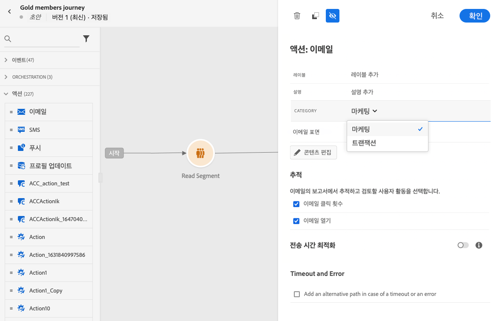
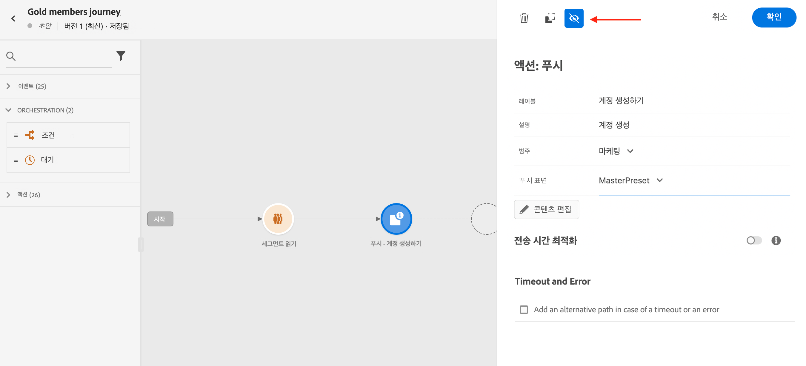
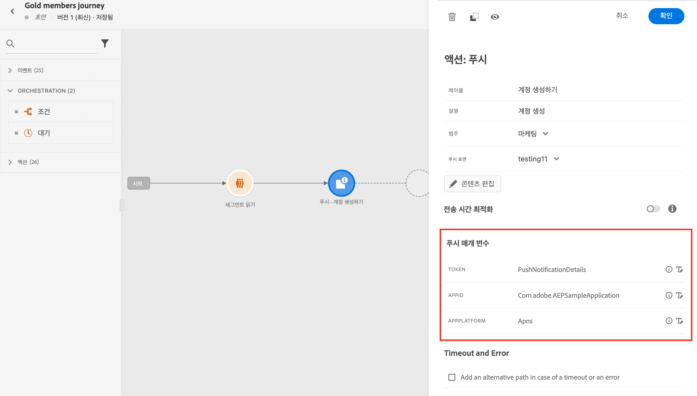
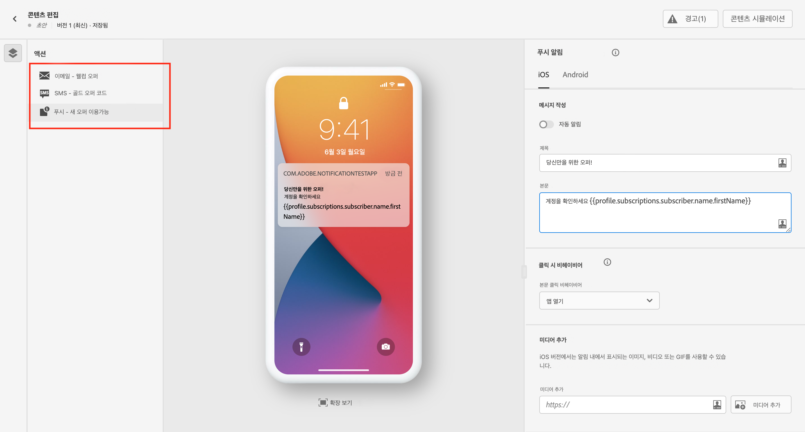
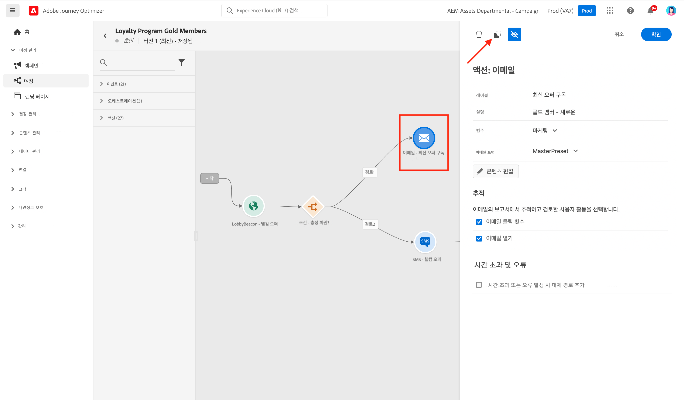
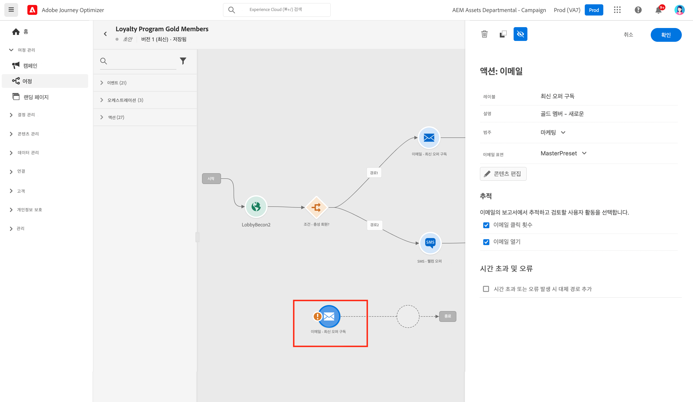
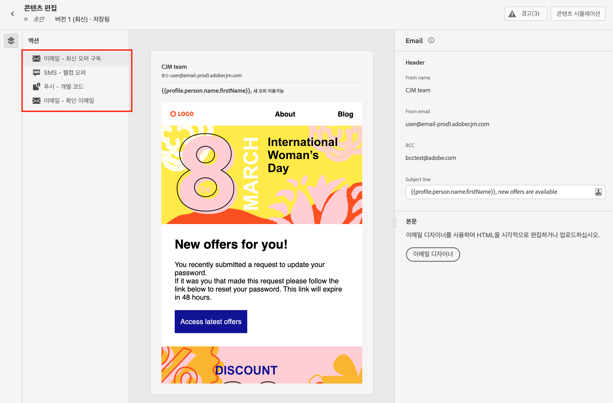
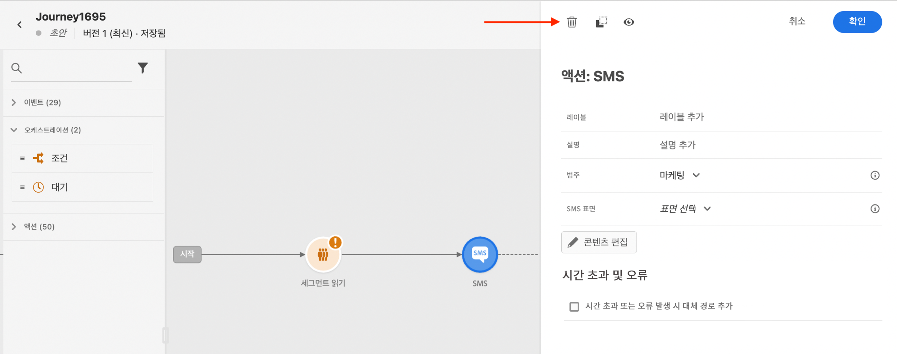

# 채널 작업 시작 {#get-started-messages}

>[!CONTEXTUALHELP]
>id="ajo_journey_message"
>title="채널 작업"
>abstract="채널 작업을 사용하여 푸시, SMS 또는 이메일 메시지를 보냅니다."

사용 [!DNL Journey Optimizer] 개인화된 푸시 알림, SMS 및 이메일 메시지를 만들고 게재하기 위해. 모든 메시지는 여정 캔버스에서 작업의 일부로 인라인 편집할 수 있습니다.  템플릿으로 저장 기능을 사용하여 컨텐츠를 쉽게 재사용할 수 있습니다. 다음을 수행할 수 있습니다.

* 사용 [!DNL Journey Optimizer] **이메일 디자인 기능** 반응형 이메일을 만들거나 가져오기 위해.

* 활용 **Adobe Experience Manager Assets Essentials** 이메일을 보강하기 위해 자산 데이터베이스를 빌드하고 관리합니다.

* 찾기 **Adobe Stock 사진** 콘텐츠를 빌드하고 이메일 디자인을 개선하기 위해

* 개인화된 환경을 만들어 고객 경험 향상 **푸시 알림, SMS 및 이메일** 프로필 속성에 따라 다릅니다.

* **게재 보내기** 이러한 컨텐츠를 기반으로 하여 고객 행동을 추적합니다.

>[!NOTE]
>
>사용자는 제품 프로필에 따라 여정에 액세스, 만들기, 편집 및/또는 게시할 수 있습니다. 사용자 권한에 대한 자세한 내용은 [이 섹션](../administration/permissions.md)을 참조하세요.

## 여정에 메시지 추가{#messages-in-journeys}

>[!CONTEXTUALHELP]
>id="ajo_message_category"
>title="메시지 카테고리"
>abstract="상업용 메시지에 대한 마케팅 또는 주문 확인, 암호 재설정 알림 또는 게재 정보와 같은 비상업적인 메시지에 대한 트랜잭션 을 선택합니다"

>[!CONTEXTUALHELP]
>id="ajo_message_surface"
>title="채널 서피스"
>abstract="채널 서피스는 캠페인이나 여정을 통해 작업을 성공적으로 전달할 수 있는 모든 설정이 있는 해당 채널의 인스턴스입니다. 시스템 관리자가 정의합니다."

여정에서 메시지를 추가하려면 여정 캔버스에서 푸시, SMS 또는 이메일 활동을 추가하기만 하면 됩니다.

1. 여정 시작 [이벤트](../building-journeys/general-events.md) 또는 [세그먼트 읽기](../building-journeys/read-segment.md) 활동.

1. 에서 **작업** 팔레트의 섹션에서 **이메일**, **SMS** 또는 **푸시** 활동을 캔버스로 이동합니다.

   

1. 레이블과 설명을 입력합니다.

1. 메시지를 선택합니다 **[!UICONTROL Category]**: 선택 **마케팅** 상업적 메시지 또는 **트랜잭션** 주문 확인, 암호 재설정 알림 또는 배달 정보와 같은 비상업적인 메시지의 경우.

   >[!NOTE]
   >
   >정의한 경우 [빈도 규칙](../configuration/frequency-rules.md) 특정 채널 및 카테고리의 경우 해당 채널 및 카테고리를 선택하면 메시지에 자동으로 적용됩니다. 현재 **[!UICONTROL Marketing]** 카테고리는 빈도 규칙에 사용할 수 있습니다.

   

   >[!CAUTION]
   >
   >마케팅 유형 메시지에는 [옵트아웃 링크](../messages/consent.md#opt-out-management). 이러한 메시지는 마케팅 커뮤니케이션의 구독을 취소한 프로필에 보낼 수 있으므로 트랜잭션 메시지에 필요하지 않습니다.

1. 채널 선택 **[!UICONTROL Surface]** (즉, 메시지 사전 설정)을 사용하여 메시지를 보낼 수 있습니다.

   서피스는 [시스템 관리자](../start/path/administrator.md). 여기에는 헤더 매개 변수, 하위 도메인, 모바일 앱 등과 같이 메시지를 전송하기 위한 모든 기술 매개 변수가 포함되어 있습니다. [자세히 알아보기](../configuration/message-presets.md).

   >[!CAUTION]
   >
   >선택한 메시지 범주 및 채널에 대해 유효한 채널 서피스를 선택해야 합니다.

   언제든지 을 사용하여 메시지의 레이블, 설명 및 서피스에 액세스하고 수정할 수 있습니다. **[!UICONTROL Properties]** 메시지 인터페이스의 단추.

1. 메시지 콘텐츠를 만듭니다.

   다음 페이지에서 메시지 콘텐츠를 만드는 자세한 단계를 배웁니다.

   * [이메일 만들기](create-email.md)
   * [푸시 알림 만들기](create-push.md)
   * [SMS 메시지 만들기](create-sms.md)

## 전송 시간 최적화 활성화{#sto-in-journeys}

이메일 및 푸시 알림의 경우 **[!UICONTROL Send-time optimization]**.

사용 **[!UICONTROL Send-time optimization]** 각 사용자에 대해 개인화된 전송 시간을 예약하여 메시지 열람률과 클릭률을 높일 수 있습니다. [자세히 알아보기](../messages/send-time-optimization.md).

## 고급 매개 변수{#adv-settings}

고급 매개 변수는 기본적으로 읽기 전용이며 숨겨집니다.

고급 매개 변수에 액세스하려면 **[!UICONTROL Show read-only fields]** 아이콘을 클릭합니다.

고급 매개 변수는 메시지 창 하단에 표시됩니다. 이러한 매개 변수는 [시스템 관리자](../start/path/administrator.md) 에서 [채널 표면](../configuration/message-presets.md) (즉, 메시지 사전 설정)이 메시지와 연결되어 있습니다.

푸시 알림의 경우 다음 매개 변수를 표시할 수 있습니다. 토큰, AppID, AppPlatform.

이메일의 경우 기본 이메일 주소를 표시할 수 있습니다.

특정 사용을 위해 특정 컨텍스트에서 이러한 값을 무시할 수 있습니다. 값을 강제 적용하려면 **매개 변수 무시 사용** 필드의 오른쪽에 있는 아이콘을 클릭합니다. 이 옵션은 예를 들면 다음과 같은 경우에 유용합니다.

* 이메일을 테스트하면 이메일 주소를 추가할 수 있습니다. 여정을 게시하면 이메일이 사용자에게 전송됩니다.
* 목록의 구독자 이메일 주소를 참조하십시오. 추가 정보 [이 사용 사례](../building-journeys/message-to-subscribers-uc.md).

동일한 아이콘을 클릭하여 기본 매개 변수로 재설정합니다.

## 메시지 찾아보기{#browse-message}

여정에서 여러 메시지를 사용하는 경우 **컨텐츠 편집** 화면.

그러면 다음 작업을 수행할 수 있습니다 [경고 확인](alerts.md) 및 [시뮬레이션](../design/preview.md) 단일 보기에서 각 컨텐츠.

## 메시지 복제 {#duplicate-message}

여정 캔버스에서 기존 메시지를 복사할 수 있습니다.

이렇게 하려면 아래 단계를 수행하십시오.

1. 복사할 메시지를 선택합니다.

1. 를 사용하십시오 **[!UICONTROL Copy]** 단추 **[!UICONTROL Action]** 창

   

1. Enter 키 **crtl+V** 메시지를 붙여넣습니다.

   메시지가 여정 캔버스에 추가됩니다. 모든 설정 및 구성이 새 메시지에 복사됩니다.

   

1. 초기 메시지를 복사와 구분할 수 있도록 메시지의 이름을 변경합니다. 예를 들어 메시지를 편집할 때 다음과 같이 바꿉니다.

   

>[!NOTE]
>
>이메일의 경우 기존 메시지를 템플릿에 전환할 수도 있습니다. [자세히 알아보기](../design/email-templates.md).

## 메시지 삭제

메시지를 삭제하려면 채널 작업 활동 창의 맨 위에 있는 휴지통 아이콘을 사용하십시오.

를 사용하십시오 **[!UICONTROL Confirm]** 확인할 단추를 클릭합니다.
