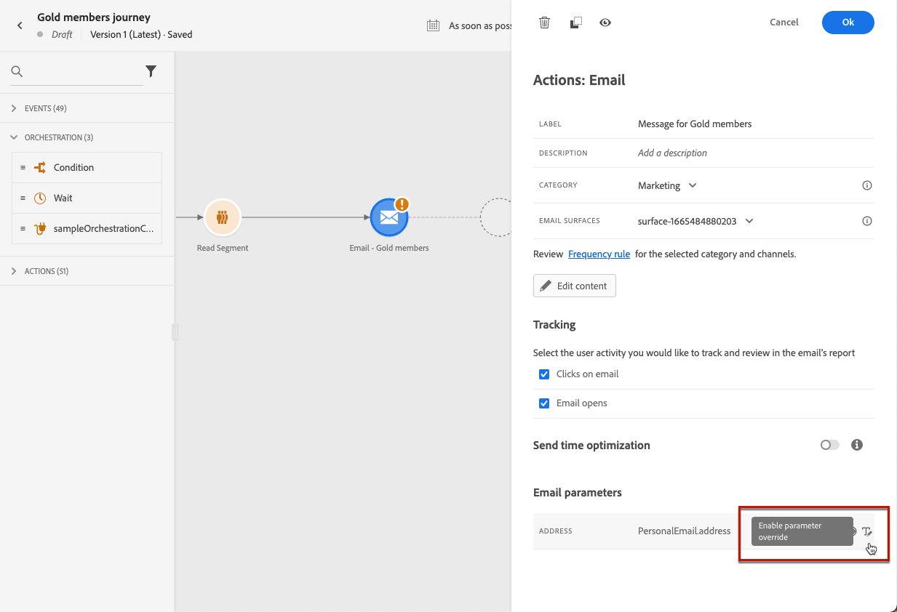

# 여정에 메시지 추가하기{#messages-in-journeys}

>[!CONTEXTUALHELP]
>id="ajo_message_category"
>title="메시지 카테고리"
>abstract="상업용 메시지에 대한 마케팅 또는 주문 확인, 암호 재설정 알림 또는 게재 정보와 같은 비상업적인 메시지에 대한 트랜잭션을 선택합니다."

>[!CONTEXTUALHELP]
>id="ajo_message_surface"
>title="채널 표면"
>abstract="채널 표면은 캠페인이나 여정을 통해 작업을 성공적으로 전달할 수 있는 모든 설정이 있는 해당 채널의 인스턴스입니다. 시스템 관리자가 정의합니다."

여정에서 채널 작업을 사용하여 대상자에게 보낼 메시지를 디자인하고 개인화합니다. 여정 캔버스에 이메일, SMS 또는 푸시 작업을 추가하면 트리거 전송이 만들어집니다. 연락 대상자가 해당 채널 작업에 도달하면 Adobe Journey Optimizer가 자동으로 메시지를 보냅니다.

>[!NOTE]
>캠페인을 만들어 예약 메시지를 보낼 수도 있습니다. 자세한 내용은 [이 섹션](../campaigns/get-started-with-campaigns.md)을 참조하세요.

여정에 메시지를 추가하려면 여정 캔버스에 푸시, SMS 또는 이메일 활동을 추가합니다.

1. [이벤트](../building-journeys/general-events.md) 또는 [세그먼트 읽기](../building-journeys/read-segment.md) 활동으로 여정을 시작하십시오.

1. 팔레트의 **작업** 섹션에서 **이메일**, **SMS** 또는 **푸시** 활동을 캔버스로 드래그하여 놓습니다.

   

1. 레이블과 설명을 입력합니다.

1. 메시지 **[!UICONTROL 카테고리]**&#x200B;를 선택합니다: 상업용 메시지에 대한 **마케팅** 또는 주문 확인, 암호 재설정 알림이나 게재 정보와 같은 비상업적인 메시지에 대한 **트랜잭션**&#x200B;을 선택합니다.

   

   >[!CAUTION]
   >
   >* 특정 채널 및 카테고리의 [빈도 규칙](../configuration/frequency-rules.md)을 정의한 경우 해당 채널 및 카테고리를 선택하면 메시지에 자동으로 적용됩니다. 현재 **[!UICONTROL 마케팅]** 카테고리만 빈도 규칙에 사용할 수 있습니다.
   >
   >* 마케팅 유형 메시지에는 [옵트아웃 링크](../privacy/opt-out.md#opt-out-management)가 포함되어야 합니다. 트랜잭션 메시지는 마케팅 커뮤니케이션의 구독을 취소한 프로필에 전송될 수 있으므로 이러한 메시지에는 필요하지 않습니다.

1. 메시지를 보내는 데 사용할 채널 **[!UICONTROL 표면]**(즉, 메시지 사전 설정)을 선택합니다.

   표면은 [시스템 관리자](../start/path/administrator.md)에 의해 정의된 구성입니다. 여기에는 헤더 매개 변수, 하위 도메인, 모바일 앱 등과 같이 메시지를 전송하기 위한 모든 기술 매개 변수가 포함되어 있습니다. [자세히 알아보기](../configuration/channel-surfaces.md).

   >[!CAUTION]
   >
   >선택한 메시지 카테고리 및 채널에 대해 유효한 채널 표면을 선택해야 합니다.

   언제든지 메시지 인터페이스의 **[!UICONTROL 속성]** 버튼을 사용하여 메시지의 레이블, 설명, 표면에 액세스하고 이를 수정할 수 있습니다.

1. 메시지 템플릿을 만듭니다.

   다음 페이지에서 메시지 콘텐츠를 만드는 자세한 단계를 배웁니다.

   * [이메일 만들기](create-email.md)
   * [푸시 알림 만들기](create-push.md)
   * [SMS 메시지 만들기](create-sms.md)

## 전송 시간 최적화 활성화{#sto-in-journeys}

이메일 및 푸시 알림의 경우 **[!UICONTROL 전송 시간 최적화]**&#x200B;를 활성화할 수 있습니다.

**[!UICONTROL 전송 시간 최적화]**&#x200B;를 사용하여 각 사용자에 대해 개인화된 전송 시간을 예약하여 메시지 열람률과 클릭률을 높일 수 있습니다. [자세히 알아보기](../messages/send-time-optimization.md).

## 고급 매개 변수{#adv-settings}

고급 매개 변수는 기본적으로 읽기 전용이며 숨겨집니다.

고급 매개 변수에 액세스하려면 메시지 창 상단의 **[!UICONTROL 읽기 전용 필드 표시]** 아이콘을 클릭합니다. 고급 설정을 숨기려면 동일한 아이콘을 클릭합니다.

고급 매개 변수는 메시지 창 하단에 표시됩니다. 이러한 매개 변수는 [시스템 관리자](../start/path/administrator.md)에 의해 메시지와 연관된 [채널 표면](../configuration/channel-surfaces.md)(즉, 메시지 사전 설정)에서 정의됩니다.

푸시 알림의 경우 Token, AppID, AppPlatform 매개 변수를 표시할 수 있습니다.

이메일의 경우 [기본 이메일 주소](../configuration/primary-email-addresses.md).

특정 컨텍스트에서는 특정 사용을 위해 이러한 값을 무시할 수 있습니다. 값을 강제 적용하려면 필드의 오른쪽에 있는 **[!UICONTROL 매개 변수 무시 활성화]** 아이콘을 클릭합니다.

이 옵션은 다음과 같은 경우에 유용합니다.

* 이메일을 테스트합니다. 이메일 주소를 추가할 수 있습니다. 여정을 게시하면 이메일이 사용자에게 전송됩니다.
* 목록의 구독자 이메일 주소를 참조하십시오. [사용 사례](../building-journeys/message-to-subscribers-uc.md)를 자세히 알아보십시오.

>[!NOTE]
>
>이메일 주소 무시는 특정 사용 사례에만 사용해야 합니다. 대부분의 경우 **[!UICONTROL 실행 필드]** 는 사용해야 하는 것입니다. [자세히 보기](../configuration/primary-email-addresses.md)

## 메시지 찾아보기{#browse-message}

여정에서 여러 메시지를 사용하는 경우 **컨텐츠 편집** 화면에서 메시지를 전환할 수 있습니다.

그 다음 단일 보기에서 [경고를 확인](alerts.md)하고 각 콘텐츠를 [시뮬레이션](../design/preview.md)할 수 있습니다.

## 메시지 복제 {#duplicate-message}

여정 캔버스에서 기존 메시지를 복사할 수 있습니다.

이렇게 하려면 아래 단계를 수행합니다.

1. 복사할 메시지를 엽니다.

1. **[!UICONTROL 작업]** 창에서 **[!UICONTROL 복사]** 버튼을 사용합니다.

   

1. **crtl+V** 키를 눌러 메시지를 붙여넣습니다.

   메시지가 여정 캔버스에 추가됩니다. 모든 설정 및 구성이 새 메시지에 복사됩니다.

   

1. 초기 메시지를 복사본과 구분할 수 있도록 메시지의 이름을 변경합니다. 예를 들어 메시지를 편집할 때 다음과 같이 바꿉니다.

   

>[!NOTE]
>
>이메일의 경우 기존 메시지를 템플릿에 전환할 수도 있습니다. [자세히 알아보기](../design/email-templates.md).

## 메시지 삭제{#delete-message}

메시지를 삭제하려면 채널 작업 활동 창 상단의 휴지통 아이콘을 사용합니다.

**[!UICONTROL 확인]** 버튼을 사용하여 확인합니다.
