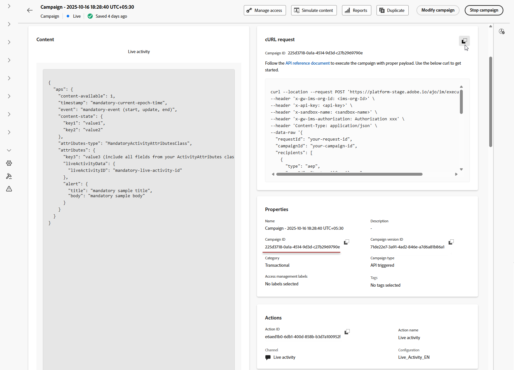

# 라이브 활동 만들기 {#create-mobile-live}

모바일 구성을 구성하고 Adobe Experience Platform mobile SDK을 구현한 후 Journey Optimizer에서 라이브 활동을 만들 수 있습니다.

1. **[!UICONTROL 캠페인]** 메뉴에 액세스한 다음 **[!UICONTROL 캠페인 만들기]**&#x200B;를 클릭합니다.

1. **API 트리거됨** 캠페인 유형을 선택하십시오.

   * 대상자 기반 캠페인에 대해 **API 트리거 마케팅** 선택

   * 개별 캠페인에 대해 **API 트리거 트랜잭션**&#x200B;을(를) 선택하십시오.

   >[!IMPORTANT]
   >
   > **API 트리거 트랜잭션**&#x200B;의 경우 **[!UICONTROL 높은 처리량]** 옵션을 사용할 수 없습니다.

   

1. **[!UICONTROL 속성]** 섹션에서 Campaign의 **[!UICONTROL 제목]** 및 **[!UICONTROL 설명]**&#x200B;을(를) 편집합니다.

1. **[!UICONTROL 작업]** 섹션에서 **[!UICONTROL 라이브 활동]**&#x200B;을 선택하고 새 구성을 선택하거나 만드십시오.

   [이 페이지](mobile-live-configuration.md)에서 실시간 활동 구성에 대해 자세히 알아보세요.

   

1. 콘텐츠 실험 구성을 시작하고 처리를 만들어 성능을 측정하고 대상 대상에 가장 적합한 옵션을 식별하려면 **[!UICONTROL 실험 만들기]**&#x200B;를 클릭하십시오. [자세히 알아보기](../content-management/content-experiment.md)

1. **[!UICONTROL 대상자]** 탭에서 **[!UICONTROL ID 유형]**&#x200B;을 선택합니다. [자세히 알아보기](../audience/about-audiences.md).

   >[!NOTE]
   >
   >**API 트리거 마케팅** 캠페인의 경우 API 페이로드에서 APNs channelID 구독을 확인하기 전에 첫 번째 세그먼테이션으로 작동하는 기존 대상을 선택할 수 있습니다.

1. 캠페인은 특정 날짜 또는 되풀이되는 빈도로 실행되도록 디자인됩니다. **[!UICONTROL 이 섹션]**&#x200B;에서 캠페인의 [일정](../campaigns/create-campaign.md#schedule)을 구성하는 방법을 알아보세요.

1. 구성이 완료되면 **[!UICONTROL 활성화 검토]**&#x200B;를 클릭한 다음 **[!UICONTROL 활성화]**&#x200B;를 클릭합니다.

1. 캠페인이 활성화되면 제공된 **cURL 요청**&#x200B;을(를) 템플릿으로 사용하여 라이브 활동 시작, 업데이트 또는 종료 이벤트를 트리거합니다. 실행 전에 특정 데이터로 샘플 페이로드를 업데이트합니다.

   페이로드에 포함할 **[!UICONTROL 캠페인 ID]** 식별자도 복사하십시오.

   ➡️ OAuth 토큰 및 API 키를 포함한 인증 요구 사항은 [API 트리거된 캠페인 설명서](https://developer.adobe.com/journey-optimizer-apis/references/messaging/)를 참조하십시오.

   

   +++ 단일 사용 사례에 대한 페이로드의 예(API 트리거 트랜잭션 캠페인)

   이 페이로드 예는 **API 트리거 트랜잭션** 캠페인 유형을 사용하는 개별 캠페인에 대한 것입니다. 다음 페이로드 예제의 필드 대부분은 필수이므로 `requestId`, `dismissal-date` 및 `alert`만 선택 사항입니다.

   ```json
   {
       "requestId": "your-request-id",
       "campaignId": "your-campaign-id",
       "recipients": [
   {
       "type": "aep",
       "userId": "testemail@gmail.com",
       "namespace": "email",
       "context": {
        "requestPayload": {
       "aps": {
       "content-available": 1,
       "timestamp": 1756984054,              // current epoch time
       "dismissal-date": 1756984084,         // optional – auto remove when event="end"
       "event": "update",                    // start | update | end
   
       // Fields from FoodDeliveryLiveActivityAttributes
       "content-state": {
         "orderStatus": "Delivered"
       },
   
       "attributes-type": "FoodDeliveryLiveActivityAttributes",
       "attributes": {
         "restaurantName": "Pizza",
         "liveActivityData": {
           "liveActivityID": "orderId1"       // customer reference ID
         }
       },
   
       "alert": {
         "title": "Order Delivered!",
         "body": "Your pizza has arrived."
       }
     }
   }
   }
   }
   ]
   }
   ```

   +++

   +++ 브로드캐스트 사용 사례(API 트리거 마케팅 캠페인)에 대한 페이로드의 예

   이 페이로드 예제는 **API 트리거 마케팅** 캠페인 유형을 사용하는 대상자 기반 캠페인에 대한 것입니다.

   ```json
   {
       "requestId": "123400000",
       "campaignId": "d32e6f6c-56df-4a98-a2c0-6db6008f8f32",
       "audience": {
           "id": "508f9416-52d0-4898-ba47-08baaa22e9c7"
       },
       "context": {
           "requestPayload": {
               "aps": {
                   "input-push-channel": "V+8UslywEfAAAOq9SbTrLg==",  //apns-channel-id
                   "content-available": 1,
                   "timestamp": 1770808339,
                   "event": "update",   // start | update | end
   
                   // Fields from GameScoreLiveActivityAttributes
                   "content-state": {
                       "homeTeamScore": 33,
                       "awayTeamScore": 49,
                       "statusText": "Wingdom keeps scoring!"
                   },
                   "attributes-type": "GameScoreLiveActivityAttributes",
                   "attributes": {
                       "liveActivityData": {
                           "channelID": "V+8UslywEfAAAOq9SbTrLg=="   //apns-channel-id, must match the "input-push-channel" value
                       }
                   },
                   "alert": {
                       "title": "This is the title for game",
                       "body": "This is the body for body"
                   }
               }
           }
       }
   }
   ```

   +++

라이브 활동을 디자인한 후 [기본 제공 보고서](../reports/campaign-global-report-cja-activity.md)를 통해 라이브 활동의 영향을 측정하는 방법을 추적할 수 있습니다.

>[!TIP]
>
>라이브 활동이 예상대로 나타나거나 업데이트되지 않으면 [라이브 활동 문제 해결](troubleshoot-mobile-live.md)에서 단계별 디버깅 지침을 참조하십시오.

## 사용 방법 비디오

Adobe Journey Optimizer을 사용하여 iOS 라이브 활동을 구성하여 iPhone 잠금 화면 및 Dynamic Island에서 다양한 실시간 업데이트를 제공하는 방법에 대해 알아봅니다.

>[!VIDEO](https://video.tv.adobe.com/v/3479871?captions=kor)
