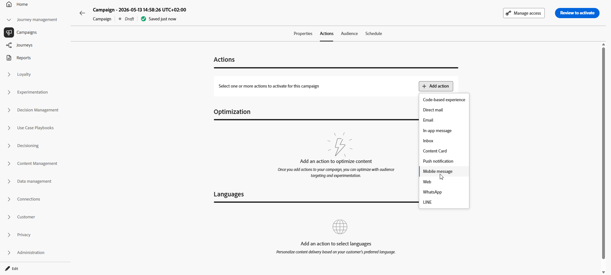

# 모바일 메시지 만들기 {#create-sms}

>[!CONTEXTUALHELP]
>id="ajo_message_sms"
>title="모바일 메시지 만들기"
>abstract="모바일 메시지를 만들려면 여정 또는 캠페인에 SMS 작업을 추가하고 개인화 편집기로 개인화를 시작합니다."

>[!AVAILABILITY]
>
>RCS는 HIPAA 지원 서비스가 아니므로 Journey Optimizer에서 처리할 수 있도록 귀하의 조직에서 허용할 수 있는 허용된 상태 데이터(예: 개인 건강 정보)를 비롯한 민감한 개인 데이터를 수집, 저장 또는 처리하는 데 사용되어서는 안 됩니다.

Adobe Journey Optimizer에서 텍스트(SMS), 풍부한 커뮤니케이션(RCS) 및 멀티미디어(MMS) 메시지를 디자인하고 보낼 수 있습니다. 먼저 여정 또는 캠페인에 모바일 메시지 작업을 추가한 다음 아래에 설명된 대로 모바일 메시지의 콘텐츠를 정의해야 합니다. Adobe Journey Optimizer은 전송 전에 모바일 메시지를 테스트하여 렌더링, 개인화 속성 및 기타 모든 설정을 확인할 수 있는 기능도 제공합니다.

업계 표준 및 규정에 따라 모든 SMS/RCS/MMS 마케팅 메시지에는 수신자가 쉽게 구독을 취소할 수 있는 방법이 포함되어야 합니다. 이를 위해 SMS 수신자는 옵트인 및 옵트아웃 키워드로 회신할 수 있습니다. [옵트아웃 관리 방법 알아보기](../privacy/opt-out.md#opt-out-decision-management)

## 모바일 메시지 추가 {#create-sms-journey-campaign}

캠페인이나 여정에 모바일 메시지를 추가하는 방법을 배우려면 아래 탭을 살펴보십시오.

>[!BEGINTABS]

>[!TAB 여정에 모바일 메시지 추가]

1. 여정을 열고 팔레트의 **[!UICONTROL 작업]** 섹션에서 **[!UICONTROL 작업]** 활동을 끌어서 놓습니다. [작업 활동](../building-journeys/journey-action.md)에 대해 자세히 알아보세요.

   >[!IMPORTANT]
   >
   >기존 기본 채널 활동(이메일, 푸시, SMS, 인앱, 웹, 코드 기반 경험 및 콘텐츠 카드)은 2026년 3월 릴리스부터 더 이상 사용되지 않습니다. 이러한 활동을 사용하는 기존 여정은 변경 사항 없이 계속 작동하므로 마이그레이션이 필요하지 않습니다.

1. 작업 유형으로 **[!UICONTROL 모바일 메시지]**&#x200B;를 선택하고 **[!UICONTROL 추가]**&#x200B;를 클릭합니다.

   

1. 여정 캔버스에서 작업을 식별하려면 **[!UICONTROL 레이블]**&#x200B;을 입력하십시오.

1. **[!UICONTROL 작업 구성]** 단추를 클릭합니다.

1. **[!UICONTROL 작업]** 탭으로 이동되었습니다. 여기에서 사용할 모바일 메시지 구성을 선택하거나 만듭니다. [자세히 알아보기](mobile-configuration.md)

   

1. 또한 **[!UICONTROL 비즈니스 규칙]** 드롭다운 목록에서 규칙 세트를 선택하여 모바일 메시지 작업에 최대 가용량 규칙을 적용할 수 있습니다. [자세히 알아보기](../conflict-prioritization/channel-capping.md)

1. **[!UICONTROL 콘텐츠 편집]** 단추를 선택하고 원하는 대로 콘텐츠를 만드십시오. [자세히 알아보기](design-mobile.md)

1. 여정 캔버스로 돌아갑니다. 필요한 경우 추가 작업 또는 이벤트를 끌어다 놓아 여정 흐름을 완료합니다. [자세히 알아보기](../building-journeys/about-journey-activities.md)

여정 만들기, 구성 및 게시 방법에 대한 자세한 내용은 [이 페이지](../building-journeys/journey-gs.md)를 참조하세요.

>[!TAB Campaign에 모바일 메시지 추가]

1. **[!UICONTROL 캠페인]** 메뉴에 액세스한 다음 **[!UICONTROL 캠페인 만들기]**&#x200B;를 클릭합니다.

1. 실행할 캠페인 유형 선택

   * **예약됨 - 마케팅**: 캠페인을 즉시 또는 지정한 날짜에 실행합니다. 예약된 캠페인은 마케팅 메시지 전송을 목적으로 합니다. 사용자 인터페이스에서 구성 및 실행됩니다.

   * **API 트리거됨 - 마케팅/트랜잭션**: API 호출을 사용하여 캠페인을 실행하십시오. API 트리거 캠페인은 마케팅 또는 트랜잭션 메시지(예: 암호 재설정, 장바구니 구매 등 개인이 수행한 작업에 따라 전송된 메시지)를 보내는 것을 목표로 합니다.

1. **[!UICONTROL 속성]** 섹션에서 Campaign의 **[!UICONTROL 제목]** 및 **[!UICONTROL 설명]**&#x200B;을(를) 편집합니다.

1. **[!UICONTROL 작업]** 탭에서 **[!UICONTROL 작업 추가]**&#x200B;를 클릭하고 **[!UICONTROL 모바일 메시지]**&#x200B;를 선택합니다. 그런 다음 새 구성을 선택하거나 만듭니다.

   [이 페이지](mobile-configuration.md)에서 모바일 메시지 구성에 대해 자세히 알아보세요.

   

1. 콘텐츠 실험 구성을 시작하고 처리를 만들어 성능을 측정하고 대상 대상에 가장 적합한 옵션을 식별하려면 **[!UICONTROL 실험 만들기]**&#x200B;를 클릭하십시오. [자세히 알아보기](../content-management/content-experiment.md)

1. **[!UICONTROL 작업 추적]** 섹션에서 모바일 메시지의 링크 클릭을 추적할지 여부를 지정합니다.

1. **[!UICONTROL 대상]** 탭에서 **[!UICONTROL 대상 선택]** 단추를 클릭하여 사용 가능한 Adobe Experience Platform 대상 목록에서 타깃팅할 대상을 정의합니다. [자세히 알아보기](../audience/about-audiences.md).

1. **[!UICONTROL ID 네임스페이스]** 필드에서 선택한 대상에서 개인을 식별하기 위해 사용할 네임스페이스를 선택합니다. [자세히 알아보기](../event/about-creating.md#select-the-namespace).

1. **[!UICONTROL 일정]** 탭에서 특정 날짜 또는 되풀이되는 빈도에 실행되도록 캠페인을 디자인할 수 있습니다. [이 섹션](../campaigns/campaign-schedule.md#action-campaign-schedule)에서 캠페인의 **[!UICONTROL 일정]**&#x200B;을 구성하는 방법을 알아보세요.

1. **[!UICONTROL 작업 트리거]** 메뉴에서 모바일 메시지의 **[!UICONTROL 빈도]**&#x200B;를 선택합니다.

   * 한 번
   * 일별
   * 매주
   * Month

이제 아래에 자세히 설명된 대로 **[!UICONTROL 콘텐츠 편집]** 단추에서 모바일 메시지의 콘텐츠 디자인을 시작할 수 있습니다. [자세히 알아보기](design-mobile.md)

캠페인을 만들고 구성하고 활성화하는 방법에 대한 자세한 내용은 [이 페이지](../campaigns/get-started-with-campaigns.md)를 참조하세요.

>[!ENDTABS]

**관련 항목**

* [모바일 메시지 디자인](design-mobile.md)
* [캠페인에 메시지 추가](../campaigns/create-campaign.md)
* [모바일 메시지 미리 보기, 테스트 및 보내기](send-mobile-message.md)
* [모바일 메시지 채널 구성](mobile-configuration.md)
* [모바일 메시지 보고서](../reports/journey-global-report-cja-sms.md)

