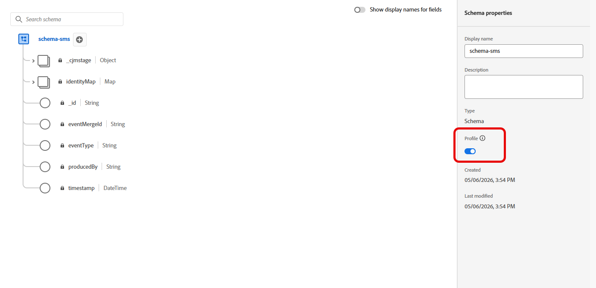
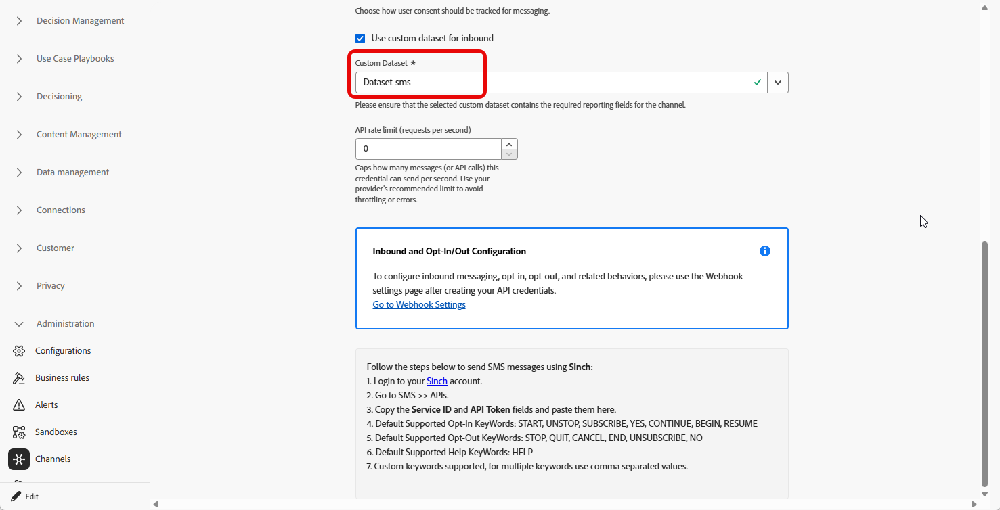

# 인바운드 키워드에 대한 사용자 지정 데이터 세트 사용 {#custom-dataset-inbound-keywords}

인바운드 SMS 키워드는 프로필이 활성화된 사용자 정의 데이터 세트에 저장할 수 있습니다. 구성은 Adobe Experience Platform 스키마, 해당 스키마에서 생성된 데이터 세트 및 인바운드 메시지에 대한 데이터 세트를 참조하는 Journey Optimizer SMS API 자격 증명으로 구성됩니다.

>[!NOTE]
>
>사용자 지정 데이터 세트가 구성되지 않은 경우 기본적으로 인바운드 키워드가 시스템 _AJO 인바운드 활동 이벤트 데이터 세트_&#x200B;에 저장됩니다. 들어오는 메시지가 이 데이터 집합에 캡처되기 전에 프로필에 [!DNL Journey Optimizer]에서 보낸 메시지가 하나 이상 있어야 합니다. [시스템 데이터 세트에 대해 자세히 알아보기](../data/get-started-datasets.md#system-datasets)

스키마, 필드 그룹 및 데이터 세트에 대한 배경은 다음 Adobe Experience Platform 설명서를 참조하십시오.

* [XDM 시스템 개요](https://experienceleague.adobe.com/docs/experience-platform/xdm/home.html?lang=ko-KR){target="_blank"}
* [스키마 컴포지션 기본 사항](https://experienceleague.adobe.com/docs/experience-platform/xdm/schema/composition.html?lang=ko-KR){target="_blank"}
* [데이터 세트 개요](https://experienceleague.adobe.com/docs/experience-platform/catalog/datasets/overview.html?lang=ko){target="_blank"}

인바운드 키워드에 대한 사용자 지정 데이터 세트를 사용하려면 다음을 수행해야 합니다.

1. [스키마 만들기](#create-schema)
1. [데이터 세트 만들기](#create-dataset)
1. [API 자격 증명 구성](#configure-api-credentials)

## 스키마 만들기 {#create-schema}

스키마는 수집된 데이터에 적용되는 구조 및 유효성 검사 규칙을 정의합니다. 아래 나열된 기존 필드 그룹을 추가하여 인바운드 키워드 수집을 위한 경험 이벤트 스키마를 구성합니다.

➡️ [Adobe Experience Platform 설명서에서 스키마 만들기에 대해 자세히 알아보기](https://experienceleague.adobe.com/ko/docs/experience-platform/xdm/schema/composition)

1. Adobe Experience Platform의 **[!UICONTROL 데이터 관리]**&#x200B;에서 **[!UICONTROL 스키마]**&#x200B;에 액세스하고 **[!UICONTROL 스키마 만들기]**&#x200B;를 선택합니다.

   

1. **[!UICONTROL 표준 스키마]**&#x200B;를 선택하십시오.

1. **[!UICONTROL 경험 이벤트]**&#x200B;를 선택합니다.

   

1. 스키마에 대한 **[!UICONTROL 표시 이름]**&#x200B;을(를) 입력하고 **[!UICONTROL 마침]**&#x200B;을(를) 클릭합니다.

   스키마가 저장되고 스키마 편집기가 열립니다.

1. **[!UICONTROL 스키마 속성]**&#x200B;을 열고 **[!UICONTROL 프로필]**&#x200B;에 대한 스키마를 사용하도록 설정하십시오.

   

1. **[!UICONTROL 필드 그룹]**&#x200B;에서 다음과 같은 기존 필드 그룹을 추가하십시오.

   * [!DNL Adobe CJM ExperienceEvent - Message interaction details]
   * [!DNL Adobe CJM ExperienceEvent - Message Execution Details]
   * [!DNL Adobe CJM ExperienceEvent - Message Profile Details]

1. **[!UICONTROL 저장]**&#x200B;을 클릭합니다.

## 데이터 세트 만들기 {#create-dataset}

데이터 세트는 수집된 데이터의 저장소 컨테이너입니다. 각 데이터 세트는 정확히 하나의 스키마와 연결되며 데이터 세트에 작성된 레코드는 해당 스키마를 준수해야 합니다.

1. Adobe Experience Platform의 **[!UICONTROL 데이터 관리]**&#x200B;에서 **[!UICONTROL 데이터 세트]**&#x200B;에 액세스하고 **[!UICONTROL 데이터 세트 만들기]**&#x200B;를 선택합니다.

   

1. **[!UICONTROL 스키마에서 데이터 집합 만들기]**&#x200B;를 선택합니다.

1. 이전 섹션에서 만든 스키마를 선택하고 **[!UICONTROL 다음]**&#x200B;을(를) 클릭합니다.

   

1. **[!UICONTROL 이름]**&#x200B;을 입력하고 **[!UICONTROL 마침]**&#x200B;을 클릭합니다.

1. **[!UICONTROL 데이터 활동]** 탭에서 **[!UICONTROL 프로필]**&#x200B;에 대한 데이터를 사용하도록 설정하십시오.

   조직 거버넌스 요구 사항에 적합한 **[!UICONTROL 데이터 보존]** 정책을 선택하십시오.

   

1. **[!UICONTROL 저장]**&#x200B;을 클릭합니다.

## API 자격 증명 구성 {#configure-api-credentials}

[SMS/MMS/RCS 구성 시작](mobile-configuration.md)을 사용하여 SMS 공급자에 따라 자격 증명을 구성합니다. 그런 다음 아래 단계를 완료하여 사용자 지정 인바운드 데이터 세트를 선택합니다.

1. 왼쪽 레일에서 **[!UICONTROL 관리]** > **[!UICONTROL 채널]** `>` **[!UICONTROL SMS 설정]**&#x200B;으로 이동한 다음 **[!UICONTROL API 자격 증명]** 메뉴를 선택합니다. **[!UICONTROL 새 API 자격 증명 만들기]** 단추를 클릭합니다.

1. 공급자에 따라 자격 증명을 만들거나 편집합니다.

1. **[!UICONTROL 인바운드에 대한 사용자 지정 데이터 집합 사용]** 옵션을 사용하도록 설정합니다.

1. 이전 섹션에서 만든 **[!UICONTROL 데이터 집합]**&#x200B;을(를) 선택하십시오.

   

1. 나머지 필수 필드를 작성하고 **[!UICONTROL 저장]**&#x200B;을 클릭합니다.

   >[!NOTE]
   >
   >API 자격 증명을 저장할 때 Journey Optimizer이 인바운드 키워드 데이터 세트가 올바르게 구성되어 있는지 확인합니다. 유효성 검사가 실패하면 필요한 수정 사항을 나타내는 오류 메시지가 표시됩니다.

자격 증명이 저장된 후 아웃바운드 및 인바운드 메시징 동작은 변경되지 않습니다. 해당 자격 증명에 대한 인바운드 키워드는 선택한 사용자 지정 데이터 세트에 기록됩니다.
