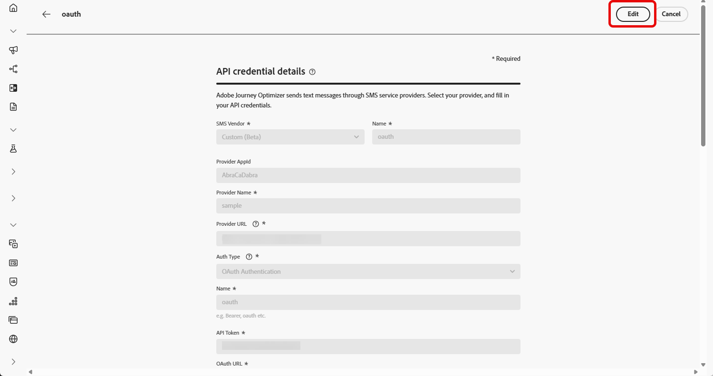

# 사용자 정의 제공자 구성 {#sms-configuration-custom}

>[!BEGINSHADEBOX]

**이 페이지에서:** API 자격 증명을 만들고, 인증 방법을 선택하고, SMS 및 RCS 메시지를 보내기 위해 헤더, 페이로드 및 인바운드 설정을 구성하여 Adobe Journey Optimizer에서 사용자 지정 메시징 공급자를 통합하는 방법에 대해 알아봅니다.

>[!ENDSHADEBOX]

>[!CONTEXTUALHELP]
>id="ajo_admin_sms_api_byop_provider_url"
>title="제공자 URL"
>abstract="연결하려는 외부 API의 URL을 지정합니다. 이 URL은 해당 API의 특징과 기능에 액세스하기 위한 엔드포인트 역할을 합니다"

>[!CONTEXTUALHELP]
>id="ajo_admin_sms_api_byop_header_parameters"
>title="헤더 매개변수"
>abstract="적절한 인증, 콘텐츠 형식 지정 및 효과적인 API 통신을 위해 추가 헤더의 레이블, 유형 및 값을 지정합니다. "

>[!CONTEXTUALHELP]
>id="ajo_admin_sms_api_byop_provider_payload"
>title="공급자 페이로드"
>abstract="올바른 데이터가 처리 및 응답 생성에 사용될 수 있도록 요청 페이로드를 제공합니다."

>[!CONTEXTUALHELP]
>id="ajo_admin_sms_api_byop_response_msg_id_extractor"
>title="제공자 페이로드"
>abstract="Journey Optimizer에서 어떻게 공급자의 전송 응답에서 고유한 메시지 ID를 추출할지를 지정합니다.  필드 일치: 필드 이름(예: messageId)을 입력합니다. AJO에서 응답을 스캔하고 첫 번째로 일치하는 값을 반환할 것입니다.  점 표기법: 필드로의 경로(예: messages.0.id)를 입력합니다. 배열에 대해 숫자 세그먼트를 사용합니다. $ 접두사는 사용하지 않습니다.  공급자가 대신 콜백 데이터 필드 전달을 지원하는 경우 비워 두십시오."

이 기능을 사용하면 고유한 메시징 공급자를 통합 및 구성하여 기본 옵션(Sinch, Twilio 및 Infobip) 이상의 유연성을 제공할 수 있습니다. 이를 통해 모바일 메시지에 대한 원활한 작성, 전달, 보고 및 동의 관리가 가능합니다.

사용자 정의 공급자 구성을 통해 Journey Optimizer 내에서 직접 서드파티 메시징 서비스에 연결하고, 다이내믹 컨텐츠에 대한 메시지 페이로드를 사용자 정의하고, 옵트인/옵트아웃 환경 설정을 관리하여 SMS와 RCS 채널 모두에서 규정 준수를 보장할 수 있습니다.

사용자 지정 공급자를 구성하려면 아래 단계를 수행하십시오.

1. [API 자격 증명 만들기](#api-credential)
1. [웹후크 만들기](mobile-webhook.md)
1. [채널 구성 만들기](mobile-configuration-surface.md)
1. [SMS 채널 작업으로 여정 또는 캠페인 만들기](create-mobile-message.md)

## API 자격 증명 만들기 {#api-credential}

>[!CONTEXTUALHELP]
>id="ajo_admin_sms_api_byop_channel_type"
>title="채널 유형"
>abstract="선택 사항입니다. 이 사용자 정의 SMS 공급자 자격 증명으로 보낸 메시지(예: SMS 또는 RCS)를 분류합니다. Journey Optimizer은 채널별 게재를 보고하고 추적할 수 있도록 XDM 경험 이벤트에 값을 기록합니다."

>[!CONTEXTUALHELP]
>id="ajo_admin_sms_webhook_require_auth"
>title="인증"
>abstract="활성화되면 Adobe IMS를 통해 인증된 요청만 수락됩니다. 이 끝점으로 데이터를 전송할 때 호출자는 유효한 OAuth 토큰을 포함해야 합니다."

Adobe에서 즉시 사용할 수 없는 사용자 지정 공급자(예: Sinch, Infobip, Twilio)를 사용하여 Journey Optimizer에서 모바일 메시지를 보내려면 다음 단계를 따르십시오.

1. 왼쪽 레일에서 **[!UICONTROL 관리]** `>` **[!UICONTROL 채널]**(으)로 이동하고 **[!UICONTROL SMS 설정]**&#x200B;에서 **[!UICONTROL API 자격 증명]** 메뉴를 선택한 다음 **[!UICONTROL 새 API 자격 증명 만들기]** 단추를 클릭합니다.

   

1. 아래에 자세히 설명된 대로 SMS API 자격 증명을 구성합니다.

   * **[!UICONTROL SMS 공급업체]**: 사용자 지정입니다.

   * **[!UICONTROL 이름]**: API 자격 증명의 이름을 입력하십시오.

   * **[!UICONTROL 공급자 AppId]**: SMS 공급자가 제공한 응용 프로그램 ID를 입력하십시오.

   * **[!UICONTROL 공급자 이름]**: SMS 공급자의 이름을 입력하십시오.

   * **[!UICONTROL 공급자 URL]**: SMS 공급자의 URL을 입력하십시오.

   * **[!UICONTROL 채널 유형]**: 선택 사항입니다. 이 자격 증명이 나타내는 모바일 채널(예: SMS, RCS 또는 MMS)을 나타냅니다.

   * **[!UICONTROL 인증 유형{&#x200B;1}: 인증 유형을 선택하고 [선택한 인증 방법에 따라 해당 필드를 완료](#auth-options)합니다.]**

     

1. 보안 연결을 설정하기 전에 클라이언트와 서버가 서로 인증하도록 하는 **[!UICONTROL mTLS 지원]** 옵션을 사용하도록 설정하십시오.

   mTLS만 사용하려면 **[!UICONTROL 인증 유형]** 드롭다운에서 **[!UICONTROL 인증 없음]**&#x200B;을 선택한 다음 **[!UICONTROL mTLS 지원]**&#x200B;을 사용하도록 설정하십시오.

   mTLS는 SMS 공급자(메시지 전송) 엔드포인트에만 적용됩니다. OAuth 토큰 종단점은 mTLS를 사용하면 안 됩니다. 테스트하기 전에 토큰 엔드포인트에서 mTLS가 비활성화되어 있는지 확인하십시오.

   >[!IMPORTANT]
   >
   >[MTLS 공개 인증서 API](https://experienceleague.adobe.com/ko/docs/experience-platform/data-governance/mtls-api/public-certificate-endpoint)에서 공개 인증서를 다운로드하고 서버 신뢰 저장소(예상 클라이언트 CN: `ajo-sms.aep-mtls.adobe.com`)에 추가하여 Adobe Experience Platform 인증 기관 체인을 신뢰하도록 SMS 전송 끝점을 구성하십시오. 그렇지 않으면 Journey Optimizer에서 클라이언트 인증서를 생략하고 SMS 배달이 실패합니다.

1. **[!UICONTROL Headers]** 섹션에서 **[!UICONTROL 새 매개 변수 추가]**&#x200B;를 클릭하여 외부 서비스로 전송될 요청 메시지에 대한 HTTP 헤더를 지정합니다.

   **Content-Type** 및 **Charset** 헤더 필드는 기본적으로 설정되며 삭제할 수 없습니다.

   

1. **[!UICONTROL 공급자 페이로드]**&#x200B;를 추가하여 요청 페이로드의 유효성을 검사하고 사용자 지정합니다.

   RCS 메시지의 경우 이 페이로드는 나중에 [콘텐츠 디자인](create-mobile-message.md#sms-content) 중에 사용됩니다.

   >[!NOTE]
   >
   >기본 또는 전달자 인증을 사용하여 사용자 지정 SMS 공급자를 구성할 때는 JSON 페이로드에 `authOption` 매개 변수를 포함해야 합니다. 또한 **공급자 페이로드**&#x200B;는 템플릿 변수 `{{fromNumber}}`, `{{toNumber}}` 및 `{{message}}`을(를) 참조해야 합니다.

1. 이 자격 증명의 인바운드 SMS를 드롭다운에서 선택한 미리 만들어진 데이터 세트로 라우팅하려면 **[!UICONTROL 인바운드에 대한 사용자 지정 데이터 세트 사용]**&#x200B;을 선택하십시오. [인바운드 키워드에 대한 사용자 지정 데이터 세트 사용에 대해 자세히 알아보기](custom-dataset-inbound-keywords.md)

   >[!NOTE]
   >
   >데이터 세트 스키마는 **[!UICONTROL XDM ExperienceEvent]**&#x200B;이어야 하며 다음 필드 그룹을 하나 이상 포함해야 합니다.
   >* Adobe CJM ExperienceEvent - 메시지 상호 작용 세부 정보
   >* Adobe CJM ExperienceEvent - 메시지 실행 세부 정보
   >* Adobe CJM ExperienceEvent - 메시지 프로필 세부 정보
   >
   >프로필에 대해 스키마 및 데이터 세트를 활성화해야 합니다.

1. API 자격 증명 구성을 마치면 **[!UICONTROL 제출]**&#x200B;을 클릭합니다.

1. **[!UICONTROL API 자격 증명]** 메뉴에서 을 클릭하여 API 자격 증명을 삭제합니다.

   

1. 기존 자격 증명을 수정하려면 원하는 API 자격 증명을 찾은 다음 **[!UICONTROL 편집]** 옵션을 클릭하여 필요한 변경을 수행합니다.

   

1. 기존 API 자격 증명에서 **[!UICONTROL SMS 연결 확인]**&#x200B;을 클릭하여 샘플 메시지를 지정된 장치로 보내 SMS API 자격 증명을 테스트하고 확인합니다.

1. **숫자** 및 **메시지** 필드를 입력하고 **[!UICONTROL 연결 확인]**&#x200B;을 클릭합니다.

   >[!IMPORTANT]
   >
   >공급자의 페이로드 형식에 맞게 메시지를 구조화해야 합니다.

   

API 자격 증명을 만들고 구성한 후에는 SMS 메시지에 대해 [Webhook에 대한 인바운드 설정](#webhook)을 설정해야 합니다.

>[!TIP]
>
>항상 각 샌드박스(프로덕션, 개발 등)에 대해 별도의 에이전트 구성을 만들고 유지 관리합니다. 환경 간 웹후크 응답 문제를 방지합니다. 샌드박스에서 동일한 API 자격 증명, 웹후크 또는 공급자 콜백 URL(RCS 에이전트 포함)을 재사용하지 마십시오.

### 사용자 정의 SMS 제공자에 대한 인증 옵션 {#auth-options}

>[!CONTEXTUALHELP]
>id="ajo_admin_sms_api_byop_auth_type"
>title="인증 유형"
>abstract="API에 액세스하는 데 필요한 인증 방법을 지정하면 외부 서비스와의 안전하고 승인된 통신이 보장됩니다."

>[!BEGINTABS]

>[!TAB API 키]

API 자격 증명이 만들어지면 API 키 인증에 필요한 필드를 작성합니다.

* **[!UICONTROL 이름]**&#x200B;: API 키 구성의 이름을 입력하십시오.
* **[!UICONTROL API 토큰]**&#x200B;: SMS 공급자가 제공한 API 토큰을 입력하십시오.

>[!TAB MAC 인증]

API 자격 증명이 만들어지면 MAC 인증에 필요한 필드를 작성합니다.

* **[!UICONTROL 이름]**&#x200B;: MAC 인증 구성의 이름을 입력하십시오.
* **[!UICONTROL API 토큰]**&#x200B;: SMS 공급자가 제공한 API 토큰을 입력하십시오.
* **[!UICONTROL API 암호 키]**: SMS 공급자가 제공한 API 암호 키를 입력하십시오. 이 키는 보안 통신을 위한 MAC(메시지 인증 코드)를 생성하는 데 사용됩니다.
* **[!UICONTROL Mac 인증 해시 형식]**: MAC 인증에 대한 해시 형식을 선택합니다.

>[!TAB OAuth 인증]

API 자격 증명이 생성되면 OAuth 인증에 필요한 필드를 작성합니다.

* **[!UICONTROL 이름]**&#x200B;: OAuth 인증 구성의 이름을 입력합니다.

* **[!UICONTROL API 토큰]**&#x200B;: SMS 공급자가 제공한 API 토큰을 입력하십시오.

* **[!UICONTROL OAuth URL]**&#x200B;: OAuth 토큰을 가져올 URL을 입력합니다.

* **[!UICONTROL OAuth 본문]**&#x200B;: `grant_type`, `client_id` 및 `client_secret` 등의 매개 변수를 포함하여 JSON 형식으로 OAuth 요청 본문을 제공합니다.

Journey Optimizer은 사용자 지정 SMS 커넥터에 대한 만료 시 OAuth 토큰을 동적으로 새로 고칩니다.

>[!TAB JWT 인증]

API 자격 증명이 생성되면 JWT 인증에 필요한 필드를 작성합니다.

* **[!UICONTROL 이름]**&#x200B;: JWT 인증 구성의 이름을 입력하십시오.

* **[!UICONTROL API 토큰]**&#x200B;: SMS 공급자가 제공한 API 토큰을 입력하십시오.

* **[!UICONTROL JWT 페이로드]**&#x200B;: 발급자, 제목, 대상 및 만료와 같이 JWT에 필요한 클레임이 들어 있는 JSON 페이로드를 입력합니다.

>[!ENDTABS]

## 사용 방법 비디오 {#video}

>[!VIDEO](https://video.tv.adobe.com/v/3431625)

