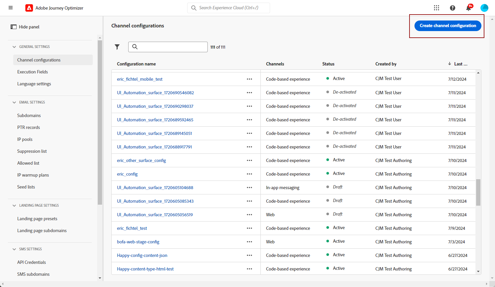

# 모바일 메시지 구성 만들기 {#message-preset-sms}

>[!BEGINSHADEBOX]

**이 페이지에서:** 메시지 유형, 모바일 구성, 보낸 사람 번호, 하위 도메인 및 실행 필드를 설정하여 SMS, RCS 및 MMS 메시지를 보내는 모바일 메시지 채널 구성을 만드는 방법을 알아봅니다.

>[!ENDSHADEBOX]

>[!CONTEXTUALHELP]
>id="ajo_admin_surface_sms_type"
>title="메시지 카테고리 정의"
>abstract="이 구성을 사용하는 모바일 메시지 유형 선택: 사용자 동의가 필요한 프로모션 메시지를 위한 마케팅 또는 암호 재설정과 같은 비상업적 메시지를 위한 트랜잭션."
>additional-url="https://experienceleague.adobe.com/docs/journey-optimizer/using/privacy/consent/opt-out.html?lang=ko#sms-opt-out-management" text="마케팅 모바일 메시지 옵트아웃"

모바일 메시지 채널이 구성되면 **[!DNL Journey Optimizer]**&#x200B;에서 SMS, RCS 및 MMS 메시지를 보낼 수 있도록 채널 구성을 만들어야 합니다.

채널 구성을 만들려면 다음 단계를 수행하십시오.

1. 왼쪽 레일에서 **[!UICONTROL 관리]** > **[!UICONTROL 채널]**(으)로 이동한 다음 **[!UICONTROL 일반 설정]** > **[!UICONTROL 채널 구성]**&#x200B;을 선택합니다. **[!UICONTROL 채널 구성 만들기]** 단추를 클릭합니다.

   

1. 구성의 이름 및 설명(선택 사항)을 입력한 다음 모바일 채널을 선택합니다.

   

   >[!NOTE]
   >
   > 이름은 문자(A-Z)로 시작해야 합니다. 영숫자만 포함할 수 있습니다. 밑줄 `_`, 점 `.`, 하이픈 `-`도 사용할 수 있습니다.

1. 이 구성에 대한 **[!UICONTROL SMS 유형]**&#x200B;을(를) 선택하십시오.

   * **[!UICONTROL 마케팅]**: 사용자 동의가 필요한 프로모션 메시지용.
   * **[!UICONTROL 트랜잭션]**: 주문 확인, 암호 재설정 또는 게재 업데이트와 같은 비상업적인 메시지의 경우.

   >[!CAUTION]
   >
   >**트랜잭션** 메시지는 마케팅 커뮤니케이션의 구독을 취소한 프로필에 보낼 수 있지만, 특정 컨텍스트에서만 보낼 수 있습니다.

   {width=80%}

1. 구성과 연결할 **[!UICONTROL 모바일 구성]**&#x200B;을(를) 선택하십시오.

   모바일 메시지를 보내도록 환경을 구성하는 방법에 대한 자세한 내용은 [이 섹션](#create-api)을 참조하세요.

1. 통신에 사용할 **[!UICONTROL 발신자 번호]**&#x200B;을(를) 입력하십시오.

1. 모바일 메시지에서 URL 단축 기능을 사용하려면 **[!UICONTROL 하위 도메인]** 목록에서 항목을 선택하십시오.

   >[!NOTE]
   >
   >하위 도메인을 선택하려면 최소 하나 이상의 SMS/RCS/MMS 하위 도메인을 이전에 구성했는지 확인하십시오. [방법 알아보기](mobile-subdomains.md)

1. **[!UICONTROL 실행 차원]** 섹션에서 **[!UICONTROL SMS 실행 필드]**&#x200B;를 사용하여 데이터베이스에서 여러 번호를 사용할 수 있는 경우 우선 순위에 사용할 전화 번호를 프로필 특성 중에서 선택합니다. [자세히 알아보기](../configuration/primary-email-addresses.md#override-execution-address-channel-config)

   >[!NOTE]
   >
   >기본적으로 [!DNL Journey Optimizer]은(는) 샌드박스 수준의 [일반 설정](../configuration/primary-email-addresses.md)에 지정된 전화 번호를 사용합니다. 이 필드를 업데이트하면 이 구성을 사용하는 여정 및 캠페인에 대한 기본값이 재정의됩니다.

1. 이 자격 증명의 인바운드 SMS를 드롭다운에서 선택한 미리 만들어진 데이터 세트로 라우팅하려면 **[!UICONTROL 인바운드에 대한 사용자 지정 데이터 세트 사용]**&#x200B;을 선택하십시오. [인바운드 키워드에 대한 사용자 지정 데이터 세트 사용에 대해 자세히 알아보기](custom-dataset-inbound-keywords.md)

   >[!NOTE]
   >
   >데이터 세트 스키마는 **[!UICONTROL XDM ExperienceEvent]**&#x200B;이어야 하며 다음 필드 그룹을 하나 이상 포함해야 합니다.
   >* Adobe CJM ExperienceEvent - 메시지 상호 작용 세부 정보
   >* Adobe CJM ExperienceEvent - 메시지 실행 세부 정보
   >* Adobe CJM ExperienceEvent - 메시지 프로필 세부 정보
   >
   >프로필에 대해 스키마 및 데이터 세트를 활성화해야 합니다.

1. 모든 매개 변수가 구성되면 **[!UICONTROL 제출]**&#x200B;을 클릭하여 확인합니다. 채널 구성을 초안으로 저장하고 나중에 구성을 다시 시작할 수도 있습니다.

   

1. 채널 구성이 만들어지면 목록에 **[!UICONTROL 처리 중]** 상태로 표시됩니다.

   >[!NOTE]
   >
   >검사에 실패한 경우 [이 섹션](../configuration/channel-surfaces.md)에서 가능한 실패 이유에 대해 자세히 알아보세요.

1. 검사가 성공하면 채널 구성이 **[!UICONTROL 활성]** 상태가 됩니다. 메시지를 전달하는 데 사용할 준비가 되었습니다.

   

이제 Journey Optimizer으로 모바일 메시지를 보낼 준비가 되었습니다.
