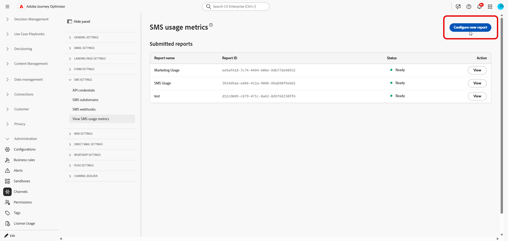

# SMS 사용량 보고서 생성 {#sms-usage-report}

>[!CONTEXTUALHELP]
>id="ajo_admin_sms_usage_metrics"
>title="SMS 사용 지표"
>abstract="SMS 사용량 보고서를 생성하여 메시지 볼륨을 공급업체 청구와 맞도록 조정합니다. 보고서는 각 짧은 코드 또는 전화번호에 대한 MT(mobile-terminated) 및 MO(mobile-originated)의 수를 일별 집계하여 나열합니다."

>[!BEGINSHADEBOX]

**이 페이지에서:** Sinch MMS API 자격 증명과 다운로드 가능한 CSV 출력을 사용하여 MT(모바일 착신) 및 MO(모바일 원본) 볼륨을 공급업체 청구와 조정하기 위해 Adobe Journey Optimizer에서 SMS 사용 보고서를 생성합니다.

>[!ENDSHADEBOX]

SMS 사용 지표는 Adobe Journey Optimizer을 통해 SMS를 구매할 때 사용할 수 있습니다. 보고서는 지난 **90일** 동안 일별로 집계된 짧은 코드 또는 전화 번호별로 보내고 받는 트래픽을 요약합니다.

사용량 지표를 보려면 관리자는 다음 작업을 수행해야 합니다.

1. [Sinch MMS API 자격 증명을 만듭니다](mobile-configuration-sinch.md#sinch-mms) Sinch에서 사용 데이터를 검색하는 데만 사용됩니다.

   사용량 보고서를 사용하려면 **[!UICONTROL SMS 공급업체]**&#x200B;이(가) **Sinch MMS**(으)로 설정된 API 자격 증명이 필요합니다. 이 자격 증명은 사용 데이터를 검색할 수 있도록 Journey Optimizer을 Sinch에 연결합니다. 필드 값은 동일한 Sinch 프로젝트에서 가져오지만 SMS 또는 MMS 메시지를 전송하는 데 사용되는 Sinch 자격 증명과 별개입니다.

1. [SMS 사용 보고서를 구성하고 검색하십시오](#configure-sms-usage-report).

이 단계를 수행하려면 **[!UICONTROL SMS 설정 관리]** 권한이 필요합니다. [권한에 대해 자세히 알아보십시오](../administration/high-low-permissions.md#administration-permissions).

## SMS 사용량 보고서 구성 및 조회 {#configure-sms-usage-report}

>[!CONTEXTUALHELP]
>id="ajo_admin_sms_usage_report_name"
>title="보고서 이름"
>abstract="나중에 목록에서 이 보고서를 쉽게 알아볼 수 있도록 레이블을 입력합니다(예: 2026년 5월 청구 검토)."

>[!CONTEXTUALHELP]
>id="ajo_admin_sms_usage_credential"
>title="SMS 자격 증명"
>abstract="이 보고서에 주고 받는 트래픽이 표시되도록 할 Sinch API 자격 증명을 선택합니다. 자격 증명을 추가하거나 업데이트하려면 **관리** > **채널** > **API 자격 증명**&#x200B;으로 이동한 다음, **SMS 공급업체** > **Sinch MMS**&#x200B;를 선택합니다."

>[!CONTEXTUALHELP]
>id="ajo_admin_sms_usage_start_date"
>title="시작 날짜"
>abstract="보고서에 포함되도록 할 날짜 범위의 첫 번째 날입니다. 지난 90일 동안의 사용 데이터만 이용 가능합니다."

SMS 사용 보고서는 Journey Optimizer에서 공급업체 청구와 메시징 활동 간의 조정을 지원하기 위해 짧은 코드로 MO(Mobile-Originated) 및 MT(Mobile-Terminated) 볼륨을 표시합니다.

1. 왼쪽 레일에서 **[!UICONTROL 관리]** > **[!UICONTROL 채널]** > **[!UICONTROL SMS 설정]**&#x200B;으로 이동합니다.

1. **[!UICONTROL SMS 사용 지표 보기]** 메뉴에 액세스한 다음 **[!UICONTROL 새 보고서 구성]**&#x200B;을 클릭합니다.

   

1. 보고서를 구성합니다.

   * **[!UICONTROL 보고서 이름]**: 보고서를 인식하는 데 도움이 되는 레이블을 입력하십시오.
   * **[!UICONTROL SMS 자격 증명]**: SMS 사용 보고를 위해 이전에 만든 **Sinch MMS** API 자격 증명을 선택합니다.
   * **[!UICONTROL 시작 날짜]** 및 **[!UICONTROL 종료 날짜]**: 보고서의 날짜 범위를 설정합니다. 지난 90일 동안의 사용 데이터만 이용 가능합니다.

     

1. 요청을 제출하려면 **[!UICONTROL 보고서 구성]**&#x200B;을 클릭하세요.

1. **[!UICONTROL 제출된 보고서]** 목록에서 구성한 보고서를 찾아 **[!UICONTROL 보고서 검색]**&#x200B;을 클릭합니다.

   보고서가 생성되는 동안 상태가 **보류 중**(으)로 변경됩니다.

1. 보고서 상태가 **[!UICONTROL 준비]**(으)로 업데이트되면 **[!UICONTROL 보기]**&#x200B;를 클릭하여 보고서를 엽니다. 이 보고서에는 다음이 포함됩니다.

   * **사용 요약**: 선택한 날짜에 대한 총 모바일 원본(MO) 및 모바일 착신(MT) 메시지를 짧은 코드로 분류했습니다.

   * **일별 SMS 볼륨**: SMS 볼륨을 짧은 코드로 분류합니다.

     

1. 보고서를 내보내려면 **[!UICONTROL CSV 다운로드]**&#x200B;를 클릭하십시오. Journey Optimizer은 보고 있는 보고서에 대한 CSV 파일을 다운로드합니다.
