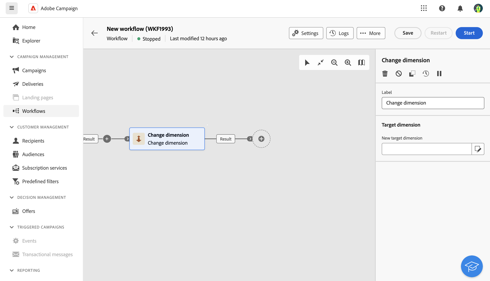

# 차원 변경 {#change-dimension}

>[!CONTEXTUALHELP]
>id="ajo_orchestration_dimension_complement"
>title="여집합 생성"
>abstract="중복으로 제외된 나머지 집단으로 추가 아웃바운드 전환을 생성할 수 있습니다. 이렇게 하려면 **여집합 생성** 옵션을 토글합니다."

>[!CONTEXTUALHELP]
>id="ajo_orchestration_change_dimension"
>title="차원 활동 변경"
>abstract="이 활동을 통해 대상자를 빌드하면서 타기팅 차원을 변경할 수 있습니다. 데이터 템플릿과 입력 차원에 따라 축이 이동됩니다. 예를 들어 “계약” 차원에서 “클라이언트” 차원으로 전환할 수 있습니다."

**차원 변경** 활동은 **타깃팅** 활동입니다. 이 활동을 사용하면 오케스트레이션된 캠페인을 구축할 때 타겟팅 차원을 변경할 수 있습니다. 데이터 템플릿과 입력 차원에 따라 축을 이동합니다.

예를 들어 오케스트레이션된 캠페인의 타겟팅 차원을 &quot;수신자&quot;에서 &quot;구독자 애플리케이션&quot;으로 전환하여 타겟팅된 수신자에게 푸시 알림을 전송할 수 있습니다.

>[!IMPORTANT]
>
>**[!UICONTROL 차원 변경]** 및 **[!UICONTROL 데이터 원본 변경]** 활동은 한 행에 추가해서는 안 됩니다. 두 활동을 연속해서 사용해야 하는 경우 두 활동 사이에 **[!UICONTROL 강화]** 활동을 포함해야 합니다. 이렇게 하면 적절한 실행이 보장되며 잠재적인 충돌 또는 오류가 방지됩니다.

## 차원 변경 활동 구성 {#configure}

**차원 변경** 활동을 구성하려면 다음 단계를 따르십시오.

1. 오케스트레이션된 캠페인에 **차원 변경** 활동을 추가합니다.

   

1. **새 대상 차원**&#x200B;을(를) 정의합니다. 차원 변경 중에는 모든 레코드가 유지됩니다. 다른 옵션은 아직 사용할 수 없습니다.

1. 오케스트레이션된 캠페인을 실행하여 결과를 확인합니다. 차원 변경 활동 전후의 테이블에서 데이터를 비교하고 오케스트레이션된 캠페인 테이블의 구조를 비교합니다.

## 예 {#example}

이 예제에서는 구매한 모든 프로필에 SMS 게재를 전송하려고 합니다. 이렇게 하려면 먼저 사용자 지정 &quot;구매&quot; 타겟팅 차원에 연결된 **[!UICONTROL 대상자 작성]** 활동을 사용하여 발생한 모든 구매를 타겟팅합니다.

그런 다음 **[!UICONTROL 차원 변경]** 활동을 사용하여 오케스트레이션된 캠페인 타기팅 차원을 &quot;수신자&quot;로 전환합니다. 이를 통해 쿼리와 일치하는 수신자를 타겟팅할 수 있습니다.

