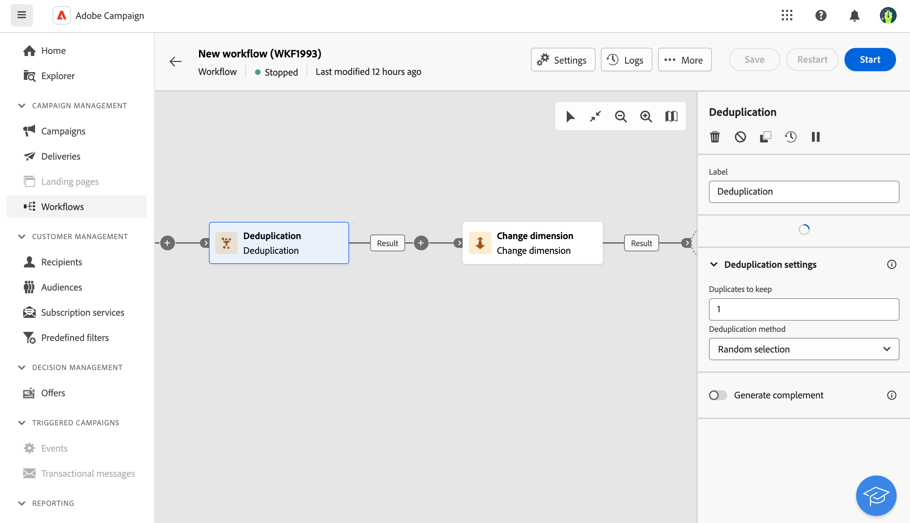

# 중복 제거 {#deduplication}

>[!CONTEXTUALHELP]
>id="ajo_orchestration_deduplication_fields"
>title="중복 요소 식별을 위한 필드"
>abstract="**중복 요소 식별을 위한 필드** 섹션에서 **속성 추가** 버튼을 클릭하여 이메일 주소, 이름, 성 등 동일한 값으로 중복 요소를 식별할 수 있는 필드를 지정합니다. 필드 순서에 따라 먼저 처리할 필드를 지정할 수 있습니다."

>[!CONTEXTUALHELP]
>id="ajo_orchestration_deduplication"
>title="중복 제거 활동"
>abstract="**중복 제거** 활동을 통해 인바운드 활동의 결과에서 중복 요소를 삭제할 수 있습니다. 주로 타기팅 활동 이후와 대상 데이터를 사용할 수 있는 활동 이전에 사용됩니다."

>[!CONTEXTUALHELP]
>id="ajo_orchestration_deduplication_complement"
>title="여집합 생성"
>abstract="중복으로 제외된 나머지 집단으로 추가 아웃바운드 전환을 생성할 수 있습니다. 이렇게 하려면 **여집합 생성** 옵션을 토글합니다."

>[!CONTEXTUALHELP]
>id="ajo_orchestration_deduplication_settings"
>title="중복 제거 설정"
>abstract="수신 데이터에서 중복 요소를 삭제하려면 아래 필드에서 중복 제거 방법을 정의합니다. 기본적으로 하나의 레코드만 유지됩니다. 또한 표현식 또는 속성을 기반으로 중복 제거 모드를 선택해야 합니다. 기본적으로 중복에서 제외할 레코드는 무작위로 선택됩니다."

**중복 제거** 활동은 **타깃팅** 활동입니다. 이 활동을 사용하면 인바운드 활동의 결과에서 중복을 삭제할 수 있습니다(예: 수신자 목록에서 중복된 프로필). **중복 제거** 활동은 일반적으로 타겟팅 활동 다음부터 타겟팅된 데이터를 사용할 수 있는 활동 전에 사용됩니다.

## 중복 제거 활동 구성{#deduplication-configuration}

**중복 제거** 활동을 구성하려면 다음 단계를 따르십시오.

1. 오케스트레이션된 캠페인에 **중복 제거** 활동을 추가합니다.

1. **중복 요소 식별을 위한 필드** 섹션에서 **속성 추가** 버튼을 클릭하여 이메일 주소, 이름, 성 등 동일한 값으로 중복 요소를 식별할 수 있는 필드를 지정합니다. 필드 순서에 따라 먼저 처리할 필드를 지정할 수 있습니다.

1. **중복 제거 설정** 섹션에서 고유한 **유지할 중복 항목 수**&#x200B;를 선택하십시오. 이 필드의 기본값은 1입니다. 값 0을 사용하면 모든 중복을 유지할 수 있습니다.

   예를 들어 레코드 A와 B가 레코드 Y의 중복으로 간주되고 레코드 C가 레코드 Z의 중복으로 간주되는 경우:

   * 필드의 값이 1인 경우 레코드 Y와 Z만 유지됩니다.
   * 필드의 값이 0인 경우 모든 레코드가 유지됩니다.
   * 필드의 값이 2인 경우 레코드 C와 Z는 유지되고 A, B 및 Y의 두 레코드는 우연히 또는 이후에 선택한 중복 제거 방법에 따라 유지됩니다.

1. 사용할 **중복 제거 방법**&#x200B;을(를) 선택하십시오.

   * **무작위 선택**: 중복 중에서 유지할 레코드를 임의로 선택합니다.
   * **식 사용**: 입력한 식의 값이 가장 작거나 가장 큰 레코드를 유지합니다.
   * **비어 있지 않은 값**: 식이 비어 있지 않은 레코드를 유지합니다.
   * **값 목록을 팔로우합니다**: 하나 이상의 필드에 대한 값 우선 순위를 정의합니다. 값을 정의하려면 **특성**&#x200B;을(를) 클릭하여 필드를 선택하거나 식을 만든 다음 해당 테이블에 값을 추가합니다. 새 필드를 정의하려면 값 목록 위에 있는 **추가 단추**&#x200B;를 클릭합니다.

1. 나머지 모집단을 활용하려면 **보조 항목 생성** 옵션을 선택하십시오. 보완은 모든 중복으로 구성됩니다. 그런 다음 추가 전환이 활동에 추가됩니다.

## 예{#deduplication-example}

다음 예제에서는 중복 제거 활동을 사용하여 게재를 보내기 전에 대상에서 중복을 제외합니다. 식별된 중복 프로필은 전용 대상에 추가되며 필요한 경우 재사용할 수 있습니다. 중복을 식별하려면 **전자 메일** 주소를 선택하세요. 항목 1개를 유지하고 **무작위** 중복 제거 방법을 선택하십시오.

