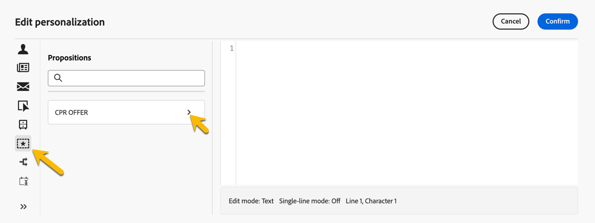
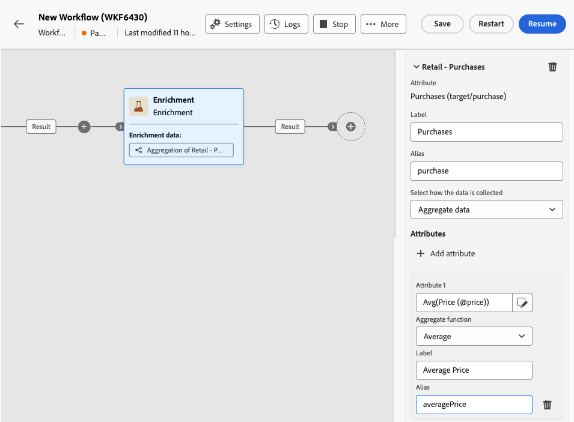

# 보강 {#enrichment}

>[!CONTEXTUALHELP]
>id="ajo_orchestration_enrichment"
>title="보강 활동"
>abstract="**보강** 활동을 통해 데이터베이스의 추가 정보로 타기팅 데이터를 보강할 수 있습니다. 일반적으로 세분화 활동 이후에 워크플로에서 사용됩니다. 일반적으로 활동을 세분화한 후 워크플로에서 사용됩니다."

**보강** 활동은 **타겟팅** 활동입니다. 이를 통해 데이터베이스의 추가 정보로 타겟팅된 데이터를 보강할 수 있습니다. 일반적으로 활동을 세분화한 후 워크플로에서 사용됩니다.

보강 데이터의 출처는 다음 중 하나일 수 있습니다.

* 오케스트레이션된 캠페인에 타겟팅된 작업 테이블과 **동일한 작업 테이블에서**:

  *고객 그룹을 타겟팅하고 현재 작업 표에 &quot;생년월일&quot; 필드를 추가*.

* **다른 작업 테이블**:

  *고객 그룹 타겟팅 후 “구매” 테이블의 “수량” 및 “제품 유형” 필드 추가*

데이터 보강 데이터가 오케스트레이션된 캠페인에 추가되면 **데이터 보강** 활동 후 추가된 활동에 사용하여 고객의 동작, 환경 설정 및 요구 사항을 기반으로 개별 그룹으로 고객을 세그먼트화하거나 대상 대상자와 공감할 가능성이 높은 개인화된 마케팅 메시지 및 캠페인을 만들 수 있습니다.

예를 들어, 오케스트레이션된 캠페인 작업 표에 고객의 구매와 관련된 정보를 추가하고 이 데이터를 사용하여 최신 구매 또는 이러한 구매에 사용된 금액으로 이메일을 개인화할 수 있습니다.

## 데이터 보강 활동 추가 {#enrichment-configuration}

**보강** 활동을 구성하려면 다음 단계를 따르십시오.

1. **대상자 빌드** 및 **결합** 활동과 같은 활동을 추가합니다.
1. **보강** 활동을 추가합니다.
1. 오케스트레이션된 캠페인에 전환을 여러 개 구성한 경우 **[!UICONTROL 기본 집합]** 필드를 사용하여 데이터를 보강할 기본 집합으로 사용해야 하는 전환을 정의할 수 있습니다.

## 보강 데이터 추가 {#enrichment-add}

>[!CONTEXTUALHELP]
>id="ajo_targetdata_personalization_enrichmentdata"
>title="보강 데이터"
>abstract="오케스트레이션된 캠페인을 보강하는 데 사용할 데이터를 선택합니다. 보강 데이터의 두 가지 유형, 즉 타기팅 차원의 단일 보강 속성 또는 테이블 간에 1-N 카디널리티가 있는 링크인 컬렉션 링크를 선택할 수 있습니다."

>[!CONTEXTUALHELP]
>id="ajo_orchestration_enrichment_data"
>title="보강 활동"
>abstract="보강 데이터를 오케스트레이션된 캠페인에 추가한 다음에는 이를 보강 활동 다음에 추가된 활동에서 사용하여 고객을 행동, 선호도 및 요구 사항에 따라 고유한 그룹으로 세분화하거나, 타깃 대상자의 마음을 움직일 수 있는 개인화된 마케팅 메시지 및 캠페인을 만들 수 있습니다."

1. **데이터 보강 추가**&#x200B;를 클릭하고 데이터를 보강하는 데 사용할 특성을 선택하십시오.

   데이터 보강 데이터의 두 가지 유형인 대상 차원의 단일 보강 속성이나 컬렉션 링크를 선택할 수 있습니다. 이러한 각 유형은 아래 예제에 자세히 설명되어 있습니다.
   * [단일 보강 속성](#single-attribute)
   * [컬렉션 링크](#collection-link)

   >[!NOTE]
   >
   >특성 선택 화면의 **표현식 편집 단추**&#x200B;를 사용하면 특성을 선택할 고급 표현식을 작성할 수 있습니다.

   

## 테이블 간 링크 만들기 {#create-links}

>[!CONTEXTUALHELP]
>id="ajo_orchestration_enrichment_simplejoin"
>title="링크 정의"
>abstract="작업 테이블 데이터와 Adobe Journey Optimizer 간의 링크를 만듭니다. 예를 들어 수신자의 계정 번호, 국가 및 이메일이 포함된 파일에서 데이터를 로드하는 경우 해당 국가 테이블에 대한 링크를 생성해야 수신자의 프로필에서 이 정보를 업데이트할 수 있습니다."

**[!UICONTROL 링크 정의]** 섹션에서 작업 테이블 데이터와 Adobe Journey Optimizer 간 링크를 만들 수 있습니다. 예를 들어 수신자의 계정 번호, 국가 및 이메일이 포함된 파일에서 데이터를 로드하는 경우 해당 국가 테이블에 대한 링크를 생성해야 수신자의 프로필에서 이 정보를 업데이트할 수 있습니다.

사용 가능한 링크에는 몇 가지 유형이 있습니다.

* **[!UICONTROL 1 카디널리티 단순 링크]**: 기본 집합의 각 레코드는 연결된 데이터의 한 레코드에만 연결할 수 있습니다.
* **[!UICONTROL 0 또는 1개의 카디널리티 단순 링크]**: 기본 집합의 각 레코드는 연결된 데이터의 0개 또는 1개의 레코드와 연결할 수 있지만 1개 이하여야 합니다.
* **[!UICONTROL N개 카디널리티 컬렉션 링크]**: 기본 집합의 각 레코드는 연결된 데이터의 0개, 1개 또는 그 이상의 레코드(N개)와 연결할 수 있습니다.

링크를 만들려면 다음 단계를 수행합니다.

1. **[!UICONTROL 링크 정의]** 섹션에서 **[!UICONTROL 링크 추가]** 단추를 클릭합니다.

   

1. **관계 유형** 드롭다운 목록에서 만들려는 링크의 유형을 선택합니다.

1. 기본 세트를 연결할 대상을 식별합니다.

   * 데이터베이스의 기존 테이블을 연결하려면 **[!UICONTROL 데이터베이스 스키마]**&#x200B;를 선택하고 **[!UICONTROL 대상 스키마]** 필드에서 원하는 테이블을 선택합니다.
   * 입력 전환의 데이터와 연결하려면 **임시 스키마**&#x200B;를 선택하고 데이터를 사용할 전환을 선택하십시오.

1. 기본 세트의 데이터를 연결된 스키마와 일치하도록 조정 기준을 정의합니다. 두 가지 유형의 조인 사용 가능

   * **단순 조인**: 두 스키마의 데이터를 일치시킬 특정 특성을 선택하십시오. **조인 추가**&#x200B;를 클릭하고 조정 기준으로 사용할 **Source** 및 **대상** 특성을 선택합니다.
   * **고급 조인**: 고급 조건을 사용하여 조인을 만듭니다. **조인 추가**&#x200B;를 클릭하고 **조건 만들기** 단추를 클릭하여 쿼리 모델러를 엽니다.

링크를 사용하는 워크플로 예제는 [예제](#link-example) 섹션에서 확인할 수 있습니다.

## 데이터 조정 {#reconciliation}

>[!CONTEXTUALHELP]
>id="ajo_orchestration_enrichment_reconciliation"
>title="조정"
>abstract="**보강** 활동을 통해 Journey Optimizer 스키마의 데이터를 다른 스키마의 데이터 또는 파일 로드 활동을 사용하여 업로드한 데이터와 같은 임시 스키마에서 가져온 데이터와 조정할 수 있습니다. 이 유형의 링크는 고유 레코드에 대한 조정을 정의합니다. Journey Optimizer는 고유 레코드에 대한 참조를 저장하기 위해 외래 키를 추가하여 대상 테이블에 대한 링크를 만듭니다."

**보강** 활동을 통해 Campaign 데이터베이스 스키마의 데이터를 다른 스키마의 데이터 또는 파일 로드 활동을 사용하여 업로드한 데이터와 같은 임시 스키마에서 가져온 데이터와 조정할 수 있습니다. 이 유형의 링크는 고유 레코드에 대한 조정을 정의합니다. Journey Optimizer는 고유 레코드에 대한 참조를 저장하기 위해 외래 키를 추가하여 대상 테이블에 대한 링크를 만듭니다.

예를 들면 이 옵션을 사용하여 업로드된 파일에 지정된 프로필 국가를 Campaign 데이터베이스의 전용 테이블에 있는 국가 중 하나와 조정할 수 있습니다.

조정 링크로 **데이터 보강** 활동을 구성하는 단계를 따르십시오.

1. **조정** 섹션에서 **링크 추가** 단추를 클릭합니다.
1. 조정 링크를 만들 데이터를 식별합니다.

   * Campaign 데이터베이스의 데이터를 사용하여 조정 링크를 만들려면 **데이터베이스 스키마**&#x200B;를 선택하고 대상이 저장된 스키마를 선택하십시오.
   * 입력 전환에서 가져온 데이터로 조정 링크를 만들려면 **임시 스키마**&#x200B;를 선택하고 대상 데이터가 저장되는 오케스트레이션된 캠페인 전환을 선택하십시오.

1. **Label** 및 **Name** 필드는 선택한 대상 스키마를 기준으로 자동으로 채워집니다. 필요한 경우 해당 값을 변경할 수 있습니다.

1. **조정 기준** 섹션에서 원본 및 대상 테이블의 데이터를 조정하는 방법을 지정하십시오.

   * **단순 조인**: 원본 테이블의 특정 필드를 대상 테이블의 다른 필드와 조정합니다. 이렇게 하려면 **조인 추가** 단추를 클릭하고 조정에 사용할 **Source** 및 **대상** 필드를 지정합니다.

     >[!NOTE]
     >
     >하나 이상의 **단순 조인** 기준을 사용할 수 있습니다. 이 경우 데이터를 함께 연결할 수 있도록 모두 확인해야 합니다.

   * **고급 조인**: 쿼리 모델러를 사용하여 조정 기준을 구성합니다. 이렇게 하려면 **조건 만들기** 단추를 클릭한 다음 AND 및 OR 작업을 사용하여 고유한 규칙을 빌드하여 조정 기준을 정의합니다.

아래 예제에서는 Journey Optimizer 프로필 테이블과 **파일 로드** 활동을 생성한 임시 테이블 간에 링크를 만들도록 구성된 오케스트레이션된 캠페인을 보여줍니다. 이 예제에서는 **데이터 보강** 활동이 조정 기준으로 전자 메일 주소를 사용하여 두 테이블을 조정합니다.

## 오퍼 추가 {#add-offers}

>[!CONTEXTUALHELP]
>id="ajo_orchestration_enrichment_offer_proposition"
>title="오퍼 제안"
>abstract="보강 활동을 통해 각 프로필에 대한 오퍼를 추가할 수 있습니다."

**[!UICONTROL 데이터 보강]** 활동을 통해 각 프로필에 대한 오퍼를 추가할 수 있습니다.

이렇게 하려면 오퍼로 **[!UICONTROL 데이터 보강]** 활동을 구성하는 단계를 따르십시오.

1. **[!UICONTROL 데이터 보강]** 활동의 **[!UICONTROL 오퍼 제안]** 섹션에서 **[!UICONTROL 오퍼 추가]** 버튼을 클릭합니다

   

1. 두 가지 오퍼 선택 사항이 있습니다.

   * **[!UICONTROL 최상의 오퍼를 카테고리에서 검색]** : 이 옵션을 선택하고 오퍼 엔진 호출 매개 변수(오퍼 공간, 카테고리 또는 테마, 연락 날짜, 유지할 오퍼 수)를 지정합니다. 엔진은 이러한 매개 변수에 따라 추가할 최상의 오퍼를 계산합니다. 카테고리 또는 테마 필드를 동시에 완료하지 않는 것이 좋습니다.

     

   * **[!UICONTROL 미리 정의된 오퍼]** : 이 옵션을 선택하고 오퍼 엔진을 호출하지 않고 추가할 오퍼를 직접 구성하려면 오퍼 공간, 특정 오퍼 및 연락 날짜를 지정하십시오.

     

1. 오퍼를 선택한 후 **[!UICONTROL 확인]** 단추를 클릭합니다.

이제 게재 활동에서 오퍼를 사용할 수 있습니다.

### 데이터 보강 활동의 오퍼 사용

오케스트레이션된 캠페인 내에서, 게재에서 데이터 보강 활동에서 얻은 오퍼를 사용하려면 아래 단계를 따르십시오.

1. 게재 활동을 열고 컨텐츠 에디션으로 이동합니다. **[!UICONTROL 오퍼 설정]** 단추를 클릭하고 드롭다운 목록에서 오퍼에 해당하는 **[!UICONTROL 오퍼 공간]**을 선택합니다.
데이터 보강 활동의 오퍼만 보려면 **[!UICONTROL 제안]**&#x200B;의 수를 0으로 설정하고 수정 사항을 저장하십시오.

   

1. 이메일 디자이너에서 오퍼를 사용하여 개인화를 추가할 때 **[!UICONTROL 제안]** 아이콘을 클릭하면 **[!UICONTROL 데이터 보강]** 활동에서 받은 오퍼가 표시됩니다. 선택할 오퍼를 클릭하여 엽니다.

   

   필요에 따라 **[!UICONTROL 렌더링 함수]**&#x200B;로 이동하여 **[!UICONTROL HTML 렌더링]** 또는 **[!UICONTROL 텍스트 렌더링]**&#x200B;을 선택하십시오.

   

>[!NOTE]
>
>**[!UICONTROL 유지할 오퍼 수]** 옵션의 **[!UICONTROL 데이터 보강]** 활동에 두 개 이상의 오퍼를 포함하도록 선택한 경우 **[!UICONTROL 제안]** 아이콘을 클릭하면 모든 오퍼가 표시됩니다.

## 예시 {#example}

### 단일 보강 속성 {#single-attribute}

여기에서 생년월일과 같은 단일 보강 속성만 추가합니다. 다음 단계를 수행하십시오.

1. **속성** 필드 내부를 클릭합니다.
1. 타겟팅 차원에서 간단한 필드(이 예시에서는 생년월일)를 선택합니다.
1. **확인**&#x200B;을 클릭합니다.

### 컬렉션 링크 {#collection-link}

이보다 복잡한 사용 사례에서는 테이블 간에 1-N 카디널리티가 있는 링크인 컬렉션 링크를 선택합니다. 100$ 미만의 최근 구매 내역 3개를 검색해 보겠습니다. 이렇게 하려면 다음을 정의해야 합니다.

* 데이터 보강 특성: **가격** 필드
* 검색할 라인 수: 3
* 필터: 100$보다 큰 항목을 필터링합니다.
* 정렬: **주문 날짜** 필드에서 내림차순 정렬입니다.

#### 속성 추가 {#add-attribute}

보강 데이터로 사용할 컬렉션 링크를 선택하는 곳입니다.

1. **속성** 필드 내부를 클릭합니다.
1. **고급 속성 표시**&#x200B;를 클릭합니다.
1. **구매** 테이블에서 **가격** 필드를 선택합니다.

<!--  -->

#### 컬렉션 설정 정의{#collection-settings}

그런 다음 데이터가 수집되는 방식과 검색할 레코드 수를 정의합니다.

1. **데이터 수집 방법 선택** 드롭다운에서 **데이터 수집**&#x200B;을 선택합니다.
1. **검색할 라인(작성할 열)** 필드에 “3”을 입력합니다.

예를 들어 고객의 평균 구매 금액을 도출하려면 대신 **집계된 데이터**&#x200B;를 선택하고 **집계 함수** 드롭다운에서 **평균**&#x200B;을 선택합니다.

아래와 같이 특성을 더 이해하기 쉽게 하려면 특성의 **Label** 및 **Alias** 필드를 사용하십시오.

#### 필터 정의{#collection-filters}

여기에서 보강 속성의 최대값을 정의합니다. 100$보다 큰 항목을 필터링합니다.
1. **필터 만들기**&#x200B;를 클릭합니다.
1. **가격**&#x200B;이(가) 있고 **가격**&#x200B;이(가) 100보다 작은 필터를 두 개 추가하십시오. 첫 번째 필터는 가장 큰 값으로 표시되는 NULL 값을 필터링합니다.
1. **확인**&#x200B;을 클릭합니다.

#### 정렬 정의{#collection-sorting}

이제 세 개의 **최신** 구매 항목을 검색하기 위해 정렬을 적용해야 합니다.

1. **정렬 활성화** 옵션을 활성화합니다.
1. **속성** 필드 내부를 클릭합니다.
1. **주문 날짜** 필드를 선택합니다.
1. **확인**&#x200B;을 클릭합니다.
1. **정렬** 드롭다운에서 **내림차순**&#x200B;을 선택합니다.

### 연결된 데이터를 사용한 데이터 보강 {#link-example}

아래 예는 두 전환 간에 링크를 만들도록 구성된 오케스트레이션된 캠페인을 보여줍니다. 첫 번째 전환은 **쿼리** 활동을 사용하여 프로필 데이터를 타깃팅하는 반면, 두 번째 전환에는 파일 로드 활동을 통해 로드된 파일에 저장된 구매 데이터가 포함됩니다.

* 첫 번째 **데이터 보강** 활동은 기본 집합(**쿼리** 활동의 데이터)을 **파일 로드** 활동의 스키마와 연결합니다. 이를 통해 쿼리가 타겟팅한 각 프로필을 해당 구매 데이터와 일치시킬 수 있습니다.

  

* 오케스트레이션된 캠페인 테이블의 데이터를 **파일 로드** 활동에서 가져온 구매 데이터로 보강하기 위해 두 번째 **데이터 보강** 활동이 추가됩니다. 이를 통해 이러한 데이터를 추가 활동에서 사용할 수 있습니다. 예를 들어, 구매 정보를 통해 고객에게 전송된 메시지를 개인화할 수 있습니다.

  
