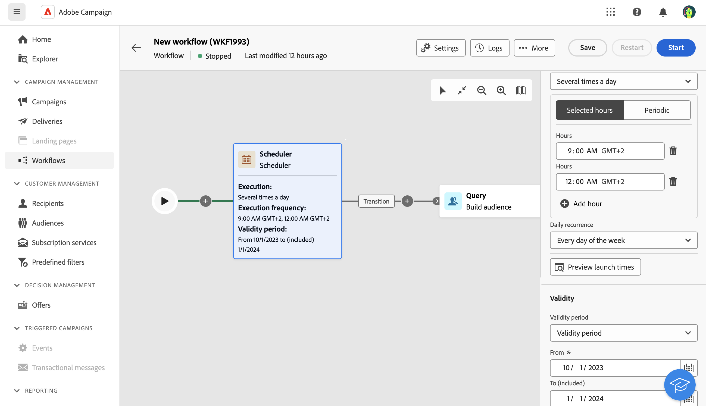

# 스케줄러 {#scheduler}

>[!CONTEXTUALHELP]
>id="ajo_orchestration_scheduler"
>title="스케줄러 활동"
>abstract="**스케줄러** 활동을 통해 여러 단계 캠페인을 시작할 시기를 예약할 수 있습니다. 이 활동은 시작을 예약하는 것으로 생각해야 합니다. 여러 단계 캠페인의 첫 번째 활동으로만 사용할 수 있습니다."

**스케줄러** 활동은 **흐름 제어** 활동입니다. 다중 단계 캠페인이 시작되는 시기를 예약할 수 있습니다. 이 활동은 시작을 예약하는 것으로 생각해야 합니다. 여러 단계 캠페인의 첫 번째 활동으로만 사용할 수 있습니다.

## 모범 사례{#scheduler-best-practices}

* 여러 단계로 구성된 캠페인이 전체 시스템 성능을 방해하고 데이터베이스에 블록을 생성할 수 있으므로 15분 간격으로 실행되도록 예약하지 마십시오.
* 여러 단계 캠페인에서 일회성 게재를 보내려면 스케줄러 활동을 추가하고 **한 번**&#x200B;을 실행하도록 설정할 수 있습니다. 게재 설정에서 **일정**&#x200B;을(를) 정의할 수도 있습니다.
* 여러 단계 캠페인에서 반복 게재를 보내려면 **스케줄러** 활동을 사용하고 실행 빈도를 설정해야 합니다. 반복 게재 활동에서는 일정을 정의할 수 없습니다.

## 스케줄러 활동 구성 {#scheduler-configuration}

>[!CONTEXTUALHELP]
>id="ajo_orchestration_schedule_validity"
>title="스케줄러 유효성"
>abstract="스케줄러의 유효 기간을 정의할 수 있습니다. 영구적(기본값)이거나 특정 날짜까지 유효할 수 있습니다."

>[!CONTEXTUALHELP]
>id="ajo_orchestration_schedule_options"
>title="스케줄러 옵션"
>abstract="스케줄러의 빈도를 정의합니다. 특정 순간, 하루에 한 번 또는 여러 번, 일주일 또는 한 달로 실행할 수 있습니다."

**스케줄러** 활동을 구성하려면 다음 단계를 따르십시오.

1. **스케줄러** 활동을 여러 단계 캠페인에 추가합니다.

1. **실행 빈도**&#x200B;를 구성합니다.

   * **한 번**: 여러 단계 캠페인이 한 번 실행됩니다.

   * **매일**: 다중 단계 캠페인은 하루에 한 번, 특정 시간에 실행됩니다.

   * **하루에 여러 번:** 여러 단계 캠페인이 하루에 여러 번 규칙적으로 실행됩니다. 특정 시간에 실행되거나 주기적으로 실행되도록 설정할 수 있습니다.

   * **주별**: 다중 단계 캠페인은 일주일에 한 번 또는 여러 번, 지정한 시점에 실행됩니다.

   * **월별**: 한 달에 한 번 또는 여러 번, 지정한 시점에 여러 단계 캠페인이 실행됩니다. 여러 단계 캠페인을 실행해야 하는 경우 월을 선택할 수 있습니다. 해당 월의 지정된 요일(예: 해당 월의 두 번째 화요일)에 실행을 설정할 수도 있습니다.

1. 선택한 빈도에 따라 실행의 세부 정보를 정의합니다. 세부 정보 필드는 사용하는 빈도(시간, 반복 빈도, 지정된 날짜 등)에 따라 달라질 수 있습니다.

1. **실행 시간 미리 보기**&#x200B;를 클릭하여 다음 10번의 다중 단계 캠페인 실행 일정을 확인합니다.

1. 스케줄러의 유효 기간을 정의합니다.

   * **영구(만료되지 않음)**: 시간 프레임이나 반복 횟수 제한 없이 지정한 빈도대로 여러 단계 캠페인이 실행됩니다.

   * **유효 기간**: 특정 날짜까지 지정한 빈도대로 여러 단계 캠페인이 실행됩니다. 시작 및 종료 날짜를 지정해야 합니다.

>[!NOTE]
>
>여러 단계 캠페인을 바로 시작하려면 스케줄러의 상단 작업 표시줄에서 **보류 중인 작업 실행**&#x200B;을 클릭합니다. 이 단추는 여러 단계 캠페인을 시작한 경우에만 사용할 수 있습니다.

## 예{#scheduler-example}

다음 예에서는 2025년 10월 1일부터 2026년 1월 1일까지 한 주의 매일 오전 9시와 12시에 여러 단계 캠페인이 하루에 여러 번 실행되도록 활동이 구성됩니다.

