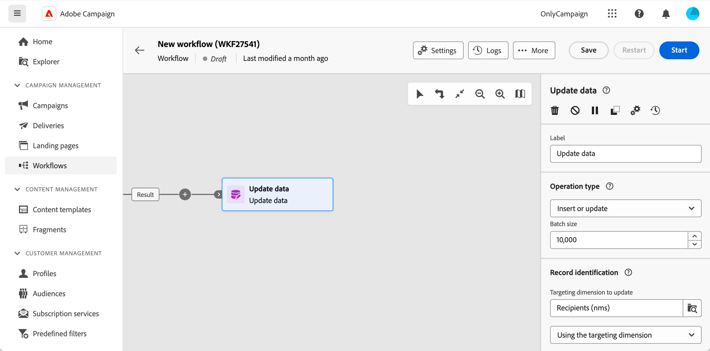

# 데이터 업데이트 {#update-data}

**데이터 업데이트** 활동은 **데이터 관리** 활동입니다. 데이터베이스의 필드에 대한 대량 업데이트를 수행할 수 있습니다. 몇 가지 옵션을 사용하여 데이터 업데이트를 개인화할 수 있습니다.

<!--
The **Operation type** field lets you choose the process to be carried out on the data in the database. Select the first option to add data or update (it if it has already been added). You can also only add data, only update data, or delete data. Select the **Update and merge collections** to select a primary record to link duplicates to, and delete those duplicates safely

Specify how to identify the records in the database: if data relate to an existing targeting dimension, select the **Using the targeting dimension** option and select the targeting dimension and fields to update. Otherwise, specify one or more custom links to identify the data in the database, or direct use of reconciliation keys.

Select the fields to update and reconciliation settings. You can use the **Auto-mapping** option to automatically identify the fields to be updated.

The **Advanced options** section let you specify additional settings to manage data and duplicates.

Toggle the **Generate an outbound transition** option to add an outbound transition that will be activated at the end of the execution of the **Update data** activity. The update generally marks the end of a targeting workflow and therefore the option is not activated by default.

Toggle the **Generate an outbound transition for rejects** option to add an outbound transition containing records that have not been correctly processed after the update (for example if there is a duplicate). The update generally marks the end of a targeting workflow and therefore the option is not activated by default.
-->

## 데이터 업데이트 활동 구성{#update-data-configuration}

**데이터 업데이트** 활동을 구성하려면 먼저 활동을 여러 단계 캠페인에 추가하고 레이블을 정의합니다.

### 작업 유형

**작업 유형** 필드를 사용하면 데이터베이스의 데이터에 대해 수행할 프로세스를 선택할 수 있습니다.

* **삽입 또는 업데이트**: 데이터베이스에 레코드가 이미 있는 경우 데이터를 삽입하거나 업데이트합니다.
* **삽입**: 데이터만 삽입합니다. 이미 존재하는 레코드는 업데이트되지 않습니다. 조정 기준이 정의된 경우, 조정되지 않은 레코드만 추가됩니다.
* **업데이트**: 데이터베이스에 이미 있는 레코드의 데이터를 업데이트합니다.
* **삭제**: 데이터를 삭제합니다.

**일괄 처리 크기** 필드를 사용하면 업데이트할 인바운드 전환 요소의 수를 선택할 수 있습니다. 예를 들어 500이라고 지정하면 처음 처리된 500개의 레코드가 업데이트됩니다.

### 레코드 식별

이 섹션에서는 데이터베이스의 레코드를 식별하는 방법을 지정할 수 있습니다.

* 데이터 항목이 기존 타겟팅 차원과 관련된 경우 **타겟팅 차원 사용** 옵션을 선택하고 **업데이트할 타겟팅 차원** 필드에서 선택합니다.
* **사용자 지정 링크 사용**&#x200B;을 선택하고 데이터베이스의 데이터를 식별할 수 있는 링크를 하나 이상 지정할 수도 있습니다
* 선택한 작업 유형을 업데이트해야 하는 경우 **조정 규칙 사용** 옵션을 사용해야 합니다.

### 업데이트할 필드

**업데이트할 필드** 섹션에서 업데이트를 적용할 필드를 추가하고 필요한 경우 이 업데이트가 수행되도록 조건을 추가합니다. 이렇게 하려면 **고려 사항** 필드를 사용하십시오. 조건이 목록 순서대로 적용됩니다. 업데이트 순서를 변경하려면 오른쪽의 화살표를 사용합니다. 동일한 대상 필드를 여러 번 사용할 수 있습니다.

**자동 매핑** 단추를 사용하여 필드를 자동으로 연결할 수 있습니다. 자동 연결은 이름이 같은 필드를 검색합니다.

**삽입 또는 업데이트** 작업 유형 중에 각 필드에 적용할 작업을 개별적으로 선택할 수 있습니다. 이렇게 하려면 **작업 유형** 필드에서 원하는 값을 선택합니다.

### 고급 옵션

**고급 옵션**&#x200B;을 사용하면 데이터 업데이트와 중복 관리를 위한 추가 옵션을 지정할 수 있습니다.

<!--
* **Disable automatic key management**
* **Disable audit**
* **Empty the destination value if the source value is empty**
* **Update all columns with matching names**
* **Ignore records which concern the same target**: only the first in the list of expressions will be considered
-->

마지막 두 옵션을 사용하면 특정 작업을 수행할 수 있습니다.

* **아웃바운드 전환을 생성합니다**: 실행 종료 시 활성화될 아웃바운드 전환을 만듭니다. 업데이트는 일반적으로 타겟팅 다중 단계 캠페인의 종료 신호를 보내므로 옵션이 기본적으로 활성화되지 않습니다.

* **거부에 대한 아웃바운드 전환을 생성합니다**: 업데이트 후 올바르게 처리되지 않은 레코드가 들어 있는 아웃바운드 전환을 만듭니다(예: 중복된 경우). 업데이트는 일반적으로 타겟팅 다중 단계 캠페인의 끝을 표시하므로 옵션이 기본적으로 활성화되지 않습니다.
