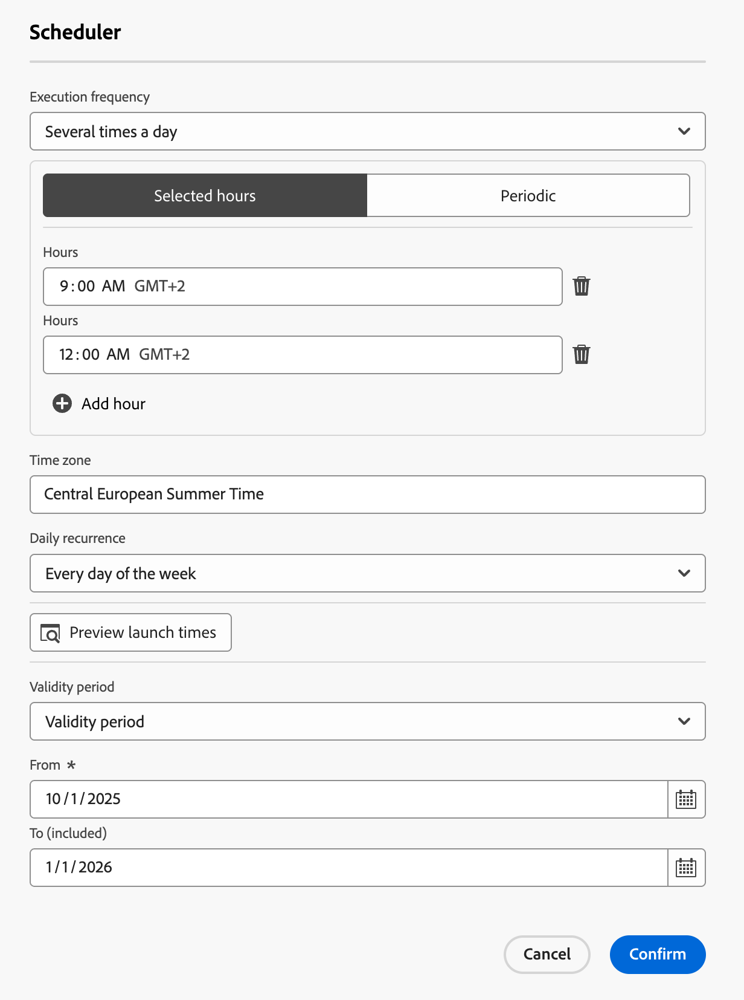

# 오케스트레이션된 캠페인 예약 및 시작 {#start-monitor}

>[!CONTEXTUALHELP]
>id="ajo_campaign_publication"
>title="오케스트레이션된 캠페인 게시"
>abstract="캠페인을 시작하려면 먼저 캠페인을 게시해야 합니다. 게시하기 전에 모든 경고가 해제되었는지 확인하십시오."

오케스트레이션된 작업을 만들고 캔버스에서 수행할 작업을 디자인했으면 이를 게시하고 실행 방법을 모니터링할 수 있습니다.

## 예약 옵션

>[!CONTEXTUALHELP]
>id="ajo_orchestration_scheduler"
>title="스케줄러 활동"
>abstract="**스케줄러** 캠페인을 사용하면 오케스트레이션된 캠페인을 시작할 시기를 예약할 수 있습니다. 이 활동은 시작을 예약하는 것으로 생각해야 합니다. 오케스트레이션된 캠페인의 첫 번째 활동으로만 사용할 수 있습니다."

캠페인 관리자는 특정 시간에 자동으로 실행되도록 캠페인을 예약할 수 있으므로 마케팅 커뮤니케이션에 대한 정확한 타이밍과 정확한 타겟팅 데이터를 사용할 수 있습니다.

### 모범 사례 {#scheduler-best-practices}

* 오케스트레이션된 캠페인이 전체 시스템 성능을 저해하고 데이터베이스에 블록을 생성할 수 있으므로 15분 간격으로 실행되도록 예약하지 마십시오.
* 오케스트레이션된 캠페인에서 일회성 메시지를 보내려면 **Once**&#x200B;를 실행하도록 설정할 수 있습니다.
* 오케스트레이션된 캠페인에서 반복 메시지를 보내려면 **예약** 옵션을 사용하고 실행 빈도를 설정해야 합니다. 반복 게재 활동에서는 일정을 정의할 수 없습니다.

### 캠페인 일정 구성 {#scheduler-configuration}

>[!CONTEXTUALHELP]
>id="ajo_orchestration_schedule_validity"
>title="스케줄러 유효성"
>abstract="스케줄러의 유효 기간을 정의할 수 있습니다. 영구적(기본값)이거나 특정 날짜까지 유효할 수 있습니다."

>[!CONTEXTUALHELP]
>id="ajo_orchestration_schedule_options"
>title="스케줄러 옵션"
>abstract="스케줄러의 빈도를 정의합니다. 특정 순간, 하루에 한 번 또는 여러 번, 일주일 또는 한 달로 실행할 수 있습니다."

다음 단계에 따라 **오케스트레이션된 캠페인 일정**&#x200B;을 구성하십시오.

1. 오케스트레이션된 캠페인 캔버스의 맨 위에서 **가능한 한 빨리** 단추를 선택합니다.

1. **실행 빈도**&#x200B;를 구성합니다.

   * **한 번**: 오케스트레이션된 캠페인이 한 번 실행됩니다.

   * **매일**: 오케스트레이션된 캠페인이 하루에 한 번 특정 시간에 실행됩니다.

   * **하루에 여러 번:** 오케스트레이션된 캠페인이 하루에 여러 번 규칙적으로 실행됩니다. 특정 시간에 실행되거나 주기적으로 실행되도록 설정할 수 있습니다.

   * **주별**: 오케스트레이션된 캠페인은 일주일에 한 번 또는 여러 번, 지정한 시점에 실행됩니다.

   * **월별**: 오케스트레이션된 캠페인은 한 달에 한 번 또는 여러 번, 지정한 시점에 실행됩니다. 오케스트레이션된 캠페인을 실행해야 하는 월을 선택할 수 있습니다. 해당 월의 지정된 요일(예: 해당 월의 두 번째 화요일)에 실행을 설정할 수도 있습니다.

     {width="50%" align="left"}

1. 선택한 빈도에 따라 실행의 세부 정보를 정의합니다. 세부 정보 필드는 사용하는 빈도(시간, 반복 빈도, 지정된 날짜 등)에 따라 다릅니다.

1. 오케스트레이션된 캠페인의 다음 10개 실행 일정을 확인하려면 **실행 시간 미리 보기**&#x200B;를 클릭하세요.

1. 스케줄러의 유효 기간을 정의합니다.

   * **영구(만료되지 않음)**: 조정된 캠페인이 시간 프레임이나 반복 횟수 제한 없이 지정한 빈도대로 실행됩니다.

   * **유효 기간**: 오케스트레이션된 캠페인이 특정 날짜까지 지정한 빈도대로 실행됩니다. 시작 및 종료 날짜를 지정해야 합니다.

1. 설정을 저장하려면 **확인**&#x200B;을 선택하세요. 오케스트레이션된 캠페인 캔버스 위에 실행 빈도가 표시됩니다.

>[!TIP]
>
>오케스트레이션된 캠페인을 즉시 시작하려면 **가능한 한 빨리** 기본값을 유지합니다.

## 예 {#scheduler-example}

다음 예제에서는 오케스트레이션된 캠페인이 2025년 10월 1일부터 2026년 1월 1일까지 매주 오전 9시와 12시에 하루에 두 번 실행되도록 활동을 구성합니다.

{width="50%" align="left"}

## 오케스트레이션된 캠페인 시작 {#start}

오케스트레이션된 캠페인을 시작하려면 **[!UICONTROL 캠페인]** 메뉴의 **[!UICONTROL 오케스트레이션]** 탭으로 이동하여 시작할 캠페인을 선택한 다음 캔버스의 오른쪽 상단에 있는 **[!UICONTROL 재생]** 단추를 클릭하십시오.

오케스트레이션된 캠페인이 실행되면, 캔버스의 각 활동은 오케스트레이션된 캠페인의 끝에 도달할 때까지 순차적 순서로 실행됩니다.

시각적인 흐름을 사용하여 실시간으로 타겟팅된 프로필의 진행 상황을 추적할 수 있습니다. 이렇게 하면 각 활동의 상태와 활동 간에 전환되는 프로필 수를 빠르게 식별할 수 있습니다.

{zoomable="yes"}

## 오케스트레이션된 캠페인 전환 {#transitions}

오케스트레이션된 캠페인에서 전환을 통해 한 활동에서 다른 활동으로 전송된 데이터는 임시 작업 표에 저장됩니다. 각 전환에 대해 이 데이터를 표시할 수 있습니다. 이렇게 하려면 전환을 선택하여 화면 오른쪽에서 속성을 엽니다.

* 작업 테이블의 스키마를 표시하려면 **[!UICONTROL 스키마 미리 보기]**&#x200B;를 클릭하십시오.
* 선택한 전환에서 전송된 데이터를 시각화하려면 **[!UICONTROL 결과 미리 보기]**&#x200B;를 클릭하십시오.

{zoomable="yes"}

## 활동 실행 모니터링 {#activities}

각 활동 상자의 오른쪽 위 모서리에 있는 시각적 표시기를 사용하여 실행을 확인할 수 있습니다.

| 시각적 표시기 | 설명 |
|-----|------------|
| {zoomable="yes"}{width="70%"} | 활동이 현재 실행 중입니다. |
| {zoomable="yes"}{width="70%"} | 이 활동에는 주의가 필요합니다. 여기에는 게재 전송을 확인하거나 필요한 조치를 취하는 작업이 포함될 수 있습니다. |
| {zoomable="yes"}{width="70%"} | 활동에 오류가 발생했습니다. 문제를 해결하려면 오케스트레이션된 캠페인 로그를 열어 자세한 내용을 확인하십시오. |
| {zoomable="yes"}{width="70%"} | 활동이 정상적으로 실행되었습니다. |

## 로그 및 작업 모니터링 {#logs-tasks}

>[!CONTEXTUALHELP]
>id="ajo_campaign_logs"
>title="로그 및 작업"
>abstract="**로그 및 작업** 화면에서 모든 사용자 작업을 기록하고 오류가 발생한 오케스트레이션된 캠페인 실행 기록을 제공합니다."

로그 및 작업 모니터링은 오케스트레이션된 캠페인을 분석하고 제대로 실행되고 있는지 확인하는 중요한 단계입니다. 작업 도구 모음 및 각 활동의 속성 창에서 사용할 수 있는 **[!UICONTROL 로그]** 아이콘을 통해 액세스할 수 있습니다.

**[!UICONTROL 로그 및 작업]** 메뉴에서는 모든 사용자 작업을 기록하고 오류가 발생한 오케스트레이션된 캠페인 실행 기록을 제공합니다.

{zoomable="yes"}

다음 두 가지 유형의 정보를 사용할 수 있습니다.

* **[!UICONTROL 로그]** 탭에는 오케스트레이션된 모든 캠페인 활동의 실행 기록이 들어 있습니다. 시간 순서대로 수행된 작업과 실행 오류를 색인화합니다.
* **[!UICONTROL 작업]** 탭은 활동의 실행 시퀀싱에 대해 자세히 설명합니다.

두 탭 모두에서 표시된 열과 해당 순서를 선택하고 필터를 적용한 다음 검색 필드를 사용하여 원하는 정보를 빠르게 찾을 수 있습니다.

## 오케스트레이션된 캠페인 실행 명령 {#execution-commands}

오른쪽 상단의 작업 표시줄은 오케스트레이션된 캠페인 실행을 관리할 수 있는 명령을 제공합니다. 다음과 같은 작업을 수행할 수 있습니다.

* 실행 **[!UICONTROL 시작]** / **[!UICONTROL 다시 시작]**   오케스트레이션된 캠페인. 그런 다음 진행 중 상태로 전환됩니다. 오케스트레이션된 캠페인이 일시 중지되면 다시 시작됩니다. 그렇지 않으면 시작되고 초기 활동이 활성화됩니다.

* **[!UICONTROL 일시 중지]** 오케스트레이션된 캠페인의 실행을 일시 중지한 다음 일시 중지됨 상태로 전환합니다. 다시 시작될 때까지 새 활동이 활성화되지 않지만 진행 중인 작업은 중단되지 않습니다.

* 실행 중인 오케스트레이션된 캠페인을 **[!UICONTROL 중지]**&#x200B;하여 완료됨 상태로 전환합니다. 진행 중인 작업은 가능한 경우 중단됩니다. 중지된 동일한 위치에서 오케스트레이션된 캠페인에서 다시 시작할 수 없습니다.
