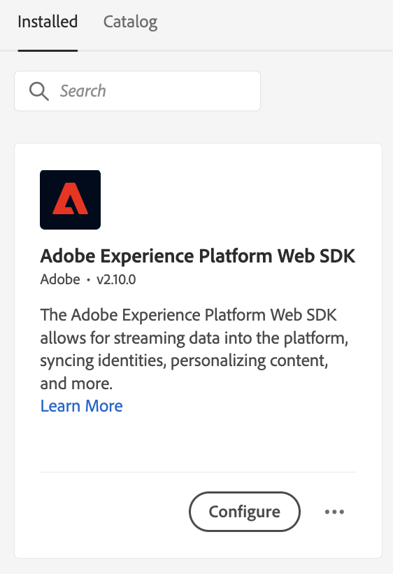
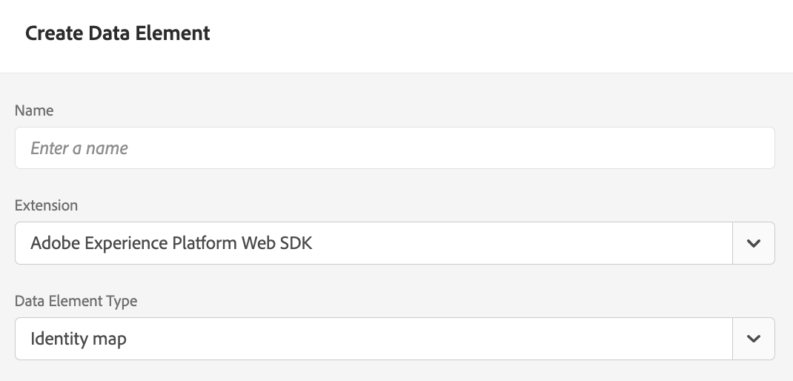

# Edge Decisioning API를 사용하여 오퍼 게재 {#edge-decisioning-api}

## 시작하기 및 사전 요구 사항 {#edge-overview-and-prerequisites}

다음 [Adobe Experience Platform 웹 SDK](https://experienceleague.adobe.com/docs/experience-platform/edge/home.html#video-overview) 는 Adobe Experience Cloud 고객이 Experience Platform Edge Network를 통해 Experience Cloud의 다양한 서비스와 상호 작용할 수 있도록 해주는 클라이언트측 JavaScript 라이브러리입니다.

Experience Platform Web SDK는 의사 결정 관리를 포함하여 Adobe에서 개인화 솔루션 쿼리를 지원하므로 API 또는 오퍼 라이브러리를 사용하여 만든 개인화된 오퍼를 검색하고 렌더링할 수 있습니다. 자세한 지침은 [오퍼 만들기](../../get-started/starting-offer-decisioning.md).

을 사용하여 의사 결정 관리를 구현하는 방법에는 두 가지가 있습니다 [Platform 웹 SDK](https://experienceleague.adobe.com/docs/experience-platform/edge/home.html#video-overview). 한 가지 방법은 개발자를 위한 것이고 웹 사이트와 프로그래밍에 대한 지식이 필요합니다. 다른 방법은 Adobe Experience Platform 사용자 인터페이스를 사용하여 HTML 페이지의 헤더에서 작은 스크립트만 참조하도록 하는 오퍼를 설정하는 것입니다.

다음 문서를 참조하십시오. [의사 결정 관리](https://experienceleague.adobe.com/docs/experience-platform/edge/personalization/offer-decisioning/offer-decisioning-overview.html?lang=en#enabling-offer-decisioning) adobe Experience Platform Web SDK를 사용하여 개인화된 오퍼를 제공하는 방법에 대한 자세한 정보.

>[!NOTE]
>
>Adobe Experience Platform Web SDK의 의사 결정 관리 사용은 한 세트의 조직(제한된 가용성)에만 사용할 수 있습니다. 이 기능을 활용하려면 Adobe 계정 담당자에게 문의하십시오.

## Adobe Experience Platform 웹 SDK {#aep-web-sdk}

Platform Web SDK는 다음 SDK를 대체합니다.

* Visitor.js
* AppMeasurement.js
* AT.js
* DIL.js

SDK는 이러한 라이브러리를 결합하지 않았으며 처음부터 새로운 구현입니다. 사용하려면 먼저 다음 단계를 수행해야 합니다.

1. 조직에 SDK를 사용할 수 있는 적절한 권한이 있고 권한이 올바르게 구성되었는지 확인합니다.

   <!-- For more detailed instructions, refer to the documentation on using the [Adobe Experience Platform Web SDK](). -->

1. [데이터 스트림 구성](https://experienceleague.adobe.com/docs/experience-platform/edge/fundamentals/datastreams.html?lang=en) 를 클릭하여 제품에서 사용할 수 있습니다.

1. SDK를 설치합니다. 다음과 같은 여러 가지 방법으로 데이터를 수집할 수 있습니다 [SDK 페이지 설치](https://experienceleague.adobe.com/docs/experience-platform/edge/fundamentals/installing-the-sdk.html?lang=en). 이 페이지는 각 서로 다른 구현 방법으로 계속 진행됩니다.

SDK를 사용하려면 [스키마](../../../data/get-started-schemas.md) 그리고 [데이터 스트림](../../../data/get-started-datasets.md) 정의됩니다.

<!-- ****TODO - Configure schema**** -->

오퍼를 개인화하려면 개인화/프로필을 별도로 구성해야 합니다.

<!-- Refer to the [doc](www.link.com) for detailed instructions.  -->

의사 결정 관리를 위해 SDK를 구성하려면 아래 두 단계 중 하나를 수행하십시오.

## 옵션 1 - Launch를 사용하여 태그 확장 및 구현 설치

이 옵션은 코딩 경험이 적은 사용자에게 더 친숙합니다.

1. [태그 속성 만들기](https://experienceleague.adobe.com/docs/experience-platform/tags/admin/companies-and-properties.html?lang=en)

1. [포함 코드 추가](https://experienceleague.adobe.com/docs/core-services-learn/implementing-in-websites-with-launch/configure-launch/launch-add-embed.html?lang=en)

1. &quot;데이터 스트림&quot; 드롭다운에서 구성을 선택하여 만든 데이터 스트림으로 Adobe Experience Platform Web SDK 확장을 설치하고 구성합니다. 다음 문서를 참조하십시오. [확장](https://experienceleague.adobe.com/docs/experience-platform/tags/ui/extensions/overview.html?lang=en).

   

   

1. 필요한 만들기 [데이터 요소](https://experienceleague.adobe.com/docs/experience-platform/tags/ui/data-elements.html?lang=en). 최소한으로, Platform 웹 SDK ID 맵과 Platform 웹 SDK XDM 개체 데이터 요소를 만들어야 합니다.

   

   

1. 만들기 [규칙](https://experienceleague.adobe.com/docs/experience-platform/tags/ui/rules.html?lang=en):

   Platform Web SDK 이벤트 보내기 작업을 추가하고 해당 작업의 구성에 관련 decisionscopes를 추가합니다

   

   

1. [만들기 및 게시](https://experienceleague.adobe.com/docs/experience-platform/tags/publish/libraries.html?lang=en) 구성한 모든 관련 규칙, 데이터 요소 및 확장이 들어 있는 라이브러리입니다.

## 옵션 2 - 사전 빌드된 독립형 버전을 사용하여 수동으로 구현

다음은 웹 SDK의 사전 설치된 독립 실행형 설치를 사용하여 의사 결정 관리를 사용하는 데 필요한 단계입니다. 이 안내서에서는 이 작업이 SDK를 처음 구현하는 것이라며, 따라서 모든 단계를 사용자에게 적용할 수 없을 수 있습니다. 이 안내서에서는 일부 개발 경험도 가정합니다.

옵션 2에서 다음 JavaScript 코드 조각을 포함합니다. 사전 빌드된 독립형 버전 [이 페이지](https://experienceleague.adobe.com/docs/experience-platform/edge/fundamentals/installing-the-sdk.html?lang=en) 에서 `<head>` 섹션을 참조하십시오.

```
javascript
    <script>
        !function(n,o){o.forEach(function(o){n[o]||((n.__alloyNS=n.__alloyNS||
        []).push(o),n[o]=function(){var u=arguments;return new Promise(
        function(i,l){n[o].q.push([i,l,u])})},n[o].q=[])})}
        (window,["alloy"]);
    </script>
    <script src="https://cdn1.adoberesources.net/alloy/2.6.4/alloy.js" async></script>
```

SDK 구성(edgeConfigId 및 orgId)을 설정하려면 Adobe 계정 내에서 두 ID가 필요합니다. edgeConfigId는 사전 요구 사항에 구성해야 하는 데이터 스트림 ID와 동일합니다.

edgeConfigID/데이터 스트림 ID를 찾으려면 데이터 수집으로 이동하고 데이터 스트림을 선택합니다. orgId를 찾으려면 프로필로 이동합니다.

이 페이지의 지침에 따라 JavaScript에서 SDK를 구성합니다. 구성 함수에서 항상 edgeConfigId 및 orgId를 사용합니다. 이 설명서에서는 구성에 대해 어떤 선택적 매개 변수가 있는지 설명합니다. 최종 구성은 다음과 같이 표시될 수 있습니다.

```
javascript
    alloy("configure", {
        "edgeConfigId": "12345678-0ABC-DEF-GHIJ-KLMNOPQRSTUV",                            
        "orgId":"ABCDEFGHIJKLMNOPQRSTUVW@AdobeOrg",
        "debugEnabled": true,
        "edgeDomain": "edge.adobedc.net",
        "clickCollectionEnabled": true,
        "idMigrationEnabled": true,
        "thirdPartyCookiesEnabled": true,
        "defaultConsent":"in"  
    });
```

디버깅에 사용할 Debugger Chrome 확장을 설치합니다. 여기에서 찾을 수 있습니다. <https://chrome.google.com/webstore/detail/adobe-experience-platform/bfnnokhpnncpkdmbokanobigaccjkpob>

다음으로, 디버거 내에서 계정에 로그인합니다. 그런 다음 로그로 이동하여 올바른 작업 공간에 연결되어 있는지 확인합니다. 이제 오퍼에서 결정 범위의 base64 인코딩 버전을 복사합니다.

웹 사이트를 편집할 때 구성 및 `sendEvent` 결정 범위를 Adobe에 전송하는 함수입니다.

**예**:

```
javascript
    alloy("sendEvent", {
        "decisionScopes": 
        [
        "eyJ4ZG06YWN0aXZpdHlJZCI6Inhjb3JlOm9mZmVyLWFjdGl2aXR5OjE0ZWE4MDhhZjJjZDM1NzQiLCJ4ZG06cGxhY2VtZW50SWQiOiJ4Y29yZTpvZmZlci1wbGFjZW1lbnQ6MTRjNGFmZDI2OTXXXXXXXXXX"
        ]
    });
```

응답을 처리하는 방법에 대한 예는 다음을 참조하십시오.

```
javascript
    alloy("sendEvent", {
        "decisionScopes":
        [
        "eyJ4ZG06YWN0aXZpdHlJZCI6Inhjb3JlOm9mZmVyLWFjdGl2aXR5OjE0ZWE4MDhhZjJjZDM1NzQiLCJ4ZG06cGxhY2VtZW50SWQiOiJ4Y29yZTpvZmZlci1wbGFjZW1lbnQ6MTRjNGFmZDI2OTXXXXXXXXXX"
        ]
    }).then(function(result) {
        Object.entries(result).forEach(([key, value]) => {
            console.log(key, value);
        });
    });
```

디버거를 사용하여 Edge 네트워크에 성공적으로 연결되었는지 확인할 수 있습니다.

>[!NOTE]
>
>로그에 에지에 대한 연결이 표시되지 않으면 광고 차단기를 비활성화해야 할 수 있습니다.

오퍼를 만든 방법과 사용된 형식을 다시 참조하십시오. 결정에서 충족된 기준을 기반으로 오퍼는 Adobe Experience Platform 내에서 만들 때 지정한 정보가 포함된 오퍼로 반환됩니다.

이 예에서 반환할 JSON은 다음과 같습니다.

```
json
{
   "name":"ABC Test",
   "description":"This is a test offer", 
   "link":"https://sampletesting.online/",
   "image":"https://sample-demo-URL.png"
}
```

응답 개체를 처리하고 필요한 데이터를 구문 분석합니다. 여러 결정 범위를 한 번에 보낼 수 있으므로 `sendEvent` 를 호출합니다. 응답이 약간 다르게 보일 수 있습니다.

```
json
    {
        "id": "abrxgl843d913",
        "scope": "eyJ4ZG06YWN0aXZpdHlJZCI6Inhjb3JlOm9mZmVyLWFjdGl2aXR5OjE0ZWE4MDhhZjJjZDM1NzQiLCJ4ZG06cGxhY2VtZW50SWQiOiJ4Y29yZTpvZmZlci1wbGFjZW1lbnQ6MTRjNGFmZDI2OTVlNWRmOSJ9",
        "items": 
        [
            {
                "id": "xcore:fallback-offer:14ea7f1ea26ebd0a",
                "etag": "1",
                "schema": "https://ns.adobe.com/experience/offer-management/content-component-json",
                "data": {
                    "id": "xcore:fallback-offer:14ea7f1ea26ebd0a",
                    "format": "application/json",
                    "language": [
                        "en-us"
                    ],
                    "content": "{\"name\":\"ABC Test\",\"description\":\"This is a test offer\", \"link\":\"https://sampletesting.online/\",\"image\":\"https://sample-demo-URL.png\"}"
                }
            }
        ]
    }
]
}
```

```
json
{
    "propositions": 
    [
    {
        "renderAttempted": false,
        "id": "e15ecb09-993e-4b66-93d8-0a4c77e3d913",
        "scope": "eyJ4ZG06YWN0aXZpdHlJZCI6Inhjb3JlOm9mZmVyLWFjdGl2aXR5OjE0ZWE4MDhhZjJjZDM1NzQiLCJ4ZG06cGxhY2VtZW50SWQiOiJ4Y29yZTpvZmZlci1wbGFjZW1lbnQ6MTRjNGFmZDI2OTVlNWRmOSJ9",
        "items": 
        [
            {
                "id": "xcore:fallback-offer:14ea7f1ea26ebd0a",
                "etag": "1",
                "schema": "https://ns.adobe.com/experience/offer-management/content-component-json",
                "data": {
                    "id": "xcore:fallback-offer:14ea7f1ea26ebd0a",
                    "format": "application/json",
                    "language": [
                        "en-us"
                    ],
                    "content": "{\"name\":\"Claire Hubacek Test\",\"description\":\"This is a test offer\", \"link\":\"https://sampletesting.online/\",\"image\":\"https://sample-demo-URL.png\"}"
                }
            }
        ]
    }
    ]
}
```

이 예에서 웹 페이지에서 오퍼별 세부 사항을 처리하고 사용하는 데 필요한 경로는 다음과 같습니다. `result['decisions'][0]['items'][0]['data']['content']`

JS 변수를 설정하려면 다음을 수행하십시오.

```
javascript
const offer = JSON.parse(result['decisions'][0]['items'][0]['data']['content']);

let offerURL = offer['link'];
let offerDescription = offer['description'];
let offerImageURL = offer['image'];

document.getElementById("offerDescription").innerHTML = offerDescription;
document.getElementById('offerImage').src = offerImageURL;
```

## 제한 사항

일부 오퍼 제한 사항은 현재 모바일 Experience Edge 워크플로우에서 지원되지 않습니다(예: 최대 가용량). 최대 가용량 필드 값은 모든 사용자에게 오퍼를 제공할 수 있는 횟수를 지정합니다. 자세한 내용은 [오퍼에 제한 추가](../../offer-library/add-constraints.md#capping).
