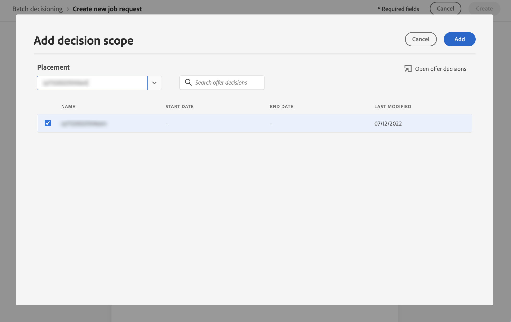

# 일괄 의사 결정 {#deliver}

## 일괄 처리 의사 결정 시작 {#start}

Journey Optimizer을 사용하면 주어진 Adobe Experience Platform 대상의 모든 프로필에 오퍼 의사 결정을 전달할 수 있습니다.

이렇게 하려면 타깃팅할 대상과 사용할 오퍼 결정에 대한 정보가 포함된 작업 요청을 Journey Optimizer에서 만들어야 합니다. 그런 다음 대상의 각 프로필에 대한 오퍼 컨텐츠가 사용자 지정 일괄 처리 워크플로우에 사용할 수 있는 Adobe Experience Platform 데이터 세트에 배치됩니다.

API를 사용하여 일괄 게재를 수행할 수도 있습니다. 자세한 내용은 [Batch Decisioning API 설명서](api-reference/offer-delivery-api/batch-decisioning-api.md)를 참조하세요.

## 전제 조건 {#prerequisites}

작업 요청을 구성하기 전에 다음을 생성했는지 확인하십시오.

* Adobe Experience Platform의 **데이터 세트**. 이 데이터 세트는 &quot;ODE DecisionEvents&quot; 스키마를 사용하여 결정 결과를 저장하는 데 사용됩니다. 자세한 내용은 [데이터 세트 설명서](https://experienceleague.adobe.com/docs/experience-platform/catalog/datasets/overview.html?lang=ko)를 참조하세요.

* Adobe Experience Platform의 **대상자** 대상자를 평가한 다음 업데이트해야 합니다. [세분화 서비스 설명서](https://www.adobe.com/go/segmentation-overview-en_kr)에서 대상 멤버십 평가를 업데이트하는 방법을 알아보세요

  >[!NOTE]
  >
  >하루에 한 번 발생하는 프로필 스냅샷에서 일괄 작업이 실행됩니다. 일괄 처리 의사 결정은 빈도를 제한하며 항상 가장 최근 스냅샷에서 프로필을 로드합니다. Batch Decisioning API를 시도하기 전에 대상을 만든 후 최대 24시간 대기하십시오.

* Adobe Journey Optimizer에서 **결정**. [의사 결정을 만드는 방법을 알아봅니다](offer-activities/create-offer-activities.md)

<!-- in API doc, remove these info and add ref here-->

## 작업 요청 만들기

새 작업 요청을 만들려면 아래 단계를 수행합니다.

1. **[!UICONTROL 오퍼]** 메뉴에서 **[!UICONTROL 일괄 처리 결정]** 탭을 연 다음 **[!UICONTROL 요청 만들기]**&#x200B;를 클릭합니다.

   

1. 작업 요청의 이름을 지정한 다음 작업 데이터를 전송해야 하는 데이터 세트를 선택합니다.

1. 타깃팅할 Adobe Experience Platform 대상을 선택합니다.

1. 대상자에게 오퍼를 전달하는 데 사용할 오퍼 결정 범위를 하나 이상 선택합니다.
   1. 목록에서 배치를 선택합니다.
   1. 선택한 배치에 사용할 수 있는 결정이 표시됩니다. 선택한 결정을 선택하고 **[!UICONTROL 추가]**&#x200B;를 클릭합니다.
   1. 작업을 반복하여 원하는 만큼 결정 범위를 추가합니다.

   

1. 기본적으로 각 프로필에 대해 결정 범위의 오퍼 하나가 반환됩니다. **[!UICONTROL 프로필당 오퍼 요청]** 옵션을 사용하여 반환된 오퍼 수를 조정할 수 있습니다. 예를 들어 2를 선택하면 선택한 결정 범위에 대해 최상의 2 오퍼가 표시됩니다.

   >[!NOTE]
   >
   >결정 범위당 최대 30개의 오퍼를 요청할 수 있습니다.

1. 데이터 집합에 오퍼 콘텐츠를 포함하려면 **[!UICONTROL 콘텐츠 포함]** 옵션을 켜십시오. 이 옵션은 기본적으로 비활성화되어 있습니다.

1. 작업 요청을 실행하려면 **[!UICONTROL 만들기]**&#x200B;를 클릭하십시오.

## 일괄 처리 작업 모니터링

요청된 모든 일괄 처리 작업은 **[!UICONTROL 일괄 처리 결정]** 탭에서 액세스할 수 있습니다. 또한 목록을 구체화하는 데 도움이 되는 검색 및 필터링 도구를 사용할 수 있습니다.

### 작업 요청 상태

작업 요청이 생성되면 배치 작업은 다음과 같은 여러 상태를 거칩니다.

>[!NOTE]
>
>작업 요청 상태에 대한 최신 정보를 가져오려면 작업 옆에 있는 줄임표 버튼을 사용하여 새로 고칩니다.

1. **[!UICONTROL 큐에 있음]**: 작업 요청이 만들어지고 처리 큐에 들어갔습니다. 데이터 세트당 한 번에 최대 5개의 일괄 작업을 실행할 수 있습니다. 출력 데이터 세트가 동일한 다른 모든 일괄 처리 요청이 큐에 추가됩니다. 이전 작업 실행이 완료되면 대기 중인 작업이 선택되어 처리됩니다.
1. **[!UICONTROL 처리 중]**: 작업 요청이 처리 중입니다.
1. **[!UICONTROL 수집]**: 작업 요청이 실행되었으며 결과 데이터가 선택한 데이터 세트에서 수집되고 있습니다.
1. **[!UICONTROL 완료]**: 작업 요청이 실행되었으며 이제 결과 데이터가 선택한 데이터 집합에 저장됩니다.

   >[!NOTE]
   >
   >작업 목록에서 데이터 세트 이름을 클릭하여 작업 결과가 저장되는 데이터 세트에 액세스할 수 있습니다.

작업 요청을 실행하는 동안 오류가 발생하면 **[!UICONTROL 오류]** 상태가 됩니다. 새 요청을 만들려면 일괄 처리 작업을 복제해 보십시오. [일괄 처리 작업을 복제하는 방법을 알아보세요](#duplicate)

### 일괄 처리 작업 처리 시간

모든 일괄 처리 작업에 대한 전체 시간은 작업 로드가 생성된 시간부터 결정 결과를 출력 데이터 세트에서 사용할 수 있는 시간까지의 기간입니다.

대상자 크기는 전체 일괄 처리 결정 시간에 영향을 주는 주요 요소입니다. 적격 오퍼에 글로벌 빈도 상한이 활성화된 경우 일괄 의사 결정을 완료하는 데 추가 시간이 소요됩니다. 다음은 적격 오퍼에 대한 빈도 상한이 있거나 없는 각 대상 크기에 대한 전체적인 처리 시간 근사치입니다.

적격 제안에 대해 빈도 상한이 활성화된 경우:

| 대상자 크기 | 전체 처리 시간 |
|--------------|----------------------------|
| 1만 프로필 이하 | 7분 |
| 100만 프로필 이하 | 30분 |
| 1,500만 프로필 이하 | 50분 |

적격 오퍼에 대한 빈도 제한 없음:

| 대상자 크기 | 전체 처리 시간 |
|--------------|----------------------------|
| 1만 프로필 이하 | 6분 |
| 100만 프로필 이하 | 8분 |
| 1,500만 프로필 이하 | 16분 |

## 작업 요청 복제 {#duplicate}

기존 작업의 정보를 재사용하여 새 요청을 만들 수 있습니다.

이렇게 하려면 중복 아이콘을 클릭하고 필요한 경우 작업 정보를 편집한 다음 **[!UICONTROL 만들기]**&#x200B;를 클릭하여 새 요청을 만듭니다.

