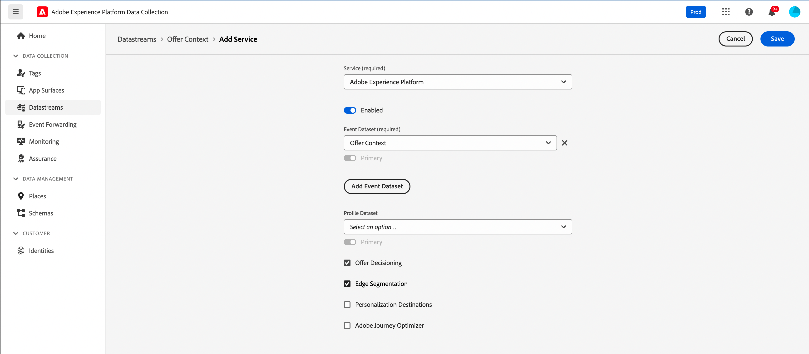
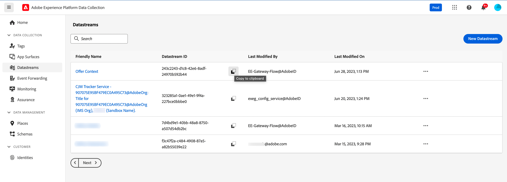

# 컨텍스트 데이터 및 Edge Decisioning 요청 {#edge}

이 섹션에서는 Edge Decisioning 요청에서 컨텍스트 데이터를 전달하고 자격 규칙에서 사용하는 방법을 안내합니다. 고객이 사용하는 장치 유형에 따라 개인화된 오퍼를 제공하는 방법을 보여 주는 엔드투엔드 사용 사례를 살펴봅니다.

이 사용 사례에는 다음과 같은 몇 가지 주요 단계가 포함됩니다.

1. [필수 구성 요소를 설정](#prerequisites): 요청에 컨텍스트 데이터를 전달하는 데 필요한 모든 단계를 완료했는지 확인하십시오.
1. [자격 규칙에 컨텍스트 데이터 사용](#rules): 사용자의 장치 유형에 따라 표시할 오퍼를 결정하는 규칙을 만듭니다.
1. [장치별 오퍼 디자인](#offers): 각 장치 유형에 맞는 맞춤 오퍼를 만들고 해당 규칙에 연결합니다.
1. [오퍼 컬렉션 만들기](#collection): 모든 오퍼를 정적 컬렉션으로 그룹화합니다.
1. [의사 결정 구성](#decision) : 오퍼 의사 결정 엔진을 활용하여 장치 유형에 따라 사용자에게 제공할 최상의 오퍼를 선택하는 새 의사 결정을 만듭니다.
1. [Edge Decisioning 요청에서 컨텍스트 데이터 전달](#request): API 요청을 통해 컨텍스트 데이터를 전달하여 적절한 오퍼를 검색하고 사용자에게 제공합니다.

>[!BEGINSHADEBOX]

또한 컨텍스트 데이터를 **등급 수식**&#x200B;에 활용하거나 **오퍼 표시를 동적으로 개인화**&#x200B;할 수 있습니다. 예를 들어 단일 오퍼를 만들고 개인화 필드를 사용하여 컨텍스트 데이터를 기반으로 해당 표현을 조정할 수 있습니다. 예를 들어, 사용자에게 iphone이 있는 경우 지정된 이미지를 표시하고 ipad 사용자에 대한 다른 이미지를 표시합니다. 자세한 내용은 다음 섹션을 참조하십시오.

* [등급 수식 - 컨텍스트 데이터를 기반으로 오퍼 증폭](../offers/ranking/create-ranking-formulas.md#context-data)
* [컨텍스트 데이터를 기반으로 표현 개인화](../offers/offer-library/add-representations.md#context-data)

>[!ENDSHADEBOX]

## Edge Decisioning 요청에서 컨텍스트 데이터를 전달하기 위한 사전 요구 사항 {#prerequisites}

Decisioning API를 사용하여 컨텍스트를 다소 자유 형식으로 전달하는 것과 달리 Edge Decisioning 컨텍스트 페이로드는 XDM 경험 이벤트를 준수해야 합니다. 이를 위해서는 데이터 수집에 사용되는 &#39;XDM 경험 이벤트&#39;의 일부로 컨텍스트를 정의해야 합니다.

1. 경험 이벤트 스키마를 정의합니다. 이 사용 사례에서는 &quot;오퍼 컨텍스트&quot; 스키마가 만들어지고 오퍼 컨텍스트 필드는 &quot;오퍼 컨텍스트&quot; 필드 그룹의 일부입니다. 실제로 필드 그룹은 &#39;Edge 컬렉션 네트워크&#39; 데이터스트림에 연결된 데이터 수집에 사용되는 경험 이벤트 스키마에 추가됩니다.

   >[!NOTE]
   >
   >오퍼 컨텍스트 경험 이벤트 스키마는 프로필의 일부여야 하며, &#39;CUSTOMER_ID&#39; 필드가 기본 ID로 사용됩니다.

   이 예제에서 &quot;Offer Context&quot; 필드 그룹에는 language와 deviceType의 두 가지 속성이 있습니다. 이러한 속성은 오퍼 순위 및 자격 규칙에 사용됩니다.

   {width="60%" align="center" zoomable="yes"}

   Adobe Experience Platform [XDM(Experience Data Model) 안내서](https://experienceleague.adobe.com/ko/docs/experience-platform/xdm/home){target="_blank"}에서 스키마로 작업하는 방법을 알아봅니다

1. 데이터 세트(&quot;오퍼 컨텍스트&quot;)를 만들고 프로필에 대해 활성화되어 있는지 확인합니다.

1. **[!UICONTROL 데이터 수집]** > **[!UICONTROL 데이터스트림]** 메뉴에서 새 데이터스트림을 만듭니다. Adobe Experience Platform [데이터스트림 안내서](https://experienceleague.adobe.com/ko/docs/experience-platform/datastreams/configure){target="_blank"}에서 데이터스트림을 만들고 구성하는 방법에 대해 알아봅니다.

   여기에서는 &quot;오퍼 컨텐츠&quot; 이벤트 스키마가 선택된 상태로 &quot;오퍼 컨텍스트&quot; 데이터스트림을 생성했습니다.

   

1. 새로 생성된 데이터스트림을 편집하고 서비스로 &quot;Adobe Experience Platform&quot;, 이벤트 데이터 세트로 &quot;오퍼 컨텍스트&quot;를 선택합니다.

   

1. 데이터 스트림을 저장하고 ID를 복사합니다. 이 ID는 API 요청 엔드포인트에 사용됩니다. [API 호출을 작성하는 방법을 알아봅니다](#request)

   

## 자격 규칙에서 컨텍스트 데이터 사용 {#rules}

사용자의 장치 유형에 따라 표시할 오퍼를 결정하는 자격 규칙을 만듭니다.


* iphone 장치 규칙:

   * 규칙 이름: &quot;Edge 컨텍스트 규칙 - iphone&quot;
   * 구성: deviceType = &#39;iphone&#39;
   * PQL 구문:

     ```
     select _Any1 from xEvent where _Any1._experienceplatform.offerContextData.deviceType.equals("iphone", false)
     ```

* ipad 장치 규칙:

   * 규칙 이름: &quot;Edge 컨텍스트 규칙 - ipad&quot;
   * 구성: deviceType = &#39;ipad&#39;
   * PQL 구문

     ```
     select _Any1 from xEvent where _Any1._experienceplatform.offerContextData.deviceType.equals("ipad", false)
     ```

## 오퍼 만들기 {#offers}

각 장치 유형에 대한 오퍼를 만들고 이전에 만든 해당 자격 규칙에 연결합니다.

* iphone 사용자를 위한 오퍼:

   * 오퍼 이름 : &quot;Edge 컨텍스트 - iPhone 오퍼 컨텐츠&quot;
   * 관련 규칙: &quot;Edge 컨텍스트 규칙 - iphone&quot;

* ipad 사용자를 위한 오퍼:

   * 오퍼 이름: Edge 컨텍스트 - iPad 오퍼 컨텐츠 :
   * 관련 규칙: &quot;Edge 컨텍스트 규칙 - ipad&quot;

또한 특정 장치 기준이 충족되지 않는 경우 표시할 대체 오퍼(여기서는 &quot;컨텍스트 대체 컨텐츠&quot;)를 만듭니다.

## 컬렉션에 오퍼 추가 {#collection}

이전에 만든 오퍼를 여기 &quot;Edge 장치 컨텍스트&quot;라는 정적 컬렉션에 추가합니다. 이 컬렉션은 오퍼 결정에서 고객에게 제공할 적격 오퍼를 선택하는 위치입니다.


## 오퍼 결정 만들기 {#decision}

오퍼 의사 결정 엔진을 활용하여 대체 오퍼로 선택한 &quot;컨텍스트 대체&quot; 오퍼와 함께 장치 유형에 따라 사용자에게 제공할 최상의 오퍼를 선택하는 새 의사 결정을 만듭니다.


>[!NOTE]
>
>더 자세히 알아보려면 컨텍스트 데이터를 등급 수식에 활용하고 해당 데이터를 의사 결정에 할당할 수 있습니다. 정보 추가

## Edge Decisioning 요청에서 컨텍스트 데이터 전달 {#request}

### 엔드포인트

끝점에서 이전에 만든 [데이터스트림](#prerequisites)의 ID를 사용합니다.

`https://edge.adobedc.net/ee/irl1/v1/interact?configId=f3c47f2a-c484-4908-87a5-a82b55039e22`

### 페이로드

다음은 컨텍스트 데이터를 전달하는 요청의 예입니다.

* 장치 유형에 대한 정보가 `xdm:ContextData` 노드에 전달됩니다.
* `decisionScopes` 노드에서 이전에 구성한 [오퍼 결정](#decision)의 결정 범위를 복사하여 붙여 넣습니다.

  +++결정 범위를 가져올 위치

  

  +++

```
{
    "events": [{
        "xdm": {
            "identityMap": {
                "customerId": [{
                    "id": "0000158216",
                    "authenticatedState": "authenticated",
                    "primary": true
                }]
            },
            "_experienceplatform": {
                "identity": {
                    "core": {
                        "customerId": "0000158216"
                    }
                },
                "offerContextData" : {
                    "language" : "NL",
                    "deviceType" : "iphone"
                }
            }
        }
    }],
    "query": {
        "personalization": {
            "decisionScopes": ["eyJ4ZG06YWN0aXZpdHlJZCI6Inhjb3JlOm9mZmVyLWFjdGl2aXR5OjE3M2I1MGM5Mjg0ZGQ4NzkiLCJ4ZG06cGxhY2VtZW50SWQiOiJ4Y29yZTpvZmZlci1wbGFjZW1lbnQ6MTZhMzQxZWQ4ZDYyMzc2MSJ9"]
        }
    }
}
```

### 응답

다음은 샘플 응답입니다.

```
{
    "requestId": "14a2d3f5-a6fa-494e-b42c-cc65a845284a",
    "handle": [
        {
            "payload": [
                {
                    "id": "1eafc831-4819-4800-8e25-c9e9f0838e09",
                    "scope": "eyJ4ZG06YWN0aXZpdHlJZCI6Inhjb3JlOm9mZmVyLWFjdGl2aXR5OjE3M2I1MGM5Mjg0ZGQ4NzkiLCJ4ZG06cGxhY2VtZW50SWQiOiJ4Y29yZTpvZmZlci1wbGFjZW1lbnQ6MTZhMzQxZWQ4ZDYyMzc2MSJ9",
                    "activity": {
                        "id": "xcore:offer-activity:173b50c9284dd879",
                        "etag": "1",
                        "name": "Edge Device Context"
                    },
                    "placement": {
                        "id": "xcore:offer-placement:16a341ed8d623761",
                        "etag": "1",
                        "name": "HIB",
                        "channel": "https://ns.adobe.com/xdm/channel-types/mobile",
                        "componentType": "https://ns.adobe.com/experience/offer-management/content-component-json"
                    },
                    "items": [
                        {
                            "id": "xcore:personalized-offer:173b4e05676d87f5",
                            "etag": "3",
                            "name": "Edge Context - iPhone Offer",
                            "priority": 0,
                            "schema": "https://ns.adobe.com/experience/offer-management/content-component-json",
                            "data": {
                                "id": "xcore:personalized-offer:173b4e05676d87f5",
                                "format": "application/json",
                                "language": [
                                    "en-gb"
                                ],
                                "content": "{\n    \"name\" : \"iphone offer\"\n}"
                            }
                        }
                    ]
                }
            ],
            "type": "personalization:decisions",
            "eventIndex": 0
        },
        {
            "payload": [],
            "type": "activation:pull",
            "eventIndex": 0
        },
        {
            "payload": [],
            "type": "personalization:decisions",
            "eventIndex": 0
        },
        {
            "payload": [
                {
                    "scope": "Target",
                    "hint": "37",
                    "ttlSeconds": 1800
                },
                {
                    "scope": "AAM",
                    "hint": "6",
                    "ttlSeconds": 1800
                },
                {
                    "scope": "EdgeNetwork",
                    "hint": "irl1",
                    "ttlSeconds": 1800
                }
            ],
            "type": "locationHint:result"
        },
        {
            "payload": [
                {
                    "key": "kndctr_907075E95BF479EC0A495C73_AdobeOrg_identity",
                    "value": "CiY0MDAwMDgyMjMzNTEzNzU1OTcwMjQ0NDcyNjU1MTAyMDEwNDQ3MVIRCNnE4Y6QMRABGAEqBElSTDHwAdnE4Y6QMQ==",
                    "maxAge": 34128000
                },
                {
                    "key": "kndctr_907075E95BF479EC0A495C73_AdobeOrg_cluster",
                    "value": "irl1",
                    "maxAge": 1800
                }
            ],
            "type": "state:store"
        }
    ]
}
```
