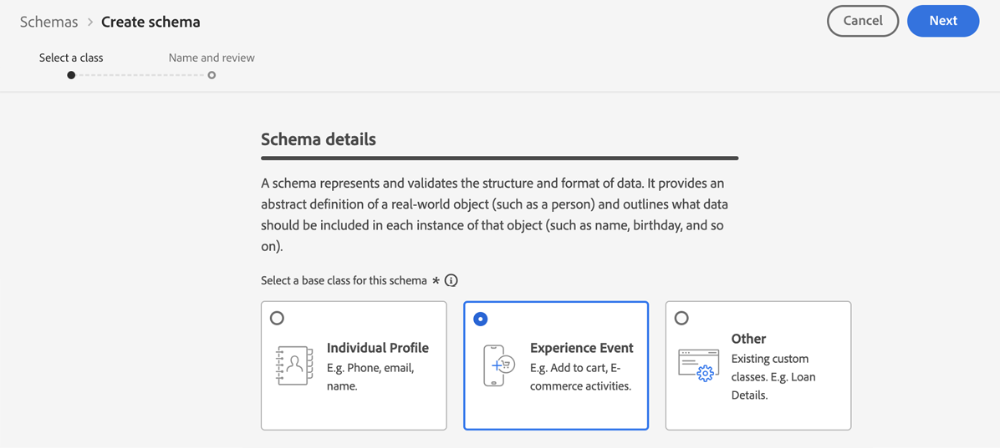

# 이벤트를 수집할 데이터 세트 만들기 {#create-dataset}

경험 이벤트를 수집하려면 먼저 이러한 이벤트를 전송할 데이터 세트를 만들어야 합니다.

먼저 데이터 세트에 사용할 스키마를 만듭니다.

1. 다음에서 **[!UICONTROL 데이터 관리]** 메뉴, 선택 **[!UICONTROL 스키마]**.

1. 클릭 **[!UICONTROL 스키마 만들기]**&#x200B;오른쪽 상단에서 을(를) 선택합니다. **[!UICONTROL 경험 이벤트]** 및 클릭 **다음**.

   

   >[!NOTE]
   >
   >에서 XDM 스키마 및 필드 그룹에 대한 자세한 내용을 알아봅니다. [XDM 시스템 개요 설명서](https://experienceleague.adobe.com/docs/experience-platform/xdm/home.html?lang=ko-KR){target="_blank"}.

1. 스키마의 이름과 설명을 입력하고 **완료**.
   

1. 다음에서 **[!UICONTROL 필드 그룹]** 왼쪽에서 섹션을 선택합니다. **[!UICONTROL 추가]**.

   

1. 다음에서 **[!UICONTROL 검색]** 필드에 &quot;proposition interaction&quot;을 입력합니다.

1. 다음 항목 선택 **[!UICONTROL 경험 이벤트 - 제안 상호 작용]** 필드 그룹 및 클릭 **[!UICONTROL 필드 그룹 추가]**.

   

   >[!CAUTION]
   >
   >데이터 세트에서 사용할 스키마에는 **[!UICONTROL 경험 이벤트 - 제안 상호 작용]** 연결된 필드 그룹입니다. 그렇지 않으면 AI 모델에서 사용할 수 없습니다.

1. 스키마를 저장합니다.

>[!NOTE]
>
>에서 스키마 빌드에 대해 자세히 알아보기 [스키마 컴포지션 기본 사항](https://experienceleague.adobe.com/docs/experience-platform/xdm/schema/composition.html?lang=ko-KR#understanding-schemas){target="_blank"}.

이제 이 스키마를 사용하여 데이터 세트를 만들 준비가 되었습니다. 이렇게 하려면 아래 단계를 수행합니다.

1. 다음에서 **[!UICONTROL 데이터 관리]** 메뉴, 선택 **[!UICONTROL 데이터 세트]** 로 이동 **[!UICONTROL 찾아보기]** 탭.

1. 클릭 **[!UICONTROL 데이터 세트 만들기]** 및 선택 **[!UICONTROL 스키마에서 데이터 세트 만들기]**.

   

1. 목록에서 방금 만든 스키마를 선택하고 **[!UICONTROL 다음]**.

1. 에서 데이터 세트에 대한 고유한 이름을 제공합니다. **[!UICONTROL 이름]** 필드 및 클릭 **[!UICONTROL 완료]**.

   

>[!NOTE]
>
>이제 다음 경우에 이벤트 데이터를 수집하도록 이 데이터 세트를 선택할 수 있습니다. [ai 모델 만들기](../ranking/create-ranking-strategies.md).
