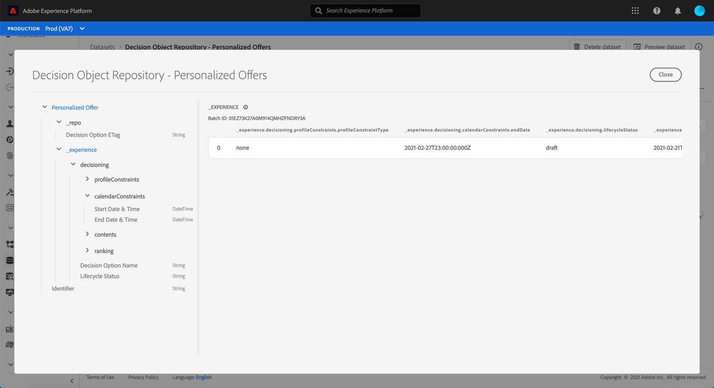

# 내보낸 오퍼 카탈로그에 액세스 {#access-exported-catalog}

내보낸 오퍼 카탈로그는 Adobe Experience Platform **[!UICONTROL Datasets]** 메뉴에서 액세스할 수 있습니다. 오퍼 라이브러리의 각 개체에 대해 하나의 데이터 세트가 만들어집니다.

데이터 세트를 클릭하여 세부 정보에 액세스합니다.

**[!UICONTROL Preview dataset]** 단추를 사용하여 데이터 세트에 가장 최근에 성공한 일괄 처리를 표시할 수 있습니다. 왼쪽 창은 내보낸 데이터 유형에 대한 정보를 제공합니다.

데이터 세트를 검색하고 사용하는 방법에 대한 자세한 내용은 [Adobe Experience Platform 데이터 집합 설명서](https://experienceleague.adobe.com/docs/experience-platform/catalog/datasets/user-guide.html?lang=en#getting-started)를 참조하십시오.
