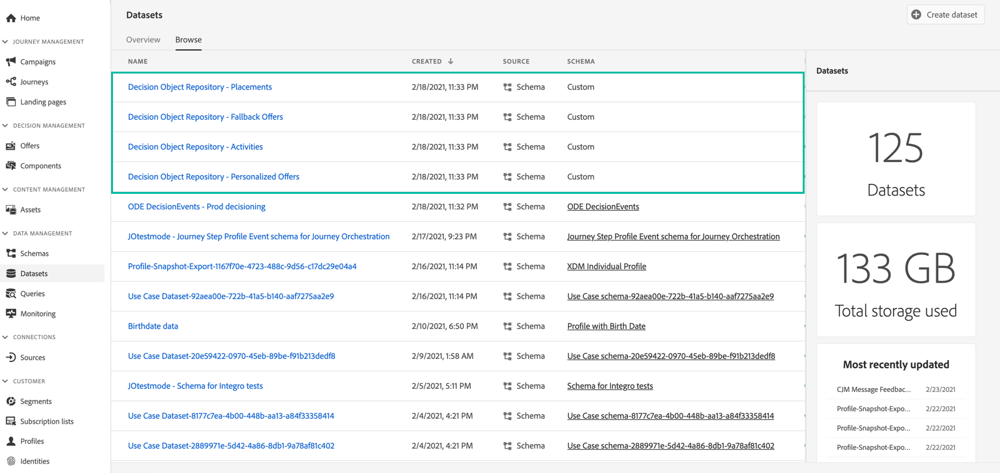

# 내보낸 오퍼 카탈로그에 액세스하기 {#access-exported-catalog}

>[!TIP]
>
>[!DNL Adobe Journey Optimizer]의 새로운 의사 결정 기능인 [결정]을 이제 코드 기반 경험 및 이메일 채널을 통해 사용할 수 있습니다. [자세히 알아보기](../../experience-decisioning/gs-experience-decisioning.md)

내보낸 오퍼 카탈로그는 Adobe Experience Platform **[!UICONTROL 데이터 세트]** 메뉴에서 액세스할 수 있습니다. 오퍼 라이브러리의 각 개체에 대해 하나의 데이터 세트가 만들어집니다.

데이터 세트를 클릭하여 세부 정보에 액세스합니다.

**[!UICONTROL 데이터 집합 미리 보기]** 단추를 사용하면 데이터 집합에서 가장 최근에 성공한 일괄 처리를 표시할 수 있습니다.

데이터 집합을 찾아보고 사용하는 방법에 대한 자세한 내용은 [이 페이지](../../data/get-started-datasets.md)를 참조하세요.
