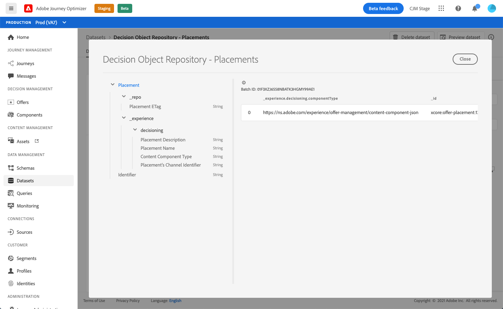

# 배치 데이터 세트 {#placements-dataset}

오퍼가 수정될 때마다 배치에 대해 자동 생성된 데이터 세트가 업데이트됩니다.

데이터 집합에 있는 가장 최근 성공한 일괄 처리가 오른쪽에 표시됩니다. 데이터 집합에 대한 스키마의 계층 구조 보기가 왼쪽 창에 표시됩니다.

>[!NOTE]
>
>[이 섹션](../export-catalog/access-dataset.md)에서 오퍼 라이브러리의 각 개체에 대해 내보낸 데이터 세트에 액세스하는 방법을 알아봅니다.

다음은 **[!UICONTROL Decision Object Repository - Placements]** 데이터 집합에 사용할 수 있는 모든 필드 목록입니다.

<!--A placement describes a location or place in a personalized message. It is used to set technical constraints for content that the personalization decision supplies. The placement also represents a request to produce certain types of metrics when an experience event is produced where this placement is involved. For instance, the placement facilitates a personalized clickable image inside an email shown to an end-user. The placement may for instance request from the assembled experience that the click on its image gets reported in an experience event with a metric https://ns.adobe.com/xdm/data/metrics/web/linkclicks and a reference to this placement.-->

## 식별자

**필드:** _id 
**제목:** 식별자 
**설명:** 레코드의 고유 식별자입니다.
**유형:** 문자열

## _경험

**필드:** _experience 
**유형:** 개체

### _experience > decisioning

**필드:** 의사 결정 
**유형:** 개체

#### _experience > decisioning > 배치의 채널 식별자

**필드:** channelID 
**제목:** 배치의 채널 식별자 
**설명:** 제안을 수행한 채널입니다. 값은 유효한 채널 URI입니다. https://ns.adobe.com/xdm/channels/channel을 참조하십시오.
**유형:** 문자열

#### _experience > decisioning > 컨텐츠 구성 요소 유형

**필드:** componentType 
**Title:** 컨텐츠 구성 요소 유형 
**설명:**  각 값이 컨텐츠 구성 요소에 지정된 유형에 매핑되는 열거된 URI 세트입니다. 컨텐츠 표현의 일부 소비자는 @type 값이 컨텐츠 구성 요소의 추가 속성을 설명하는 스키마를 참조할 것으로 기대하고 있습니다.
**유형:** 문자열

#### _experience > decisioning > contentTypes

**필드:** contentTypes 
**유형:** 배열

* **MIME 미디어 유형**

   **제목:** MIME 미디어 유형
   **설명:**  해당 배치에 필요한 구성 요소의 미디어 유형에 대한 제한입니다. 한 구성 요소에 대해 다른 이미지 형식과 같은 두 개 이상의 미디어 유형을 사용할 수 있습니다.
   **유형:** 문자열

#### _experience > decisioning > 배치 설명

**필드:** 설명 
**제목:** 배치 설명 
**:** 전체 메시지 게재에서 동적 컨텐츠가 사용되는 방법에 대한 사람이 읽을 수 있는 의도를 전달하는 데 사용됩니다. 특정 공간이 웹 페이지의 \&quot;배너\&quot;라는 것은 공식 방법이 아니라 설명을 통해 전달되는 경우가 많습니다.
**유형:** 문자열

#### _experience > decisioning > 배치 이름

**필드:** 이름 
**제목:** 배치 이름 
**설명:** 사람 상호 작용에서 해당 배치를 참조할 수 있도록 지정된 이름입니다.
**유형:** 문자열

## _repo

**필드:** _repo 
**유형:** 개체

### _repo > 배치 ETag

**필드:** 태그 
**제목:** 배치 
**태그 설명:** 스냅샷을 가져올 때 결정 옵션 개체가 있었던 개정입니다.
**유형:** 문자열
