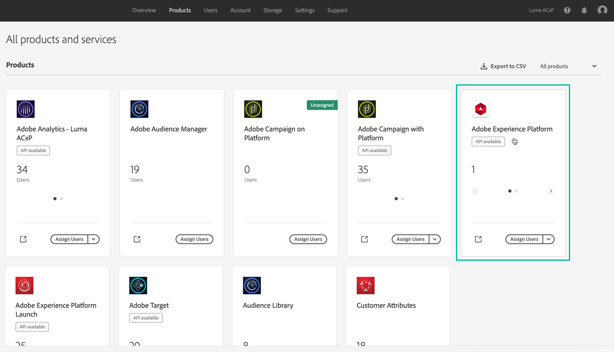

# 의사 결정 관리에 대한 액세스 권한 부여 {#granting-acess-to-decision-management}

offer decisioning 기능에 액세스하고 사용할 권한은 [Adobe Admin Console](https://helpx.adobe.com/kr/enterprise/managing/user-guide.html){target=&quot;_blank&quot;}.

의사 결정 관리 기능에 대한 액세스 권한을 부여하려면 **[!UICONTROL Product profile]** 사용자에게 해당 권한을 할당합니다. 관리에 대해 자세히 알아보기 [!DNL Journey Optimizer] 사용자 및 권한 [이 섹션](../../administration/permissions.md).

결정 관리에 대한 권한은 다음과 같습니다. [이 섹션](../../administration/high-low-permissions.md#manage-decisioning).

<!--If you are a [!DNL Journey Optimizer] user leveraging the **Decision Management** functionality, you need to have the [Decision management permissions](../../administration/high-low-permissions.md#decisions-permissions) enabled to acces all related capabilities. Learn more on managing [!DNL Journey Optimizer] users and permissions in [this section](../../administration/permissions.md).

If you are an [Adobe Experience Platform](https://experienceleague.adobe.com/docs/experience-platform/landing/home.html){target="_blank"} user leveraging the **Offer Decisioning** application service, follow the steps [below](#granting-acess-to-offer-decisioning) to grant access to [!DNL Offer Decisioning].

Grant access to Offer Decisioning

The steps below only apply to **Experience Platform users** leveraging the [!DNL Offer Decisioning] service.-->

1. 를 엽니다. [Admin Console](https://helpx.adobe.com/enterprise/managing/user-guide.html)를 선택하고 을 선택합니다. **[!UICONTROL Adobe Experience Platform]**.

   <!---->

1. 서비스의 제품 프로필이 표시됩니다. 새 제품 프로필을 만들려면 **[!UICONTROL New Profile]** 버튼을 클릭합니다.

   

   >[!NOTE]
   >
   >조직에 대해 설정하려는 다양한 역할에 해당하는 제품 프로필을 원하는 만큼 보유할 수 있습니다.

1. 제품 프로필의 이름과 설명을 지정한 다음 **[!UICONTROL Next]**.

   

   <!--To access the product profile’s permissions, select the **[!UICONTROL Permissions]** line.-->

1. 제품 프로필에 대해 활성화할 서비스를 선택합니다. 기본적으로 모든 서비스가 선택되어 있으므로 모든 Experience Platform 기능을 사용할 수 있는 것이 좋습니다.

   

1. 에서 **[!UICONTROL Decision Management]** 섹션에서 **+** 버튼을 클릭하여 제품 프로필에 권한을 지정한 다음 **[!UICONTROL Save]**.

   

   사용 가능한 권한은 다음과 같습니다.

   **[!UICONTROL Manage Decisioning Activities]**:

   * 오퍼 읽기, 쓰기, 삭제
   * 결정 읽기, 쓰기, 삭제(이전에 오퍼 활동이라고 함)
   * 배치 읽기, 쓰기, 삭제

   **[!UICONTROL Execute Decisioning Activities]**:

   * 오퍼 읽기
   * 결정 읽기
   * 배치 읽기

   **[!UICONTROL Manage Decisioning Options]**:

   * 오퍼 읽기, 쓰기, 삭제
   * 결정 읽기
   * 배치 읽기, 쓰기, 삭제

1. 제품 프로필의 권한 요약이 표시됩니다. 이제 사용자가 이러한 권한에 액세스할 수 있도록 제품 프로필에 사용자를 할당할 수 있습니다.

   

>[!NOTE]
>
>사용자 권한을 관리하는 방법에 대한 자세한 내용은 [Admin Console 설명서](https://helpx.adobe.com/enterprise/managing/user-guide.html){target=&quot;_blank&quot;}.

