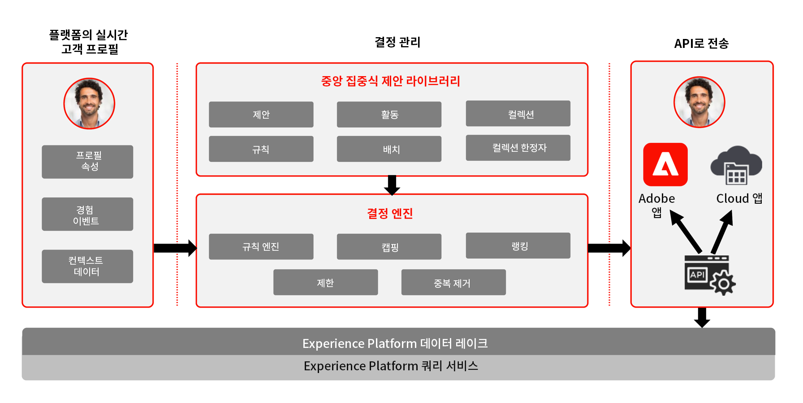
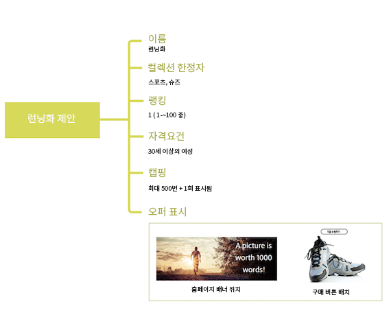

# 의사 결정 관리 정보 {#about-decision-management}

[!DNL Journey Optimizer]을(를) 사용하여 적절한 시기에 모든 접점에서 고객에게 최상의 오퍼 및 경험을 제공하십시오. 디자인한 후에는 개인화된 오퍼를 통해 대상을 타기팅하십시오.

>[!NOTE]
>
>[Adobe Experience Platform](https://experienceleague.adobe.com/docs/experience-platform/landing/home.html?lang=ko){target=&quot;_blank&quot;} 사용자가 **Offer Decisioning** 애플리케이션 서비스를 활용하면 이 섹션에서 설명하는 [의사 결정 관리] 기능을 모두 사용할 수 있습니다.

의사 결정 관리 기능은 다음 두 가지 주요 구성 요소로 이루어집니다.

* **중앙 집중식 오퍼 라이브러리**&#x200B;는 오퍼를 구성하는 여러 요소를 만들고 관리하고, 규칙과 제약 조건을 정의하는 인터페이스입니다.
* **오퍼 의사 결정 엔진**&#x200B;은 오퍼 라이브러리, Adobe Experience Platform 데이터, 실시간 고객 프로필을 활용하여 오퍼가 제공될 올바른 시간, 고객 및 채널을 선택합니다.

이점은 다음과 같습니다.

* 다중 채널에 개인화된 오퍼를 전달하여 캠페인 성과를 향상시킬 수 있습니다.
* 워크플로우 개선: 마케팅 팀은 게재 또는 캠페인을 여러 개 만드는 대신 하나의 게재를 만들어 워크플로우를 개선하고 템플릿의 여러 부분에서 오퍼에 변화를 줄 수 있습니다,
* 캠페인 및 고객 측면에 표시될 오퍼 횟수를 제어합니다.

➡️ [의사 결정 관리]에 대한 자세한 내용은 [튜토리얼 비디오를 참조](#tutorial-videos)하세요.

## 오퍼 및 의사 결정 정보 {#about-offers-and-decisions}

**오퍼**&#x200B;는 고객에게 제공되는 조건을 정의하는 콘텐츠, 자격 조건 규칙 및 제약 조건으로 구성됩니다.

오퍼를 만들고 게시할 여러 콘텐츠에 자격 조건 규칙 및 제약 조건을 연결할 수 있는 중앙 오퍼 카탈로그를 제공하는 **오퍼 라이브러리**&#x200B;를 사용하여 만듭니다([오퍼 라이브러리 사용자 인터페이스 참조](../get-started/user-interface.md)).

오퍼 라이브러리가 오퍼로 보강되면 오퍼를 **의사 결정**(이전의 &#39;오퍼 활동&#39;)에 통합할 수 있습니다.

의사 결정은 게재 대상에 따라 제공할 최상의 오퍼를 선택하기 위해 오퍼 의사 결정 엔진을 활용하는 오퍼에 대한 컨테이너입니다.

## 일반적인 사용 사례 {#common-use-cases}

의사 결정 관리 기능과 Adobe Experience Platform의 통합을 통해 고객의 참여도와 전환율을 높이는 데 도움이 되는 다양한 사용 사례를 다룰 수 있습니다.

* Adobe Experience Platform의 데이터를 기반으로 방문자의 관심 사항과 일치하는 오퍼를 웹 사이트에 표시합니다.

   

* 고객이 매장 근처에 있는 경우, 고객의 특성(충성도 수준, 성별, 이전 구매...)에 따라 사용 가능한 오퍼를 알려 주는 푸시 알림을 보냅니다.

   

* 또한 의사 결정을 사용하면 지원 팀에 문의할 때 고객의 경험을 향상시킬 수 있습니다. 의사 결정 관리 API를 사용하면 고객이 상환한 정보와 다음 최적 오퍼에 대한 정보를 콜 센터 상담원의 포털 정보에 표시하도록 할 수 있습니다.

   

## 의사 결정 관리 액세스 권한 부여 {#granting-acess-to-decision-management}

offer decisioning 기능의 액세스 및 사용 권한은 [Adobe Admin Console](https://helpx.adobe.com/kr/enterprise/managing/user-guide.html){target=&quot;_blank&quot;}을 통해 관리할 수 있습니다.

[의사 결정 관리] 기능에 대한 액세스 권한을 부여하려면 **[!UICONTROL Product profile]**&#x200B;을 만들고 사용자에게 해당 권한을 할당합니다. [!DNL Journey Optimizer]의 사용자 및 권한 관리에 대한 자세한 정보는 [이 섹션](../../administration/permissions.md)을 참조하세요.

[의사 결정 관리]에 대한 권한 목록은 [이 섹션](../../administration/high-low-permissions.md#decisions-permissions)에서 확인할 수 있습니다.

## 용어집 {#glossary}

의사 결정 관리 사용 시 사용할 주요 개념 목록을 아래에서 확인할 수 있습니다.

* **한도** 또는 **게재 빈도 설정**: 한도는 오퍼가 표시되는 횟수를 정의하는 제약 조건으로 사용됩니다. 두 가지 유형의 최대 가용량이 있습니다. “총 최대 가용량”이라고도 하는 결합된 타겟 대상자 전체에 오퍼를 제안할 수 있는 횟수를 나타내는 최대 가용량과 &quot;프로필 최대 가용량&quot;이라고도 하는 동일한 최종 사용자에게 오퍼를 제안할 수 있는 횟수를 나타내는 최대 가용량이 있습니다.

* **컬렉션**: 컬렉션은 오퍼의 카테고리와 같이 마케터가 정의한 사전 정의된 조건을 기반으로 하는 오퍼의 하위 집합입니다.

* **결정**: 결정에는 오퍼의 선택을 알리는 논리가 포함되어 있습니다.

* **의사 결정 규칙**: 의사 결정 규칙은 개인화된 오퍼에 추가되고 자격을 결정하기 위해 프로필에 적용되는 제약 조건입니다.

* **적격 오퍼**: 적격 오퍼는 프로필에 일관되게 오퍼할 수 있는 업스트림에 정의된 제약 조건을 충족합니다.

* **의사 결정 관리**: 비즈니스 논리 및 의사 결정 규칙을 사용하여 채널 및 애플리케이션 전반에 개인화된 제안 경험을 제작하여 제공할 수 있습니다.

* **대체 오퍼**: 대체 오퍼는 최종 사용자가 컬렉션에 있는 개인화된 오퍼에 대한 자격이 없을 때 표시되는 기본 오퍼입니다.

* **오퍼**: 오퍼는 오퍼를 볼 자격이 있는 사람을 지정하는 규칙과 관련된 마케팅 메시지입니다.

* **오퍼 라이브러리**: 오퍼 라이브러리는 개인화된 오퍼 및 대체 오퍼와 의사 결정 규칙 및 의사 결정을 관리하는 데 사용되는 중앙 라이브러리입니다.

* **개인화된 오퍼**: 개인화된 오퍼는 적격성 및 제약 조건을 기반으로 한 맞춤형 마케팅 메시지입니다.

* **배치**: 배치는 최종 사용자에게 나타나는 오퍼의 위치 및 컨텍스트입니다.

* **우선 순위**: 우선 순위는 자격, 일정 및 한도 등과 같은 모든 제약 조건을 충족하는 오퍼의 등급을 지정하는 데 사용됩니다.

* **표시**: 표시란 오퍼를 표시하는 데 사용되는 위치 또는 언어와 같은 채널에서 사용하는 정보입니다.

## 튜토리얼 비디오 {#tutorial-videos}

>[!NOTE]
>
>이러한 비디오는 Adobe Experience Platform을 기반으로 구축된 Offer Decisioning 애플리케이션 서비스에 적용되며 [!DNL Adobe Journey Optimizer]에만 국한되지 않습니다. 하지만, 이 지침에서는 [!DNL Journey Optimizer]를 사용하는 맥락에서 [의사 결정 관리]를 사용하기 위한 일반적인 지침을 제공합니다.

### 의사 결정 관리란? {#what-is-offer-decisioning}

아래 비디오에서는 의사 결정 관리의 주요 기능, 아키텍처 및 사용 사례에 대한 소개를 제공합니다.

>[!VIDEO](https://video.tv.adobe.com/v/326961?quality=12&learn=on)

### 오퍼 정의 및 관리 {#use-offer-decisioning}

아래 비디오에서는 의사 결정 관리를 사용하여 오퍼를 정의 및 관리하고 실시간 고객 데이터를 활용하는 방법을 보여 줍니다.

>[!VIDEO](https://video.tv.adobe.com/v/326841?quality=12&learn=on)
