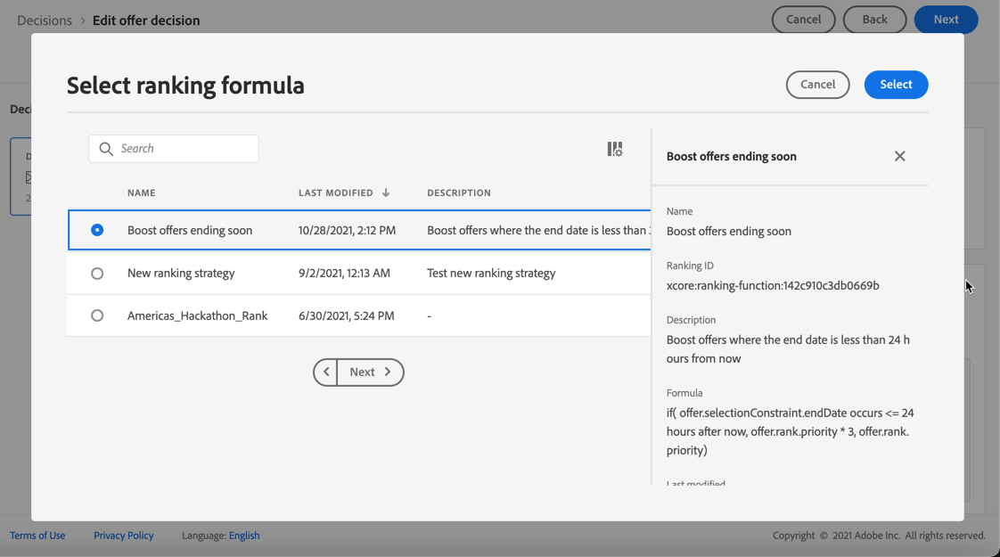

# 의사 결정에서 오퍼 선택 구성 {#offers-selection-in-activities}

지정된 배치에 여러 오퍼가 적격인 경우, 결정을 구성할 때(이전에 오퍼 활동이라고 알려짐) 각 프로필에 대해 가장 적합한 오퍼를 선택하는 방법을 선택할 수 있습니다. 오퍼의 등급을 다음과 같이 지정할 수 있습니다.
* 오퍼 우선 순위
* 등급 공식

## 오퍼 우선 순위 {#about-offers-priority}

기본적으로 몇 개의 오퍼가 결정(이전에 오퍼 활동이라고 함)에서 주어진 배치에 참가할 수 있는 경우 가장 높은 **우선순위**&#x200B;를 가진 오퍼가 고객에게 먼저 전달됩니다.

오퍼를 만들 때 오퍼의 우선순위 점수가 지정됩니다. [이 섹션](../offer-library/creating-personalized-offers.md)에서 개인화된 오퍼를 만드는 방법을 알아봅니다.

## 등급 공식 {#assign-ranking-formula}

Journey Optimizer에서는 오퍼 우선 순위 외에 **등급 공식**&#x200B;을 만들 수 있습니다. 오퍼의 우선 순위 점수를 고려하지 않고 주어진 배치에 대해 먼저 제공해야 하는 오퍼를 결정하는 공식입니다.

예를 들어, 종료 날짜가 지금부터 24시간 미만인 모든 오퍼의 우선순위를 늘리거나, 프로필의 관심 영역이 &quot;실행 중&quot;인 경우 &quot;실행 중&quot; 카테고리의 오퍼를 늘릴 수 있습니다.

[이 섹션](../offer-library/create-ranking-formulas.md)에서 등급 공식을 만드는 방법을 알아봅니다.

등급 공식이 만들어지면 결정(이전에 오퍼 활동이라고 함)의 배치에 할당할 수 있습니다. 이렇게 하려면 아래 단계를 수행합니다:

1. 결정을 만들거나 기존 결정을 편집합니다. [의사 결정 만들기](../offer-activities/create-offer-activities.md)를 참조하십시오.

1. 오퍼가 포함될 배치를 추가합니다. [배치 만들기](../offer-library/creating-placements.md)를 참조하십시오.

1. 각 배치에 대해 컬렉션을 추가합니다. [컬렉션 만들기](../offer-library/creating-collections.md)를 참조하십시오.

1. 드롭다운 목록에서 **[!UICONTROL Ranking]** 별로 오퍼의 등급을 매기도록 선택한 다음 **[!UICONTROL Add ranking]** 를 클릭합니다.

   

1. 원하는 등급 공식을 선택하고 **[!UICONTROL Select]** 을 클릭합니다.

   

이제 등급 공식이 배치와 연결됩니다.

이 배치에서 여러 오퍼를 표시할 수 있는 경우, 이 결정은 순위 수식의 공식을 사용하여 먼저 전달할 오퍼를 계산합니다.
