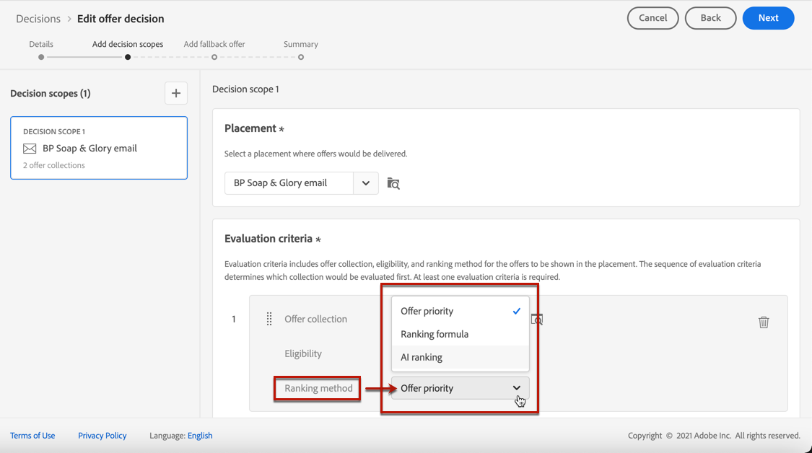

# 의사 결정에서 오퍼 선택 구성 {#offers-selection-in-decisions}

지정된 배치에 여러 오퍼가 적합한 경우 결정을 구성할 때 각 프로필에 대해 가장 적합한 오퍼를 선택하는 방법을 선택할 수 있습니다. 오퍼의 등급을 다음과 같이 지정할 수 있습니다.
* 오퍼 우선 순위
* 등급 공식
* [AI 순위](#use-ranking-strategy) (일부 사용자에게만 얼리 액세스 시)

## 오퍼 우선 순위 {#offer-priority}

기본적으로 여러 오퍼가 결정에서 주어진 배치에 적격인 경우 오퍼가 가장 높은 오퍼입니다 **우선순위** 은 고객에게 먼저 전달됩니다.

오퍼를 만들 때 오퍼의 우선순위 점수가 지정됩니다. 에서 개인화된 오퍼를 만드는 방법을 알아봅니다 [이 섹션](../offer-library/creating-personalized-offers.md).

## 등급 공식 {#assign-ranking-formula}

Journey Optimizer에서는 오퍼 우선 순위 외에도 **등급 공식**. 오퍼의 우선 순위 점수를 고려하지 않고 주어진 배치에 대해 먼저 제공해야 하는 오퍼를 결정하는 공식입니다.

예를 들어, 종료 날짜가 지금부터 24시간 미만인 모든 오퍼의 우선순위를 늘리거나, 프로필의 관심 영역이 &quot;실행 중&quot;인 경우 &quot;실행 중&quot; 카테고리의 오퍼를 늘릴 수 있습니다.

에서 등급 공식을 만드는 방법을 알아봅니다 [이 섹션](../offer-library/create-ranking-formulas.md).

등급 공식이 만들어지면 결정에서 배치에 할당할 수 있습니다. 이렇게 하려면 아래 단계를 수행합니다:

1. 결정을 만들거나 기존 결정을 편집합니다. [의사 결정 만들기](../offer-activities/create-offer-activities.md)를 참조하십시오.

1. 오퍼가 포함될 배치를 추가합니다. 자세한 내용은 [배치 만들기](../offer-library/creating-placements.md).

1. 각 배치에 대해 컬렉션을 추가합니다. 자세한 내용은 [컬렉션 만들기](../offer-library/creating-collections.md).

1. 선택 **[!UICONTROL Ranking formula]** 를 순위 지정 메서드로 설정한 다음 **[!UICONTROL Add ranking]**.

   

1. 원하는 등급 공식을 선택하고 을 클릭합니다 **[!UICONTROL Select]**.

   

이제 등급 공식이 배치와 연결됩니다.

이 배치에서 여러 오퍼를 표시할 수 있는 경우, 이 결정은 순위 수식의 공식을 사용하여 먼저 전달할 오퍼를 계산합니다.

## AI 등급 {#use-ranking-strategy}

<!--If you are an [Adobe Experience Platform](https://experienceleague.adobe.com/docs/experience-platform/landing/home.html){target="_blank"} user leveraging the **Offer Decisioning** application service,-->

등급 전략을 선택하여 주어진 프로필에 대해 표시할 오퍼의 등급을 자동으로 지정하는 숙련된 모델 시스템을 사용할 수도 있습니다. 에서 등급 전략을 만드는 방법을 알아봅니다. [이 섹션](../offer-library/create-ranking-strategies.md).

>[!CAUTION]
>
>현재 AI 등급을 사용하여 사용자를 선택하기만 하면 조기 액세스에서 사용할 수 있습니다.

등급 전략이 만들어지면 결정에서 배치에 할당할 수 있습니다. 이렇게 하려면 아래 단계를 수행하십시오.

1. 결정을 만들거나 기존 결정을 편집합니다. [의사 결정 만들기](../offer-activities/create-offer-activities.md)를 참조하십시오.

1. 오퍼가 포함될 배치를 추가합니다. 자세한 내용은 [배치 만들기](../offer-library/creating-placements.md).

1. 각 배치에 대해 컬렉션을 추가합니다. 자세한 내용은 [컬렉션 만들기](../offer-library/creating-collections.md).

1. 오퍼의 등급을 매기도록 선택합니다 **[!UICONTROL AI ranking]** 드롭다운 목록에서 **[!UICONTROL Add ranking]**.

   

1. 생성한 등급 전략을 선택합니다. 순위 전략의 모든 세부 사항이 표시됩니다.

   

1. **[!UICONTROL Select]**&#x200B;을(를) 클릭합니다. 이제 등급 전략이 배치와 연결됩니다.

여러 오퍼가 적격인 경우, 훈련된 모델 시스템에서 지정된 배치에 대해 먼저 제공해야 하는 오퍼를 결정합니다.

