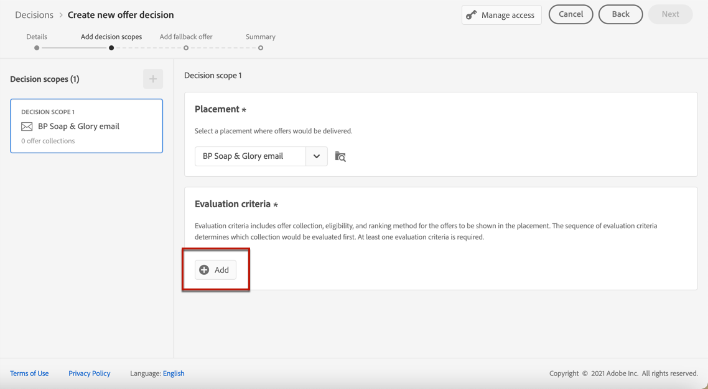
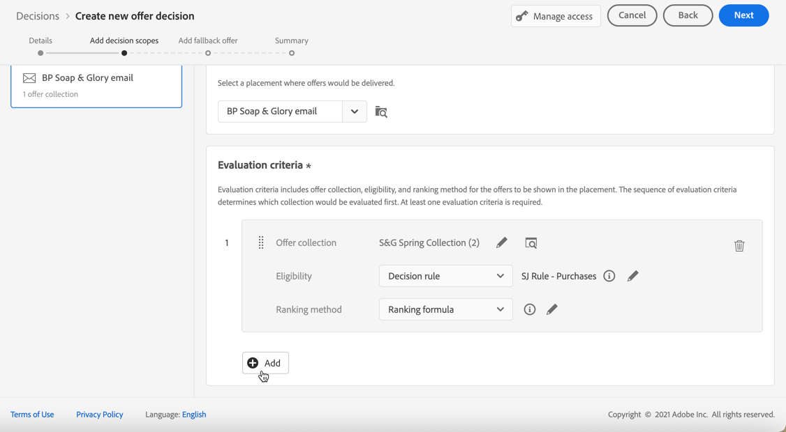

# 의사 결정 만들기 {#create-offer-activities}

의사 결정은 게재 대상에 따라 제공할 최상의 오퍼를 선택하기 위해 오퍼 의사 결정 엔진을 활용하는 오퍼에 대한 컨테이너입니다.

➡️ [이 비디오에서는 오퍼 활동을 만드는 방법을 알아봅니다.](#video)

의사 결정 목록은 **[!UICONTROL 오퍼]** 메뉴 > **[!UICONTROL 결정]** 탭. 필터를 사용하여 상태 또는 시작 및 종료 날짜에 따라 결정을 검색할 수 있습니다.

결정을 만들기 전에 아래 구성 요소가 오퍼 라이브러리에 만들어졌는지 확인하십시오.

* [배치](../offer-library/creating-placements.md)
* [컬렉션](../offer-library/creating-collections.md)
* [개인화된 오퍼](../offer-library/creating-personalized-offers.md)
* [대체 오퍼](../offer-library/creating-fallback-offers.md)

## 의사 결정 만들기 {#create-activity}

1. 의사 결정 목록에 액세스한 다음 **[!UICONTROL 결정 만들기]**.

1. 결정의 이름을 지정합니다.

1. 필요한 경우 시작 및 종료 날짜 및 시간을 정의한 다음 을 클릭합니다. **[!UICONTROL 다음]**.

   

1. 사용자 지정 또는 핵심 데이터 사용 레이블을 의사 결정에 할당하려면 다음을 선택합니다. **[!UICONTROL 액세스 관리]**. [OLAC(Object Level Access Control)에 대해 자세히 알아보기](../../administration/object-based-access.md)

## 결정 범위 정의 {#add-decision-scopes}

1. 드롭다운 목록에서 배치를 선택합니다. 귀하의 결정 중 첫 번째 결정 범위에 추가됩니다.

   

1. 클릭 **[!UICONTROL 추가]** 이 배치에 대한 평가 기준을 선택합니다.

   

   각 기준은 자격 제한과 연관된 오퍼 컬렉션 및 배치에 표시할 오퍼를 결정하는 등급 메서드로 구성됩니다.

   >[!NOTE]
   >
   >하나 이상의 평가 기준이 필요합니다.

1. 고려할 오퍼가 포함된 오퍼 컬렉션을 선택한 다음 를 클릭합니다. **[!UICONTROL 추가]**.

   

   >[!NOTE]
   >
   >다음을 클릭할 수 있습니다 **[!UICONTROL 오퍼 컬렉션 열기]** 새 탭에 컬렉션 목록을 표시하는 링크입니다. 여기에서 컬렉션과 컬렉션에 포함된 오퍼를 검색할 수 있습니다.

   선택한 컬렉션이 기준에 추가됩니다.

   

1. 사용 **[!UICONTROL 자격 요건]** 이 배치에 대한 오퍼 선택을 제한하는 필드.

   이 제한은 다음을 사용하여 적용할 수 있습니다. **결정 규칙**&#x200B;또는 하나 또는 여러 개 **Adobe Experience Platform 대상**. 둘 다 다음에 자세히 설명되어 있습니다. [이 섹션](../offer-library/add-constraints.md#segments-vs-decision-rules).

   * 오퍼 선택을 Experience Platform 대상의 구성원으로 제한하려면 다음을 선택합니다. **[!UICONTROL 대상]**&#x200B;을 클릭한 다음 을 클릭합니다 **[!UICONTROL 대상자 추가]**.

     

     왼쪽 창에서 하나 또는 여러 대상자를 추가하고 **[!UICONTROL 및]** / **[!UICONTROL 또는]** 논리 연산자.

     

     에서 대상자를 사용하여 작업하는 방법을 알아봅니다. [이 섹션](../../audience/about-audiences.md).

   * 의사 결정 규칙과 함께 선택 제한을 추가하려면 **[!UICONTROL 결정 규칙]** 옵션을 선택하고 선택한 규칙을 선택합니다.

     

     에서 의사 결정 규칙을 만드는 방법을 알아봅니다. [이 섹션](../offer-library/creating-decision-rules.md).

1. 대상자 또는 결정 규칙을 선택하면 예상 적격 프로필에 대한 정보를 볼 수 있습니다. 클릭 **[!UICONTROL 새로 고침]** 을 클릭하여 데이터를 업데이트합니다.

   >[!NOTE]
   >
   >규칙 매개 변수에 컨텍스트 데이터와 같이 프로필에 없는 데이터가 포함되어 있으면 프로필 추정치를 사용할 수 없습니다. 예를 들어 현재 날씨가 ≥80도여야 하는 자격 규칙이 있습니다.

   

1. 각 프로필에 가장 적합한 오퍼를 선택하는 데 사용할 순위 방법을 정의합니다. [자세히 알아보기](../offer-activities/configure-offer-selection.md).

   

   * 기본적으로 여러 오퍼가 이 배치에 적합한 경우 **[!UICONTROL 오퍼 우선 순위]** 메서드는 오퍼에 정의된 값을 사용합니다. 우선 순위 점수가 가장 높은 오퍼가 사용자에게 제공됩니다.

   * 특정 계산된 점수를 사용하여 게재할 적격 오퍼를 선택하려면 다음을 선택합니다. **[!UICONTROL 공식]** 또는 **[!UICONTROL AI 모델]**. [자세히 알아보기](../offer-activities/configure-offer-selection.md).

1. 클릭 **[!UICONTROL 추가]** 동일한 배치에 대해 더 많은 기준을 정의할 수 있습니다.

   

1. 여러 기준을 추가하면 특정 순서로 평가됩니다. 시퀀스에 추가된 첫 번째 컬렉션이 먼저 평가되는 식입니다. [자세히 알아보기](#evaluation-criteria-order)

   기본 시퀀스를 변경하려면 컬렉션을 끌어다 놓아 원하는 대로 순서를 변경할 수 있습니다.

   

1. 여러 기준을 동시에 평가할 수도 있습니다. 이렇게 하려면 컬렉션을 다른 컬렉션 위에 끌어서 놓습니다.

   

   이제 동일한 순위를 가지므로 동시에 평가됩니다. [자세히 알아보기](#evaluation-criteria-order)

   

   >[!CAUTION]
   >
   >* If [AI 모델](../ranking/ai-models.md) 는 평가 기준 그룹에 사용되며 해당 그룹의 모든 평가 기준은 AI 등급 방법을 사용해야 하며 동일한 특정 AI 모델을 사용해야 합니다.
   >
   >* 하나의 평가 기준 그룹만 AI 모델을 사용할 수 있습니다. 결정 범위 내의 다른 모든 그룹은 다른 순위 방법(우선순위 또는 공식)을 사용해야 합니다. [등급 방법에 대해 자세히 알아보기](../offer-activities/configure-offer-selection.md)

1. 이 결정의 일부로 오퍼에 대한 다른 배치를 추가하려면 다음을 사용하십시오. **[!UICONTROL 새 범위]** 단추를 클릭합니다. 각 결정 범위에 대해 위의 단계를 반복합니다.

   

   >[!NOTE]
   >
   >여러 결정 범위를 추가할 때 평가 기준 순서가 영향을 받습니다. [자세히 알아보기](#multiple-scopes)

### 평가 기준 순서 {#evaluation-criteria-order}

앞서 설명한 바와 같이 평가 기준은 수집, 적격성 제약, 순위화 방법으로 구성된다. 평가 기준을 평가할 순서 를 설정할 수 있지만, 여러 평가 기준을 결합하여 별도로 평가하지 않고 함께 평가할 수도 있습니다.

#### 하나의 범위 사용 {#one-scope}

단일 결정 범위 내에서 여러 기준 및 해당 그룹화가 적격 오퍼의 기준 및 순위의 우선 순위를 결정합니다. 첫 번째 기준이 우선순위가 가장 높고 같은 &#39;그룹&#39; 내에서 결합된 기준도 우선순위가 같다.

예를 들어 두 개의 컬렉션이 있습니다. 하나는 평가 기준 A에 있고 다른 하나는 평가 기준 B에 있습니다. 요청은 두 오퍼를 다시 전송하는 것입니다. 평가 기준 A에서 2개의 적격 오퍼와 평가 기준 B에서 3개의 적격 오퍼가 있다고 가정해 보겠습니다.

* 두 평가 기준이 다음과 같은 경우 **결합되지 않음** 및/또는 순차적 순서(1 및 2)로 평가 기준의 상위 2개의 적격 오퍼가 첫 번째 행에 반환됩니다. 첫 번째 평가 기준에 두 개의 적격 오퍼가 없는 경우, 의사 결정 엔진은 계속해서 필요한 만큼 찾기 위해 다음 평가 기준으로 이동하고, 필요한 경우 최종적으로 대체 오퍼를 반환합니다.

  

* 두 컬렉션이 **동시에 평가됨**, 평가 기준 A의 2개의 적격 오퍼와 평가 기준 B의 3개의 적격 오퍼가 있으므로, 5개의 오퍼는 모두 각 순위 방법으로 결정된 값에 따라 함께 순위가 지정됩니다. 2개의 오퍼가 요청되므로 이 5개의 오퍼 중 상위 2개의 적격 오퍼가 반환됩니다.

  

+++ **여러 기준이 있는 예**

이제 하나의 범위에 대해 여러 개의 기준을 다른 그룹으로 나눈 예를 살펴보겠습니다.

세 가지 기준을 정의했습니다. 기준 1과 기준 2는 그룹 1에서 함께 결합되고 기준 3은 독립적이다(그룹 2).

각 기준 및 해당 우선 순위(순위 함수 평가에 사용됨)에 대한 적격 오퍼는 다음과 같습니다.

* 그룹 1:
   * 기준 1 - (오퍼 1, 오퍼 2, 오퍼 3) - 우선순위 1
   * 기준 2 - (오퍼 3, 오퍼 4, 오퍼 5) - 우선순위 1

* 그룹 2:
   * 기준 3 - (오퍼 5, 오퍼 6) - 우선순위 0

우선 순위가 가장 높은 기준 오퍼를 먼저 평가하고 등급 오퍼 목록에 추가합니다.

**반복 1:**

기준 1 및 기준 2 오퍼는 함께 평가됩니다(오퍼 1, 오퍼 2, 오퍼 3, 오퍼 4, 오퍼 5). 그 결과는 다음과 같습니다.

오퍼 1 - 10 오퍼 2 - 20 오퍼 3 - 30 기준 1에서, 45 기준 2에서. 둘 중 가장 높은 것을 고려할 것이므로 45를 고려한다.
오퍼 4 - 40 오퍼 5 - 50

이제 등급 오퍼는 다음과 같습니다. 오퍼 5, 오퍼 3, 오퍼 4, 오퍼 2, 오퍼 1.

**반복 2:**

기준 3 오퍼가 평가됩니다(오퍼 5, 오퍼 6). 그 결과는 다음과 같습니다.

* 오퍼 5 - 위의 결과에 이미 있으므로 평가되지 않습니다.
* 오퍼 6 - 60

이제 등급 오퍼는 다음과 같습니다. 오퍼 5 , 오퍼 3, 오퍼 4, 오퍼 2, 오퍼 1, 오퍼 6.

+++

#### 여러 범위 포함 {#multiple-scopes}

**복제가 해제된 경우**

의사 결정에 여러 의사 결정 범위를 추가할 때 배치 전체에서 복제가 허용되지 않는 경우 요청에 있는 의사 결정 범위 순서대로 적격 오퍼가 순차적으로 선택됩니다.

>[!NOTE]
>
>다음 **[!UICONTROL 배치 간 중복 허용]** 매개변수는 배치 레벨에서 설정됩니다. 의사 결정 요청의 모든 배치에 대해 중복이 false로 설정되면 요청의 모든 배치가 false 설정을 상속합니다. [중복 매개 변수에 대해 자세히 알아보기](../offer-library/creating-placements.md)

다음과 같은 두 가지 결정 범위를 추가한 예를 살펴보겠습니다.

* 범위 1: 4개의 적격 오퍼(오퍼 1, 오퍼 2, 오퍼 3, 오퍼 4)가 있으며 요청은 2개의 오퍼를 다시 전송하는 것입니다.
* 범위 2: 4개의 적격 오퍼(오퍼 1, 오퍼 2, 오퍼 3, 오퍼 4)가 있으며 요청은 2개의 오퍼를 다시 전송하는 것입니다.

+++ **예 1**

선택은 다음과 같습니다.

1. 범위 1의 상위 2개의 적격 오퍼가 반환됩니다(오퍼 1, 오퍼 2).
1. 범위 2의 나머지 상위 2개의 적격 오퍼가 반환됩니다(오퍼 3, 오퍼 4).

+++

+++ **예 2**

이 예에서 오퍼 1은 빈도 상한 제한에 도달했습니다. [빈도 설정에 대해 자세히 알아보기](../offer-library/add-constraints.md#capping)

선택은 다음과 같습니다.

1. 범위 1의 나머지 상위 2개의 적격 오퍼가 반환됩니다(오퍼 2, 오퍼 3).
1. 범위 2의 나머지 적격 오퍼가 반환됩니다(오퍼 4).

+++

+++ **예 3**

이 예에서 오퍼 1과 오퍼 3은 빈도 상한 제한에 도달했습니다. [빈도 설정에 대해 자세히 알아보기](../offer-library/add-constraints.md#capping)

선택은 다음과 같습니다.

1. 범위 1의 나머지 상위 2개의 적격 오퍼가 반환됩니다(오퍼 2, 오퍼 4).
1. 범위 2에 대한 나머지 적격 오퍼가 없으므로 [대체 오퍼](#add-fallback) 가 반환됩니다.

+++

**복제가 켜져 있는 경우**

모든 배치에 걸쳐 중복이 허용되면 서로 다른 배치에서 동일한 오퍼를 여러 번 제안할 수 있습니다. 활성화되면 시스템은 여러 배치에 대해 동일한 오퍼를 고려합니다. [중복 매개 변수에 대해 자세히 알아보기](../offer-library/creating-placements.md)

다음과 같은 두 가지 결정 범위를 추가한 위와 동일한 예를 살펴보겠습니다.

* 범위 1: 4개의 적격 오퍼(오퍼 1, 오퍼 2, 오퍼 3, 오퍼 4)가 있으며 요청은 2개의 오퍼를 다시 전송하는 것입니다.
* 범위 2: 4개의 적격 오퍼(오퍼 1, 오퍼 2, 오퍼 3, 오퍼 4)가 있으며 요청은 2개의 오퍼를 다시 전송하는 것입니다.

+++ **예 1**

선택은 다음과 같습니다.

1. 범위 1의 상위 2개의 적격 오퍼가 반환됩니다(오퍼 1, 오퍼 2).
1. 범위 2의 동일한 상위 2개의 적격 오퍼가 반환됩니다(오퍼 1, 오퍼 2).

+++

+++ **예 2**

이 예에서 오퍼 1은 빈도 상한 제한에 도달했습니다. [빈도 설정에 대해 자세히 알아보기](../offer-library/add-constraints.md#capping)

선택은 다음과 같습니다.

1. 범위 1의 나머지 상위 2개의 적격 오퍼가 반환됩니다(오퍼 2, 오퍼 3).

1. 범위 2의 동일한 나머지 상위 2개의 적격 오퍼가 반환됩니다(오퍼 2, 오퍼 3).

+++

+++ **예 3**

이 예에서 오퍼 1과 오퍼 3은 빈도 상한 제한에 도달했습니다. [빈도 설정에 대해 자세히 알아보기](../offer-library/add-constraints.md#capping)

선택은 다음과 같습니다.

1. 범위 1의 나머지 상위 2개의 적격 오퍼가 반환됩니다(오퍼 2, 오퍼 4).

1. 범위 2의 동일한 나머지 상위 2개의 적격 오퍼가 반환됩니다(오퍼 2, 오퍼 4).

+++

## 대체 오퍼 추가 {#add-fallback}

결정 범위를 정의한 후 오퍼 자격 규칙 및 제약 조건과 일치하지 않는 고객에게 마지막 수단으로 제공될 대체 오퍼를 정의합니다.

이렇게 하려면 결정에 정의된 배치에 사용할 수 있는 대체 오퍼 목록에서 선택한 다음 을(를) 클릭합니다 **[!UICONTROL 다음]**.

>[!NOTE]
>
>다음을 클릭할 수 있습니다 **[!UICONTROL 오퍼 라이브러리 열기]** 새 탭에 오퍼 목록을 표시하는 링크.

## 결정을 검토하고 저장합니다 {#review}

모든 것이 올바르게 구성된 경우 결정 속성에 대한 요약이 표시됩니다.

1. 고객에게 오퍼를 제공하는 데 사용할 준비가 되었는지 확인하십시오. 모든 결정 범위 및 여기에 포함된 대체 오퍼가 표시됩니다.

   

1. 각 배치를 확장하거나 축소할 수 있습니다. 각 배치에 대한 사용 가능한 오퍼, 자격 요건 및 등급 세부 정보를 미리 볼 수 있습니다. 예상 적격 프로필에 대한 정보를 표시할 수도 있습니다. 클릭 **[!UICONTROL 새로 고침]** 을 클릭하여 데이터를 업데이트합니다.

   

1. **[!UICONTROL 마침을 클릭합니다]**.
1. 선택 **[!UICONTROL 저장 및 활성화]**.

   

   나중에 결정을 편집하고 활성화하기 위해 초안으로 저장할 수도 있습니다.

결정은 목록에 과 함께 표시됩니다. **[!UICONTROL 라이브]** 또는 **[!UICONTROL 초안]** 상태, 이전 단계에서 활성화했는지 여부에 따라 달라집니다.

이제 고객에게 오퍼를 게재하는 데 사용할 준비가 되었습니다.

## 의사 결정 목록 {#decision-list}

결정 목록에서 속성을 표시할 결정을 선택할 수 있습니다. 여기에서 편집하고 상태를 변경할 수도 있습니다(**초안**, **라이브**, **완료**, **보관됨**), 결정을 복제하거나 삭제합니다.

다음 항목 선택 **[!UICONTROL 편집]** 단추를 클릭하여 의사 결정 편집 모드로 돌아갑니다. 여기서 의사 결정의 [세부 사항](#create-activity), [결정 범위](#add-decision-scopes) 및 [대체 오퍼](#add-fallback).

>[!IMPORTANT]
>
>여정의 메시지에 사용 중인 오퍼 의사 결정이 변경되는 경우 여정 게시를 취소하고 다시 게시해야 합니다.  이렇게 하면 변경 사항이 여정 메시지에 통합되고 메시지가 최신 업데이트와 일관되게 표시됩니다.

라이브 의사 결정을 선택하고 **[!UICONTROL 비활성화]** 결정 상태를 (으)로 다시 설정하려면 **[!UICONTROL 초안]**.

상태를 (으)로 다시 설정 **[!UICONTROL 라이브]**&#x200B;를 선택하고 **[!UICONTROL 활성화]** 단추가 표시됩니다.

다음 **[!UICONTROL 추가 작업]** 버튼은 아래에 설명된 작업을 활성화합니다.

* **[!UICONTROL 완료]**: 의사 결정 상태를 다음으로 설정합니다. **[!UICONTROL 완료]**&#x200B;를 의미합니다. 더 이상 이 결정은 호출될 수 없습니다. 이 작업은 활성화된 결정에만 사용할 수 있습니다. 이 결정은 여전히 목록에서 사용할 수 있지만, 상태를 다시 로 설정할 수 없습니다. **[!UICONTROL 초안]** 또는 **[!UICONTROL 승인됨]**. 복제, 삭제 또는 보관만 가능합니다.

* **[!UICONTROL 복제]**: 동일한 속성, 결정 범위 및 대체 오퍼를 사용하여 결정을 만듭니다. 기본적으로 새 결정에는 **[!UICONTROL 초안]** 상태.

* **[!UICONTROL 삭제]**: 목록에서 결정을 제거합니다.

  >[!CAUTION]
  >
  >결정 및 해당 콘텐츠에 더 이상 액세스할 수 없습니다. 이 작업은 실행 취소할 수 없습니다.
  >
  >결정이 다른 오브젝트에서 사용되는 경우 삭제할 수 없습니다.

* **[!UICONTROL 보관]**: 결정 상태를 다음으로 설정 **[!UICONTROL 보관됨]**. 이 결정은 여전히 목록에서 사용할 수 있지만, 상태를 다시 로 설정할 수 없습니다. **[!UICONTROL 초안]** 또는 **[!UICONTROL 승인됨]**. 복제하거나 삭제할 수만 있습니다.

해당 확인란을 선택하여 여러 결정의 상태를 동시에 삭제하거나 변경할 수도 있습니다.

상태가 다른 여러 결정의 상태를 변경하려는 경우 관련 상태만 변경됩니다.

결정이 만들어지면 목록에서 해당 이름을 클릭할 수 있습니다.

이를 통해 해당 결정에 대한 자세한 정보에 액세스할 수 있습니다. 다음 항목 선택 **[!UICONTROL 변경 로그]** 탭 [모든 변경 사항 모니터링](../get-started/user-interface.md#changes-log) 그것은 그 결정에 의해 결정되었습니다.

## 방법 비디오{#video}

의사 결정 관리에서 오퍼 활동을 만드는 방법을 알아봅니다.

>[!VIDEO](https://video.tv.adobe.com/v/329606?quality=12)

