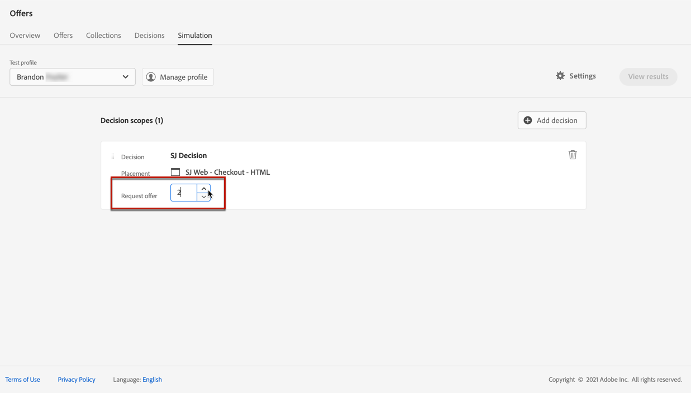
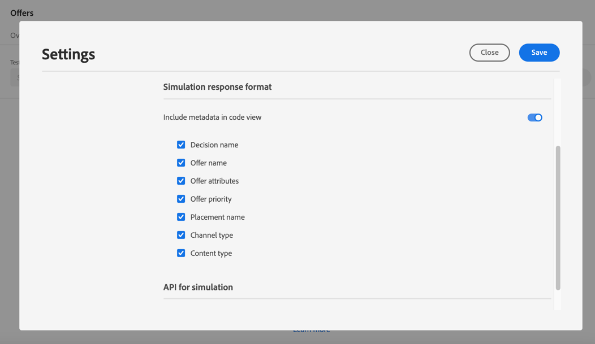

# 시뮬레이션 만들기 {#create-simulations}

>[!CONTEXTUALHELP]
>id="ajo_decisioning_simulation"
>title="오퍼 결정 시뮬레이션"
>abstract="시뮬레이션을 사용하면 지정된 배치에 대해 테스트 프로필에 어떤 오퍼를 제공할지 시뮬레이션할 수 있습니다. 이를 통해 대상 수신자에게 영향을 주지 않고 다양한 버전의 오퍼를 테스트 및 구체화할 수 있습니다."

## 시뮬레이션 기본 정보 {#about-simulation}

의사 결정 논리의 유효성을 검사하기 위해 주어진 배치에 대해 테스트 프로필에 게재할 오퍼를 시뮬레이션할 수 있습니다.

<!--Simulation allows you to view the results of offer decisions as a selected profile.-->

이를 통해 대상 수신자에게 영향을 주지 않고 다양한 버전의 오퍼를 테스트 및 구체화할 수 있습니다.

>[!NOTE]
>
>이 기능은 [!DNL Decisioning] API에 대한 단일 요청을 시뮬레이션합니다. [Decisioning API를 사용하여 오퍼 게재](../api-reference/offer-delivery-api/decisioning-api.md)에 대해 자세히 알아보세요.

이 기능에 액세스하려면 **[!UICONTROL 의사 결정 관리]** > **[!UICONTROL 오퍼]** 메뉴에서 **[!UICONTROL 시뮬레이션]** 탭을 선택하십시오.

>[!NOTE]
>
>시뮬레이션에서 결정 이벤트가 생성되지 않으므로 [capping](../offer-library/creating-personalized-offers.md#capping) 수는 영향을 받지 않습니다.

<!--
➡️ [Discover this feature in video](#video)
-->

## 테스트 프로필 선택 {#select-test-profiles}

>[!CONTEXTUALHELP]
>id="ajo_decisioning_simulation_test_profile"
>title="테스트 프로필 추가"
>abstract="ID 네임스페이스 및 해당 ID 값을 선택하여 테스트 프로필을 추가할 수 있습니다. 시뮬레이션에 사용할 수 있는 테스트 프로필이 제공되어야 합니다."

먼저 시뮬레이션에 사용할 테스트 프로필을 선택해야 합니다.

>[!CAUTION]
>
>게재할 오퍼를 시뮬레이션할 수 있는 테스트 프로필이 있어야 합니다. [테스트 프로필을 만드는](../../audience/creating-test-profiles.md) 방법을 알아봅니다.

1. **[!UICONTROL 프로필 관리]**&#x200B;를 클릭합니다.

   

1. 테스트 프로필을 식별하는 데 사용할 ID 네임스페이스를 선택합니다. 이 예제에서는 **Email** 네임스페이스를 사용합니다.

   >[!NOTE]
   >
   >ID 네임스페이스는 이메일 주소 또는 CRM ID와 같은 식별자의 컨텍스트를 정의합니다. 이 섹션[&#128279;](../../audience/get-started-identity.md){target="_blank"}에서 Adobe Experience Platform ID 네임스페이스 에 대해 자세히 알아보세요.

1. ID 값을 입력하고 **[!UICONTROL 보기]**&#x200B;를 클릭하여 사용 가능한 프로필을 나열합니다.

   

1. 다른 프로필 데이터를 테스트하려면 다른 프로필을 추가하고 선택 내용을 저장합니다.

   

1. 추가되면 모든 프로필이 **[!UICONTROL 테스트 프로필]** 아래의 드롭다운 목록에 나열됩니다. 저장된 테스트 프로필 간에 전환하여 선택한 각 프로필에 대한 결과를 표시할 수 있습니다.

   

   >[!NOTE]
   >
   >선택한 프로필은 **[!UICONTROL 프로필 관리]**&#x200B;를 사용하여 제거될 때까지 세션마다 **[!UICONTROL 시뮬레이션]** 탭에 테스트 프로필로 나열됩니다.

1. **[!UICONTROL 프로필 세부 정보]** 링크를 클릭하여 선택한 프로필 데이터를 표시할 수 있습니다.

## 결정 범위 추가 {#add-decision-scopes}

이제 테스트 프로필에서 시뮬레이션할 오퍼 결정을 선택합니다.

1. **[!UICONTROL 결정 범위 추가]**&#x200B;를 선택합니다.

   

1. 목록에서 배치를 선택합니다.

   

1. 사용 가능한 결정이 표시됩니다.

   * 검색 필드를 사용하여 선택 영역을 구체화할 수 있습니다.
   * **[!UICONTROL 오퍼 결정 열기]** 링크를 클릭하여 만든 모든 결정의 목록을 열 수 있습니다. [결정](create-offer-activities.md)에 대해 자세히 알아보세요.

   선택한 결정을 선택하고 **[!UICONTROL 추가]**&#x200B;를 클릭합니다.

   

1. 방금 정의한 결정 범위가 기본 작업 공간에 표시됩니다.

   요청할 오퍼의 수를 조정할 수 있습니다. 예를 들어 2를 선택하면 이 결정 범위에 대해 최상의 2 오퍼가 표시됩니다.

   

   >[!NOTE]
   >
   >최대 30개의 오퍼를 요청할 수 있습니다.

1. 위의 단계를 반복하여 필요한 만큼 결정을 추가합니다.

   

   >[!NOTE]
   >
   >여러 결정 범위를 정의하더라도 하나의 API 요청만 시뮬레이션됩니다.

## 시뮬레이션 설정 정의 {#define-simulation-settings}

시뮬레이션에 대한 기본 설정을 편집하려면 아래 단계를 따르십시오.

1. **[!UICONTROL 설정]**&#x200B;을 클릭합니다.

   

1. **[!UICONTROL 중복 제거]** 섹션에서 결정 및/또는 배치에 중복 오퍼를 허용하도록 선택할 수 있습니다. 즉, 여러 개의 결정/배치에 동일한 오퍼가 할당될 수 있습니다.

   

   >[!NOTE]
   >
   >기본적으로 모든 중복 제거 플래그는 시뮬레이션에 대해 활성화되어 있습니다. 즉, 의사 결정 엔진이 중복을 허용하므로 여러 의사 결정/배치에서 동일한 제안을 할 수 있습니다. [이 섹션](../api-reference/offer-delivery-api/decisioning-api.md)에서 [!DNL Decisioning] API 요청 속성에 대해 자세히 알아보세요.

1. **[!UICONTROL 응답 형식]** 섹션에서 코드 보기에 메타데이터를 포함하도록 선택할 수 있습니다. 해당 옵션을 선택하고 선택한 메타데이터를 선택합니다. **[!UICONTROL 코드 보기]**&#x200B;를 선택하면 요청 및 응답 페이로드에 표시됩니다. 자세한 내용은 [시뮬레이션 결과 보기](#simulation-results) 섹션을 참조하세요.

   

   >[!NOTE]
   >
   >옵션을 켜면 기본적으로 모든 항목이 선택됩니다.

1. **[!UICONTROL 저장]**&#x200B;을 클릭합니다.

>[!NOTE]
>
>현재 시뮬레이션 데이터에는 **[!UICONTROL Hub]** API만 사용할 수 있습니다.

<!--
In the **[!UICONTROL API for simulation]** section, select the API you want to use: **[!UICONTROL Hub]** or **[!UICONTROL Edge]**.
Hub and Edge are two different end points for simulation data.

In the **[!UICONTROL Context data]** section, you can add as many elements as needed.

    >[!NOTE]
    >
    >This section is hidden if you select Edge API in the section above. Hub allows the use of Context data, Edge does not.

Context data allows the user to add contextual data that could affect the simulation score.
For instance, let's say the customer has an offer for a discount on ice cream. In the rules for that offer, it can have logic that would rank it higher when the temperature is above 80 degrees. In simulation, the user could add context data: temperature=65 and that offer would rank lower, of they could add temperature=95 and that would rank higher.
-->

## 시뮬레이션 결과 보기 {#simulation-results}

의사 결정 범위를 추가하고 테스트 프로필을 선택하면 결과를 볼 수 있습니다.

1. **[!UICONTROL 결과 보기]**&#x200B;를 클릭합니다.

   

1. 각 결정에 대해 선택한 프로필에 따라 사용 가능한 최상의 오퍼가 표시됩니다.

   오퍼를 선택하여 세부 정보를 표시합니다.

   

1. **[!UICONTROL 코드 보기]**&#x200B;를 클릭하여 요청 및 응답 페이로드를 표시합니다. [자세히 알아보기](#view-code)

1. 다른 테스트 프로필에 대한 오퍼 결정 결과를 표시하려면 목록에서 다른 프로필을 선택합니다.

1. 필요한 횟수만큼 결정 범위를 추가, 제거 또는 업데이트할 수 있습니다.

>[!NOTE]
>
>프로필을 변경하거나 결정 범위를 업데이트할 때마다 **[!UICONTROL 결과 보기]** 단추를 사용하여 결과를 새로 고쳐야 합니다.

## 코드 보기 {#view-code}

1. **[!UICONTROL 코드 보기]** 단추를 사용하여 요청 및 응답 페이로드를 표시합니다.

   

   코드 보기에는 현재 사용자의 개발자 정보가 표시됩니다. 기본적으로 **[!UICONTROL 응답 페이로드]**&#x200B;가 표시됩니다.

   

1. 두 탭 사이를 이동하려면 **[!UICONTROL 응답 페이로드]** 또는 **[!UICONTROL 요청 페이로드]**&#x200B;를 클릭하십시오.

   

1. [!DNL Journey Optimizer] 외부의 요청 페이로드를 사용하려면(예: 문제 해결 목적으로 코드 보기 위에 있는 **[!UICONTROL 클립보드에 복사]** 단추를 사용하여 복사하십시오).

   

   <!--You cannot copy the response payload. ACTUALLY YES YOU CAN > to confirm with PM/dev? -->

   >[!NOTE]
   >
   >요청 또는 응답 페이로드를 자체 코드에 복사할 때에는 {USER_TOKEN} 및 {API_KEY}을(를) 올바른 값으로 바꾸십시오. [Adobe Experience Platform API](https://experienceleague.adobe.com/docs/experience-platform/landing/platform-apis/api-authentication.html?lang=ko){target="_blank"} 설명서에서 이러한 값을 검색하는 방법을 알아봅니다.

