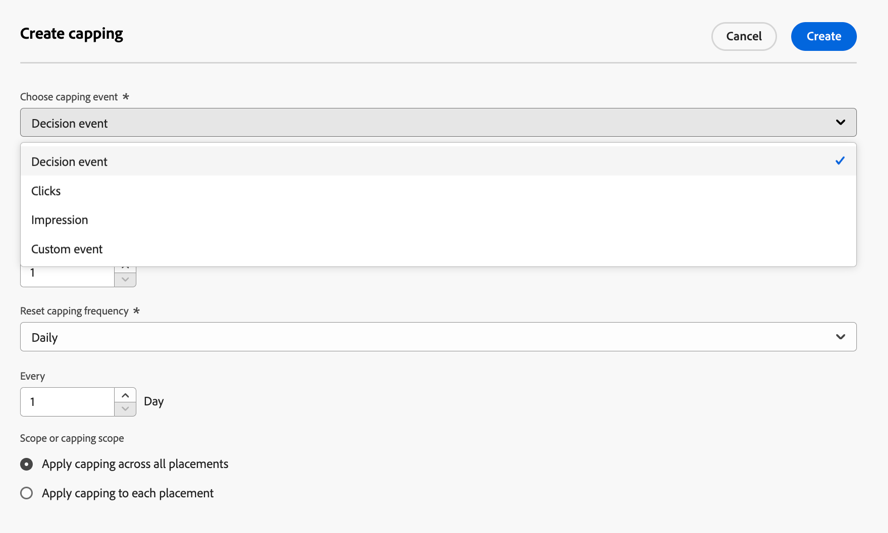
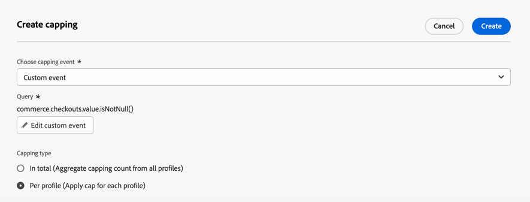

# 오퍼에 제한 추가 {#add-constraints}

>[!CONTEXTUALHELP]
>id="od_offer_constraints"
>title="오퍼 제한 정보"
>abstract="제한 조건을 사용하면 다른 오퍼와 비교하여 오퍼의 우선 순위를 지정하고 사용자에게 표시하는 방법을 지정할 수 있습니다."

>[!CONTEXTUALHELP]
>id="ajo_decisioning_constraints"
>title="오퍼 제한 정보"
>abstract="제한 조건을 사용하면 다른 오퍼와 비교하여 오퍼의 우선 순위를 지정하고 사용자에게 표시하는 방법을 지정할 수 있습니다."

>[!CONTEXTUALHELP]
>id="od_offer_priority"
>title="오퍼 우선 순위 정보"
>abstract="이 필드에서 오퍼에 대한 우선 순위 설정을 지정할 수 있습니다. 우선 순위는 적격성, 날짜 및 상한 설정과 같은 모든 제한 조건을 충족하는 오퍼 순위를 매기는 데 사용되는 숫자입니다."

>[!CONTEXTUALHELP]
>id="ajo_decisioning_priority"
>title="우선 순위 설정"
>abstract="사용자는 우선 순위를 통해 둘 이상의 오퍼에 대한 자격이 있는 경우 다른 오퍼와 비교하여 오퍼의 우선 순위를 정의할 수 있습니다. 오퍼의 우선 순위가 높을수록 다른 오퍼와 비교할 때 우선 순위가 높아집니다."

제약 조건을 사용하면 오퍼가 표시될 조건을 정의할 수 있습니다.

1. 구성 **[!UICONTROL 오퍼 자격 요건]**. [자세히 알아보기](#eligibility)

   

1. 다음을 정의합니다. **[!UICONTROL 우선 순위]** 사용자가 둘 이상의 오퍼에 적격인 경우, 다른 오퍼와 비교하여 오퍼. 오퍼의 우선 순위가 높을수록 다른 오퍼와 비교할 때 우선 순위가 높아집니다.

   

   >[!NOTE]
   >
   >오퍼 우선 순위는 정수 값(소수점 없음)이어야 합니다.

1. 오퍼의 **[!UICONTROL 캡핑]**: 오퍼가 표시되는 횟수를 의미합니다. [자세히 알아보기](#capping)

   

1. 클릭 **[!UICONTROL 다음]** 을 눌러 정의한 모든 구속을 확인합니다.

예를 들어 다음 제한을 설정하는 경우:

* 이 오퍼는 &quot;Gold Loyalty Customers&quot; 결정 규칙과 일치하는 사용자에게만 고려됩니다.
* 오퍼의 우선 순위는 &quot;50&quot;으로 설정되어 있습니다. 즉, 우선 순위가 1과 49 사이인 오퍼 앞에, 우선 순위가 최소 51인 오퍼 뒤에 오퍼가 표시됩니다.
* 이 오퍼는 모든 배치에서 사용자당 한 달에 한 번만 제공됩니다.

## 적격성 {#eligibility}

>[!CONTEXTUALHELP]
>id="ajo_decisioning_eligibility"
>title="적격성 정의"
>abstract="기본적으로 모든 프로필에 오퍼가 표시될 수 있지만, 대상자 또는 결정 규칙을 사용하여 오퍼를 특정 프로필로 제한할 수 있습니다."

>[!CONTEXTUALHELP]
>id="od_offer_eligibility"
>title="오퍼 적격성 정보"
>abstract="이 섹션에서는 결정 규칙을 사용하여 오퍼에 적합한 사용자를 결정할 수 있습니다."
>additional-url="https://video.tv.adobe.com/v/329373" text="데모 비디오 보기"

>[!CONTEXTUALHELP]
>id="ajo_decisioning_total_profile_estimate"
>title="총 프로필 예상"
>abstract="대상자 또는 결정 규칙을 선택하면 예상 적격 프로필에 대한 정보를 볼 수 있습니다."

다음 **[!UICONTROL 오퍼 자격 요건]** 섹션에서는 대상자 또는 의사 결정 규칙을 사용하여 정의하는 특정 프로필로 오퍼를 제한할 수 있습니다.

>[!NOTE]
>
>사용에 대해 자세히 알아보기 **대상** 및 **의사 결정 규칙** 위치: [이 섹션](#segments-vs-decision-rules).

* 기본적으로 **[!UICONTROL 모든 방문자]** 옵션이 선택되어 있으므로 모든 프로필에서 오퍼를 제공할 수 있습니다.

  

* 하나 또는 여러 명의 멤버로 오퍼 표시를 제한할 수도 있습니다 [Adobe Experience Platform 대상](../../audience/about-audiences.md).

  이렇게 하려면 를 활성화합니다. **[!UICONTROL 하나 또는 여러 대상에 속하는 방문자]** 옵션을 선택한 다음 왼쪽 창에서 하나 또는 여러 대상자를 추가하고 **[!UICONTROL 및]** / **[!UICONTROL 또는]** 논리 연산자.

  

* 특정 [결정 규칙](../offer-library/creating-decision-rules.md) 오퍼에 대해 다음을 선택합니다. **[!UICONTROL 정의된 결정 규칙별]**&#x200B;을 클릭한 다음 왼쪽 창에서 원하는 규칙을 **[!UICONTROL 결정 규칙]** 영역입니다.

  

  >[!CAUTION]
  >
  >이벤트 기반 오퍼는에서 현재 지원되지 않습니다. [!DNL Journey Optimizer]. 다음을 기반으로 의사 결정 규칙을 만드는 경우 [이벤트](https://experienceleague.adobe.com/docs/experience-platform/segmentation/ui/segment-builder.html#events){target="_blank"}, 오퍼에서 이를 활용할 수 없습니다.

대상자 또는 의사 결정 규칙을 선택하면 예상 적격 프로필에 대한 정보를 볼 수 있습니다. 클릭 **[!UICONTROL 새로 고침]** 을 클릭하여 데이터를 업데이트합니다.

>[!NOTE]
>
>규칙 매개 변수에 컨텍스트 데이터와 같이 프로필에 없는 데이터가 포함되어 있으면 프로필 추정치를 사용할 수 없습니다. 예를 들어 현재 날씨가 ≥80도여야 하는 자격 규칙이 있습니다.

### 대상과 의사 결정 규칙 사용 {#segments-vs-decision-rules}

제한을 적용하려면 하나 또는 여러 개의 멤버로 오퍼 선택을 제한할 수 있습니다 **Adobe Experience Platform 대상**&#x200B;또는 다음을 사용할 수 있습니다 **결정 규칙**, 두 솔루션은 서로 다른 사용법에 해당합니다.

기본적으로 대상자의 출력은 프로필 목록이지만 의사 결정 규칙은 의사 결정 프로세스 동안 단일 프로필에 대해 온디맨드로 실행되는 함수입니다. 두 사용법의 차이는 아래에 자세히 설명되어 있습니다.

* **대상자**

  한편으로는 대상자는 프로필 속성 및 경험 이벤트를 기반으로 특정 논리와 일치하는 Adobe Experience Platform 프로필 그룹입니다. 그러나 오퍼 관리에서는 대상을 다시 계산하지 않습니다. 오퍼를 표시할 때 최신이 아닐 수 있습니다.

  에서 대상자에 대해 자세히 알아보기 [이 섹션](../../audience/about-audiences.md).

* **의사 결정 규칙**

  반면, 의사 결정 규칙은 Adobe Experience Platform에서 사용 가능한 데이터를 기반으로 하며 오퍼를 표시할 수 있는 사용자를 결정합니다. 오퍼 또는 주어진 배치에 대한 의사 결정에서 선택되면 의사 결정이 내려질 때마다 규칙이 실행되어 각 프로필이 최신 오퍼와 최상의 오퍼를 얻도록 합니다.

  에서 의사 결정 규칙에 대해 자세히 알아보기 [이 섹션](creating-decision-rules.md).

## 상한 설정 {#capping}

>[!CONTEXTUALHELP]
>id="od_offer_globalcap"
>title="오퍼 상한 설정 정보"
>abstract="이 필드에서 오퍼를 제시할 수 있는 횟수를 지정할 수 있습니다."

>[!CONTEXTUALHELP]
>id="ajo_decisioning_capping"
>title="상한 설정 사용"
>abstract="고객에게 과도하게 요청하지 않으려면 상한 설정을 사용하여 오퍼를 제시할 수 있는 최대 횟수를 정의합니다. 특정 오퍼에 대해 최대 10개의 상한 규칙을 만들 수 있습니다."
>additional-url="https://experienceleague.adobe.com/docs/journey-optimizer/using/decisioning/offer-decisioning/managing-offers-in-the-offer-library/configure-offers/add-constraints.html#capping-change-date" text="날짜 변경은 상한 설정에 영향을 미칠 수 있음"

한도는 오퍼를 표시할 수 있는 최대 횟수를 정의하는 제약 조건으로 사용됩니다. 사용자가 특정 오퍼를 받는 횟수를 제한하면 고객에게 과다 청탁을 하지 않고 최상의 오퍼로 각 접점을 최적화할 수 있습니다.

주어진 오퍼에 대해 최대 10개의 최대 가용량 규칙을 추가할 수 있습니다. 최대 가용량 규칙을 설정하려면 **[!UICONTROL 캡핑 만들기]** 버튼을 누른 후 아래 단계를 수행합니다.

>[!CAUTION]
>
>이전에 만든 오퍼에 대해 빈도 제한을 활성화하거나 비활성화할 수 없습니다. 이렇게 하려면 새 오퍼를 만들어야 합니다.

1. 정의 **[!UICONTROL 최대 이벤트]** 계산기를 늘리기 위해 고려될 것입니다. [자세히 알아보기](#capping-event)

1. 캡핑을 모든 사용자에게 적용할지 또는 하나의 프로필에만 적용할지 선택합니다. [자세히 알아보기](#capping-type)

1. 오퍼를 표시할 수 있는 횟수를 설정합니다. [자세히 알아보기](#capping-count)

1. 설정 **[!UICONTROL 빈도]** 최대 가용량 수가 재설정되는 빈도를 정의합니다. [자세히 알아보기](#frequency-capping)

1. 여러 을 정의한 경우 [표시](add-representations.md) 오퍼에 최대 가용량 적용 여부를 지정합니다 **모든 배치에서** 또는 **각 배치로**. [자세히 알아보기](#placements)

1. 저장 및 승인되면, 정의한 기준 및 일정에 따라 이 필드에 지정한 횟수로 오퍼가 제공된 경우 해당 게재가 중지됩니다.

오퍼를 제안하는 횟수는 이메일 준비 시 계산됩니다. 예를 들어, 많은 수의 오퍼가 포함된 이메일을 준비하는 경우 해당 숫자는 이메일 전송 여부와 관계없이 최대 상한에 포함됩니다.

<!--If an email delivery is deleted or if the preparation is done again before being sent, the capping value for the offer is automatically updated.-->

>[!NOTE]
>
>최대 가용량 카운터는 오퍼가 만료되거나 오퍼 시작 날짜 후 2년 중 먼저 도래하는 날짜에 재설정됩니다. 에서 오퍼의 날짜를 정의하는 방법 알아보기 [이 섹션](creating-personalized-offers.md#create-offer).

### 상한 설정 이벤트 {#capping-event}

>[!CONTEXTUALHELP]
>id="ajo_decisioning_frequency_capping_impression"
>title="노출 횟수"
>abstract="상한 설정 이벤트로 노출 횟수를 사용하는 것은 인바운드 채널에서만 사용할 수 있습니다."

다음 **[!UICONTROL 최대 가용량 이벤트 선택]** 필드를 사용하면 카운터를 증가시키기 위해 고려할 이벤트를 정의할 수 있습니다.

* **[!UICONTROL 결정 이벤트]** (기본값): 오퍼를 표시할 수 있는 최대 횟수입니다.
* **[!UICONTROL 클릭수]**: 사용자가 오퍼를 클릭할 수 있는 최대 횟수입니다.
* **[!UICONTROL 노출 횟수]**: 사용자에게 오퍼를 표시할 수 있는 최대 횟수입니다.

  >[!NOTE]
  >
  >노출을 최대 가용량 이벤트로 사용하기는에서 사용할 수 있습니다. **인바운드 채널** 만 해당.

* **[!UICONTROL 사용자 지정 이벤트]**: 전송된 오퍼 수를 제한하는 데 사용할 사용자 지정 이벤트를 정의할 수 있습니다. 예를 들어 환매가 10000 때까지 또는 주어진 프로필이 1회 환매될 때까지 환매 수를 제한할 수 있습니다. 이렇게 하려면 다음을 사용합니다. [Adobe Experience Platform Xdm](https://experienceleague.adobe.com/docs/experience-platform/xdm/home.html?lang=ko-KR){target="_blank"} 사용자 지정 이벤트 규칙을 작성할 스키마.

  <!--For example, you can cap on the number of redemptions so that the offer can be shown until redemptions equal 10000. You can only select XDM ExperienceEvents. -->

  아래 예제에서는 체크아웃 수를 제한하려고 합니다.

   1. 선택 **[!UICONTROL 사용자 지정 이벤트]** 목록에서 을(를) 만들고 **[!UICONTROL 사용자 지정 이벤트 추가]** 단추를 클릭합니다.

   1. 사용 **[!UICONTROL 사용자 지정 이벤트 규칙 만들기]** 빌더에서 관련 이벤트를 선택합니다. 오퍼를 제한할 사용자 작업을 선택할 수 있습니다.

      여기에서 선택 **[!UICONTROL 상거래]** > **[!UICONTROL 체크아웃]** > **[!UICONTROL 값]** 및 선택 **[!UICONTROL 존재함]** 을 클릭합니다.

      

   1. 규칙이 만들어지면에서 표시됩니다. **[!UICONTROL 사용자 지정 이벤트 쿼리]** 필드.

      

>[!CAUTION]
>
>의사 결정 이벤트를 제외한 모든 최대 가용량 이벤트에 대해 의사 결정 관리 피드백이 자동으로 수집되지 않을 수 있으므로 최대 가용량 카운터가 올바르게 증가하지 않을 수 있습니다. [자세히 알아보기](../data-collection/data-collection.md)
>
>각 최대 가용량 이벤트가 최대 가용량 카운터에서 추적 및 처리되도록 하려면 경험 이벤트를 수집하는 데 사용되는 스키마에 해당 이벤트에 대한 올바른 필드 그룹이 포함되어 있는지 확인하십시오. [자세히 알아보기](../data-collection/schema-requirement.md)

### 캡핑 유형 {#capping-type}

캡핑을 모든 사용자 간에 적용할지 또는 하나의 특정 프로필에 적용할지를 지정할 수 있습니다.

* 선택 **[!UICONTROL 합계]** 결합된 타겟 대상자, 즉 모든 사용자에게 오퍼를 제안할 수 있는 횟수를 정의할 수 있습니다.

  예를 들어 &#39;TV 초보자용 거래&#39;를 하는 전자 제품 소매업자인 경우 모든 프로필에서 오퍼가 200배만 반환되기를 원할 수 있습니다.

* 선택 **[!UICONTROL 프로필별]** 동일한 사용자에게 오퍼를 제안할 수 있는 횟수를 정의합니다.

  예를 들어 &#39;플래티넘 신용카드&#39; 오퍼가 있는 은행인 경우 이 오퍼가 프로필당 5회 이상 표시되지 않도록 할 수 있습니다. 실제로, 사용자가 오퍼를 5번 보고 실행하지 않은 경우 다음 최상의 오퍼에 대해 조치를 취할 수 있는 기회가 더 높다고 판단합니다.

### 캡핑 수 {#capping-count}

다음 **[!UICONTROL 최대 개수 제한]** 필드를 사용하면 오퍼를 표시할 수 있는 횟수를 지정할 수 있습니다.

>[!NOTE]
>
>숫자는 0보다 큰 정수여야 합니다.

예를 들어, 체크아웃 수를 고려하는 사용자 정의 캡핑 이벤트를 정의했습니다. 에 10을 입력하면 **[!UICONTROL 최대 개수 제한]** 필드에서는 10회 체크아웃 후에는 더 이상 오퍼가 전송되지 않습니다.

### 빈도 설정 {#frequency-capping}

>[!CONTEXTUALHELP]
>id="ajo_decisioning_frequency_capping"
>title="상한 빈도 설정"
>abstract="오퍼 상한 설정 카운터를 매일, 매주 또는 매월 재설정하도록 선택할 수 있습니다. 빈도 설정이 활성화된 오퍼를 게시한 후에는 이미 정의된 빈도를 변경할 수 없다는 점을 참고하십시오."

다음 **[!UICONTROL 캡핑 빈도 재설정]** 필드에서는 최대 가용량 수가 재설정되는 빈도를 정의할 수 있습니다. 이렇게 하려면 계산 기간(일별, 주별 또는 월별)을 정의하고 선택한 일/주/개월을 입력합니다. 예를 들어, 2주마다 최대 가용량 수를 재설정하려면 을 선택합니다. **[!UICONTROL 매주]** 해당 드롭다운 목록 및 유형에서 **2** 다른 필드에서.

>[!NOTE]
>
>빈도 제한 카운터 재설정은 다음 위치에서 수행됩니다. **오전 12시 UTC**&#x200B;를 정의하거나 해당하는 경우 주/월의 첫 번째 날에. 주 시작일은 **일요일**. 선택하는 기간은 **2년** (즉, 해당 개월, 주 또는 일 수)
>
>오퍼를 게시한 후에는 빈도에 대해 선택한 기간(월별, 주별 또는 일별)을 변경할 수 없습니다. 오퍼에 다음 항목이 있는 경우 빈도 상한을 편집할 수 있습니다. **[!UICONTROL 초안]** 상태 및 은(는) 빈도 조절 기능이 활성화된 전에 게시된 적이 없습니다.

+++ **반드시 알아야 할 사항: 빈도 설정 및 Edge Decisioning API**

빈도 제한 카운터는 3초 이내에 Edge Decisioning API 의사 결정에서 업데이트되고 사용할 수 있습니다.

각각의 허브 영역은 하나 이상의 에지 영역들과 연관된다. 빈도 제한 규칙이 생성되고 각 허브 영역에서 연관된 에지 영역으로 내보내집니다. Edge Decisioning API를 사용하여 결정이 내려질 때마다 시스템은 동일한 에지 영역에서 사용할 수 있는 규칙을 적용합니다.

* 일치하는 규칙이 있으면 프로필의 빈도 제한 카운터가 증가합니다.
* 그렇지 않으면 프로필에 대해 카운터가 만들어지지 않고 빈도 제한 규칙이 적용되지 않습니다. 따라서 최대 가용량 임계값이 초과되더라도 프로필은 개인화된 오퍼를 계속 수신하게 됩니다.

예를 들어 조직의 허브 지역을 로 간주해 보겠습니다. *NLD2*, 그리고 유럽에서 의사 결정 요청을 보내고 있습니다. (*IRL1* 가장자리 영역). 이 시나리오에서는 (아일랜드)에서 규칙을 사용할 수 있으므로 의사 결정 요청은 프로필의 카운터를 증가시킵니다 *IRL1* 지역. 단, 결정 요청이 일본 등의 지역에서 발생한 경우(*JPN3*), (네덜란드)에 연결된 에지 영역이 아닌 *NLD2* 허브 영역, 카운터가 생성되지 않으며 빈도 제한 규칙이 적용되지 않습니다.

귀사와 관련된 허브 및 에지 영역에 대한 자세한 내용은 Adobe 담당자에게 문의하십시오.

+++

### 캡핑 및 배치 {#placements}

여러 을 정의한 경우 [표시](add-representations.md) 오퍼에 대해 모든 배치에 캡핑을 적용할지 아니면 각 배치에 캡핑을 적용할지 지정합니다.

* **[!UICONTROL 모든 배치에 한도 적용]**: 최대 가용량 수는 오퍼와 연결된 배치 전체의 모든 의사 결정을 합계합니다.

  예를 들어 오퍼에 **이메일** 배치 및 **웹** 배치, 그리고 다음 위치에 캡핑 설정 **모든 배치에서 프로필당 2개**&#x200B;를 선택한 경우 각 프로필은 배치 혼합에 관계없이 총 2회까지 오퍼를 받을 수 있습니다.

* **[!UICONTROL 각 배치에 한도 적용]**: 최대 가용량 수는 각 배치에 대한 결정 수를 별도로 적용합니다.

  예를 들어 오퍼에 **이메일** 배치 및 **웹** 배치, 그리고 다음 위치에 캡핑 설정 **각 배치에 대해 프로필당 2개**&#x200B;를 설치한 후 각 프로필은 이메일 배치에 대해 최대 2회 오퍼를 수신하고 웹 배치에 대해 추가로 2회 오퍼를 수신할 수 있습니다.

### 날짜 변경이 상한 설정에 미치는 영향 {#capping-change-date}

>[!CONTEXTUALHELP]
>id="ajo_decisioning_offer_change_date"
>title="날짜 변경은 상한 설정에 영향을 미칠 수 있음"
>abstract="이 오퍼에 상한 설정이 적용되면 시작 날짜 또는 종료 날짜를 변경할 때 영향을 받을 수 있습니다."

다음 조건이 충족되는 경우 캡핑에 영향을 줄 수 있으므로 오퍼 날짜를 변경할 때 주의하여 진행해야 합니다.

* 이 오퍼는 [승인됨](#review).
* [캡핑](#capping) 이(가) 오퍼에 이미 적용되어 있습니다.
* 캡핑은 프로필별로 정의됩니다.

>[!NOTE]
>
>에서 오퍼의 날짜를 정의하는 방법 알아보기 [이 섹션](creating-personalized-offers.md#create-offer).

프로필당 캡핑 수는 각 프로필의 캡핑 수를 저장합니다. 승인된 오퍼의 시작 및 종료 날짜를 변경할 때 일부 프로필의 최대 가용량 수는 아래에 설명된 다른 시나리오에 따라 영향을 받을 수 있습니다.

다음은 다음과 같은 경우에 가능한 시나리오입니다. **오퍼 시작 일자 변경**:

| 시나리오: 만약... | 결과: 그런 다음... | 최대 가용량 수에 미칠 수 있는 영향 |
|--- |--- |--- |
| ... 오퍼 시작 날짜가 원래 오퍼 시작 날짜가 시작되기 전에 업데이트됩니다. | ...최대 가용량 수는 새 시작 날짜에 시작됩니다. | 아니요 |
| ...새 시작 일자가 현재 종료 일자 이전인 경우 | ... 캡핑은 새 시작 날짜로 유지되며 각 프로필의 이전 캡핑 횟수는 앞으로 진행됩니다. | 아니요 |
| ...새 시작 일자는 현재 종료 일자 이후입니다. | ... 현재 캡핑이 만료되고 새 시작 날짜의 모든 프로필에 대해 새 캡핑 횟수가 0부터 다시 시작됩니다. | 예 |

다음은 다음과 같은 경우에 가능한 시나리오입니다. **오퍼 종료 날짜 확장**:

| 시나리오: 만약... | 결과: 그런 다음... | 최대 가용량 수에 미칠 수 있는 영향 |
|--- |--- |--- |
| ... decisioning 요청은 원래 오퍼 종료일 이전에 발생하며, | ... 최대 가용량 카운트가 업데이트되고 각 프로필의 이전 최대 가용량 카운트가 전달됩니다. | 아니요 |
| ... 원래 종료 날짜 이전에 의사 결정 요청이 발생하지 않음, | ... 최대 가용량 수는 각 프로필의 원래 종료 날짜에 재설정됩니다. 그러면 원래 종료 날짜 이후에 발생하는 모든 새 의사 결정 요청에 대해 새 최대 가용량 수가 0부터 다시 시작됩니다. | 예 |

**예**

원래 시작 일자가 로 설정된 오퍼가 있다고 가정합니다. **1년 1월**, 만료 날짜 **31년 1월**.

1. 프로필 X, Y 및 Z에 오퍼가 표시됩니다.
1. 날짜 **10년 1월**, 오퍼의 종료 일자가 (으)로 변경됩니다. **15년 2월**.
1. **1월 11일부터 1월 31일까지**, 프로필 Z만 오퍼가 표시됩니다.

   * 왜냐하면 결정 요청이 원래 종료 날짜 이전에 발생했기 때문입니다. **프로필 Z용**, 오퍼의 종료 일자를 다음으로 연장할 수 있습니다. **15년 2월**.
   * 그러나 에 대한 원래 종료 일자 이전에는 활동이 발생하지 않았습니다. **프로필 X 및 Y**, 카운터가 만료되고 최대 가용량 수가 0으로 재설정됩니다. **31년 1월**.

