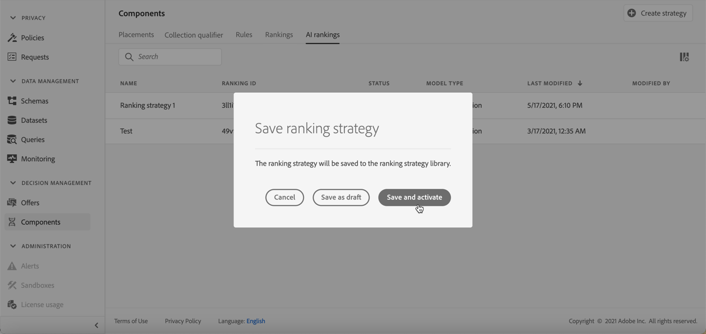
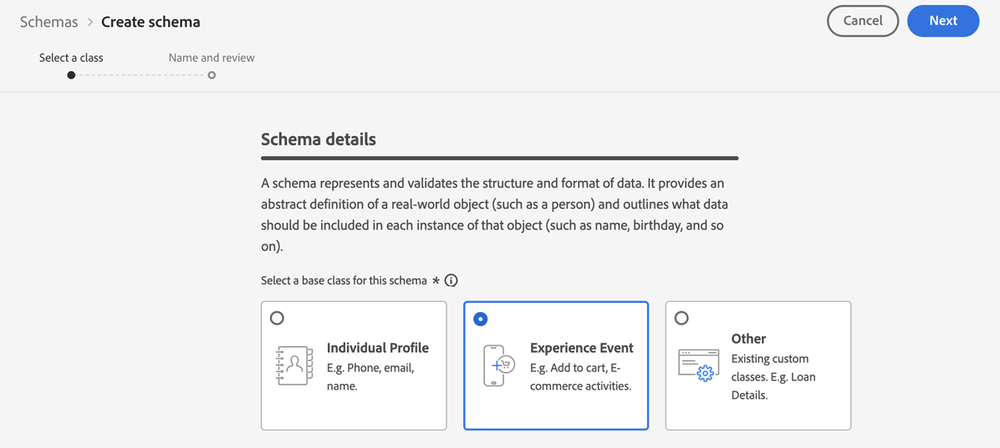

# AI 등급 {#ai-rankings}

## AI 등급 시작 {#get-started-with-ai-rankings}

<!--If you are an [Adobe Experience Platform](https://experienceleague.adobe.com/docs/experience-platform/landing/home.html){target="_blank"} user leveraging the **Offer Decisioning** application service,-->You can use a trained model system that ranks offers to display for a given profile.

>[!CAUTION]
>
>현재 AI 등급을 사용하여 사용자를 선택하기만 하면 조기 액세스에서 사용할 수 있습니다.

이 기능을 사용하면 다른 기능을 만들 수 있습니다 **순위 전략** 비즈니스 목표를 기반으로 구축 의사 결정(이전의 오퍼 활동)에 이러한 다양한 목표 기반 전략을 사용하여, 다양한 등급 전략이 목표에 미치는 영향을 이해하는 데 도움이 됩니다.

예를 들어 이메일 채널에 대한 등급 전략과 푸시 채널에 대한 등급 전략을 선택할 수 있습니다. 각 채널에 대해, 훈련된 모델 시스템은 여러 데이터 포인트를 활용하여 오퍼의 우선 순위 점수나 오퍼를 고려하지 않고 지정된 배치에 대해 먼저 제공해야 하는 오퍼를 결정합니다 [등급 공식](create-ranking-formulas.md).

<!--This feature is not enabled by default. To be able to use it, reach out to your Adobe contact.-->

등급 전략이 만들어지면 결정에서 배치에 할당합니다. 추가 정보 [결정에서 오퍼 선택 구성](../offer-activities/configure-offer-selection.md).

### 자동 최적화 모델 {#auto-optimization}

현재 [!DNL Journey Optimizer] AI 등급에 대해 지원되는 모델 유형은 **자동 최적화**.

자동 최적화 모델은 사용자가 설정한 주요 성과 지표(KPI)를 기반으로, 반품을 극대화하는 오퍼를 제공하는 것을 목표로 합니다. <!--These KPIs could be in the form of conversion rates, revenue, etc.-->이때 자동 최적화는 오퍼를 타겟으로 전환하여 오퍼 클릭 최적화에 중점을 둡니다.

>[!NOTE]
>
>자동 최적화 모델은 상황별 또는 사용자 프로필 데이터를 사용하지 않습니다. 오퍼의 전역 성능을 기반으로 결과를 최적화합니다.

자동 최적화를 통해 해결해야 할 과제는 탐구적 학습과 그 학습의 착취 간의 균형을 맞추는 것입니다. 이 원칙은 다음과 같습니다 **&quot;다중 무장 강도&quot; 접근**.

이 문제를 해결하기 위해 자동 최적화 모델은 **톰슨 샘플링** 예상 보상을 극대화하기 위한 옵션을 식별할 수 있는 방법입니다. 다시 말하면, 톰슨 샘플링은 다무장 산적 문제에 대한 탐구적 착취 딜레마를 해결하기 위한 일종의 강화 학습 기술이다.

또한 Thompson 샘플링 방법은 &quot;콜드 스타트&quot; 문제와 같은 문제를 처리할 수 있습니다. 즉, 새로운 오퍼가 캠페인에 도입되었을 때, 이 방법에서 교육할 수 있는 이력이 없습니다.

## 등급 전략 만들기 {#create-ranking-strategy}

등급 전략을 만들려면 아래 단계를 수행하십시오.

1. 액세스 권한 **[!UICONTROL Components]** 메뉴를 선택한 다음 **[!UICONTROL AI rankings]** 탭.

   

   지금까지 생성된 모든 순위 전략들이 나열됩니다.

1. **[!UICONTROL Create strategy]** 단추를 클릭합니다.

1. 다음 필드를 채웁니다.

   

   * **[!UICONTROL Name]**: 입력해야 하는 고유한 이름입니다.

   * **[!UICONTROL Model type]**: 현재 지원되는 모델 유형은 **[!UICONTROL Auto-optimization]**.<!--More will be supported in the future so the drop-down list will be enabled.-->

   * **[!UICONTROL Optimization metric]**:

      이 옵션을 통해 마케터는 시스템 학습 모델을 만들고 교육하는 방법을 선택할 수 있습니다. 표시된 오퍼, 이메일을 클릭한 오퍼 및/또는 웹에서 클릭한 오퍼를 기반으로 합니다.

      >[!NOTE]
      >
      >필요한 경우 모든 지표 유형을 선택할 수 있습니다.

      다음과 같은 두 가지 유형의 최적화 지표가 있습니다.
      * **[!UICONTROL Impression]**: 현재 노출 이벤트는 표시되는 모든 오퍼에 해당합니다.
      * **[!UICONTROL Conversion]**: 전환 이벤트는 이메일 또는 웹을 통해 클릭을 생성하는 모든 오퍼에 해당합니다.

      선택한 모든 노출 이벤트 및/또는 전환 이벤트는 제공된 Web SDK 또는 Mobile SDK를 사용하여 자동으로 캡처됩니다. 자세한 내용은 [Adobe Experience Platform Web SDK 개요](https://experienceleague.adobe.com/docs/experience-platform/edge/home.html?lang=en).

   * **[!UICONTROL Dataset ID]**: 전환의 경우 드롭다운 목록에서 이벤트를 선택하여 이벤트를 수집할 데이터 세트를 제공해야 합니다. 에서 이러한 데이터 세트를 만드는 방법을 알아봅니다 [이 섹션](#create-dataset). <!--This dataset needs to be associated with a schema that must have the **[!UICONTROL Proposition Interactions]** field group (previously known as mixin) associated with it.-->

   

   >[!CAUTION]
   >
   >스키마에서 생성된 데이터 세트만 과 연결됩니다 **[!UICONTROL Experience Event - Proposition Interactions]** 필드 그룹(이전에 mixin이라고 함)이 드롭다운 목록에 표시됩니다.

1. 등급 전략을 저장하고 활성화합니다.

   

이제 배치에 적합한 오퍼의 등급을 매기는 결정에 사용할 준비가 되었습니다. 추가 정보 [이 섹션](../offer-activities/configure-offer-selection.md#use-ranking-strategy).<!--TBC?-->

## 이벤트를 수집할 데이터 세트 만들기 {#create-dataset}

전환 이벤트를 수집할 데이터 세트를 만들어야 합니다. 먼저 데이터 세트에 사용할 스키마를 만듭니다.

1. 에서 **[!UICONTROL Data Management]** 메뉴, 선택 **[!UICONTROL Schema]**&#x200B;로 이동합니다. **[!UICONTROL Browse]** 탭을 클릭하고 **[!UICONTROL Create schema]**.

   

1. 선택 **[!UICONTROL XDM ExperienceEvent]**.

   

   >[!NOTE]
   >
   >    XDM 스키마 및 필드 그룹의 [XDM 시스템 개요 설명서](https://experienceleague.adobe.com/docs/experience-platform/xdm/home.html?lang=ko).


1. 에서 **[!UICONTROL Search]** 필드를 입력하고 &quot;제안 상호 작용&quot;을 입력하고 을 선택합니다 **[!UICONTROL Experience Event - Proposition Interactions]** 필드 그룹.

   

   >[!CAUTION]
   >
   >    데이터 집합에 사용할 스키마에는 **[!UICONTROL Experience Event - Proposition Interactions]** 연결된 필드 그룹입니다. 그렇지 않으면 순위 전략에서 사용할 수 없습니다.

1. **[!UICONTROL Add field groups]**&#x200B;을(를) 클릭합니다.

   

   >[!NOTE]
   >필드 그룹은 이전에 mixin이라고 불렀습니다.

1. 이름을 입력하고 스키마를 저장합니다.<!--How do you edit the fields in this new schema? Examples?-->

>[!NOTE]
>
>    스키마 빌드에 대한 자세한 내용 [스키마 작성 기본 사항](https://experienceleague.adobe.com/docs/experience-platform/xdm/schema/composition.html?lang=en#understanding-schemas).

이제 이 스키마를 사용하여 데이터 세트를 만들 준비가 되었습니다. 이렇게 하려면 아래 단계를 수행합니다:

1. 에서 **[!UICONTROL Data Management]** 메뉴, 선택 **[!UICONTROL Datasets]**&#x200B;로 이동합니다. **[!UICONTROL Browse]** 탭을 클릭하고 **[!UICONTROL Create dataset]**.

   

1. **[!UICONTROL Create dataset from schema]**&#x200B;를 선택합니다.

   

1. 목록에서 방금 만든 스키마를 선택합니다.

   

1. **[!UICONTROL Next]**&#x200B;을(를) 클릭합니다.

1. 에서 데이터 세트에 대한 고유한 이름을 제공합니다 **[!UICONTROL Name]** 필드를 입력하고 **[!UICONTROL Finish]**.

   

이제 데이터 세트를 선택하여 이벤트 데이터를 수집할 준비가 되었습니다. [등급 전략 생성](#create-ranking-strategy).

## 오퍼 스키마 요구 사항 {#schema-requirements}

이 시점에서 다음을 수행해야 합니다.

* 순위 전략,
* 캡처할 이벤트 유형, 즉 표시된 오퍼(노출) 및/또는 클릭한 오퍼(전환)를 정의합니다.
* 및 이벤트 데이터를 수집할 데이터 세트에 포함되어 있습니다.

이제 오퍼가 표시되고/또는 클릭할 때마다 해당 이벤트가 **[!UICONTROL Experience Event - Proposition Interactions]** 필드 그룹을 사용하여 [Adobe Experience Platform Web SDK](https://experienceleague.adobe.com/docs/experience-platform/edge/web-sdk-faq.html#what-is-adobe-experience-platform-web-sdk%3F){target=&quot;_blank&quot;} 또는 Mobile SDK입니다.

이벤트 유형(표시된 오퍼 또는 클릭한 오퍼)을 보낼 수 있으려면 Adobe Experience Platform으로 전송되는 경험 이벤트의 각 이벤트 유형에 대해 올바른 값을 설정해야 합니다. 다음은 JavaScript 코드에 구현해야 하는 스키마 요구 사항입니다.

### 표시된 오퍼 시나리오

**이벤트 유형:** `decisioning.propositionDisplay`
**소스:** Web.sdk/Alloy.js (`sendEvent command -> xdm : {eventType, interactionMixin}`) 또는 배치 수집
+++**샘플 페이로드:**

```
{
    "@id": "a7864a96-1eac-4934-ab44-54ad037b4f2b",
    "xdm:timestamp": "2020-09-26T15:52:25+00:00",
    "xdm:eventType": "decisioning.propositionDisplay",
    "https://ns.adobe.com/experience/decisioning/propositions":
    [
        {
            "xdm:items":
            [
                {
                    "xdm:id": "personalized-offer:f67bab756ed6ee4",
                },
                {
                    "xdm:id": "personalized-offer:f67bab756ed6ee5",
                }
            ],
            "xdm:id": "3cc33a7e-13ca-4b19-b25d-c816eff9a70a", //decision event id - taken from experience event for “nextBestOffer”
            "xdm:scope": "scope:12cfc3fa94281acb", //decision scope id - taken from experience event for “nextBestOffer”
        }
    ]
}
```

+++

### 클릭한 오퍼 시나리오

**이벤트 유형:** `decisioning.propositionInteract`
**소스:** Web.sdk/Alloy.js (`sendEvent command -> xdm : {eventType, interactionMixin}`) 또는 배치 수집
+++**샘플 페이로드:**

```
{
    "@id": "a7864a96-1eac-4934-ab44-54ad037b4f2b",
    "xdm:timestamp": "2020-09-26T15:52:25+00:00",
    "xdm:eventType": "decisioning.propositionInteract",
    "https://ns.adobe.com/experience/decisioning/propositions":
    [
        {
            "xdm:items":
            [
                {
                    "xdm:id": "personalized-offer:f67bab756ed6ee4"
                },
                {
                    "xdm:id": "personalized-offer:f67bab756ed6ee5"
                },
            ],
            "xdm:id": "3cc33a7e-13ca-4b19-b25d-c816eff9a70a", //decision event id
            "xdm:scope": "scope:12cfc3fa94281acb", //decision scope id
        }
    ]
}
```

+++

<!--
## Using a ranking strategy {#using-ranking}

To use the ranking strategy you created above, follow the steps below:

Once a ranking strategy has been created, you can assign it to a placement in a decision. For more on this, see [Configure offers selection in decisions](../offer-activities/configure-offer-selection.md).

1. Create a decision.
1. Add a placement.
1. Add a collection.
1. Choose to rank offers by AI ranking (select it from the drop-down list).
1. Click Add ranking.
1. Select the ranking strategy that you created. All the details of the ranking strategy are displayed.
1. Click Next to confirm.
1. Save your decision.

It is now ready to be used in a decision to rank eligible offers for a placement (see [Configure offers selection in decisions](../offer-activities/configure-offer-selection.md)).
-->

