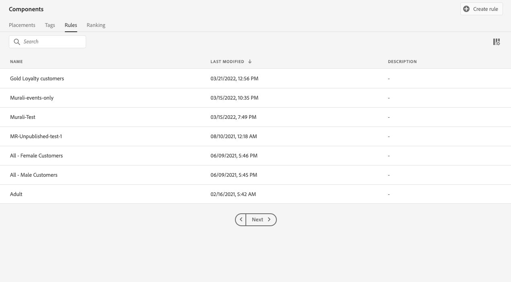

# 의사 결정 규칙 만들기 {#create-decision-rules}

## 의사 결정 규칙 기본 정보 {#about}

Adobe Experience Platform에서 사용할 수 있는 데이터를 기반으로 오퍼 의사 결정 규칙을 만들 수 있습니다. 의사 결정 규칙은 오퍼를 표시할 대상을 결정합니다.

예를 들어 (Gender = &#39;Female&#39;) 및 (Region = &#39;Northeast&#39;)일 때만 &#39;여성용 겨울 의류 상품&#39;을 표시하도록 지정할 수 있습니다. 

➡️ [비디오에서 이 기능 살펴보기](#video)

다음은 의사 결정 규칙 작업 시 알아야 할 제한 사항 목록입니다.

* 규칙을 생성할 때 이전 이벤트를 사용할 수 있지만 이러한 규칙을 사용할 수 있는 시기에 대한 제한 사항이 있습니다.
* Edge Decisioning은 이벤트를 저장하지 않는 Edge 프로필을 사용하므로 Edge Decisioning에 사용된 모든 규칙이 유효하지 않습니다.
* 오퍼 결정을 사용하는 여정은 이전 이벤트를 보지 않으므로 이러한 규칙은 유효하지 않습니다.
* 허브 프로필을 사용하는 의사 결정 요청은 프로필의 마지막 100개의 경험 이벤트를 확인하여, 내역 경험 이벤트를 참조하는 규칙을 평가합니다.

## 의사 결정 규칙 만들기 {#create}

생성된 결정 규칙 목록은 **[!UICONTROL 구성 요소]** 메뉴 아래의 제품에서 사용할 수 있습니다.

의사 결정 규칙을 만들려면 다음 단계를 수행합니다.

1. 로 이동 **[!UICONTROL 규칙]** 탭을 클릭한 다음 를 클릭합니다 **[!UICONTROL 규칙 만들기]**.

   

1. 규칙에 이름을 지정하고 설명을 제공한 다음 필요에 따라 규칙을 구성합니다.

   이를 위해 Adobe Experience Platform **세그먼트 빌더** 은 규칙의 조건을 작성하는 데 도움이 됩니다. [세그먼트 정의를 작성하는 방법 알아보기](../../audience/creating-a-segment-definition.md)

   <!--In this example, the rule will target customers that have the "Gold" loyalty level.-->

   

   >[!NOTE]
   >
   >의사 결정 규칙을 만들기 위해 제공된 세그먼트 빌더는 와 함께 사용되는 세그먼트 빌더와 비교하여 몇 가지 특성을 제공합니다. **[!UICONTROL 세분화]** 서비스. 그러나 다음에 설명된 글로벌 프로세스는 [세그먼트 빌더](../../audience/creating-a-segment-definition.md) 설명서는 오퍼 의사 결정 규칙을 작성하는 데 여전히 유효합니다. [Adobe Experience Platform Segmentation Service 설명서](https://experienceleague.adobe.com/docs/experience-platform/segmentation/ui/segment-builder.html)에서 자세히 알아보세요.

1. 작업 영역에서 새 필드를 추가하고 구성할 때 **[!UICONTROL 대상 속성]** 창에는 대상자에 속한 예상 프로필에 대한 정보가 표시됩니다. 클릭 **[!UICONTROL 예상 새로 고침]** 을 클릭하여 데이터를 업데이트합니다.

   

   >[!NOTE]
   >
   >규칙 매개 변수에 컨텍스트 데이터와 같이 프로필에 없는 데이터가 포함되어 있으면 프로필 추정치를 사용할 수 없습니다. 예를 들어 현재 날씨가 ≥80도여야 하는 자격 규칙이 있습니다.

1. 클릭 **[!UICONTROL 저장]** 확인할 수 있습니다.

1. 규칙이 만들어지면에서 표시됩니다. **[!UICONTROL 규칙]** 목록을 표시합니다. 속성을 표시하도록 선택하고 편집하거나 삭제할 수 있습니다.

   

>[!CAUTION]
>
>이벤트 기반 오퍼는에서 현재 지원되지 않습니다. [!DNL Journey Optimizer]. 다음을 기반으로 의사 결정 규칙을 만드는 경우 [이벤트](https://experienceleague.adobe.com/docs/experience-platform/segmentation/ui/segment-builder.html#events){target="_blank"}, 오퍼에서 이를 활용할 수 없습니다.

## 튜토리얼 비디오 {#video}

>[!VIDEO](https://video.tv.adobe.com/v/329373?quality=12)
