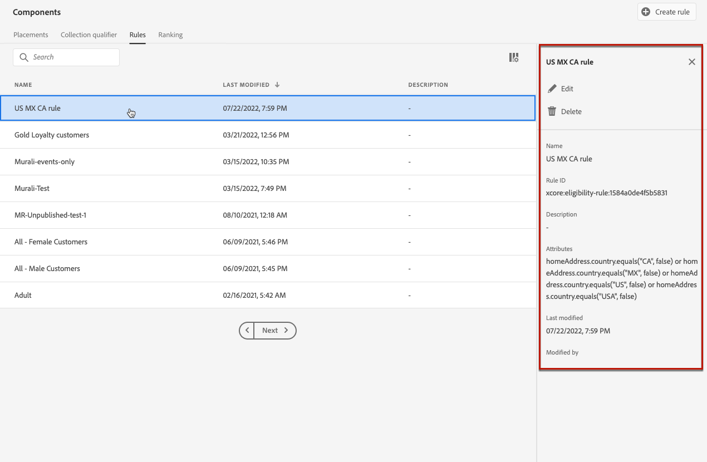

# 의사 결정 규칙 만들기 {#create-decision-rules}

## 의사 결정 규칙 기본 정보 {#about}

Adobe Experience Platform에서 사용할 수 있는 데이터를 기반으로 오퍼 의사 결정 규칙을 만들 수 있습니다. 의사 결정 규칙은 오퍼를 표시할 대상을 결정합니다.

예를 들어 (Gender = &#39;Female&#39;) 및 (Region = &#39;Northeast&#39;)일 때만 &#39;여성용 겨울 의류 상품&#39;을 표시하도록 지정할 수 있습니다.

➡️ [비디오에서 이 기능 살펴보기](#video)

다음은 의사 결정 규칙 작업 시 알아야 할 제한 사항 목록입니다.

* Edge decisioning은 이벤트를 저장하지 않는 Edge 프로필을 사용하므로 Edge Decisioning에 사용된 규칙은 무효화됩니다.
* 의사 결정 규칙을 만들 때 이전 기간을 되돌아보는 기능은 지원되지 않습니다. 예를 들어, 지난 달 내에 발생한 경험 이벤트를 규칙의 구성 요소로 지정하는 경우. 규칙을 만드는 동안 전환 확인 기간을 포함하려고 하면 저장 시 오류가 트리거됩니다.
  <!--* Decision requests that use the hub profile will look at the last 100 experience events on the profile to evaluate rules that reference historical experience events.-->

## 의사 결정 규칙 만들기 {#create}

만든 결정 규칙 목록은 **[!UICONTROL 구성 요소]** 메뉴에서 액세스할 수 있습니다.

의사 결정 규칙을 만들려면 다음 단계를 수행합니다.

1. **[!UICONTROL 규칙]** 탭으로 이동한 다음 **[!UICONTROL 규칙 만들기]**&#x200B;를 클릭합니다.

   

1. 규칙에 이름을 지정하고 설명을 제공한 다음 필요에 따라 규칙을 구성합니다.

   이를 위해 Adobe Experience Platform **세그먼트 빌더**&#x200B;를 사용하여 규칙의 조건을 작성할 수 있습니다. [세그먼트 정의를 만드는 방법을 알아봅니다](../../audience/creating-a-segment-definition.md)

   <!--In this example, the rule will target customers that have the "Gold" loyalty level.-->

   

   >[!NOTE]
   >
   >의사 결정 규칙을 만들기 위해 제공된 세그먼트 빌더는 **[!UICONTROL 세그먼테이션]** 서비스에 사용되는 것과 비교하여 몇 가지 특성을 제공합니다. 그러나 [세그먼트 빌더](../../audience/creating-a-segment-definition.md) 설명서에 설명된 전역 프로세스는 오퍼 결정 규칙을 작성하는 데 여전히 유효합니다. [Adobe Experience Platform Segmentation Service 설명서](https://experienceleague.adobe.com/docs/experience-platform/segmentation/ui/segment-builder.html)에서 자세히 알아보세요.

1. 작업 영역에서 새 필드를 추가하고 구성할 때 **[!UICONTROL 대상 속성]** 창에 대상에 속하는 예상 프로필에 대한 정보가 표시됩니다. 데이터를 업데이트하려면 **[!UICONTROL 예상 새로 고침]**&#x200B;을 클릭하세요.

   

   >[!NOTE]
   >
   >규칙 매개 변수에 컨텍스트 데이터와 같이 프로필에 없는 데이터가 포함되어 있으면 프로필 추정치를 사용할 수 없습니다. 예를 들어 현재 날씨가 ≥80도여야 하는 자격 규칙이 있습니다.

1. **[!UICONTROL 저장]**&#x200B;을 클릭하여 확인합니다.

1. 규칙이 만들어지면 **[!UICONTROL 규칙]** 목록에 표시됩니다. 속성을 표시하도록 선택하고 편집하거나 삭제할 수 있습니다.

   

>[!CAUTION]
>
>이벤트 기반 오퍼는 현재 [!DNL Journey Optimizer]에서 지원되지 않습니다. [event](https://experienceleague.adobe.com/docs/experience-platform/segmentation/ui/segment-builder.html#events){target="_blank"}을(를) 기반으로 의사 결정 규칙을 만드는 경우 오퍼에서 이를 활용할 수 없습니다.

## 튜토리얼 비디오 {#video}

>[!VIDEO](https://video.tv.adobe.com/v/329373?quality=12)
