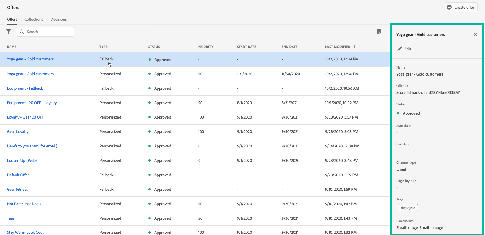

# 대체 오퍼 만들기 {#create-fallback-offers}

다른 오퍼에 적합하지 않은 경우 고객에게 대체 오퍼가 전송됩니다. 대체 오퍼를 만드는 단계는 오퍼를 만들 때와 같이 하나 또는 여러 개의 표현을 만드는 것으로 구성됩니다.

➡️ [비디오에서 이 기능 살펴보기](#video)

대체 오퍼 목록은 **[!UICONTROL 오퍼]** 메뉴에서 액세스할 수 있습니다.

대체 오퍼를 만들려면 다음 단계를 수행하십시오.

>[!NOTE]
>
>개인화된 오퍼와 달리, 대체 오퍼는 조건 없이 마지막 리조트로 고객에게 표시되므로 자격 규칙 및 제한 매개 변수가 없습니다.

1. **[!UICONTROL 오퍼 만들기]**&#x200B;를 클릭한 다음 **[!UICONTROL 대체 오퍼]**&#x200B;를 선택합니다.

   

1. 대체 오퍼의 이름을 지정합니다. 하나 또는 여러 개의 기존 컬렉션 한정자(이전의 &quot;태그&quot;라고 함)를 여기에 연결할 수도 있으므로 오퍼 라이브러리를 보다 쉽게 검색하고 구성할 수 있습니다.

   

1. 오퍼에 사용자 지정 또는 핵심 데이터 사용 레이블을 할당하려면 **[!UICONTROL 액세스 관리]**&#x200B;를 선택합니다. [OLAC(개체 수준 액세스 제어)에 대해 자세히 알아보기](../../administration/object-based-access.md)

1. 대체 오퍼에 대해 하나 이상의 표현을 만듭니다. 이렇게 하려면 개인화된 오퍼를 만들 때와 같이 왼쪽 창에서 배치를 끌어다 놓습니다. [개인화된 오퍼 만들기](../offer-library/creating-personalized-offers.md)를 참조하세요.

   

1. 대체 오퍼의 표시가 추가되면 요약이 표시됩니다. 모든 것이 올바르게 구성되어 있고 대체 오퍼를 고객에게 제공할 준비가 되었으면 **[!UICONTROL 마침]**&#x200B;을 클릭한 다음 **[!UICONTROL 저장 및 승인]**&#x200B;을 선택하십시오.

   대체 오퍼를 초안으로 저장하여 나중에 편집하고 승인할 수도 있습니다.

   

1. 대체 오퍼는 이전 단계에서 승인했는지 여부에 따라 **[!UICONTROL Live]** 또는 **[!UICONTROL 초안]** 상태로 목록에 표시됩니다.

   이제 고객에게 배송할 준비가 되었습니다. 속성을 표시하고 편집할 수 있습니다. <!-- no suppression? -->

   

## 방법 비디오 {#video}

>[!VIDEO](https://video.tv.adobe.com/v/329383?quality=12)

