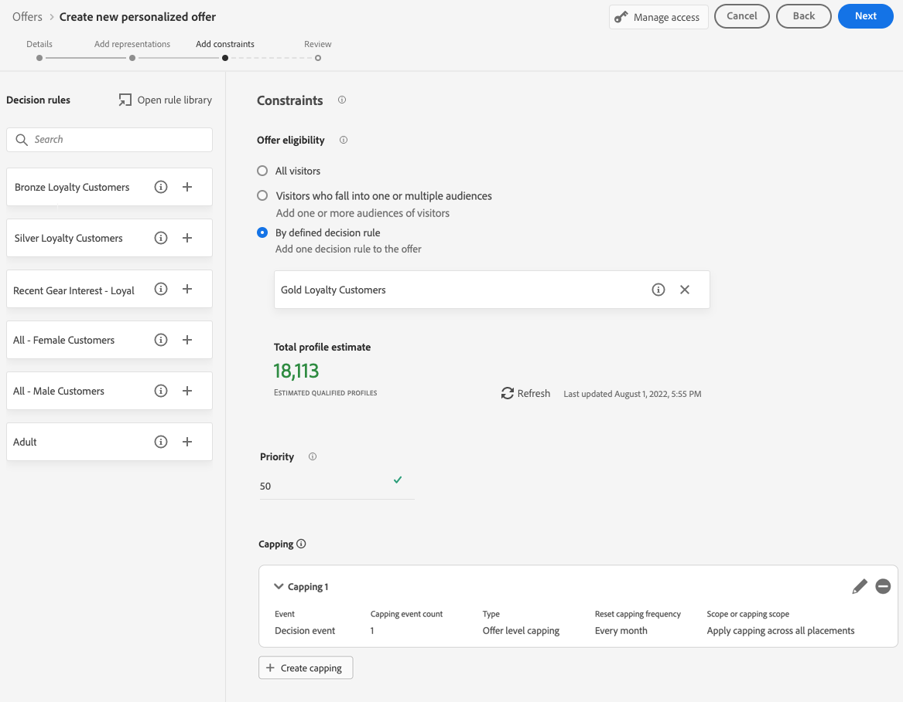

# 개인화된 오퍼 만들기 {#create-personalized-offers}

오퍼를 만들기 전에 다음을 만들었는지 확인하십시오.

* 오퍼가 표시되는 **배치**. [배치 만들기](../offer-library/creating-placements.md)를 참조하십시오.
* 자격 조건을 추가하려면 오퍼를 제공할 조건을 정의하는 **결정 규칙**&#x200B;을(를) 추가합니다. [의사 결정 규칙 만들기](../offer-library/creating-decision-rules.md)를 참조하십시오.
* 오퍼에 연결할 수 있는 하나 또는 여러 개의 **컬렉션 한정자**(이전에는 &quot;태그&quot;라고 함)입니다. [컬렉션 한정자 만들기](../offer-library/creating-tags.md)를 참조하세요.

➡️ [비디오에서 이 기능 살펴보기](#video)

개인화된 오퍼 목록은 **[!UICONTROL 오퍼]** 메뉴에서 액세스할 수 있습니다.

## 오퍼 만들기 {#create-offer}

>[!CONTEXTUALHELP]
>id="ajo_decisioning_offer_details"
>title="오퍼 세부 정보"
>abstract="오퍼의 이름, 시작 날짜 및 종료 날짜를 입력합니다. 이 날짜 외에는 의사 결정 엔진에서 해당 오퍼가 선택되지 않습니다."

>[!CONTEXTUALHELP]
>id="od_offer_attributes"
>title="오퍼 속성 정보"
>abstract="오퍼 속성을 사용하면 보고 및 분석을 위해 키 값 쌍을 오퍼와 연결할 수 있습니다."

>[!CONTEXTUALHELP]
>id="ajo_decisioning_offer_attributes"
>title="오퍼 속성"
>abstract="오퍼 속성을 사용하면 보고 및 분석을 위해 키 값 쌍을 오퍼와 연결할 수 있습니다."

>[!CONTEXTUALHELP]
>id="ajo_decisioning_new_personalized"
>title="맞춤형 오퍼"
>abstract="맞춤형 오퍼는 자격 규칙과 제한에 따라 사용자 정의할 수 있는 메시지입니다."

>[!CONTEXTUALHELP]
>id="ajo_decisioning_new_fallback"
>title="대체 오퍼"
>abstract="대체 제안은 최종 사용자가 맞춤형 오퍼를 받을 자격이 없는 경우 표시되는 기본 오퍼입니다."

**오퍼**&#x200B;를 만들려면 다음 단계를 수행하십시오.

1. **[!UICONTROL 오퍼 만들기]**&#x200B;를 클릭한 다음 **[!UICONTROL 개인화된 오퍼]**&#x200B;를 선택합니다.

   

1. 오퍼의 이름과 시작 및 종료 날짜 및 시간을 지정합니다. 이 날짜 외에는 의사 결정 엔진에서 해당 오퍼가 선택되지 않습니다.

   >[!NOTE]
   >
   >시간을 선택할 때는 현재 시간대를 고려합니다.

   

   >[!CAUTION]
   >
   >시작/종료 날짜를 업데이트하면 캡핑에 영향을 줄 수 있습니다. [자세히 알아보기](add-constraints.md#capping-change-date)

1. 하나 또는 여러 개의 기존 **[!UICONTROL 컬렉션 한정자]**&#x200B;를 오퍼에 연결하여 오퍼 라이브러리를 보다 쉽게 검색하고 구성할 수 있습니다. [자세히 알아보기](creating-tags.md).

1. **[!UICONTROL 오퍼 특성]** 섹션에서 보고 및 분석을 위해 키-값 쌍을 오퍼와 연결할 수 있습니다.

1. 오퍼에 사용자 지정 또는 핵심 데이터 사용 레이블을 할당하려면 **[!UICONTROL 액세스 관리]**&#x200B;를 선택합니다. [OLAC(개체 수준 액세스 제어)에 대해 자세히 알아보기](../../administration/object-based-access.md)

   

1. 표현을 추가하여 메시지에 오퍼가 표시될 위치를 정의합니다. [자세히 알아보기](add-representations.md)

   

   >[!CAUTION]
   >
   >모든 표현을 포함하는 오퍼의 크기는 300KB를 초과할 수 없습니다.

1. 표시할 오퍼에 대한 조건을 설정하려면 제약 조건을 추가하십시오. [자세히 알아보기](add-constraints.md)

   >[!NOTE]
   >
   >대상자 또는 의사 결정 규칙을 선택하면 예상 적격 프로필에 대한 정보를 볼 수 있습니다. 데이터를 업데이트하려면 **[!UICONTROL 새로 고침]**&#x200B;을 클릭하세요.
   >
   >규칙 매개 변수에 컨텍스트 데이터와 같이 프로필에 없는 데이터가 포함되어 있으면 프로필 추정치를 사용할 수 없습니다. 예를 들어 현재 날씨가 ≥80도여야 하는 자격 규칙이 있습니다.

   

1. 오퍼를 검토하고 저장합니다. [자세히 알아보기](#review)

## 오퍼 검토 {#review}

자격 규칙 및 제약 조건이 정의되면 오퍼 속성에 대한 요약이 표시됩니다.

1. 모든 항목이 올바르게 구성되었는지 확인하십시오.

1. 예상 적격 프로필에 대한 정보를 표시할 수 있습니다. 데이터를 업데이트하려면 **[!UICONTROL 새로 고침]**&#x200B;을 클릭하세요.

   

1. 오퍼를 사용자에게 제공할 준비가 되면 **[!UICONTROL 완료]**&#x200B;를 클릭하세요.

1. **[!UICONTROL 저장 및 승인]**&#x200B;을 선택합니다.

   

   나중에 오퍼를 편집하고 승인하기 위해 오퍼를 초안으로 저장할 수도 있습니다.

이전 단계에서 오퍼를 승인했는지 여부에 따라 **[!UICONTROL 승인됨]** 또는 **[!UICONTROL 초안]** 상태로 목록에 오퍼가 표시됩니다.

이제 사용자에게 게재할 준비가 되었습니다.

## 오퍼 관리 {#offer-list}

오퍼 목록에서 속성을 표시할 오퍼를 선택할 수 있습니다. 또한 오퍼를 편집하거나, 상태(**초안**, **승인됨**, **보관됨**)를 변경하거나, 오퍼를 복제하거나, 삭제할 수 있습니다.

**[!UICONTROL 편집]** 단추를 선택하여 오퍼 편집 모드로 돌아갑니다. 그러면 오퍼의 [세부 정보](#create-offer), [표시](#representations)를 수정하고 [자격 규칙 및 제약 조건](#eligibility)을 편집할 수 있습니다.

승인된 오퍼를 선택하고 **[!UICONTROL 승인 취소]**&#x200B;를 클릭하여 오퍼 상태를 **[!UICONTROL 초안]**(으)로 다시 설정합니다.

상태를 **[!UICONTROL 승인됨]**(으)로 다시 설정하려면 현재 표시된 해당 단추를 선택하십시오.

**[!UICONTROL 추가 작업]** 단추를 사용하면 아래에 설명된 작업을 사용할 수 있습니다.

* **[!UICONTROL 복제]**: 동일한 속성, 표시, 자격 규칙 및 제약 조건을 사용하여 오퍼를 만듭니다. 기본적으로 새 오퍼는 **[!UICONTROL 초안]** 상태입니다.
* **[!UICONTROL 삭제]**: 목록에서 오퍼를 제거합니다.

  >[!CAUTION]
  >
  >오퍼 및 해당 콘텐츠에 더 이상 액세스할 수 없습니다. 이 작업은 취소할 수 없습니다.
  >
  >오퍼가 컬렉션이나 의사 결정에 사용되는 경우 삭제할 수 없습니다. 먼저 모든 개체에서 오퍼를 제거해야 합니다.

* **[!UICONTROL 보관]**: 오퍼 상태를 **[!UICONTROL 보관]**(으)로 설정합니다. 오퍼를 목록에서 계속 사용할 수 있지만 상태를 **[!UICONTROL 초안]** 또는 **[!UICONTROL 승인됨]**(으)로 다시 설정할 수 없습니다. 복제하거나 삭제할 수만 있습니다.

해당 확인란을 선택하여 여러 오퍼의 상태를 동시에 삭제하거나 변경할 수도 있습니다.

상태가 다른 여러 오퍼의 상태를 변경하려면 관련 상태만 변경됩니다.

오퍼가 만들어지면 목록에서 오퍼의 이름을 클릭할 수 있습니다.

이렇게 하면 해당 오퍼에 대한 자세한 정보에 액세스할 수 있습니다. **[!UICONTROL 변경 로그]** 탭을 선택하여 [오퍼에 대한 모든 변경 내용을 모니터링](../get-started/user-interface.md#monitoring-changes)합니다.

## 튜토리얼 비디오 {#video}

>[!VIDEO](https://video.tv.adobe.com/v/341358?quality=12&captions=kor)
