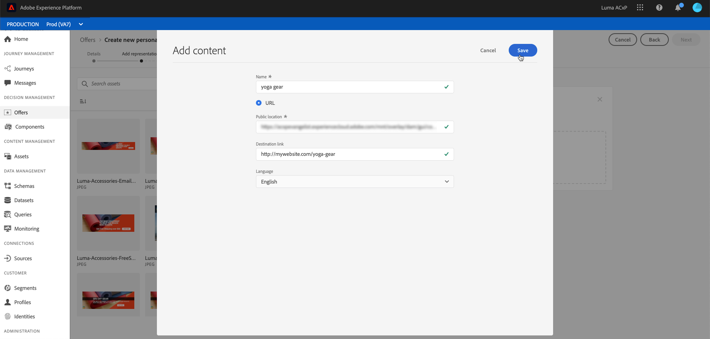

# 개인화된 오퍼 만들기 {#creating-personalized-offers}

오퍼를 만들기 전에 다음을 만들었는지 확인하십시오.

* 오퍼가 표시될 **배치**. [배치 만들기](../offer-library/creating-placements.md) 를 참조하십시오
* 오퍼가 표시될 조건을 정의하는 **결정 규칙** [의사 결정 규칙 만들기](../offer-library/creating-decision-rules.md)를 참조하십시오.
* 오퍼에 연결할 하나 또는 여러 **태그**&#x200B;를 사용하십시오. [태그 만들기](../offer-library/creating-tags.md)를 참조하십시오.

➡️ [비디오에서 이 기능 살펴보기](#video)

개인화된 오퍼 목록은 **[!UICONTROL Offers]** 메뉴에서 액세스할 수 있습니다.

## 오퍼 만들기 {#create-offer}

**오퍼**&#x200B;를 만들려면 다음 단계를 수행합니다.

1. **[!UICONTROL Create offer]** 을 클릭한 다음 **[!UICONTROL Personalized offer]** 을 선택합니다.

   

1. 오퍼의 이름과 시작 및 종료 날짜 및 시간을 지정합니다. 하나 또는 여러 개의 기존 태그를 오퍼에 연결할 수도 있으므로 오퍼 라이브러리를 보다 쉽게 검색하고 구성할 수 있습니다.

   

   >[!NOTE]
   >
   >**[!UICONTROL Offer attributes]** 섹션에서는 보고 및 분석을 위해 키-값 쌍을 오퍼와 연결할 수 있습니다.

## 오퍼의 표현 구성 {#representations}

1. **[!UICONTROL Add representation]** 버튼을 사용하여 오퍼에 대해 하나 이상의 표현을 추가합니다.

   >[!NOTE]
   >
   >오퍼는 메시지의 다른 위치에 표시할 수 있습니다. 위쪽 배너에 이미지, 단락 텍스트, html 블록 등이 있습니다. 오퍼가 더 많은 표현을 보유하게 되면 더 많은 기회가 다른 배치 컨텍스트에서 오퍼를 사용할 수 있습니다.

1. 각 표현에 대해 오퍼가 표시될 **[!UICONTROL Channel]** 및 **[!UICONTROL Placement]** 을 지정합니다.

   

   **[!UICONTROL Browse]** 버튼을 사용하면 사용 가능한 배치를 필터링하고 채널 및/또는 컨텐츠 유형에 따라 필터링할 수 있습니다.

   

1. Adobe Experience Cloud Assets 라이브러리 또는 외부 공용 위치에서 나오는 각 표현에 컨텐츠를 추가합니다.

   * Adobe Experience Cloud Assets 라이브러리의 콘텐츠를 추가하려면 왼쪽 창에서 표현 영역으로 드래그한 다음 **[!UICONTROL Destination link]** 필드에 컨텐츠와 연결할 URL을 지정합니다.

      >[!NOTE]
      >
      >내용은 왼쪽 패널의 자산 선택기에서만 드래그하여 놓을 수 있습니다. 배치의 컨텐츠 유형에 해당하는 컨텐츠만 사용할 수 있습니다.

      

   * 외부 공용 위치에서 콘텐츠를 추가하려면 **[!UICONTROL Add content]** 버튼을 클릭한 다음 추가할 컨텐츠의 이름, URL 및 대상 링크를 지정합니다.

      추가하는 컨텐츠가 선택한 배치의 컨텐츠 유형에 해당하는지 확인합니다.

      

   * 텍스트 유형 콘텐츠를 삽입할 수도 있습니다. 이렇게 하려면 **[!UICONTROL Add content]** 단추를 클릭한 다음 **[!UICONTROL Custom text]** 옵션을 선택합니다. **[!UICONTROL Text]** 필드에 오퍼에 표시할 텍스트를 입력합니다.

      >[!NOTE]
      >
      >이 옵션은 이미지 유형 배치에 사용할 수 없습니다.

      

## 자격 규칙 및 제한 추가 {#eligibility}

자격 규칙 및 제한을 사용하면 오퍼가 표시될 조건을 정의할 수 있습니다.

1. **[!UICONTROL Offer eligibility]**&#x200B;을 구성합니다. 기본적으로 **[!UICONTROL All visitors]** 의사 결정 규칙 옵션이 선택되어 있으므로 모든 프로필에 오퍼를 제공할 수 있습니다.

   오퍼 표시를 하나 또는 여러 Adobe Experience Platform 세그먼트의 구성원으로 제한할 수 있습니다. 이렇게 하려면 **[!UICONTROL Visitors who fall into one or multiple segments]** 옵션을 활성화한 다음 왼쪽 창에서 하나 또는 여러 개의 세그먼트를 추가하고 **[!UICONTROL And]** / **[!UICONTROL Or]** 논리 연산자를 사용하여 조합합니다.

   세그먼트 작업 방법에 대한 자세한 내용은 [이 페이지](../../segment/about-segments.md)를 참조하십시오.

   

   특정 의사 결정 규칙을 오퍼에 연결하려면 **[!UICONTROL By defined decision rule]** 을 선택한 다음 왼쪽 창에서 원하는 규칙을 **[!UICONTROL Decision rule]** 영역으로 드래그합니다. 의사 결정 규칙을 만드는 방법에 대한 자세한 내용은 [이 섹션](../offer-library/creating-decision-rules.md)을 참조하십시오.

   

   >[!CAUTION]
   >
   >이벤트 기반 오퍼는 현재 [!DNL Journey Optimizer]에서 지원되지 않습니다. [event](https://experienceleague.adobe.com/docs/experience-platform/segmentation/ui/segment-builder.html?lang=en#events){target=&quot;_blank&quot;}를 기반으로 의사 결정 규칙을 만드는 경우 오퍼에서 활용할 수 없습니다.

1. 사용자가 둘 이상의 오퍼에 적격인 경우, 다른 오퍼와 비교하여 오퍼의 **[!UICONTROL Priority]**&#x200B;을 정의합니다. 오퍼의 우선 순위가 높을수록 오퍼의 우선 순위가 더 높습니다.

1. 오퍼의 **[!UICONTROL Capping]**&#x200B;을 지정합니다. 이것은 모든 사용자에 대해 오퍼가 총 표시되는 횟수를 의미합니다. 오퍼가 이 필드에 지정한 횟수만큼 모든 사용자에게 전달된 경우 해당 게재가 중지됩니다.

   >[!NOTE]
   >
   >오퍼를 제안하는 횟수는 이메일 준비 시 계산됩니다. 예를 들어, 많은 수의 오퍼가 포함된 이메일을 준비하는 경우 해당 숫자는 이메일 전송 여부와 관계없이 최대 상한에 포함됩니다.
   >
   >이메일 게재가 삭제되거나 준비가 다시 수행된 경우 오퍼에 대한 최대 가용량 값이 자동으로 업데이트됩니다.

   

   위의 예에서

   * 오퍼의 우선순위는 &quot;50&quot;으로 설정됩니다. 즉, 오퍼는 1과 49 사이의 우선 순위를 가진 오퍼 앞에, 그리고 51 이상의 우선 순위가 있는 오퍼 후에 표시됩니다.
   * 오퍼는 &quot;골드 충성도 고객&quot; 의사 결정 규칙에만 해당하는 사용자에 대해서만 고려됩니다.
   * 오퍼는 사용자당 한 번만 표시됩니다.

## 오퍼 검토 {#review}

자격 규칙 및 제한이 정의되면 오퍼 속성 요약이 표시됩니다.

1. 모든 것이 제대로 구성되어 있는지 확인하십시오.

1. 오퍼를 사용자에게 제공할 준비가 되면 **[!UICONTROL Finish]** 을 클릭합니다.

1. **[!UICONTROL Save and approve]**&#x200B;를 선택합니다.

   

   나중에 편집하고 승인하기 위해 오퍼를 초안으로 저장할 수도 있습니다.

오퍼는 이전 단계에서 승인했는지 여부에 따라 **[!UICONTROL Approved]** 또는 **[!UICONTROL Draft]** 상태로 목록에 표시됩니다.

이제 사용자에게 전달할 준비가 되었습니다.

## 오퍼 목록 {#offer-list}

오퍼 목록에서 해당 속성을 표시할 오퍼를 선택할 수 있습니다. 오퍼를 편집하거나, 해당 상태(**초안**, **승인됨**, **보관됨**)를 변경하거나, 오퍼를 복제하거나, 삭제할 수도 있습니다.

**[!UICONTROL Edit]** 단추를 선택하여 오퍼 편집 모드로 돌아갑니다. 여기서 오퍼의 [세부 정보](#create-offer), [레프리젠테이션](#representations)을 수정하고 [자격 규칙 및 제약 조건](#eligibility)을 편집할 수 있습니다.

승인된 오퍼를 선택하고 **[!UICONTROL Undo approve]** 을 클릭하여 오퍼 상태를 다시 **[!UICONTROL Draft]** 로 설정합니다.

상태를 다시 **[!UICONTROL Approved]**(으)로 설정하려면 이제 표시되는 해당 단추를 선택하십시오.

**[!UICONTROL More actions]** 단추를 사용하면 아래 설명된 작업이 활성화됩니다.

* **[!UICONTROL Duplicate]**: 등록 정보, 표현, 자격 규칙 및 제약 조건이 동일한 오퍼를 생성합니다. 기본적으로 새 오퍼에는 **[!UICONTROL Draft]** 상태가 있습니다.
* **[!UICONTROL Delete]**: 목록에서 오퍼를 제거합니다.

   >[!CAUTION]
   >
   >오퍼와 해당 콘텐츠는 더 이상 액세스할 수 없습니다. 이 작업은 취소할 수 없습니다.
   >
   >오퍼가 컬렉션이나 결정에 사용되는 경우 삭제할 수 없습니다. 먼저 모든 개체에서 오퍼를 제거해야 합니다.

* **[!UICONTROL Archive]**: 오퍼 상태를 로 설정합니다  **[!UICONTROL Archived]**. 오퍼는 여전히 목록에서 사용할 수 있지만 상태를 다시 **[!UICONTROL Draft]** 또는 **[!UICONTROL Approved]** 로 설정할 수 없습니다. 복제하거나 삭제할 수만 있습니다.

해당 확인란을 선택하여 여러 오퍼의 상태를 동시에 삭제하거나 변경할 수도 있습니다.

상태가 다른 여러 오퍼의 상태를 변경하려면 관련 상태만 변경됩니다.

오퍼가 만들어지면 목록에서 해당 이름을 클릭할 수 있습니다.

이렇게 하면 해당 오퍼에 대한 세부 정보에 액세스할 수 있습니다. **[!UICONTROL Change log]** 탭을 선택하여 [오퍼에 수행된 모든 변경 사항](../get-started/user-interface.md#monitoring-changes)을 모니터링합니다.

## 튜토리얼 비디오 {#video}

>[!NOTE]
>
>이 비디오는 Adobe Experience Platform을 기반으로 하는 Offer decisioning 애플리케이션 서비스에 적용됩니다. 그러나 Journey Optimizer 컨텍스트에서 오퍼를 사용하는 일반적인 지침을 제공합니다.

>[!VIDEO](https://video.tv.adobe.com/v/329375?quality=12)
