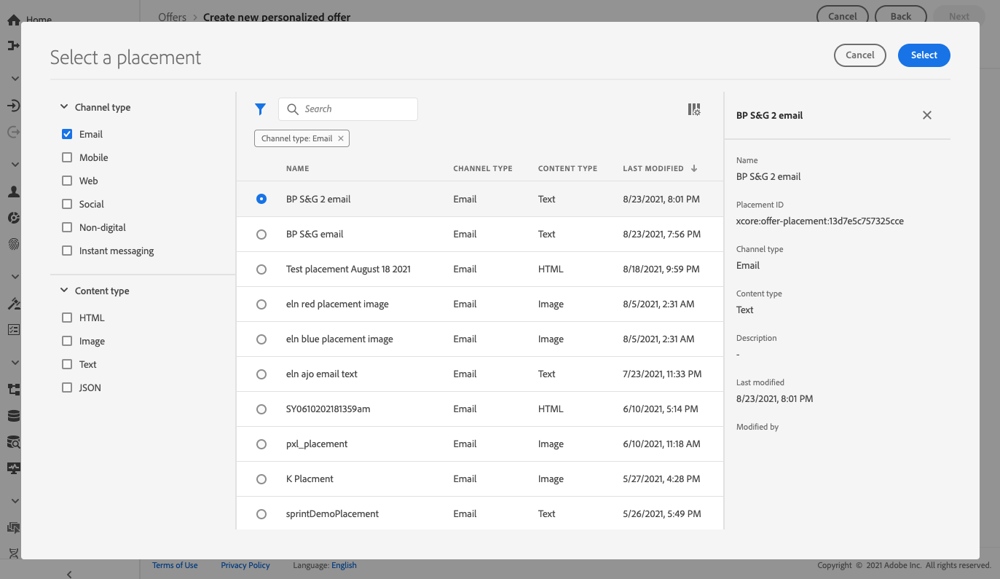
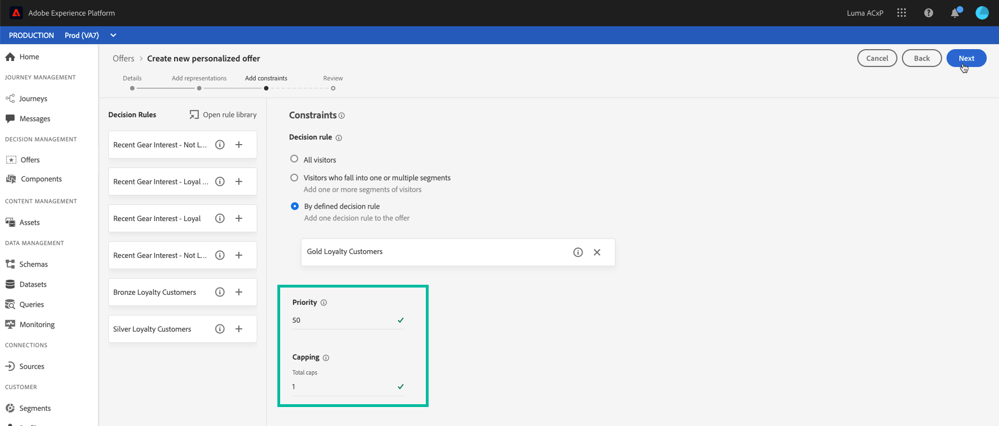

# 개인화된 오퍼 만들기 {#creating-personalized-offers}

>[!CONTEXTUALHELP]
>id="od_offer_constraints"
>title="오퍼 제한 정보"
>abstract="제약 조건을 사용하여 오퍼의 우선 순위를 지정하고 다른 오퍼와 비교하여 사용자에게 표시되는 방법을 지정할 수 있습니다."
>additional-url="https://video.tv.adobe.com/v/329375?captions=kor" text="데모 비디오 시청"

>[!CONTEXTUALHELP]
>id="od_offer_eligibility"
>title="오퍼 자격 조건 정보"
>abstract="이 섹션에서는 결정 규칙을 사용하여 오퍼에 적합한 사용자를 결정할 수 있습니다."
>additional-url="https://experienceleague.adobe.com/docs/offer-decisioning/using/managing-offers-in-the-offer-library/creating-decision-rules.html" text="의사 결정 규칙 만들기"
>additional-url="https://video.tv.adobe.com/v/329373?captions=kor" text="데모 비디오 시청"

>[!CONTEXTUALHELP]
>id="od_offer_priority"
>title="오퍼 우선 순위 정보"
>abstract="이 필드에서 오퍼에 대한 우선 순위 설정을 지정할 수 있습니다. 우선 순위는 자격 조건, 날짜 및 제한과 같은 모든 제약 조건을 충족하는 오퍼의 등급을 매기는 데 사용되는 숫자입니다."
>additional-url="https://video.tv.adobe.com/v/329375" text="데모 비디오 시청"

>[!CONTEXTUALHELP]
>id="od_offer_globalcap"
>title="오퍼 매핑 정보"
>abstract="이 필드에서 모든 사용자에게 오퍼를 표시할 수 있는 횟수를 지정할 수 있습니다."
>additional-url="https://video.tv.adobe.com/v/329375" text="데모 비디오 시청"

>[!CONTEXTUALHELP]
>id="od_offer_attributes"
>title="오퍼 속성 정보"
>abstract="오퍼 속성을 사용하여 보고 및 분석 목적으로 오퍼와 키 값 쌍을 연결할 수 있습니다."
>additional-url="https://video.tv.adobe.com/v/329375" text="데모 비디오 시청"

오퍼를 만들기 전에 다음을 만들어야 합니다.

* 오퍼가 표시될 **배치**. [배치 만들기](../offer-library/creating-placements.md)를 참조하십시오.
* 오퍼가 표시될 조건을 정의하는 **결정 규칙**. [결정 규칙 만들기](../offer-library/creating-decision-rules.md)를 참조하십시오.
* 오퍼에 연결할 하나 이상의 **태그**&#x200B;입니다. [태그 만들기](../offer-library/creating-tags.md)를 참조하십시오.

 [비디오에서 이 기능 살펴보기](#video)

개인화된 오퍼 목록은 **[!UICONTROL Offers]** 메뉴에서 액세스할 수 있습니다.

## 오퍼 {#create-offer} 만들기

**오퍼**&#x200B;를 만들려면 다음 단계를 수행합니다.

1. **[!UICONTROL Create offer]**&#x200B;을 클릭한 다음 **[!UICONTROL Personalized offer]**&#x200B;을 선택합니다.

   

1. 오퍼의 이름과 시작 날짜와 종료 날짜 및 시간을 지정합니다. 하나 또는 여러 개의 기존 태그를 오퍼에 연결할 수도 있으므로, 오퍼 라이브러리를 보다 쉽게 검색하고 구성할 수 있습니다.

   

   >[!NOTE]
   >
   >**[!UICONTROL Offer attributes]** 섹션에서는 보고 및 분석 목적으로 오퍼와 키 값 쌍을 연결할 수 있습니다.

## 오퍼의 표현 {#representations} 구성

1. **[!UICONTROL Add representation]** 단추를 사용하여 오퍼에 대해 하나 이상의 표현을 추가합니다.

   >[!NOTE]
   >
   >오퍼는 메시지의 다른 위치에 표시할 수 있습니다.이미지, 단락 텍스트, html 블록 등으로 위쪽 배너에서 오퍼에 대한 표현의 수가 많을수록 여러 배치 컨텍스트에서의 오퍼를 사용할 수 있는 기회가 더 많이 있습니다.

1. 각 표현에 대해 오퍼가 표시될 **[!UICONTROL Channel]** 및 **[!UICONTROL Placement]**&#x200B;을 지정합니다.

   

   **[!UICONTROL Browse]** 단추를 사용하면 채널 및/또는 컨텐트 유형에 따라 사용 가능한 배치를 필터링하고 필터링할 수 있습니다.

   

1. Adobe Experience Cloud Assets 라이브러리 또는 외부 공개 위치에서 나오는 각 표현에 컨텐츠를 추가합니다.

   * Adobe Experience Cloud 자산 라이브러리의 콘텐트를 추가하려면 왼쪽 창에서 표현 영역으로 해당 컨텐츠를 드래그 앤 드롭한 다음 **[!UICONTROL Destination link]** 필드의 콘텐트와 연결할 URL을 지정합니다.

      >[!NOTE]
      >
      >내용은 왼쪽 패널의 자산 선택기에서 드래그하여 놓을 수만 있습니다. 배치의 컨텐츠 유형에 해당하는 컨텐츠만 사용할 수 있습니다.

      

   * 외부 공용 위치에서 콘텐트를 추가하려면 **[!UICONTROL Add content]** 단추를 클릭한 다음 추가할 콘텐트의 이름, URL 및 대상 링크를 지정합니다.

      추가하는 컨텐츠가 선택한 배치의 컨텐츠 유형에 해당하는지 확인합니다.

      

   * 텍스트 문자 내용을 삽입할 수도 있습니다. 이렇게 하려면 **[!UICONTROL Add content]** 단추를 클릭한 다음 **[!UICONTROL Custom text]** 옵션을 선택합니다. **[!UICONTROL Text]** 필드에 오퍼에 표시할 텍스트를 입력합니다.

      >[!NOTE]
      >
      >이미지 유형 배치에는 이 옵션을 사용할 수 없습니다.

      

## 자격 조건 규칙 및 제한 조건 추가 {#eligibility}

자격 조건 규칙 및 제한을 사용하여 오퍼가 표시될 조건을 정의할 수 있습니다.

1. **[!UICONTROL Offer eligibility]**&#x200B;을 구성합니다. 기본적으로 **[!UICONTROL All visitors]** 결정 규칙 옵션이 선택되어 있으므로 모든 프로파일은 오퍼를 제공할 수 있습니다.

   하나 또는 여러 Adobe Experience Platform 세그먼트의 구성원에 대한 오퍼 표시를 제한할 수 있습니다. 이렇게 하려면 **[!UICONTROL Visitors who fall into one or multiple segments]** 옵션을 활성화한 다음 왼쪽 창에서 하나 이상의 세그먼트를 추가하고 **[!UICONTROL And]** / **[!UICONTROL Or]** 논리 연산자를 사용하여 조합합니다.

   세그먼트 작업 방법에 대한 자세한 내용은 [세그멘테이션 서비스 설명서](https://experienceleague.adobe.com/docs/experience-platform/segmentation/home.html)를 참조하십시오.

   

   특정 결정 규칙을 오퍼에 연결하려면 **[!UICONTROL By defined decision rule]**&#x200B;을 선택한 다음 왼쪽 창에서 원하는 규칙을 **[!UICONTROL Decision rule]** 영역으로 드래그합니다. 결정 규칙을 만드는 방법에 대한 자세한 내용은 [이 섹션](../offer-library/creating-decision-rules.md)을 참조하십시오.

   

1. 사용자가 두 개 이상의 오퍼에 대해 자격이 있는 경우 다른 오퍼와 비교하여 오퍼의 **[!UICONTROL Priority]**&#x200B;을 정의합니다. 오퍼의 우선 순위가 가장 높을수록 오퍼의 우선 순위가 다른 오퍼와 비교됩니다

1. 오퍼의 **[!UICONTROL Capping]**&#x200B;을 지정합니다. 즉, 모든 사용자에 대해 오퍼가 총 표시되는 횟수를 지정합니다. 이 필드에 지정한 횟수만큼 오퍼가 모든 사용자에게 전달되면 해당 배달이 중지됩니다.

   >[!NOTE]
   >
   >오퍼를 제안하는 횟수가 이메일 준비 시 계산되는 횟수입니다. 예를 들어, 많은 수의 오퍼가 포함된 이메일을 준비하는 경우 해당 숫자는 이메일 전송 여부와 관계없이 최대 상한에 포함됩니다.
   >
   >이메일 배달을 삭제하거나, 보내기 전에 준비를 다시 마친 경우, 오퍼에 대한 매핑 값이 자동으로 업데이트됩니다.

   

   위의 예에서:

   * 오퍼의 우선 순위는 &quot;50&quot;으로 설정됩니다. 즉, 1에서 49 사이의 우선 순위가 있는 오퍼와 51개 이상의 우선 순위가 있는 오퍼에 먼저 오퍼가 표시됩니다.
   * 이 혜택은 &quot;골드 로열티 고객&quot; 의사 결정 규칙과 일치하는 사용자에게만 적용됩니다.
   * 오퍼는 사용자당 한 번만 표시됩니다.

## 오퍼 {#review} 검토

자격 규칙 및 제한 조건이 정의되면 오퍼 속성 요약이 표시됩니다. 모든 것이 제대로 구성되고 오퍼가 사용자에게 표시될 준비가 되었으면 **[!UICONTROL Finish]**&#x200B;을 클릭한 다음 **[!UICONTROL Save and approve]**&#x200B;을 선택합니다.

나중에 오퍼를 편집하고 승인하려면 오퍼를 초안으로 저장할 수도 있습니다.

오퍼는 이전 단계에서 승인했는지 여부에 따라 목록에 **[!UICONTROL Live]** 또는 **[!UICONTROL Draft]** 상태로 표시됩니다.

이제 사용자에게 전달할 준비가 되었습니다. 속성을 표시하고 속성을 편집하거나 제외하도록 선택할 수 있습니다.

오퍼가 만들어지면 목록에서 오퍼의 이름을 클릭하여 자세한 정보에 액세스할 수 있을 뿐만 아니라 **[!UICONTROL Change log]** 탭을 사용하여 오퍼에 대한 모든 변경 사항을 모니터링할 수 있습니다([오퍼 및 의사 결정 변경 모니터링](../get-started/user-interface.md#monitoring-changes) 참조).

## 자습서 비디오 {#video}

>[!NOTE]
>
>이 비디오는 Adobe Experience Platform 기반으로 구축된 Offer decisioning 응용 프로그램 서비스에 적용됩니다. 그러나 Journey Optimizer 컨텍스트에서 오퍼를 사용하기 위한 일반적인 지침을 제공합니다.

>[!VIDEO](https://video.tv.adobe.com/v/329375?quality=12)
