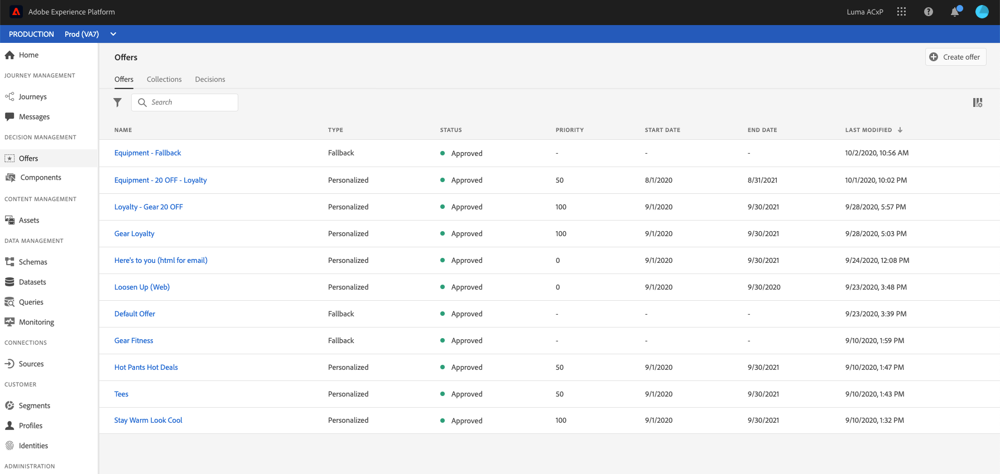
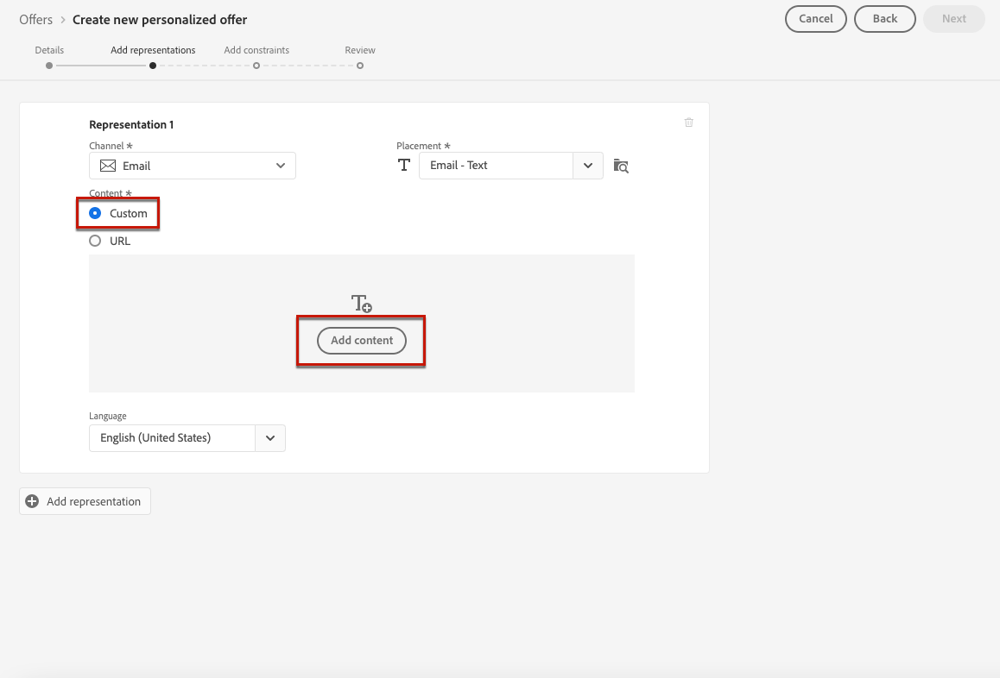
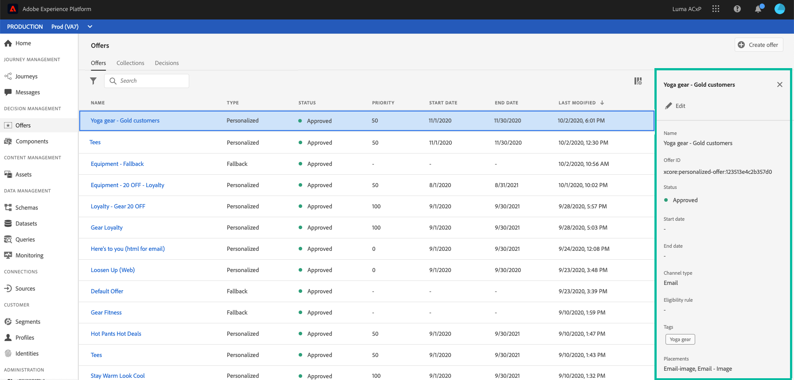

# 개인화된 오퍼 만들기 {#create-personalized-offers}

오퍼를 만들기 전에 다음을 만들었는지 확인하십시오.

* A **배치** 오퍼가 표시되는 위치입니다. 자세한 내용은 [배치 만들기](../offer-library/creating-placements.md)
* 자격 조건을 추가하려면 a **의사 결정 규칙** 이 경우 오퍼가 표시될 조건을 정의합니다. 자세한 내용은 [의사 결정 규칙 만들기](../offer-library/creating-decision-rules.md).
* 하나 또는 여러 개 **태그** 오퍼와 연결할 수 있습니다. 자세한 내용은 [태그 만들기](../offer-library/creating-tags.md).

➡️ [비디오에서 이 기능 살펴보기](#video)

개인화된 오퍼 목록은 **[!UICONTROL Offers]** 메뉴 아래의 제품에서 사용할 수 있습니다.

## 오퍼 만들기 {#create-offer}

을(를) 만들려면 **오퍼**&#x200B;다음 단계를 수행합니다.

1. 클릭 **[!UICONTROL Create offer]**&#x200B;를 선택하고 을 선택합니다. **[!UICONTROL Personalized offer]**.

   

1. 오퍼의 이름과 시작 및 종료 날짜 및 시간을 지정합니다. 하나 또는 여러 개의 기존 태그를 오퍼에 연결할 수도 있으므로 오퍼 라이브러리를 보다 쉽게 검색하고 구성할 수 있습니다.

   

   >[!NOTE]
   >
   >다음 **[!UICONTROL Offer attributes]** 섹션에서 보고 및 분석 목적으로 키-값 쌍을 오퍼와 연결할 수 있습니다.

## 오퍼의 표현 구성 {#representations}

오퍼는 메시지의 다른 위치에 표시할 수 있습니다. 위쪽 배너에 이미지, 단락 텍스트, HTML 블록 등으로 표시 오퍼가 더 많은 표현을 보유하게 되면 더 많은 기회가 다른 배치 컨텍스트에서 오퍼를 사용할 수 있습니다.

오퍼에 하나 이상의 표현을 추가하고 구성하려면 아래 단계를 수행하십시오.

1. 첫 번째 표현에 대해 다음을 선택하여 시작합니다 **[!UICONTROL Channel]** 사용됩니다.

   

   >[!NOTE]
   >
   >선택한 채널에 대해 사용 가능한 배치만 **[!UICONTROL Placement]** 드롭다운 목록.

1. 목록에서 배치를 선택합니다.

   또한 **[!UICONTROL Placement]** 모든 배치를 탐색하는 드롭다운 목록입니다.

   

   거기에서 여전히 채널 및/또는 컨텐츠 유형에 따라 배치를 필터링할 수 있습니다. 배치를 선택하고 를 클릭합니다 **[!UICONTROL Select]**.

   

1. 표시에 컨텐츠를 추가합니다. 방법 알아보기 [이 섹션](#content).

1. 이미지나 URL과 같은 컨텐츠를 추가할 때 **[!UICONTROL Destination link]**: 오퍼를 클릭하는 사용자가 해당 페이지로 이동됩니다.

   

1. 마지막으로, 사용자에게 표시할 언어를 식별하고 관리하는 데 도움이 되도록 원하는 언어를 선택합니다.

1. 다른 표현을 추가하려면 **[!UICONTROL Add representation]** 버튼을 클릭하고 필요한 만큼 표현을 추가합니다.

   

1. 모든 표현을 추가한 후 **[!UICONTROL Next]**.

## 표현 내용 정의 {#content}

표현에는 다른 유형의 컨텐츠를 추가할 수 있습니다.

>[!NOTE]
>
>배치의 컨텐츠 유형에 해당하는 컨텐츠만 사용할 수 있습니다.

### 이미지 추가 {#images}

선택한 배치가 이미지 유형인 경우 **Adobe Experience Cloud 자산** 라이브러리, 에서 제공하는 자산의 중앙 저장소 [!DNL Adobe Experience Manager Assets Essentials].

>[!NOTE]
>
> 을 사용하여 작업하려면 [Adobe Experience Manager Assets Essentials](https://experienceleague.adobe.com/docs/experience-manager-assets-essentials/help/introduction.html?lang=en){target=&quot;_blank&quot;}, 배포해야 합니다. [!DNL Assets Essentials] 조직의 경우 사용자가 **Assets Essentials 소비자 사용자** 또는/and **Assets Essentials 사용자** 제품 프로필. 추가 정보 [이 페이지](https://experienceleague.adobe.com/docs/experience-manager-assets-essentials/help/deploy-administer.html){target=&quot;_blank&quot;}.

1. **[!UICONTROL Asset library]** 옵션을 선택합니다.

1. **[!UICONTROL Browse]**&#x200B;를 선택합니다.

   

1. 자산을 탐색하여 선택한 이미지를 선택합니다

1. **[!UICONTROL Select]**&#x200B;을(를) 클릭합니다.

   

### URL 추가 {#urls}

외부 공용 위치에서 콘텐츠를 추가하려면 **[!UICONTROL URL]**&#x200B;을 입력한 다음 추가할 컨텐츠의 URL 주소를 입력합니다.

### 사용자 지정 텍스트 추가 {#custom-text}

호환 배치를 선택할 때 텍스트 유형 컨텐츠를 삽입할 수도 있습니다.

1. 을(를) 선택합니다 **[!UICONTROL Custom]** 옵션을 선택하고 **[!UICONTROL Add content]**.

   

   >[!NOTE]
   >
   >이 옵션은 이미지 유형 배치에 사용할 수 없습니다.

1. 오퍼에 표시할 텍스트를 입력합니다.

   

   표현식 편집기를 사용하여 콘텐츠를 개인화할 수 있습니다. 추가 정보 [개인화](../../personalization/personalize.md#use-expression-editor).

   

   >[!NOTE]
   >
   >전용 **[!UICONTROL Profile attributes]**, **[!UICONTROL Segment memberships]** 및 **[!UICONTROL Helper functions]** 결정 관리에 소스를 사용할 수 있습니다.

## 자격 규칙 및 제한 추가 {#eligibility}

자격 규칙 및 제한을 사용하여 오퍼가 표시될 조건을 정의할 수 있습니다.

1. 구성 **[!UICONTROL Offer eligibility]**.

   * 기본적으로 **[!UICONTROL All visitors]** 결정 규칙 옵션이 선택되어 있으므로 모든 프로필에 오퍼를 제공할 수 있습니다.

   * 오퍼 표시를 하나 또는 여러 Adobe Experience Platform 세그먼트의 구성원으로 제한할 수 있습니다. 이렇게 하려면 를 활성화합니다 **[!UICONTROL Visitors who fall into one or multiple segments]** 옵션을 선택한 다음 왼쪽 창에서 한 개 또는 여러 개의 세그먼트를 추가하고 을(를) 사용하여 결합합니다 **[!UICONTROL And]** / **[!UICONTROL Or]** 논리 연산자입니다.

      세그먼트 작업 방법에 대한 자세한 내용은 [이 페이지](../../segment/about-segments.md).

      

   * 특정 의사 결정 규칙을 오퍼에 연결하려면 을(를) 선택합니다 **[!UICONTROL By defined decision rule]**&#x200B;을 클릭한 다음 왼쪽 창에서 원하는 규칙을 **[!UICONTROL Decision rule]** 영역. 의사 결정 규칙을 만드는 방법에 대한 자세한 내용은 [이 섹션](../offer-library/creating-decision-rules.md).

      

      >[!CAUTION]
      >
      >이벤트 기반 오퍼는에서 현재 지원되지 않습니다 [!DNL Journey Optimizer]. 을 기반으로 의사 결정 규칙을 생성하는 경우 [이벤트](https://experienceleague.adobe.com/docs/experience-platform/segmentation/ui/segment-builder.html?lang=en#events){target=&quot;_blank&quot;} 오퍼에서는 활용할 수 없습니다.
   세그먼트 사용과 의사 결정 규칙 사용에 대한 자세한 내용은 [이 섹션](../offer-activities/create-offer-activities.md#segments-vs-decision-rules).

1. 을(를) 정의합니다 **[!UICONTROL Priority]** 두 개 이상의 오퍼에 대해 사용자가 자격이 있는 경우 다른 오퍼와 비교한 것입니다. 오퍼의 우선 순위가 높을수록 오퍼의 우선 순위가 더 높습니다.

1. 오퍼를 지정합니다 **[!UICONTROL Capping]**: 모든 사용자에게 오퍼가 총 표시되는 횟수를 의미합니다. 오퍼가 이 필드에 지정한 횟수만큼 모든 사용자에게 전달된 경우 해당 게재가 중지됩니다.

   >[!NOTE]
   >
   >오퍼를 제안하는 횟수는 이메일 준비 시 계산됩니다. 예를 들어, 많은 수의 오퍼가 포함된 이메일을 준비하는 경우 해당 숫자는 이메일 전송 여부와 관계없이 최대 상한에 포함됩니다.
   >
   >이메일 게재가 삭제되거나 준비가 다시 수행된 경우 오퍼에 대한 최대 가용량 값이 자동으로 업데이트됩니다.

   

   위의 예에서

   * 오퍼의 우선순위는 &quot;50&quot;으로 설정됩니다. 즉, 오퍼는 1과 49 사이의 우선 순위를 가진 오퍼 앞에, 그리고 51 이상의 우선 순위가 있는 오퍼 후에 표시됩니다.
   * 오퍼는 &quot;골드 충성도 고객&quot; 의사 결정 규칙에만 해당하는 사용자에 대해서만 고려됩니다.
   * 오퍼는 사용자당 한 번만 표시됩니다.

## 오퍼 검토 {#review}

자격 규칙 및 제한이 정의되면 오퍼 속성 요약이 표시됩니다.

1. 모든 것이 제대로 구성되어 있는지 확인하십시오.

1. 사용자에게 오퍼를 제공할 준비가 되면 **[!UICONTROL Finish]**.

1. **[!UICONTROL Save and approve]**&#x200B;를 선택합니다.

   

   나중에 편집하고 승인하기 위해 오퍼를 초안으로 저장할 수도 있습니다.

오퍼가 목록에 **[!UICONTROL Approved]** 또는 **[!UICONTROL Draft]** 상태(이전 단계에서 승인했는지 여부에 따라 다름).

이제 사용자에게 전달할 준비가 되었습니다.

## 오퍼 목록 {#offer-list}

오퍼 목록에서 해당 속성을 표시할 오퍼를 선택할 수 있습니다. 편집, 상태 변경(**초안**, **승인됨**, **보관됨**), 오퍼를 복제하거나, 삭제합니다.

을(를) 선택합니다 **[!UICONTROL Edit]** 버튼을 클릭하여 오퍼를 수정할 수 있는 오퍼 편집 모드로 돌아갑니다. [세부 정보](#create-offer), [표현](#representations)를 편집할 수 있습니다 [자격 규칙 및 제한](#eligibility).

승인된 오퍼를 선택하고 을(를) 클릭합니다 **[!UICONTROL Undo approve]** 오퍼 상태를 다시 로 설정하려면 **[!UICONTROL Draft]**.

상태를 다시 설정하려면 **[!UICONTROL Approved]**&#x200B;에서 이제 표시되는 해당 버튼을 선택합니다.

다음 **[!UICONTROL More actions]** 버튼을 사용하면 아래 설명된 작업을 사용할 수 있습니다.

* **[!UICONTROL Duplicate]**: 등록 정보, 표현, 자격 규칙 및 제약 조건이 동일한 오퍼를 생성합니다. 기본적으로 새 오퍼에는 **[!UICONTROL Draft]** 상태.
* **[!UICONTROL Delete]**: 목록에서 오퍼를 제거합니다.

   >[!CAUTION]
   >
   >오퍼와 해당 콘텐츠는 더 이상 액세스할 수 없습니다. 이 작업은 취소할 수 없습니다.
   >
   >오퍼가 컬렉션이나 결정에 사용되는 경우 삭제할 수 없습니다. 먼저 모든 개체에서 오퍼를 제거해야 합니다.

* **[!UICONTROL Archive]**: 오퍼 상태를 로 설정합니다. **[!UICONTROL Archived]**. 오퍼는 여전히 목록에서 사용할 수 있지만 상태를 다시 로 설정할 수 없습니다 **[!UICONTROL Draft]** 또는 **[!UICONTROL Approved]**. 복제하거나 삭제할 수만 있습니다.

해당 확인란을 선택하여 여러 오퍼의 상태를 동시에 삭제하거나 변경할 수도 있습니다.

상태가 다른 여러 오퍼의 상태를 변경하려면 관련 상태만 변경됩니다.

오퍼가 만들어지면 목록에서 해당 이름을 클릭할 수 있습니다.

이렇게 하면 해당 오퍼에 대한 세부 정보에 액세스할 수 있습니다. 을(를) 선택합니다 **[!UICONTROL Change log]** 탭 대상 [모든 변경 사항 모니터링](../get-started/user-interface.md#monitoring-changes) 그것은 그 제의에 대한 것입니다.

## 튜토리얼 비디오 {#video}

>[!NOTE]
>
>이 비디오는 Adobe Experience Platform을 기반으로 하는 Offer decisioning 애플리케이션 서비스에 적용됩니다. 그러나 Journey Optimizer 컨텍스트에서 오퍼를 사용하는 일반적인 지침을 제공합니다.

>[!VIDEO](https://video.tv.adobe.com/v/329375?quality=12)
