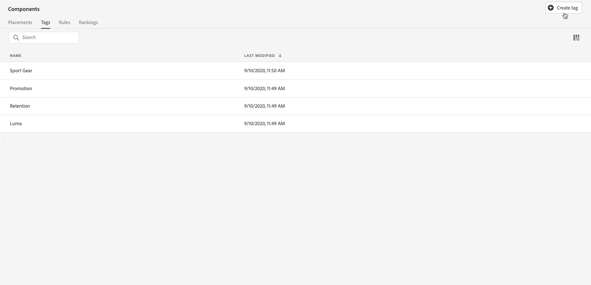
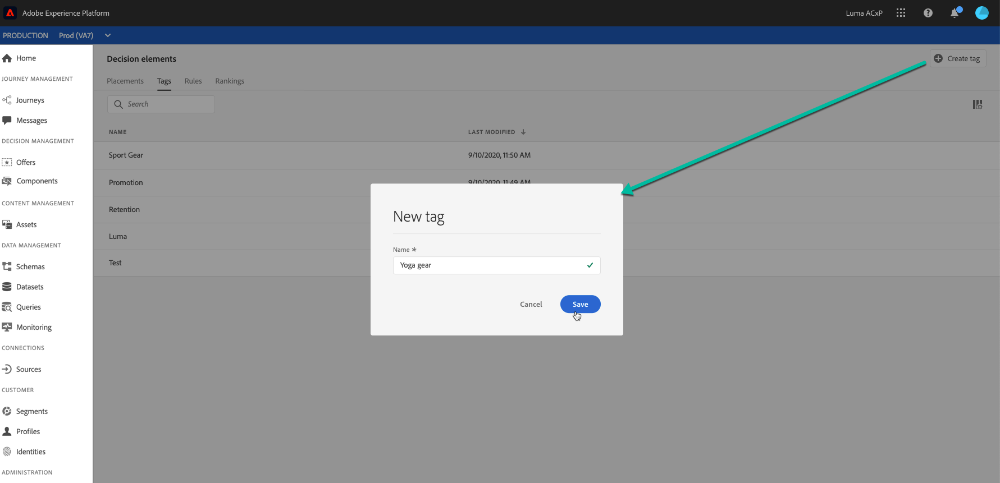

# 컬렉션 수식어 만들기 {#create-tags}

>[!TIP]
>
>[!DNL Adobe Journey Optimizer]의 새로운 의사 결정 기능인 [결정]을 이제 코드 기반 경험 및 이메일 채널을 통해 사용할 수 있습니다. [자세히 알아보기](../../experience-decisioning/gs-experience-decisioning.md)

>[!CONTEXTUALHELP]
>id="ajo_decisioning_offer_tags"
>title="컬렉션 수식어"
>abstract="하나 또는 여러 컬렉션 한정자를 오퍼에 연결하여 오퍼 라이브러리를 구성하고 제안을 보다 쉽게 찾을 수 있습니다. 컬렉션 한정자는 “구성 요소” 메뉴에서 생성됩니다."

컬렉션 한정자(이전의 &quot;태그&quot;라고 함)를 오퍼에 연결하면 보다 쉽게 정리할 수 있습니다. 예를 들어 블랙 프라이데이 오퍼에 &quot;블랙 프라이데이&quot; 컬렉션 한정자를 사용하여 레이블을 지정할 수 있습니다. 그런 다음 오퍼 라이브러리의 검색 기능을 사용하여 해당 컬렉션 한정자를 사용하는 모든 오퍼를 쉽게 찾을 수 있습니다.

컬렉션 한정자를 사용하여 오퍼를 오퍼 컬렉션으로 함께 그룹화할 수도 있습니다. [컬렉션 만들기](../offer-library/creating-collections.md)를 참조하세요.

➡️ [비디오에서 이 기능 살펴보기](#video)

만든 컬렉션 한정자 목록은 **[!UICONTROL 구성 요소]** 메뉴에서 액세스할 수 있습니다.

컬렉션 구분자를 생성하려면 다음 단계를 수행합니다.

1. **[!UICONTROL 컬렉션 한정자]** 탭으로 이동한 다음 **[!UICONTROL 컬렉션 한정자 만들기]**&#x200B;를 클릭합니다.

1. 컬렉션 한정자의 이름을 지정한 다음 **[!UICONTROL 저장]**&#x200B;을 클릭합니다.

   

1. 컬렉션 한정자가 생성되면 목록에 표시됩니다. 속성을 표시하고 편집하거나 표시하지 않도록 선택할 수 있습니다.

   

## 사용 방법 비디오 {#video}

>[!VIDEO](https://video.tv.adobe.com/v/341374?captions=kor&quality=12)
