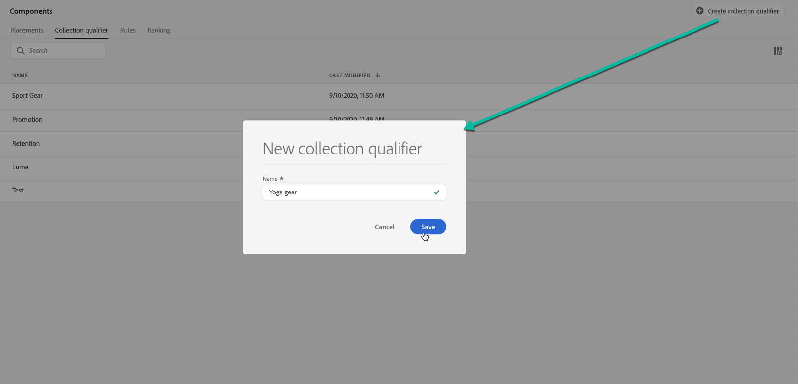

# 태그 만들기 {#create-tags}

오퍼에 태그를 연결하면 세그먼트를 쉽게 구성할 수 있습니다. 예를 들어 블랙 프라이데이 태그로 블랙 프라이데이 오퍼에 레이블을 지정할 수 있습니다. 그런 다음 오퍼 라이브러리에서 검색 기능을 사용하여 해당 태그가 있는 모든 오퍼를 쉽게 찾을 수 있습니다.

태그를 사용하여 오퍼를 함께 오퍼 컬렉션으로 그룹화할 수도 있습니다. 자세한 내용은 [컬렉션 만들기](../offer-library/creating-collections.md).

➡️ [비디오에서 이 기능 살펴보기](#video)

작성된 태그 목록은 **[!UICONTROL Components]** 메뉴 아래의 제품에서 사용할 수 있습니다.

태그를 만들려면 다음 단계를 수행하십시오.

1. 로 이동합니다. **[!UICONTROL Tags]** 탭을 클릭한 다음 **[!UICONTROL Create tag]**.

1. 태그의 이름을 지정한 다음 **[!UICONTROL Save]**.

   

1. 태그가 만들어지면 목록에 표시됩니다. 속성을 선택하여 해당 속성을 표시하고 편집하거나 억제할 수 있습니다.

   

## 방법 비디오 {#video}

>[!VIDEO](https://video.tv.adobe.com/v/329374?quality=12)

>[!NOTE]
>
>이 비디오는 Adobe Experience Platform을 기반으로 하는 Offer decisioning 애플리케이션 서비스에 적용됩니다. 그러나 Journey Optimizer 컨텍스트에서 오퍼를 사용하는 일반적인 지침을 제공합니다.
