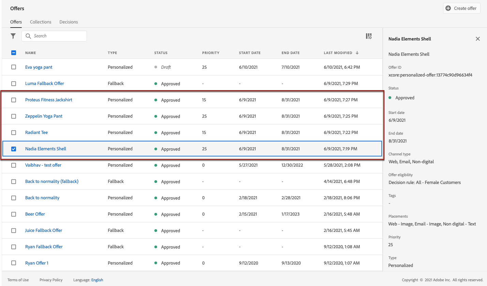

# 사용 사례: 이메일에서 사용할 수 있도록 개인화된 오퍼 구성 {#configure-add-personalized-offers-email}

이 섹션에서는 이전에 만든 결정에 따라 오퍼를 구성하고 이메일에 사용하는 방법을 보여주는 종단간 예를 제공합니다.

## 주요 단계

오퍼를 구성하고, 결정에 오퍼를 포함하며, 이메일에서 이 결정을 활용하는 주요 단계는 아래에 나와 있습니다.

1. 오퍼를 만들기 전에, [구성 요소 정의](#define-components)

   * 배치 만들기
   * 의사 결정 규칙 만들기
   * 태그 만들기
   * 등급 만들기(선택 사항)

1. [오퍼 구성](#configure-offers)

   * 오퍼 만들기
   * 각 오퍼에 대해:

      * 표현을 생성하고 각 표현에 대한 배치 및 자산을 선택합니다
      * 각 오퍼에 대한 규칙 추가
      * 각 오퍼에 대한 우선 순위를 정의합니다

1. [대체 오퍼 만들기](#create-fallback)

1. [컬렉션 만들기](#create-collection) 만든 개인화된 오퍼를 포함하려면

1. [결정 구성](#configure-decision)

   * 의사 결정 만들기
   * 만든 배치를 선택합니다
   * 각 배치에 대해 컬렉션을 선택합니다
   * 각 배치에 대해 등급을 선택합니다(선택 사항)
   * 대체 선택

1. [이메일에 결정 삽입](#insert-decision-in-email)

   * 표시할 오퍼와 일치하는 배치를 선택합니다
   * 선택한 배치와 호환되는 항목에서 결정을 선택합니다
   * 오퍼 미리 보기

이메일에 오퍼를 사용하는 전반적인 의사 결정 관리 프로세스는 다음과 같이 설명되어 있습니다.

## 구성 요소 정의 {#define-components}

오퍼 만들기를 시작하기 전에 오퍼에서 사용할 몇 가지 구성 요소를 정의해야 합니다.

아래에 있습니다 **[!UICONTROL Decision Management]** > **[!UICONTROL Components menu]**.

1. 만들기 시작 **배치** 을 참조하십시오.

   이러한 배치를 사용하여 오퍼 결정을 정의할 때 결과 오퍼가 표시되는 위치를 정의합니다.

   이 예에서는 다음 채널 및 컨텐츠 유형을 사용하여 세 개의 배치를 만듭니다.

   * *웹 - 이미지*
   * *이메일 - 이미지*
   * *비디지털 - 텍스트*

   

   배치를 만드는 자세한 단계는 [이 섹션](../../using/offers/offer-library/creating-placements.md).

1. 만들기 **의사 결정 규칙**.

   의사 결정 규칙은 Adobe Experience Platform의 프로필에 최상의 오퍼를 제공합니다.

   를 사용하여 두 개의 간단한 규칙을 구성합니다 **[!UICONTROL XDM Individual Profile > Person > Gender]** attribute:

   * *여성 고객*
   * *남성 고객*

   

   규칙을 만드는 자세한 단계는 [이 섹션](../../using/offers/offer-library/creating-decision-rules.md).

1. 또한 **태그**.

   그런 다음 오퍼에 연결하고 이 태그를 사용하여 오퍼를 컬렉션으로 그룹화할 수 있습니다.

   이 예에서 *요가* 태그에 가깝게 포함했습니다.

   

   태그를 만드는 자세한 단계는 [이 섹션](../../using/offers/offer-library/creating-tags.md).

1. 주어진 배치에 대해 먼저 제공해야 하는 오퍼를 결정하는 규칙을 정의하려는 경우(오퍼의 우선순위 점수를 고려하지 않고) 오퍼를 생성할 수 있습니다 **등급 공식**.

   등급 공식을 만드는 자세한 단계는 [이 섹션](../../using/offers/offer-library/create-ranking-formulas.md#create-ranking-formula).

   >[!NOTE]
   >
   >이 예제에서는 우선순위 점수만 사용합니다. 추가 정보 [자격 규칙 및 제한](../../using/offers/offer-library/creating-personalized-offers.md#eligibility).

## 오퍼 구성 {#configure-offers}

이제 오퍼를 만들고 구성할 수 있습니다. 이 예에서는 각 특정 프로필에 따라 표시할 4개의 오퍼를 만듭니다.

1. 오퍼 만들기. 추가 정보 [이 섹션](../../using/offers/offer-library/creating-personalized-offers.md#create-offer).

1. 이 오퍼에서 세 개의 표현을 만듭니다. 각 표현은 이전에 생성한 배치와 자산의 조합이어야 합니다.

   * 에 해당하는 하나 *웹 - 이미지* 배치
   * 에 해당하는 하나 *이메일 - 이미지* 배치
   * 에 해당하는 하나 *비디지털 - 텍스트* 배치

   >[!NOTE]
   >
   >오퍼를 메시지의 다른 위치에 표시하여 다른 배치 컨텍스트에서 오퍼를 사용할 더 많은 기회를 만들 수 있습니다.

   의 레프리젠테이션에 대해 자세히 알아보기 [이 섹션](../../using/offers/offer-library/creating-personalized-offers.md#representations).

1. 처음 두 배치에 적합한 이미지를 선택합니다. 에 대한 사용자 정의 텍스트 입력 *비디지털 - 텍스트* 배치.

   

1. 에서 **[!UICONTROL Offer eligibility]** 섹션, **[!UICONTROL By defined decision rule]** 원하는 규칙을 드래그하여 놓습니다.

   

1. 을(를) 입력합니다. **[!UICONTROL Priority]**. 이 예에서 를 추가합니다. *25년*.

1. 오퍼를 검토한 다음 **[!UICONTROL Save and approve]**.

   

1. 이 예에서, 동일한 표현이지만 다른 자산으로 세 개의 오퍼를 더 만듭니다. 다음과 같이 다양한 규칙 및 우선 순위를 사용하여 할당합니다.

   * 첫 번째 오퍼 - 의사 결정 규칙: *여성 고객*, 우선 순위: *25년*
   * 두 번째 오퍼 - 결정 규칙: *여성 고객*, 우선 순위: *15*
   * 세 번째 오퍼 - 결정 규칙: *남성 고객*, 우선 순위: *25년*
   * 네 번째 오퍼 - 결정 규칙: *남성 고객*, 우선 순위: *15*

   

오퍼를 만들고 구성하는 자세한 단계는 [이 섹션](../../using/offers/offer-library/creating-personalized-offers.md).

## 대체 오퍼 만들기 {#create-fallback}

1. 대체 오퍼 만들기.

1. 오퍼와 동일한 표현을 적절한 자산과 함께 정의합니다(오퍼는 오퍼에 사용되는 레프리젠테이션과 달라야 함).

   각 표현은 이전에 생성한 배치와 자산의 조합이어야 합니다.

   * 에 해당하는 하나 *웹 - 이미지* 배치
   * 에 해당하는 하나 *이메일 - 이미지* 배치
   * 에 해당하는 하나 *비디지털 - 텍스트* 배치

   

1. 대체 오퍼를 검토하고 **[!UICONTROL Save and approve]**.

이제 결정 시 대체 오퍼를 사용할 준비가 되었습니다.

대체 오퍼를 만들고 구성하는 자세한 단계는 [이 섹션](../../using/offers/offer-library/creating-fallback-offers.md).

## 컬렉션 만들기 {#create-collection}

결정을 구성할 때 개인화된 오퍼를 컬렉션의 일부로 추가해야 합니다.

1. 의사 결정 프로세스를 빠르게 수행하려면 동적 컬렉션을 만듭니다.

1. 를 사용하십시오 *요가* 태그로 전에 만든 4개의 개인화된 오퍼를 선택합니다.

   

컬렉션을 만드는 자세한 단계는 [이 섹션](../../using/offers/offer-library/creating-collections.md).

## 결정 구성 {#configure-decision}

이제 방금 만든 개인화된 오퍼 및 대체 오퍼와 배치를 결합할 결정을 만들어야 합니다.

이 조합은 특정 프로필에 가장 적합한 오퍼를 찾기 위해 Offer decisioning 엔진에서 사용합니다. 이 예에서는 각 오퍼에 할당한 우선 순위 및 결정 규칙을 기반으로 합니다.

오퍼 결정을 만들고 구성하려면 아래 주요 단계를 수행하십시오.

1. 의사 결정 만들기. 추가 정보 [이 섹션](../../using/offers/offer-activities/create-offer-activities.md#create-activity).

1. 을(를) 선택합니다 *웹 - 이미지*, *이메일 - 이미지* 및 *비디지털 - 텍스트* 배치.

   

1. 각 배치에 대해 만든 컬렉션을 추가합니다.

   

1. 순위를 정의한 경우 [구성 요소 작성](#define-components)를 지정하는 경우, 결정의 배치에 할당할 수 있습니다. 이 배치에서 여러 오퍼를 표시할 수 있는 경우 이 수식을 사용하여 먼저 전달할 오퍼를 계산합니다.

   배치에 순위 공식을 지정하는 자세한 단계는 다음과 같습니다. [이 섹션](../../using/offers/offer-activities/configure-offer-selection.md#assign-ranking-formula).

1. 만든 대체 오퍼를 선택합니다. 선택한 세 개의 배치에 대해 사용 가능한 대체 오퍼로 표시됩니다.

   

1. 결정을 검토하고 **[!UICONTROL Save and approve]**.

   

이제 최적화된 개인화된 오퍼를 전달하는 데 여러분의 결정을 사용할 준비가 되었습니다.

결정을 만들고 구성하는 자세한 단계는 [이 섹션](../../using/offers/offer-activities/create-offer-activities.md).

## 이메일에 결정 삽입 {#insert-decision-in-email}

이제 결정을 실행했으므로 이메일 메시지에 삽입할 수 있습니다. 이렇게 하려면 아래 절차를 따르십시오.

1. 이메일을 만든 다음 [이메일 디자이너](../../using/design-emails.md) 콘텐츠를 구성하려면 다음을 수행하십시오.

1. 왼쪽 팔레트에서 구조 구성 요소를 추가합니다.

1. 추가 **[!UICONTROL Offer decision]** 컨텐츠 구성 요소입니다. 에서 콘텐츠 구성 요소를 사용하는 방법을 알아봅니다. [이 섹션](../../using/content-components.md).

   

1. 패턴을 선택합니다. 오른쪽 팔레트에서 **[!UICONTROL Select offer decision]** 결정을 추가하려면

   

1. 에서 표시할 오퍼에 해당하는 배치를 선택합니다 **[!UICONTROL Placements]** 드롭다운 목록.

   이 경우 이 예제의 일부로 이전에 만든 배치에서는 **이메일 - 이미지** 배치는 이메일에서 결정을 사용할 때 사용할 수 있습니다. 추가 정보 [배치 만들기](../../using/offers/offer-library/creating-placements.md).

   

1. 일치하는 결정 **이메일 - 이미지** 배치가 표시됩니다. 콘텐츠 구성 요소에서 사용할 결정을 선택한 다음 **[!UICONTROL Add]**.

   

   >[!NOTE]
   >
   >선택한 배치와 호환되는 결정만 목록에 표시됩니다.

이제 이메일 디자이너에서 개인화된 모든 오퍼와 대체 오퍼를 시각화할 수 있습니다.

를 사용하십시오 **[!UICONTROL Offers]** 섹션 또는 컨텐츠 구성 요소 화살표(오른쪽 및 왼쪽 화살표)를 사용하여 데이터를 찾습니다. 고객 프로필과 함께 결정의 일부인 다른 오퍼를 표시할 수도 있습니다. 추가 정보 [이 섹션](../../using/deliver-personalized-offers.md#preview-offers-in-email).

변경 사항을 저장한 후 메시지가 게시되면 여정의 일부로 메시지를 보낼 때 관련 프로필에 오퍼를 표시할 수 있습니다.

**관련 항목:**

* 에서 메시지 미리 보기를 확인하는 방법을 알아봅니다. [이 섹션](../../using/preview.md#preview-your-messages).

* 에서 메시지를 게시하는 방법 알아보기 [이 섹션](../../using/publish-manage-message.md).

* 에서 하나 이상의 여정에 의해 메시지가 트리거되는 방법을 알아봅니다 [이 섹션](../building-journeys/journey.md).

<!--
* Learn how to measure your offer's success and impact on your targeted audience with reports in [this section](../reports/journey-global-report.md).
-->

