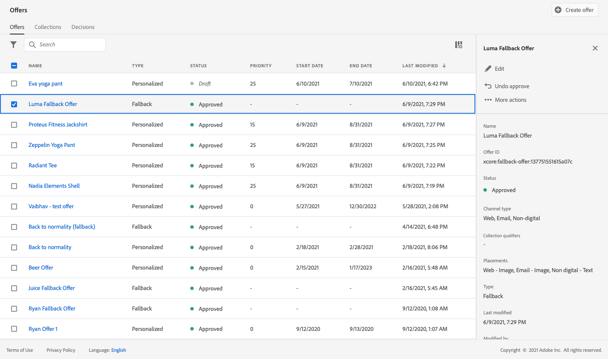

# 사용 사례: 이메일에서 사용할 수 있도록 개인화된 오퍼 구성 {#configure-add-personalized-offers-email}

이 섹션에서는 이전에 만든 의사 결정에 따라 오퍼를 구성하고 이메일에서 오퍼를 사용하는 방법을 보여주는 전체적인 예를 제공합니다.

## 주요 단계 {#main-steps}

오퍼를 구성하고 결정에 포함시킨 다음 이 결정을 이메일에 활용하는 주요 단계는 아래에 나와 있습니다.

1. 오퍼를 만들기 전에 [구성 요소 정의](#define-components)

   * 배치 만들기
   * 의사 결정 규칙 만들기
   * 컬렉션 한정자 만들기(이전의 &quot;태그&quot;)
   * 등급 만들기(선택 사항)

1. [오퍼 구성](#configure-offers)

   * 오퍼 만들기
   * 각 오퍼에 대해:

      * 표현을 생성하고 각 표현에 대한 배치 및 에셋을 선택합니다
      * 각 오퍼에 대한 규칙 추가
      * 각 오퍼에 대한 우선 순위 정의

1. [대체 오퍼 만들기](#create-fallback)

1. [컬렉션 만들기](#create-collection) 만든 개인화된 오퍼를 포함하려면

1. [의사 결정 구성](#configure-decision)

   * 의사 결정 만들기
   * 생성한 배치 선택
   * 각 배치에 대해 컬렉션을 선택합니다
   * 각 배치에 대해 순위를 선택합니다(선택 사항).
   * 대체 항목 선택

1. [전자 메일에 결정 삽입](#insert-decision-in-email)

   * 표시할 오퍼와 일치하는 배치를 선택합니다
   * 선택한 배치와 호환되는 항목에서 결정을 선택합니다
   * 오퍼 미리 보기

이메일에서 오퍼를 사용하기 위한 전반적인 의사 결정 관리 프로세스는 다음과 같이 설명할 수 있습니다.

## 구성 요소 정의 {#define-components}

오퍼 만들기를 시작하기 전에 오퍼에 사용할 몇 가지 구성 요소를 정의해야 합니다.

다음 아래에서 찾을 수 있습니다. **[!UICONTROL 의사 결정 관리]** > **[!UICONTROL 구성 요소 메뉴]**.

1. 작성으로 시작 **배치** 을 참조하십시오.

   이러한 배치를 사용하여 오퍼 결정을 정의할 때 결과 오퍼가 표시되는 위치를 정의합니다.

   이 예에서는 다음 채널 및 콘텐츠 유형을 사용하여 세 개의 배치를 만듭니다.

   * *웹 - 이미지*
   * *이메일 - 이미지*
   * *비디지털 - 텍스트*

   

   배치를 만드는 자세한 단계는 다음에 설명되어 있습니다 [이 섹션](../../using/offers/offer-library/creating-placements.md).

1. 만들기 **의사 결정 규칙**.

   의사 결정 규칙은 Adobe Experience Platform의 프로필에 최상의 오퍼를 제공합니다.

   를 사용하여 두 개의 간단한 규칙 구성 **[!UICONTROL XDM 개인 프로필 > 사용자 > 성별]** 특성:

   * *여성 고객*
   * *남성 고객*

   

   규칙을 만드는 자세한 단계는에 설명되어 있습니다 [이 섹션](../../using/offers/offer-library/creating-decision-rules.md).

1. 다음을 만들 수도 있습니다 **컬렉션 한정자**.

   그런 다음 오퍼에 연결하고 이 컬렉션 한정자를 사용하여 오퍼를 컬렉션으로 그룹화할 수 있습니다.

   이 예에서 *요가* 컬렉션 한정자입니다.

   

   컬렉션 한정자를 만드는 자세한 단계는 [이 섹션](../../using/offers/offer-library/creating-tags.md).

1. 오퍼의 우선 순위 점수를 고려하지 않고 주어진 배치에 대해 먼저 제시해야 할 오퍼를 결정하는 규칙을 정의하려면 다음을 생성할 수 있습니다. **순위 공식**.

   등급 수식을 만드는 자세한 단계는 [이 섹션](../../using/offers/ranking/create-ranking-formulas.md#create-ranking-formula).

   >[!NOTE]
   >
   >이 예제에서는 우선 순위 점수만 사용합니다. 자세히 알아보기 [자격 규칙 및 제약 조건](../../using/offers/offer-library/creating-personalized-offers.md#eligibility).

## 오퍼 구성 {#configure-offers}

이제 오퍼를 만들고 구성할 수 있습니다. 이 예제에서는 각 특정 프로필에 따라 표시할 4개의 오퍼를 만듭니다.

1. 오퍼를 만듭니다. 자세한 내용은 [이 섹션](../../using/offers/offer-library/creating-personalized-offers.md#create-offer)을 참조하십시오.

1. 이 오퍼에서는 세 개의 표현을 만듭니다. 각 표현은 이전에 생성한 배치와 자산의 조합이어야 합니다.

   * 다음에 해당하는 하나 *웹 - 이미지* 배치
   * 다음에 해당하는 하나 *이메일 - 이미지* 배치
   * 다음에 해당하는 하나 *비디지털 - 텍스트* 배치

   >[!NOTE]
   >
   >오퍼를 메시지의 다른 위치에 표시하여 다른 배치 컨텍스트에서 오퍼를 사용할 수 있는 기회를 더 많이 만들 수 있습니다.

   의 표현에 대해 자세히 알아보기 [이 섹션](../../using/offers/offer-library/creating-personalized-offers.md#representations).

1. 처음 두 배치의 적절한 이미지를 선택합니다. 다음에 대한 사용자 지정 텍스트 입력 *비디지털 - 텍스트* 배치.

   

1. 다음에서 **[!UICONTROL 오퍼 자격 요건]** 섹션, 선택 **[!UICONTROL 정의된 결정 규칙별]** 선택한 규칙을 끌어서 놓습니다.

   

1. 다음을 입력하십시오. **[!UICONTROL 우선 순위]**. 이 예에서 다음을 추가합니다. *25*.

1. 오퍼를 검토한 다음 **[!UICONTROL 저장 및 승인]**.

   

1. 이 예에서는 표현은 같지만 에셋이 다른 오퍼를 3개 더 만듭니다. 다음과 같이 서로 다른 규칙과 우선 순위를 사용하여 할당하십시오.

   * 첫 번째 오퍼 - 결정 규칙: *여성 고객*, 우선 순위: *25*
   * 두 번째 오퍼 - 결정 규칙: *여성 고객*, 우선 순위: *15*
   * 세 번째 오퍼 - 결정 규칙: *남성 고객*, 우선 순위: *25*
   * 네 번째 오퍼 - 결정 규칙: *남성 고객*, 우선 순위: *15*

   

오퍼를 만들고 구성하는 자세한 단계는에 설명되어 있습니다 [이 섹션](../../using/offers/offer-library/creating-personalized-offers.md).

## 대체 오퍼 만들기 {#create-fallback}

1. 대체 오퍼를 만듭니다.

1. 적절한 자산을 사용하여 오퍼와 동일한 표현을 정의합니다(오퍼에 사용된 것과 달라야 함).

   각 표현은 이전에 생성한 배치와 자산의 조합이어야 합니다.

   * 다음에 해당하는 하나 *웹 - 이미지* 배치
   * 다음에 해당하는 하나 *이메일 - 이미지* 배치
   * 다음에 해당하는 하나 *비디지털 - 텍스트* 배치

   

1. 대체 오퍼를 검토한 다음 **[!UICONTROL 저장 및 승인]**.

이제 대체 오퍼를 결정에 사용할 준비가 되었습니다.

대체 오퍼를 만들고 구성하는 자세한 단계는에 설명되어 있습니다 [이 섹션](../../using/offers/offer-library/creating-fallback-offers.md).

## 컬렉션 만들기 {#create-collection}

결정을 구성할 때 개인 맞춤화된 오퍼를 컬렉션의 일부로 추가해야 합니다.

1. 의사 결정 프로세스를 가속화하려면 동적 컬렉션을 만드십시오.

1. 사용 *요가* 컬렉션 한정자를 사용하여 이전에 생성한 4개의 개인화된 오퍼를 선택합니다.

   

컬렉션을 만드는 자세한 단계는에 설명되어 있습니다 [이 섹션](../../using/offers/offer-library/creating-collections.md).

## 의사 결정 구성 {#configure-decision}

이제 배치를 개인화된 오퍼 및 방금 만든 대체 오퍼와 결합하는 결정을 만들어야 합니다.

이 조합은 의사 결정 엔진이 특정 프로필에 가장 적합한 오퍼를 찾는 데 사용됩니다. 이 예에서는 각 오퍼에 할당한 우선순위 및 의사 결정 규칙을 기반으로 합니다.

오퍼 결정을 만들고 구성하려면 아래의 주요 단계를 수행합니다.

1. 의사 결정을 만듭니다. 자세한 내용은 [이 섹션](../../using/offers/offer-activities/create-offer-activities.md#create-activity)을 참조하십시오.

1. 다음 항목 선택 *웹 - 이미지*, *이메일 - 이미지* 및 *비디지털 - 텍스트* 배치.

   

1. 각 배치에 대해 생성한 컬렉션을 추가합니다.

   

1. 다음 경우에 등급을 정의한 경우 [구성 요소 빌드](#define-components)를 클릭하여 결정의 배치에 할당할 수 있습니다. 여러 오퍼가 이 배치에 표시될 수 있는 경우 결정은 이 공식을 사용하여 먼저 게재할 오퍼를 계산합니다.

   배치에 순위 공식을 지정하는 자세한 단계는에 설명되어 있습니다 [이 섹션](../../using/offers/offer-activities/configure-offer-selection.md#assign-ranking-formula).

1. 생성한 대체 오퍼를 선택합니다. 선택한 3개의 배치에 대해 사용 가능한 대체 오퍼로 표시됩니다.

   

1. 결정을 검토한 다음 **[!UICONTROL 저장 및 승인]**.

   

이제 의사 결정을 사용하여 최적화되고 개인화된 오퍼를 제공할 준비가 되었습니다.

의사 결정을 만들고 구성하는 자세한 단계는에 설명되어 있습니다 [이 섹션](../../using/offers/offer-activities/create-offer-activities.md).

## 전자 메일에 결정 삽입 {#insert-decision-in-email}

이제 결정이 라이브되었으므로 이메일 메시지에 삽입할 수 있습니다. 이렇게 하려면에 설명된 단계를 따르십시오. [이 페이지](../../using/email/add-offers-email.md).

