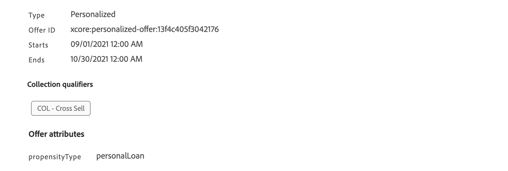

# 등급 공식 {#create-ranking-formulas}

## 등급 수식 기본 정보 {#about-ranking-formulas}

**등급 수식** 오퍼의 우선 순위 점수를 고려하지 않고, 주어진 배치에 대해 먼저 제시해야 할 오퍼를 결정하는 규칙을 정의할 수 있습니다.

등급 수식은 다음과 같이 표시됩니다. **PQL 구문** 프로필 속성, 컨텍스트 데이터 및 오퍼 속성을 활용할 수 있습니다. PQL 구문을 사용하는 방법에 대한 자세한 내용은 다음을 참조하십시오. [전용 설명서](https://experienceleague.adobe.com/docs/experience-platform/segmentation/pql/overview.html?lang=ko).

등급 공식이 생성되면 의사 결정의 배치에 지정할 수 있습니다. 자세한 내용은 [결정의 오퍼 선택 구성](../offer-activities/configure-offer-selection.md)을 참조하십시오.

## 등급 수식 만들기 {#create-ranking-formula}

순위 공식을 만들려면 아래 단계를 수행합니다.

1. 액세스 **[!UICONTROL 구성 요소]** 메뉴를 선택한 다음 **[!UICONTROL 순위]** 탭. 다음 **[!UICONTROL 공식]** 기본적으로 탭이 선택되어 있습니다. 이전에 만든 수식의 목록이 표시됩니다.

   

1. 클릭 **[!UICONTROL 순위 만들기]** 을 눌러 새 등급 공식을 생성합니다.

   

1. 공식 이름, 설명 및 공식을 지정합니다.

   이 예에서는 실제 날씨가 더운 경우 &quot;hot&quot; 속성을 가진 모든 오퍼의 우선 순위를 높이려고 합니다. 이렇게 하려면 **contextData.weather=hot** 가 의사 결정 호출에서 전달되었습니다.

   

   >[!IMPORTANT]
   >
   >순위 공식을 생성할 때 이전 기간을 되돌아보는 기능은 지원되지 않습니다. 예를 들어, 지난 달 내에 발생한 경험 이벤트를 공식의 구성 요소로 지정하는 경우. 공식을 만드는 동안 전환 확인 기간을 포함하려고 하면 저장 시 오류가 트리거됩니다.

1. **[!UICONTROL 저장]**&#x200B;을 클릭합니다. 순위 공식이 생성되면 목록에서 선택하여 세부 정보를 얻고 편집하거나 삭제할 수 있습니다.

   이제 배치에 적합한 오퍼의 등급을 지정하는 데 사용할 준비가 되었습니다(참조). [의사 결정에서 오퍼 선택 구성](../offer-activities/configure-offer-selection.md)).

   

## 순위 공식 예 {#ranking-formula-examples}

필요에 따라 다양한 등급 수식을 만들 수 있습니다. 다음은 몇 가지 예입니다.

<!--
Boost by offer ID

Boost the priority of an offer with the offer ID *xcore:personalized-offer:13d213cd4cb328ec* by 5.

**Ranking formula:**

```
if( offer._id = "xcore:personalized-offer:13d213cd4cb328ec", offer.rank.priority + 5, offer.rank.priority)
```

Change the offer priority based on a certain profile attribute

Set the offer priority to 30 for offer *xcore:personalized-offer:13d213cd4cb328ec* if the user lives in the city of Bondi.

**Ranking formula:**

```
if( offer._id = "xcore:personalized-offer:13d213cd4cb328ec" and homeAddress.city.equals("Bondi", false), 30, offer.rank.priority)
```

Boost multiple offers by offer ID based on the presence of a profile's audience membership

Boost the priority of offers based on whether the user is a member of a priority audience, which is configured as an attribute in the offer.

**Ranking formula:**

```
if( segmentMembership.get("ups").get(offer.characteristics.get("prioritySegmentId")).status in (["realized","existing"]), offer.rank.priority + 10, offer.rank.priority)
```
-->

### 프로필 속성에 따라 특정 오퍼 속성을 사용하여 오퍼 증폭

프로필이 오퍼에 해당하는 도시에 거주하는 경우 해당 도시의 모든 오퍼에 대한 우선 순위를 두 배로 늘립니다.

**순위 공식:**

```
if( offer.characteristics.get("city") = homeAddress.city, offer.rank.priority * 2, offer.rank.priority)
```

### 종료 날짜가 지금부터 24시간 미만인 오퍼 증폭

**순위 공식:**

```
if( offer.selectionConstraint.endDate occurs <= 24 hours after now, offer.rank.priority * 3, offer.rank.priority)
```

### 컨텍스트 데이터를 기반으로 특정 오퍼 속성으로 오퍼 증폭

의사 결정 호출에서 전달되는 컨텍스트 데이터를 기반으로 특정 오퍼를 증폭합니다. 예를 들어 `contextData.weather=hot` 이 결정 호출에서 전달됩니다. 이 있는 모든 오퍼의 우선 순위입니다. `attribute=hot` 은(는) 승격되어야 합니다.

**순위 공식:**

```
if (@{_xdm.context.additionalParameters;version=1}.weather.isNotNull()
and offer.characteristics.get("weather")=@{_xdm.context.additionalParameters;version=1}.weather, offer.rank.priority + 5, offer.rank.priority)
```

Decisioning API를 사용할 때 컨텍스트 데이터가 아래 예와 같이 요청 본문의 프로필 요소에 추가됩니다.

**요청 본문의 코드 조각:**

```
"xdm:profiles": [
{
    "xdm:identityMap": {
        "crmid": [
            {
            "xdm:id": "CRMID1"
            }
        ]
    },
    "xdm:contextData": [
        {
            "@type":"_xdm.context.additionalParameters;version=1",
            "xdm:data":{
                "xdm:weather":"hot"
            }
        }
    ]
 }],
```

### 제공 중인 제품을 구매하려는 고객 성향을 기반으로 오퍼를 증폭

고객 성향 점수를 기반으로 오퍼에 대한 점수를 높일 수 있습니다.

이 예제에서 인스턴스 테넌트는 *_salesvelocity* 프로필 스키마에는 배열에 저장된 다양한 점수가 포함됩니다.


지정된 프로필에 대해 다음 작업을 수행하십시오.

```
{"_salesvelocity": {"individualScoring": [
                    {"core": {
                            "category":"insurance",
                            "propensityScore": 96.9
                        }},
                    {"core": {
                            "category":"personalLoan",
                            "propensityScore": 45.3
                        }},
                    {"core": {
                            "category":"creditCard",
                            "propensityScore": 78.1
                        }}
                    ]}
}
```

오퍼에 대한 속성이 포함됩니다. *성향 유형* 점수의 범주와 일치하는 항목:



그러면 등급 공식에서 각 오퍼의 우선 순위를 고객과 동일하게 설정할 수 있습니다 *성향 점수* 에 대해 *성향 유형*. 점수가 없으면 오퍼에 설정된 정적 우선 순위를 사용하십시오.

```
let score = (select _Individual_Scoring1 from _salesvelocity.individualScoring
             where _Individual_Scoring1.core.category.equals(offer.characteristics.get("propensityType"), false)).head().core.propensityScore
in if(score.isNotNull(), score, offer.rank.priority)
```
