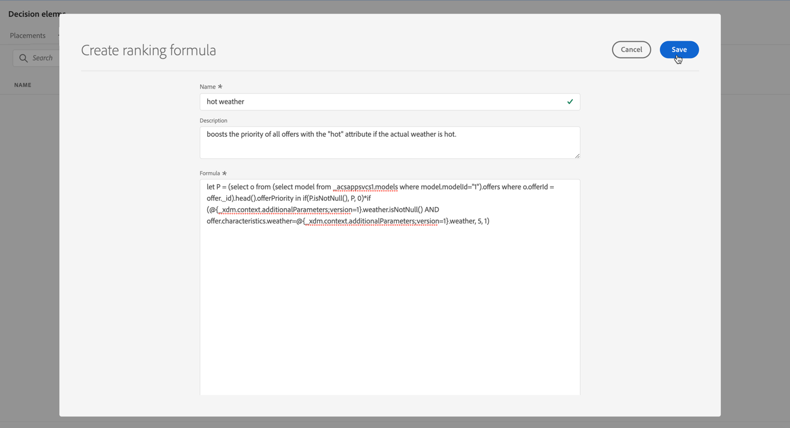

# 등급 공식 {#create-ranking-formulas}

## 등급 수식 기본 정보 {#about-ranking-formulas}

**등급 수식**&#x200B;을 사용하면 오퍼의 우선 순위 점수를 고려하지 않고 주어진 배치에 대해 먼저 제시해야 할 오퍼를 결정하는 규칙을 정의할 수 있습니다.

등급 수식은 **PQL 구문**&#x200B;으로 표시되며 프로필 특성, 컨텍스트 데이터 및 오퍼 특성을 활용할 수 있습니다. PQL 구문을 사용하는 방법에 대한 자세한 내용은 [전용 설명서](https://experienceleague.adobe.com/docs/experience-platform/segmentation/pql/overview.html?lang=ko)를 참조하세요.

등급 공식이 생성되면 의사 결정의 배치에 지정할 수 있습니다. 자세한 내용은 [결정의 오퍼 선택 구성](../offer-activities/configure-offer-selection.md)을 참조하십시오.

## 등급 수식 만들기 {#create-ranking-formula}

순위 공식을 만들려면 아래 단계를 수행합니다.

1. **[!UICONTROL 구성 요소]** 메뉴에 액세스한 다음 **[!UICONTROL 순위]** 탭을 선택합니다. 기본적으로 **[!UICONTROL 수식]** 탭이 선택되어 있습니다. 이전에 만든 수식의 목록이 표시됩니다.

   

1. 새 순위 공식을 만들려면 **[!UICONTROL 순위 만들기]**&#x200B;를 클릭하십시오.

   

1. 공식 이름, 설명 및 공식을 지정합니다.

   이 예에서는 실제 날씨가 더운 경우 &quot;hot&quot; 속성을 가진 모든 오퍼의 우선 순위를 높이려고 합니다. 이를 위해 **contextData.weather=hot**&#x200B;이(가) 의사 결정 호출에서 전달되었습니다. [컨텍스트 데이터로 작업하는 방법을 알아봅니다](../context-data.md)

   

   >[!IMPORTANT]
   >
   >순위 공식을 생성할 때 이전 기간을 되돌아보는 기능은 지원되지 않습니다. 예를 들어, 지난 달 내에 발생한 경험 이벤트를 공식의 구성 요소로 지정하는 경우. 공식을 만드는 동안 전환 확인 기간을 포함하려고 하면 저장 시 오류가 트리거됩니다.

1. **[!UICONTROL 저장]**&#x200B;을 클릭합니다. 순위 공식이 생성되면 목록에서 선택하여 세부 정보를 얻고 편집하거나 삭제할 수 있습니다.

   이제 배치에 적합한 오퍼의 등급을 결정하는 데 사용할 준비가 되었습니다([의사 결정에서 오퍼 선택 구성](../offer-activities/configure-offer-selection.md) 참조).

   

## 순위 공식 예 {#ranking-formula-examples}

필요에 따라 다양한 등급 수식을 만들 수 있습니다. 다음은 몇 가지 예입니다.

<!--
Boost by offer ID

Boost the priority of an offer with the offer ID *xcore:personalized-offer:13d213cd4cb328ec* by 5.

**Ranking formula:**

```
if( offer._id = "xcore:personalized-offer:13d213cd4cb328ec", offer.rank.priority + 5, offer.rank.priority)
```

Change the offer priority based on a certain profile attribute

Set the offer priority to 30 for offer *xcore:personalized-offer:13d213cd4cb328ec* if the user lives in the city of Bondi.

**Ranking formula:**

```
if( offer._id = "xcore:personalized-offer:13d213cd4cb328ec" and homeAddress.city.equals("Bondi", false), 30, offer.rank.priority)
```

Boost multiple offers by offer ID based on the presence of a profile's audience membership

Boost the priority of offers based on whether the user is a member of a priority audience, which is configured as an attribute in the offer.

**Ranking formula:**

```
if( segmentMembership.get("ups").get(offer.characteristics.get("prioritySegmentId")).status in (["realized","existing"]), offer.rank.priority + 10, offer.rank.priority)
```
-->

### 프로필 속성에 따라 특정 오퍼 속성을 사용하여 오퍼 증폭

프로필이 오퍼에 해당하는 도시에 거주하는 경우 해당 도시의 모든 오퍼에 대한 우선 순위를 두 배로 늘립니다.

**순위 수식:**

```
if( offer.characteristics.get("city") = homeAddress.city, offer.rank.priority * 2, offer.rank.priority)
```

### 종료 날짜가 지금부터 24시간 미만인 오퍼 증폭

**순위 수식:**

```
if( offer.selectionConstraint.endDate occurs <= 24 hours after now, offer.rank.priority * 3, offer.rank.priority)
```

### 제공 중인 제품을 구매하려는 고객 성향을 기반으로 오퍼를 증폭

고객 성향 점수를 기반으로 오퍼에 대한 점수를 높일 수 있습니다.

이 예제에서 인스턴스 테넌트는 *_salesvelocity*&#x200B;이고 프로필 스키마에는 배열에 저장된 다양한 점수가 포함되어 있습니다.


지정된 프로필에 대해 다음 작업을 수행하십시오.

```
{"_salesvelocity": {"individualScoring": [
                    {"core": {
                            "category":"insurance",
                            "propensityScore": 96.9
                        }},
                    {"core": {
                            "category":"personalLoan",
                            "propensityScore": 45.3
                        }},
                    {"core": {
                            "category":"creditCard",
                            "propensityScore": 78.1
                        }}
                    ]}
}
```

### 컨텍스트 데이터를 기반으로 오퍼 증폭 {#context-data}

[!DNL Journey Optimizer]을(를) 사용하면 호출에서 전달되는 컨텍스트 데이터를 기반으로 특정 오퍼를 늘릴 수 있습니다. 예를 들어 `contextData.weather=hot`이(가) 전달되면 `attribute=hot`이(가) 있는 모든 오퍼의 우선 순위를 높여야 합니다. **Edge Decisioning** 및 **Decisioning** API를 사용하여 컨텍스트 데이터를 전달하는 방법에 대한 자세한 내용은 [이 섹션](../context-data.md)을 참조하세요.

**Decisioning** API를 사용하는 경우 아래 예와 같이 컨텍스트 데이터가 요청 본문의 프로필 요소에 추가됩니다.

```
"xdm:profiles": [
{
    "xdm:identityMap": {
        "crmid": [
            {
            "xdm:id": "CRMID1"
            }
        ]
    },
    "xdm:contextData": [
        {
            "@type":"_xdm.context.additionalParameters;version=1",
            "xdm:data":{
                "xdm:weather":"hot"
            }
        }
    ]
    
}],
```

다음은 오퍼의 우선 순위를 높이기 위해 등급 수식에서 컨텍스트 데이터를 사용하는 방법을 보여 주는 예입니다. 각 섹션을 확장하여 순위 공식의 구문에 대한 세부 정보를 가져옵니다.

>[!NOTE]
>
>Edge Decisioning API 예제에서 `<OrgID>`을(를) 조직 테넌트 ID로 바꾸십시오.

+++컨텍스트 데이터의 채널이 고객의 선호 채널과 일치하는 경우 오퍼 우선 순위를 10까지 높입니다.

>[!BEGINTABS]

>[!TAB Decisioning API]

`if (@{_xdm.context.additionalParameters;version=1}.channel.isNotNull() and @{_xdm.context.additionalParameters;version=1}.channel.equals(_abcMobile.preferredChannel), offer.rank.priority + 10, offer.rank.priority)`

>[!TAB Edge Decisioning API]

`if (xEvent.<OrgID>.channel.isNotNull() and xEvent.<OrgID>.channel.equals(_abcMobile.preferredChannel), offer.rank.priority + 10, offer.rank.priority)`

>[!ENDTABS]

+++

+++호출에서 &quot;contextData.weather=hot&quot;가 전달된 경우 &quot;attribute=hot&quot;를 사용하여 모든 오퍼의 우선 순위를 높입니다.

>[!BEGINTABS]

>[!TAB Decisioning API]

`if (@{_xdm.context.additionalParameters;version=1}.weather.isNotNull() and offer.characteristics.get("weather")=@{_xdm.context.additionalParameters;version=1}.weather, offer.rank.priority + 5, offer.rank.priority)`

>[!TAB Edge Decisioning API]

`if (xEvent.<OrgID>.weather.isNotNull() and offer.characteristics.get("weather")=xEvent.<OrgID>.weather, offer.rank.priority + 5, offer.rank.priority)`

>[!ENDTABS]

+++

+++컨텐츠 원본 증폭

>[!BEGINTABS]

>[!TAB Decisioning API]

`if (@{_xdm.context.additionalParameters;version=1}.contentorigin.isNotNull() and offer.characteristics.contentorigin=@{_xdm.context.additionalParameters;version=1}.contentorigin, offer.rank.priority * 100, offer.rank.priority)`

>[!TAB Edge Decisioning API]

`if (xEvent.<OrgID>.contentorigin.isNotNull() and offer.characteristics.contentorigin=xEvent.<OrgID>.contentorigin, offer.rank.priority * 100, offer.rank.priority)`

>[!ENDTABS]

+++

+++날씨 증가

>[!BEGINTABS]

>[!TAB Decisioning API]

`if (@{_xdm.context.additionalParameters;version=1}.weather.isNotNull() and offer.characteristics.weather=@{_xdm.context.additionalParameters;version=1}.weather, offer.rank.priority * offer.characteristics.scoringBoost, offer.rank.priority)`

>[!TAB Edge Decisioning API]

`if (xEvent.<OrgID>.weather.isNotNull() and offer.characteristics.weather=xEvent.<OrgID>.weather, offer.rank.priority * offer.characteristics.scoringBoost, offer.rank.priority)`

>[!ENDTABS]

+++
