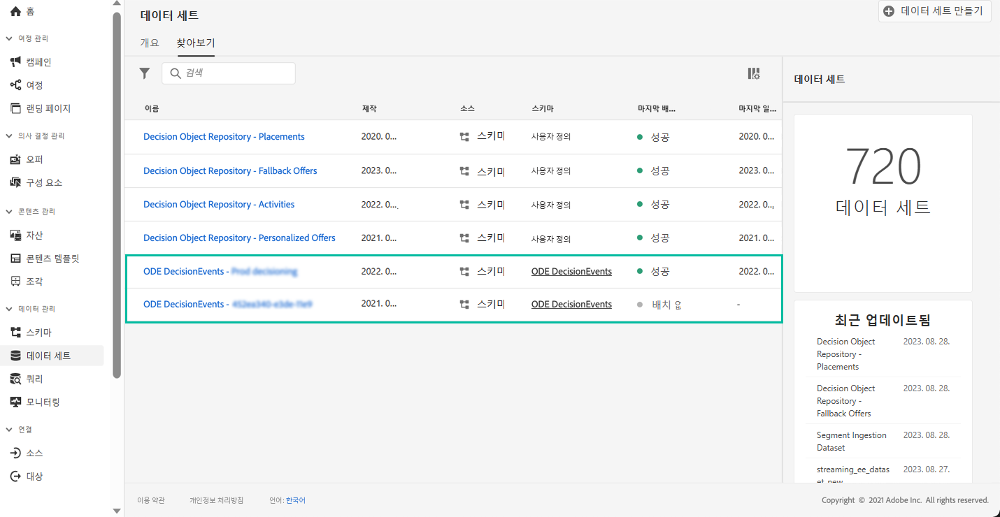

# 의사 결정 관리 이벤트 시작 {#monitor-offer-events}

의사 결정 관리에서 지정된 프로파일에 대해 결정할 때마다 이러한 이벤트와 관련된 정보가 자동으로 Adobe Experience Platform으로 전송됩니다.

이렇게 하면 이러한 데이터를 내보내 자체 보고 시스템으로 분석할 수 있습니다. 분석 및 보고 기능을 향상하기 위해 다른 도구와 함께 Adobe Experience Platform [쿼리 서비스](https://experienceleague.adobe.com/docs/experience-platform/query/home.html?lang=ko)를 활용할 수도 있습니다.

의사 결정 관리 이벤트를 포함하는 데이터 집합은 Adobe Experience Platform **[!UICONTROL Datasets]** 메뉴에서 액세스할 수 있습니다. 각 인스턴스에 대해 프로비저닝할 때 데이터 세트 하나가 자동으로 만들어집니다.

이러한 데이터 집합은 의사 결정 관리에서 Adobe Experience Platform으로 정보를 보내는 데 필요한 모든 XDM 필드를 포함하는 **[!UICONTROL ODE DecisionEvents]** 스키마를 기반으로 합니다.

>[!NOTE]
>
>ODE DecisionEvents 데이터 세트는 **비프로필 데이터 세트**&#x200B;이므로 실시간 고객 프로필에서 사용하기 위해 Experience Platform으로 수집할 수 없습니다.

**관련 항목:**

* [의사 결정 관리 이벤트 주요 정보](../reports/key-information.md)
* [이벤트 XDM 필드 액세스](../reports/xdm-fields.md)
